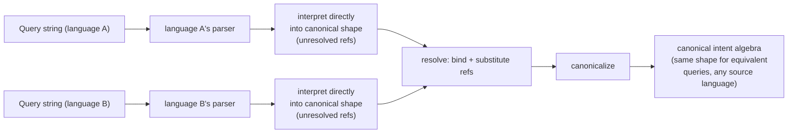
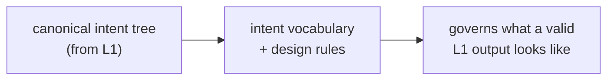
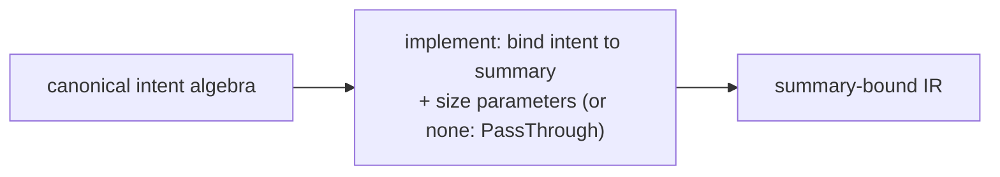
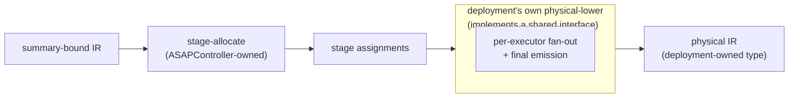
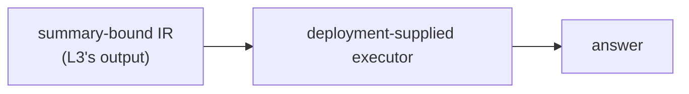

# ASAPController — design

ASAPController **plans** queries — turning a query string into a plan,
not running it. Two different questions come up when describing that
pipeline, and this document answers them separately rather than
conflating them into one "layer":

- **Representation** — "what abstraction level are we at right now?"
  A representation is a concrete shape data sits in at some point —
  a real type, or (for L4's physical IR) an interface boundary owned
  by the deployment. Representations don't run; they just *are*.
- **Pass** — "what processing does the code go through next?" A pass
  is the function/algorithm that turns one representation into
  another — or, for `canonicalize`, rewrites a representation into a
  normal form of *itself* (same type in, same type out — a within-
  representation pass, not a level change).

Four representations, connected by the passes below:

```
query string
    │  pass: interpret (each language's own third-party parser, then the
    │        front end's own translation directly into the canonical
    │        shape — dedicated topk() -> AggIntent::TopK, m[5m] ->
    │        TimeRange, WHERE/matchers -> Scan.predicates, etc. — using
    │        a named column-reference state)
    ▼
canonical-shaped tree, unresolved column references
    │  pass: resolve (bind names to schema positions, substitute them
    │        throughout the already-canonical-shaped tree)
    ▼
    │  pass: canonicalize (cross-language / cross-phrasing pattern
    │        normalization — e.g. promoting a generic
    │        Limit{Sort{Aggregate([Count])}} shape to the heavy-hitter
    │        Aggregate{aggs:[TopK]} shape)
    ▼
unified canonical intent algebra  ← L2
    │  pass: implement (bind each intent to a summary family + size its
    │        parameters, or leave it PassThrough to raw data)
    ▼
summary-bound IR  ← L3
    │  pass: stage-allocate (ASAPController-owned: assign each piece to
    │        a physical stage, given the topology + deployment
    │        constraints)
    ▼
stage assignments
    │  pass: physical-lower (deployment-supplied: per-executor fan-out
    │        + final emission — the plan ready for physical execution)
    ▼
physical IR, ready for runtime/execution  ← L4
  (a deployment's own Output type)
```

**Status.** This is the design target for L1's passes; implementation
tracked in [issue #179](https://github.com/ProjectASAP/ASAPController/issues/179).

Each layer below labels one representation. Its heading names the
artifact that representation is; the "Job:" line beneath it names the
pass(es) that produce it. Where a layer bundles more than one pass
(L1 bundles two: interpret, then resolve+canonicalize) or hosts a pass
that belongs to serving time instead of planning (L3's `execute` — see
"Serving-time execution" below), that's called out explicitly.

**A note on type names below.** This document's "Interface" sections
show Rust shapes using this document's own layer numbers (e.g.
`L2Expr`, `L3Node`) as the design target for those identifiers.

## L1 — query string → canonical intent algebra

Two passes, both internal to L1: interpret, then resolve+canonicalize.

**Pass 1 — interpret.** Each query language owns its own third-party
parser (`promql-parser`, `sqlparser`), producing that parser's own AST —
a different Rust type per language. The front end then
interprets that AST **directly into the canonical shape** (a dedicated
`topk()` call becomes `Aggregate{aggs:[AggIntent::TopK]}` directly, a
range selector `m[5m]` becomes `TimeRange` directly, `WHERE`/label
matchers become `Scan.predicates` directly) — the same type regardless
of source language, but with column references left **named**
(unresolved). Every language-construct-specific
structural decision belongs here, in the front end that has full
context on what it's looking at, at parse time.

**Pass 2 — resolve, then canonicalize.** One shared step, used by every
front end regardless of language: bind names to schema positions and
substitute them throughout, then run a cross-language normalization
pass so that semantically equivalent queries — from any supported
language, or differently-phrased within the same language — converge
on the identical canonical shape. `canonicalize` catches the cases
where a language has no dedicated syntax for an intent — e.g. SQL's
`ORDER BY count DESC LIMIT k` has no `topk()`-shaped AST node; a
pattern-detection pass over the already-assembled tree recognizes it as
the same `Aggregate{aggs:[TopK]}` shape PromQL's dedicated `topk()`
produces directly in pass 1.



- Doc: [`l1-query-language.md`](./l1-query-language.md)

## L2 — intent algebra

**Job: define the canonical intent tree's vocabulary — the shape L1's
passes produce — expressed declaratively (e.g. "a quantile to this
accuracy," "the top-k by this ranking"), with implementation
strategy left to L3.** L2 is the vocabulary/rule set
L1's output conforms to, enforced by construction: every front end's
output runs through the same `resolve`+`canonicalize`.
- The result is a language- and deployment-independent canonical
  intent tree: what to compute, without committing to how. Deployment
  here refers to a physical execution context — e.g. parallelism and
  the lifecycle stage a computation runs at — a different sense of
  "deployment" than the Glossary's "Deployment model" entry below;
  see that entry for the distinction.
- Summary type and parameters are committed later, at L3.
- Row identity (which positions uniquely identify a row — see
  `Schema::unique_keys`) and cross-query sharing of common
  sub-computations are properties of this canonical form. Both depend
  on L1's `canonicalize` pass having already converged
  semantically-equivalent queries onto the same shape: only
  structurally-identical sub-trees can be recognized as the same
  reusable computation.



- Doc: [`l2-intent-algebra.md`](./l2-intent-algebra.md)

## L3 — canonical intent algebra → summary-bound IR

**Pass: implement (planning-time only).** Decide, for each intent,
whether and how it is answered by a summary rather than by scanning raw
data — symbolically picking a summary family and its parameters, based
purely on the intent's own shape.
- An "implementation" is the concrete realization chosen for one piece
  of intent — e.g. a summary family and its parameters, an exact
  accumulator, or passing through to compute directly from raw data.
- Physical execution (where something runs, how parallel it is) is
  L4's decision alone.



**Serving-time `execute` is a separate, runtime concern.** It walks an
already-produced `L3Node` against whatever is actually materialized
right now, to answer one query, producing a value consumed immediately.
Covered in its own "Serving-time execution" section below, kept
distinct since it runs at request time rather than at planning time.

- Doc: [`l3-summary-bound-ir.md`](./l3-summary-bound-ir.md)

## L4 — summary-bound IR → physical IR (physical runtime / data plane)

**Two passes, split by who owns them.**
- **stage-allocate** (ASAPController-owned, shared code: `StageAllocator`)
  — given the summary-bound IR, a topology, and deployment constraints,
  decide which physical *stage* each piece runs at. Generic across
  deployments.
- **physical-lower** (deployment-supplied: `PhysicalPlanner::lower`) —
  per-executor fan-out and final emission into that deployment's own
  output format. ASAPController defines the contract; the deployment
  performs this pass and owns its output type.
- Inputs: which physical stages exist and how they connect (topology),
  and the budgets/capabilities a given deployment offers (deployment
  constraints).



- Doc: [`l4-physical-plan.md`](./l4-physical-plan.md)

## Serving-time execution

Everything above (L1-L4) is the **planning** pipeline: turning a query
string into a plan, one representation at a time. This section covers
what actually **answers** a query at request time, using whatever plan
L1-L4 already decided — a runtime evaluator, kept as its own interface
on purpose: a downstream deployment consumes it independently of how
the plan was produced.

**Job: walk an already-decided summary-bound IR against whatever is
actually materialized right now, and produce an answer.** Serving has
its own error cases, separate from planning-time `implement`'s,
**because**
reality can diverge from what planning assumed: data might be missing,
several instances of the same summary might need merging, instances
might disagree on parameters.
- The structural rules — which nestings of a summary-bound IR are
  valid, what must agree for a merge to be legal — are shared and
  deployment-independent. Storage, summary math, and readout are
  entirely deployment-supplied.
- Planning and serving are two separate interfaces a downstream
  deployment implements against.



- Doc: [`l3-summary-bound-ir.md`](./l3-summary-bound-ir.md) — the
  "Serving-time" section covers this in full.

## Glossary

Terms that are project-specific, or that get conflated across layers.
Full detail lives in the layer doc linked from each entry; this is a
quick reference.

### Architecture terms

- **Representation** / **layer** — a concrete shape data sits in at
  some point in the pipeline (a real type, or, for L4's output, an
  interface boundary owned by the deployment). Answers "what
  abstraction level are we at." See the representation/pass table at
  the top of this document.
- **Pass** — the function/algorithm that turns one representation into
  another, or (uniquely, `canonicalize`) rewrites a representation into
  a normal form of itself. Answers "what happens next." A layer's "Job:"
  line names its pass(es); a layer heading names what it produces.
- **Front end** — The per-language component that elaborates a raw
  query string directly into the canonical shape, with unresolved
  column references (L1's `interpret` pass). One per language. See
  [`l1-query-language.md`](./l1-query-language.md).
- **Bind** — Name resolution: mapping a symbolic column reference to a
  schema position. Part of L1's `resolve` pass. See
  [`l1-query-language.md`](./l1-query-language.md).
- **Summary** — Umbrella term for whatever answers a piece of intent
  without re-scanning raw samples: an approximate sketch or an exact
  accumulator. See [`l3-summary-bound-ir.md`](./l3-summary-bound-ir.md).
- **Cost model** — The extension point that ranks candidate summary
  choices for a given intent. See
  [`l3-summary-bound-ir.md`](./l3-summary-bound-ir.md).
- **Deployment model** — A concrete bundle of (L3 summary choices) +
  (L4 topology) + configuration emission, packaged for one downstream
  deployment. See [`l4-physical-plan.md`](./l4-physical-plan.md). A
  different sense of "deployment" than L2's Job description uses (a
  physical execution context — parallelism, lifecycle stage) — this
  entry is the packaged product that implements L3/L4 for one
  downstream consumer.
- **Stage** / **Executor** / **Topology** / **Deployment constraints** —
  L4 concepts: a categorical placement tier, a concrete runtime
  instance, which stages exist and how they connect, and the
  per-deployment budgets/capabilities. See
  [`l4-physical-plan.md`](./l4-physical-plan.md).

### Workload

The normalized input meant to sit in front of every query entry point.

- **Query workload** — a batch of one-shot and/or repeating queries,
  all in the same query language, each with an optional accuracy
  and/or latency requirement.
- **Data characteristics** — workload-level facts (series/row count,
  sample rate, wire size, key distribution) used to size summaries
  without running the query.
