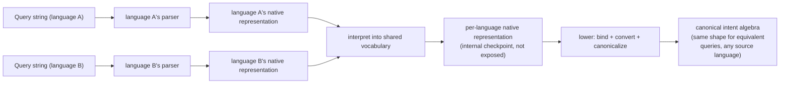
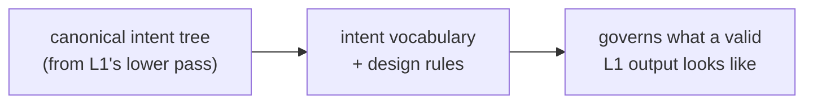
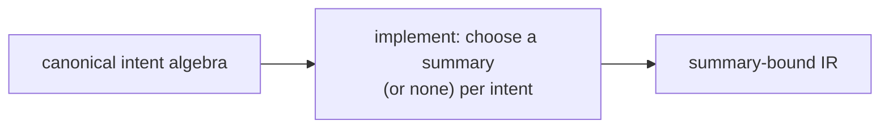
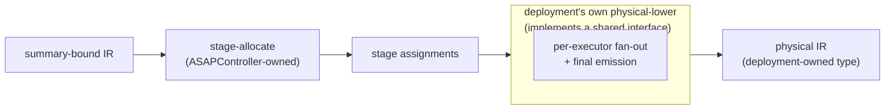
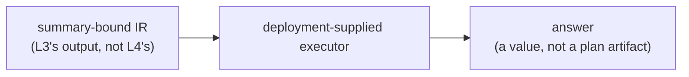

# ASAPController — design

ASAPController **plans** queries — turning a query string into a plan,
not running it. Two different questions come up when describing that
pipeline, and this document answers them separately rather than
conflating them into one "layer":

- **Representation** — "what abstraction level are we at right now?"
  A representation is a concrete shape data sits in at some point —
  a real type, or (for the one case with no ASAPController-owned type)
  an interface boundary. Representations don't run; they just *are*.
- **Pass** — "what processing does the code go through next?" A pass
  is the function/algorithm that turns one representation into
  another — or, for `canonicalize`, rewrites a representation into a
  normal form of *itself* (same type in, same type out — a within-
  representation pass, not a level change).

Five representations, connected by four passes:

```
query string
    │  pass: parse (each language's own third-party parser)
    │        + interpret (front end's own translation into one shared,
    │          not-yet-canonical vocabulary)
    ▼
per-language native representation
  (spans the raw parser AST and asap-l2's shared-but-uncanonical
  relational tree; internal to L1, never exposed as its own layer —
  see "Why this doesn't get its own layer" under L1, below)
    │  pass: lower (bind + structurally convert + canonicalize,
    │        one call: convert_root)
    ▼
unified canonical intent algebra  ← L2
    │  pass: implement (planning-time binding)
    ▼
summary-bound IR  ← L3
    │  pass: physical-lower (deployment-supplied)
    ▼
physical IR, ready for runtime/execution  ← L4
  (no ASAPController-owned type — a deployment's own Output type)
```

**L1-L4 below label representations, not passes.** Each heading names
the artifact that representation *is* — the "Job:" line under it names
the pass that *produces* it. Where a layer bundles more than one pass
(L1 bundles two: parse+interpret, then lower) or hosts a pass that
isn't part of the planning pipeline at all (L3's serving-time
`execute` is runtime evaluation, not a pass — see "Serving-time
execution" below), that's called out explicitly rather than folded
silently into one description.

**A note on type names below.** This document's "Interface" sections
show real Rust shapes, but some are written with *this* document's
layer numbers (e.g. `L2Expr`, `L3Node`) rather than whatever digit the
implementation currently carries — the implementation predates this
renumbering and hasn't caught up yet. Treat these as the design target,
not a guarantee that `grep`-ing the exact identifier finds it today.

## L1 — per-language native representation → canonical intent algebra

This section covers **two passes**, not one — both are internal to L1;
nothing outside it observes the checkpoint between them.

**Pass 1 — parse + interpret.** Each query language owns its own
third-party parser (`promql-parser`, `sqlparser`), producing that
parser's own AST — a different Rust type per language, sharing nothing.
The front end then interprets that AST into one shared relational
vocabulary (filter, project, aggregate, window, sort, limit, join, set
operations, …) — the same type regardless of source language, but
still named-column, not yet canonical. Together these produce **the
per-language native representation** — a real intermediate that spans
two real types (the third-party AST, then `asap-l2`'s own shared
relational tree), collapsed into one description here because nothing
outside this pipeline ever depends on either shape independently: no
test, tool, or downstream crate reads them as a stable target.

**Pass 2 — lower.** One shared step, used by every front end regardless
of language: bind names to schema positions, translate the tree
structurally into the canonical shape, then run a cross-language
normalization pass so that semantically equivalent queries — from any
supported language, or differently-phrased within the same language —
converge on the identical canonical shape. This is genuinely more than
renaming column references: `canonicalize` alone rewrites several real
shape differences away (e.g. promoting a generic
`Limit{Sort{Aggregate([Count])}}` shape to the explicit heavy-hitter
`Aggregate{aggs:[TopK]}` form), not just resolved-vs-unresolved column
identity.



**Why "per-language native representation" doesn't get its own layer.**
It's a real checkpoint — a genuine crate boundary (front-end crates hand
it to `asap-l2`) — but it fails the test a layer has to pass: something
*outside* this pipeline treating it as a stable interface. Nothing does.
It only ever appears as a function argument on the way to canonical,
never persisted, tested independently, or round-tripped. Compare L2,
below, which many things depend on directly (L1's output must conform
to it; L3's binding pattern-matches it; the DAG-export tooling walks
it) — that's what makes L2 a layer and this merely a pass's internal
state.

- Doc: [`l1-query-language.md`](./l1-query-language.md)

## L2 — intent algebra

**Job: define the canonical intent tree's vocabulary — the shape L1's
`lower` pass must produce — expressed declaratively (e.g. "a quantile
to this accuracy," "the top-k by this ranking"), not committed to any
particular implementation strategy.** This is the one section with no
"Job" pass of its own: L2 doesn't transform anything — it's the
vocabulary/rule set L1's output must conform to, checked by
construction (every `lower` call runs the same `canonicalize`), not by
a separate validation step.
- The result is a language- and deployment-independent canonical
  intent tree: what to compute, without committing to how. Deployment
  here refers to a physical execution context — e.g. parallelism and
  the lifecycle stage a computation runs at — a different sense of
  "deployment" than the Glossary's "Deployment model" entry below;
  see that entry for the distinction.
- No summary type or parameters are committed here; that's explicitly
  deferred to L3, below.
- Row identity (which positions uniquely identify a row — see
  `Schema::unique_keys`) and cross-query sharing of common
  sub-computations are properties of this canonical form. Both depend
  on L1's `lower` pass having already converged semantically-equivalent
  queries onto the same shape: only structurally-identical sub-trees
  can be recognized as the same reusable computation.



- Doc: [`l2-intent-algebra.md`](./l2-intent-algebra.md)

## L3 — canonical intent algebra → summary-bound IR

**Pass: implement (planning-time only).** Decide, for each intent,
whether and how it is answered by a summary rather than by scanning raw
data — symbolically picking a summary family and its parameters, with
no reference to what's actually stored anywhere.
- An "implementation" is the concrete realization chosen for one piece
  of intent — e.g. a summary family and its parameters, an exact
  accumulator, or passing through to compute directly from raw data.
- Agnostic to physical execution (where something runs, how parallel it
  is) — that's L4's decision alone.



**Serving-time `execute` is not a pass in this pipeline.** It's a
separate, runtime concern: walking an already-produced `L3Node` against
whatever is actually materialized right now, to answer one query. It
doesn't produce a new planning representation (no L5 exists) — its
output is a value, consumed immediately, not a plan artifact handed to
another layer. Covered in its own "Serving-time execution" section
below, kept distinct for exactly this reason.

- Doc: [`l3-summary-bound-ir.md`](./l3-summary-bound-ir.md)

## L4 — summary-bound IR → physical IR (physical runtime / data plane)

**Two passes, split by who owns them.**
- **stage-allocate** (ASAPController-owned, shared code: `StageAllocator`)
  — given the summary-bound IR, a topology, and deployment constraints,
  decide which physical *stage* each piece runs at. Generic across
  deployments.
- **physical-lower** (deployment-supplied: `PhysicalPlanner::lower`) —
  per-executor fan-out and final emission into that deployment's own
  output format. ASAPController defines the contract; it does not
  perform this pass itself, and does not define — or own a type for —
  its output.
- Inputs: which physical stages exist and how they connect (topology),
  and the budgets/capabilities a given deployment offers (deployment
  constraints).



- Doc: [`l4-physical-plan.md`](./l4-physical-plan.md)

## Serving-time execution

Everything above (L1-L4) is the **planning** pipeline: turning a query
string into a plan, one representation at a time. This section is
different in kind — it's what actually **answers** a query at request
time, using whatever plan L1-L4 already decided. Not a fifth
representation and not a pipeline pass — a runtime evaluator, kept as
its own interface on purpose: a downstream deployment consumes it
independently of how the plan was produced.

**Job: walk an already-decided summary-bound IR against whatever is
actually materialized right now, and produce an answer.** Serving needs
its own error cases — distinct from anything planning-time binding
raises — **because** reality can diverge from what planning assumed in
ways planning time never has to model: data might be missing, several
instances of the same summary might need merging, instances might
disagree on parameters.
- The structural rules — which nestings of a summary-bound IR are
  valid, what must agree for a merge to be legal — are shared and
  deployment-independent. Storage, summary math, and readout are
  entirely deployment-supplied.
- Planning and serving are two separate interfaces a downstream
  deployment implements against.



- Doc: [`l3-summary-bound-ir.md`](./l3-summary-bound-ir.md) — the
  "Serving-time" section covers this in full.

## Glossary

Terms that are project-specific, or that get conflated across layers.
Full detail lives in the layer doc linked from each entry; this is a
quick reference, not a replacement for it.

### Architecture terms

- **Representation** / **layer** — a concrete shape data sits in at
  some point in the pipeline (a real type, or, for L4's output, an
  interface boundary with no ASAPController-owned type). Answers
  "what abstraction level are we at." See the representation/pass table
  at the top of this document.
- **Pass** — the function/algorithm that turns one representation into
  another, or (uniquely, `canonicalize`) rewrites a representation into
  a normal form of itself. Answers "what happens next." A layer's "Job:"
  line names its pass(es); a layer heading names what it produces, not
  what runs.
- **Front end** — The per-language component that elaborates a raw
  query string into that language's own native representation (parse +
  interpret, the first half of L1). One per language. See
  [`l1-query-language.md`](./l1-query-language.md).
- **Bind** — Name resolution: mapping a symbolic column reference to a
  schema position. Part of L1's `lower` pass. See
  [`l1-query-language.md`](./l1-query-language.md).
- **Summary** — Umbrella term for whatever answers a piece of intent
  without re-scanning raw samples: an approximate sketch or an exact
  accumulator. See [`l3-summary-bound-ir.md`](./l3-summary-bound-ir.md).
- **Cost model** — The extension point that ranks candidate summary
  choices for a given intent. See
  [`l3-summary-bound-ir.md`](./l3-summary-bound-ir.md).
- **Deployment model** — A concrete bundle of (L3 summary choices) +
  (L4 topology) + configuration emission, packaged for one downstream
  deployment. See [`l4-physical-plan.md`](./l4-physical-plan.md). Not
  the same sense of "deployment" L2's Job description uses (a physical
  execution context — parallelism, lifecycle stage) — that's a property
  a plan runs *under*, this is the packaged product that *implements*
  L3/L4 for one downstream consumer.
- **Stage** / **Executor** / **Topology** / **Deployment constraints** —
  L4 concepts: a categorical placement tier, a concrete runtime
  instance, which stages exist and how they connect, and the
  per-deployment budgets/capabilities. See
  [`l4-physical-plan.md`](./l4-physical-plan.md).

### Workload

The normalized input meant to sit in front of every query entry point.

- **Query workload** — a batch of one-shot and/or repeating queries,
  all in the same query language, each with an optional accuracy
  and/or latency requirement.
- **Data characteristics** — workload-level facts (series/row count,
  sample rate, wire size, key distribution) used to size summaries
  without running the query.
