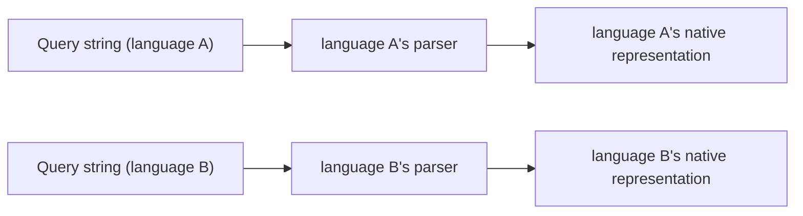
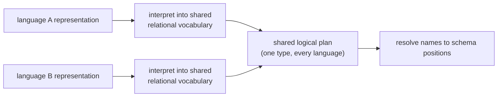
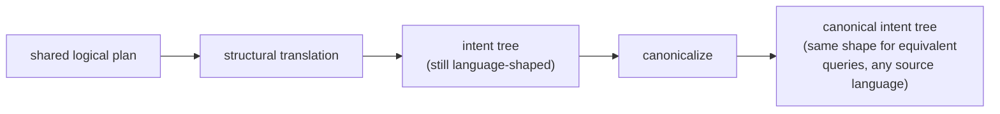
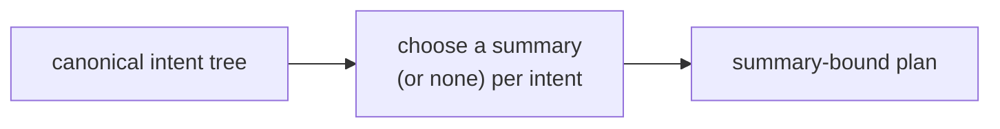
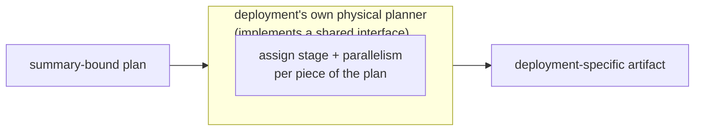
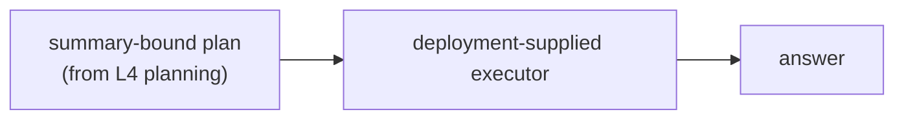

# ASAPController — design

ASAPController **plans** queries through five layers — turning a query
string into a plan, not running it:
- **L1** — parse each query language into its own native shape
- **L2** — unify every language's parsed representation into one shared
  logical plan, and resolve column names to schema positions
- **L3** — unify semantically-equivalent queries into one canonical,
  language-independent form expressed as *intent* — what to compute,
  without committing to how
- **L4** — decide how each intent is answered: which summary (if any)
  realizes it, still without committing to where it runs
- **L5** — decide where and how each piece of the plan executes
  physically (placement, parallelism, lifecycle stage)

**Answering** a query at request time — using whatever L1-L5 already
decided — is a separate concern from planning, covered in its own
"Serving-time execution" section after L5, below.

## L1 — query language (front end)

**Job: elaborate a raw query string into that language's own native
representation, independently per language — remaining agnostic to
every other query language, whose reconciliation is deferred to L2.**
- Each supported query language owns its own parser and produces its
  own native shape. This layer has no shared vocabulary between
  languages, and no summary awareness.

- Doc: [`l1-query-language.md`](./l1-query-language.md)

## L2 — logical plan

**Job: unify every language's L1 representation into one shared
relational tree (or DAG), and resolve symbolic column references to
schema positions.**
- **This is more than syntax translation.** Each language's own
  operators must be *interpreted* into the same shared relational
  vocabulary (filter, project, aggregate, window, sort, limit, join,
  set operations, …). Languages differ in which shapes they can
  already recognize directly at this layer and which ones only reach a
  more generic shape here. **No cross-language normalization of
  equivalent shapes happens yet** — two queries that mean the same
  thing may still look structurally different after L2; that
  convergence is L3's job.
- Columns are still named references at this layer, not positions —
  resolving a name to a position happens here, but still per language,
  since different languages carry different schema guarantees (a fully
  known schema vs. one only known by whatever a query happens to
  reference).

- Doc: [`l2-logical-plan.md`](./l2-logical-plan.md)

## L3 — intent algebra

**Job: specify intent — the computation and its accuracy requirement —
while remaining agnostic to implementation strategy, which L4 alone
decides.**
- **The cross-language normalization step lives here.** Semantically
  equivalent queries, however each language happened to express them,
  converge on one canonical shape at this layer. A shared logical-plan
  type alone (L2) isn't enough for this: different languages can reach
  the same L2 shape by different paths, and some equivalent
  computations only become recognizable as equivalent once normalized.
- The result is a language- and deployment-independent canonical
  intent tree: what to compute, expressed declaratively (e.g. "a
  quantile to this accuracy," "the top-k by this ranking"), not
  committed to any particular implementation strategy. Deployment here
  refers to a physical execution context — e.g. parallelism and the
  lifecycle stage a computation runs at.
- No summary type or parameters are committed here; that's explicitly
  deferred to L4, below.
- Row identity (which positions uniquely identify a row) and
  cross-query sharing of common sub-computations are properties of
  this canonical form, not inherited from L2.

- Doc: [`l3-intent-algebra.md`](./l3-intent-algebra.md)

## L4 — summary-bound IR

**Job (planning-time only): decide, for each intent, whether and how it
is answered by a summary rather than by scanning raw data** —
symbolically picking a summary family and its parameters, with no
reference to what's actually stored anywhere. **This is planning-time
only** — the serving-time half, which actually answers a query using
what got decided here, is covered in its own section below (after L5).
- An "implementation" is the concrete realization chosen for one piece
  of intent — e.g. a summary family and its parameters, an exact
  accumulator, or passing through to compute directly from raw data.
- Agnostic to physical execution (where something runs, how parallel it
  is) — that's L5's decision alone.

- Doc: [`l4-summary-bound-ir.md`](./l4-summary-bound-ir.md)

## L5 — physical plan

**Job: commit to physical execution — assign each piece of an
already-summary-bound plan to a physical execution mode (e.g. lifecycle
stage, parallelism) — taking L4's summary choices as fixed.**
- Inputs to L5: which physical stages exist and how they connect
  (topology), and the budgets/capabilities a given deployment offers
  (deployment constraints).
- This layer is inherently deployment-specific. ASAPController defines
  the interface a deployment implements, not a concrete physical
  planner.

- Doc: [`l5-physical-plan.md`](./l5-physical-plan.md)

## Serving-time execution

Everything above (L1-L5) is the **planning** pipeline: turning a query
string into a plan. This section is different in kind — it's what
actually **answers** a query at request time, using whatever plan L1-L5
already decided. It's kept as its own interface on purpose: a
downstream deployment consumes it independently of how the plan was
produced.

**Job: walk an already-decided summary-bound plan against whatever is
actually materialized right now, and produce an answer.** Reality can
diverge from the plan in ways planning time never sees — missing data,
multiple instances needing a merge, instances that disagree on
parameters — which is why serving needs its own error cases, distinct
from anything planning-time binding raises.
- The structural rules — which nestings of a summary-bound plan are
  valid, what must agree for a merge to be legal — are shared and
  deployment-independent. Storage, summary math, and readout are
  entirely deployment-supplied.
- Planning and serving are two separate interfaces a downstream
  deployment implements against.

- Doc: [`l4-summary-bound-ir.md`](./l4-summary-bound-ir.md) — the
  "Serving-time" section covers this in full.

## Glossary

Terms that are project-specific, or that get conflated across layers.
Full detail lives in the layer doc linked from each entry; this is a
quick reference, not a replacement for it.

### Architecture terms

- **Front end** — The per-language component that elaborates a raw
  query string into that language's own native representation. L1's
  job, one per language. See [`l1-query-language.md`](./l1-query-language.md).
- **Bind** — Name resolution: mapping a symbolic column reference to a
  schema position. Introduced at L2. See
  [`l2-logical-plan.md`](./l2-logical-plan.md).
- **Summary** — Umbrella term for whatever answers a piece of intent
  without re-scanning raw samples: an approximate sketch or an exact
  accumulator. See [`l4-summary-bound-ir.md`](./l4-summary-bound-ir.md).
- **Cost model** — The extension point that ranks candidate summary
  choices for a given intent. See
  [`l4-summary-bound-ir.md`](./l4-summary-bound-ir.md).
- **Deployment model** — A concrete bundle of (L4 summary choices) +
  (L5 topology) + configuration emission, packaged for one downstream
  deployment. See [`l5-physical-plan.md`](./l5-physical-plan.md).
- **Stage** / **Executor** / **Topology** / **Deployment constraints** —
  L5 concepts: a categorical placement tier, a concrete runtime
  instance, which stages exist and how they connect, and the
  per-deployment budgets/capabilities. See
  [`l5-physical-plan.md`](./l5-physical-plan.md).

### Workload

The normalized input meant to sit in front of every query entry point.

- **Query workload** — a batch of one-shot and/or repeating queries,
  all in the same query language, each with an optional accuracy
  and/or latency requirement.
- **Data characteristics** — workload-level facts (series/row count,
  sample rate, wire size, key distribution) used to size summaries
  without running the query.
