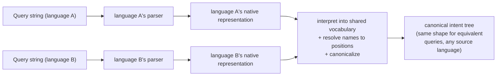
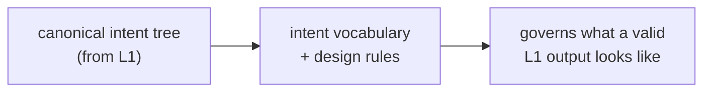
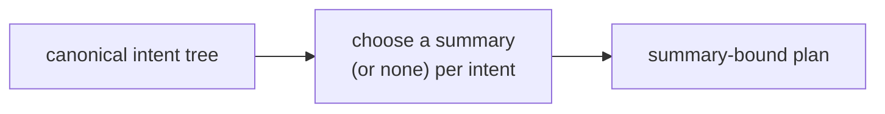
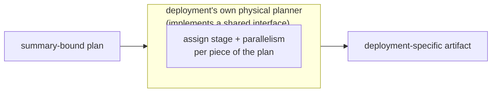
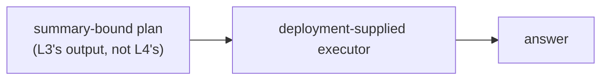

# ASAPController — design

ASAPController **plans** queries through four layers — turning a query
string into a plan, not running it:
- **L1** — parse each query language into its own native shape, then
  unify it into one shared relational vocabulary, resolve column names
  to schema positions, and canonicalize — producing the canonical
  intent tree
- **L2** — the canonical intent tree's own vocabulary and rules: what
  to compute, expressed declaratively, without committing to how
- **L3** — decide how each intent is answered: which summary (if any)
  realizes it, still without committing to where it runs
- **L4** — decide where and how each piece of the plan executes
  physically (placement, parallelism, lifecycle stage)

Each layer heading below follows an "X to Y" shape — what comes in, what
goes out — **except L2**, which doesn't transform anything: it's the
vocabulary/rule set that L1's output must conform to, not a pipeline
stage with its own input and output. Its heading names what it is, not
a transformation.

This used to be a five-layer pipeline with parsing (L1) and shared
relational unification (L2) as separate stages. They're merged now: L1
already has to run every front end through the same internal pipeline
— interpret into shared vocabulary, bind, structurally convert,
canonicalize — to reach the canonical form, so exposing that internal
pipeline as its own numbered layer added a seam nothing outside L1 ever
actually observed. What still earns its own layer is the canonical form
itself — its vocabulary and the rules that make it canonical — which is
L2, below.

**A note on type names below.** This document's "Interface" sections
show real Rust shapes, but some are written with *this* document's
layer numbers (e.g. `L2Expr`, `L3Node`) rather than whatever digit the
implementation currently carries — the implementation predates this
renumbering and hasn't caught up yet. Treat these as the design target,
not a guarantee that `grep`-ing the exact identifier finds it today.

**Answering** a query at request time — using whatever L1-L4 already
decided — is a separate concern from planning, covered in its own
"Serving-time execution" section after L4, below.

## L1 — query language expressions to canonical intent tree

**Job: elaborate a raw query string all the way into the canonical
intent tree, independently per language — remaining agnostic to every
other query language.**
- Each supported query language owns its own parser and produces its
  own native shape. No shared vocabulary between languages at this
  point, and no summary awareness anywhere in this layer.
- Every front end then runs through one shared internal pipeline:
  interpret its native shape into a common relational vocabulary
  (filter, project, aggregate, window, sort, limit, join, set
  operations, …), resolve column names to schema positions, then run a
  shared cross-language normalization pass so that semantically
  equivalent queries — from any supported language — converge on the
  identical canonical shape. This is genuinely more than syntax
  translation: two queries that mean the same thing can still take
  different structural paths to get here, and only this normalization
  step forces them to the same shape.

- Doc: [`l1-query-language.md`](./l1-query-language.md)

## L2 — intent algebra

**Job: define the canonical intent tree's vocabulary — the shape L1's
output must conform to — expressed declaratively (e.g. "a quantile to
this accuracy," "the top-k by this ranking"), not committed to any
particular implementation strategy.**
- The result is a language- and deployment-independent canonical
  intent tree: what to compute, without committing to how. Deployment
  here refers to a physical execution context — e.g. parallelism and
  the lifecycle stage a computation runs at — a different sense of
  "deployment" than the Glossary's "Deployment model" entry below;
  see that entry for the distinction.
- No summary type or parameters are committed here; that's explicitly
  deferred to L3, below.
- Row identity (which positions uniquely identify a row — see
  `Schema::unique_keys`) and cross-query sharing of common
  sub-computations are properties of this canonical form. Both depend
  on L1 having already converged semantically-equivalent queries onto
  the same shape: only structurally-identical sub-trees can be
  recognized as the same reusable computation, which is exactly what
  L1's canonicalization step (not this layer) guarantees.

- Doc: [`l2-intent-algebra.md`](./l2-intent-algebra.md)

## L3 — canonical intent tree to summary-bound IR

**Job (planning-time only): decide, for each intent, whether and how it
is answered by a summary rather than by scanning raw data** —
symbolically picking a summary family and its parameters, with no
reference to what's actually stored anywhere. **This is planning-time
only** — the serving-time half, which actually answers a query using
what got decided here, is covered in its own section below (after L4).
- An "implementation" is the concrete realization chosen for one piece
  of intent — e.g. a summary family and its parameters, an exact
  accumulator, or passing through to compute directly from raw data.
- Agnostic to physical execution (where something runs, how parallel it
  is) — that's L4's decision alone.

- Doc: [`l3-summary-bound-ir.md`](./l3-summary-bound-ir.md)

## L4 — summary-bound IR to physical plan (physical runtime / data plane)

**Job: define the contract a deployment's own physical planner
implements — assign each piece of an already-summary-bound plan to a
physical execution mode (e.g. lifecycle stage, parallelism) — taking
L3's summary choices as fixed.** ASAPController does not perform this
assignment itself; it only defines the interface a deployment
implements against (see "Core concepts" in the layer doc).
- Inputs to L4: which physical stages exist and how they connect
  (topology), and the budgets/capabilities a given deployment offers
  (deployment constraints).
- This layer is inherently deployment-specific. ASAPController defines
  the interface a deployment implements, not a concrete physical
  planner.

- Doc: [`l4-physical-plan.md`](./l4-physical-plan.md)

## Serving-time execution

Everything above (L1-L4) is the **planning** pipeline: turning a query
string into a plan. This section is different in kind — it's what
actually **answers** a query at request time, using whatever plan L1-L4
already decided. It's kept as its own interface on purpose: a
downstream deployment consumes it independently of how the plan was
produced.

**Job: walk an already-decided summary-bound plan against whatever is
actually materialized right now, and produce an answer.** Serving needs
its own error cases — distinct from anything planning-time binding
raises — **because** reality can diverge from what planning assumed in
ways planning time never has to model: data might be missing, several
instances of the same summary might need merging, instances might
disagree on parameters.
- The structural rules — which nestings of a summary-bound plan are
  valid, what must agree for a merge to be legal — are shared and
  deployment-independent. Storage, summary math, and readout are
  entirely deployment-supplied.
- Planning and serving are two separate interfaces a downstream
  deployment implements against.

- Doc: [`l3-summary-bound-ir.md`](./l3-summary-bound-ir.md) — the
  "Serving-time" section covers this in full.

## Glossary

Terms that are project-specific, or that get conflated across layers.
Full detail lives in the layer doc linked from each entry; this is a
quick reference, not a replacement for it.

### Architecture terms

- **Front end** — The per-language component that elaborates a raw
  query string all the way into the canonical intent tree. L1's job,
  one per language. See [`l1-query-language.md`](./l1-query-language.md).
- **Bind** — Name resolution: mapping a symbolic column reference to a
  schema position. Part of L1's internal pipeline. See
  [`l1-query-language.md`](./l1-query-language.md).
- **Summary** — Umbrella term for whatever answers a piece of intent
  without re-scanning raw samples: an approximate sketch or an exact
  accumulator. See [`l3-summary-bound-ir.md`](./l3-summary-bound-ir.md).
- **Cost model** — The extension point that ranks candidate summary
  choices for a given intent. See
  [`l3-summary-bound-ir.md`](./l3-summary-bound-ir.md).
- **Deployment model** — A concrete bundle of (L3 summary choices) +
  (L4 topology) + configuration emission, packaged for one downstream
  deployment. See [`l4-physical-plan.md`](./l4-physical-plan.md). Not
  the same sense of "deployment" L2's Job description uses (a physical
  execution context — parallelism, lifecycle stage) — that's a property
  a plan runs *under*, this is the packaged product that *implements*
  L3/L4 for one downstream consumer.
- **Stage** / **Executor** / **Topology** / **Deployment constraints** —
  L4 concepts: a categorical placement tier, a concrete runtime
  instance, which stages exist and how they connect, and the
  per-deployment budgets/capabilities. See
  [`l4-physical-plan.md`](./l4-physical-plan.md).

### Workload

The normalized input meant to sit in front of every query entry point.

- **Query workload** — a batch of one-shot and/or repeating queries,
  all in the same query language, each with an optional accuracy
  and/or latency requirement.
- **Data characteristics** — workload-level facts (series/row count,
  sample rate, wire size, key distribution) used to size summaries
  without running the query.
