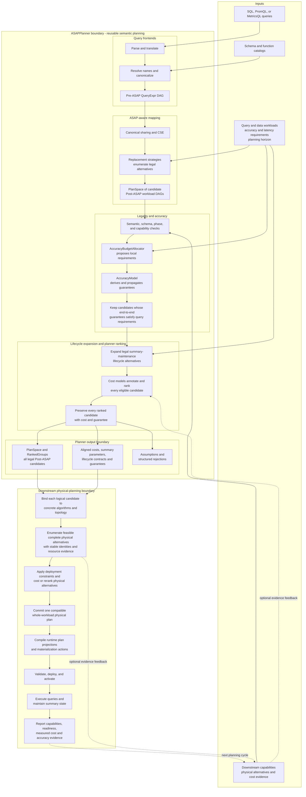

# ASAPPlanner design overview

ASAPPlanner is a reusable planning library. It converts queries and workload
requirements into legal, ranked, deployment-independent Post-ASAP candidates.
It does not commit, deploy, or execute a physical plan; downstream systems such
as ASAPQuery-backend bind the candidates to physical alternatives, make the
deployment-level decision, and run the selected contract.

## Planner component flow

The ordering in the diagram is a correctness boundary:

1. Frontends normalize source-language queries into the shared Pre-ASAP IR.
2. ASAP-aware mapping enumerates alternatives; it does not choose one.
3. Legality and the accuracy model reject candidates that cannot prove the
   requested semantics and end-to-end guarantee.
4. Lifecycle expansion and cost models rank only eligible alternatives while
   preserving the candidate set. Cost cannot make an illegal candidate legal.
5. Downstream systems bind those candidates to concrete physical alternatives.
   Physical feasibility and deployment costs may change their order; downstream
   then chooses and commits the complete physical plan.

## Module map

| Area | Main crate or module | Responsibility |
|---|---|---|
| Shared IR | `asap-types` | Pre-ASAP and Post-ASAP expressions, schemas, workloads, guarantees, and exported plan data |
| Query frontends | `frontend-sql`, `frontend-promql`, `frontend-metricsql` | Parse source languages and produce canonical Pre-ASAP queries |
| ASAP-aware mapping | `asap-aware-mapping` | Candidate generation, CSE, legality, accuracy propagation, lifecycle expansion, costing, and ranking |
| Developer inspection | `devtools` | Expose planner DAGs, alternatives, decisions, and explanations for inspection |
| End-to-end validation | `integration-tests` | Verify behavior across frontends, mapping, and output IR |

## Inputs and outputs

Planner inputs are intentionally broader than a query string. Selection may
depend on query recurrence, data arrival and distribution, accuracy and latency
requirements, the planning horizon, available materialized state, downstream
capabilities, and complete cost evidence. Missing or stale evidence must remain
explicit rather than being treated as zero.

The primary output boundary is `PlanSpace` plus its `cost_sorted` view: every
memo group retains its legal Post-ASAP candidates, ranked with index-aligned
costs. Downstream combines compatible choices across groups rather than
assuming that the first candidate in each group is already a feasible physical
workload plan. Each candidate carries the
planner-owned semantic decisions needed downstream: summary algorithms and
parameters, shared producer identities, logical time coverage, maintenance
lifecycle requirements, and accuracy guarantees. Explanation output records
costs, assumptions, and why candidates were rejected before ranking.

ASAPQuery-backend and other downstream applications translate the candidates
into physical alternatives. They own concrete implementations, storage layout,
placement, sharding, deployment-level cost and compatibility, final commitment,
serving, and operational feedback. Their physical planning can reorder
candidates because it has evidence that the reusable Planner does not, but it
must not silently change Planner-owned semantics.

When a downstream provider supplies complete physical alternatives and evidence
back to Planner, `global_selection*` APIs can perform the final compatible
whole-plan comparison as a convenience. That is an iterative specialization of
the same boundary, not a requirement that the reusable Planner hide the ranked
candidate set from downstream consumers.

## Detailed designs

- [Parsing and canonicalization](parse_and_canonicalize.md)
- [Pre-ASAP IR](pre-asap-ir.md)
- [Post-ASAP IR](post-asap-ir.md)
- [ASAP-aware mapping](asap-aware-mapping/README.md)
- [Accuracy guarantees](asap-aware-mapping/end-to-end-accuracy-guarantees.md)
- [Workload demand and summary lifecycle](asap-aware-mapping/workload-demand-and-summary-lifecycle.md)
- [Physical-plan integration](asap-aware-mapping/physical-plan-integration.md)
- [Analytical resource cost](asap-aware-mapping/analytical-resource-cost.md)
- [Searching over plans](asap-aware-mapping/searching_over_plans.md)
- [Explainability](asap-aware-mapping/explainability.md)
- [ASAPPlanner and downstream application boundaries](asapplanner-downstream-boundary.md)
