# ASAPPlanner design overview

ASAPPlanner is a reusable planning library. It converts queries and workload
requirements into a selected, deployment-independent Post-ASAP plan. It does
not deploy summaries or execute queries; downstream systems such as
ASAPQuery-backend compile and run the selected contract.

## Planner component flow

```mermaid
flowchart LR
    subgraph INPUTS[Inputs]
        QUERY[SQL, PromQL, or MetricsQL queries]
        WORKLOAD[Query and data workloads<br/>accuracy and latency requirements<br/>planning horizon]
        CATALOG[Schema and function catalogs]
        PROVIDER[Downstream capabilities<br/>physical alternatives and cost evidence]
    end

    subgraph FRONTENDS[Query frontends]
        PARSE[Parse and translate]
        CANON[Resolve names and canonicalize]
        PRE[Pre-ASAP QueryExpr DAG]
        PARSE --> CANON --> PRE
    end

    subgraph MAPPING[ASAP-aware mapping]
        CSE[Canonical sharing and CSE]
        STRATEGIES[Replacement strategies<br/>enumerate legal alternatives]
        SPACE[PlanSpace of candidate<br/>Post-ASAP workload DAGs]
        CSE --> STRATEGIES --> SPACE
    end

    subgraph CORRECTNESS[Legality and accuracy]
        LEGAL[Semantic, schema, phase,<br/>and capability checks]
        BUDGET[AccuracyBudgetAllocator<br/>proposes local requirements]
        ACCURACY[AccuracyModel<br/>derives and propagates guarantees]
        SATISFY[Keep candidates whose end-to-end<br/>guarantees satisfy query requirements]
        LEGAL --> BUDGET --> ACCURACY --> SATISFY
    end

    subgraph SELECTION[Lifecycle and cost selection]
        LIFECYCLE[Expand legal summary-maintenance<br/>lifecycle alternatives]
        COST[Cost models evaluate complete<br/>candidate implementations]
        SELECT[Select a compatible<br/>whole-workload plan]
        LIFECYCLE --> COST --> SELECT
    end

    subgraph OUTPUTS[Planner outputs]
        POST[Selected Post-ASAP workload DAG]
        CONTRACT[Summary parameters, lifecycle and<br/>accuracy guarantees, provider identity]
        EXPLAIN[Costs, assumptions, alternatives,<br/>and structured rejections]
    end

    QUERY --> PARSE
    CATALOG --> CANON
    PRE --> CSE
    WORKLOAD --> STRATEGIES
    WORKLOAD --> BUDGET
    WORKLOAD --> LIFECYCLE
    PROVIDER --> LEGAL
    PROVIDER --> COST
    SPACE --> LEGAL
    SATISFY --> LIFECYCLE
    SELECT --> POST
    SELECT --> CONTRACT
    SELECT --> EXPLAIN

    POST --> DOWNSTREAM[Downstream compilation, deployment,<br/>execution, and runtime feedback]
    CONTRACT --> DOWNSTREAM
```

The ordering in the diagram is a correctness boundary:

1. Frontends normalize source-language queries into the shared Pre-ASAP IR.
2. ASAP-aware mapping enumerates alternatives; it does not choose one.
3. Legality and the accuracy model reject candidates that cannot prove the
   requested semantics and end-to-end guarantee.
4. Lifecycle expansion and cost models compare only eligible, complete
   alternatives. Cost cannot make an illegal candidate legal.
5. The selected Post-ASAP DAG and its guarantees form a contract consumed by
   downstream systems. Concrete implementation, placement, deployment, and
   execution remain downstream responsibilities.

## Module map

| Area | Main crate or module | Responsibility |
|---|---|---|
| Shared IR | `asap-types` | Pre-ASAP and Post-ASAP expressions, schemas, workloads, guarantees, and exported plan data |
| Query frontends | `frontend-sql`, `frontend-promql`, `frontend-metricsql` | Parse source languages and produce canonical Pre-ASAP queries |
| ASAP-aware mapping | `asap-aware-mapping` | Candidate generation, CSE, legality, accuracy propagation, lifecycle expansion, costing, and selection |
| Developer inspection | `devtools` | Expose planner DAGs, alternatives, decisions, and explanations for inspection |
| End-to-end validation | `integration-tests` | Verify behavior across frontends, mapping, and output IR |

## Inputs and outputs

Planner inputs are intentionally broader than a query string. Selection may
depend on query recurrence, data arrival and distribution, accuracy and latency
requirements, the planning horizon, available materialized state, downstream
capabilities, and complete cost evidence. Missing or stale evidence must remain
explicit rather than being treated as zero.

The primary output is a selected Post-ASAP workload DAG. It carries the
planner-owned semantic decisions needed downstream: summary algorithms and
parameters, shared producer identities, logical time coverage, maintenance
lifecycle requirements, accuracy guarantees, and the identity of any selected
provider alternative. Explanation output records costs, assumptions, and why
other candidates were rejected.

ASAPQuery-backend and other downstream applications translate that contract
into executable plans. They own concrete implementations, storage layout,
placement, sharding, deployment, serving, and operational feedback; they must
not silently change Planner-owned semantics.

## Detailed designs

- [Parsing and canonicalization](parse_and_canonicalize.md)
- [Pre-ASAP IR](pre-asap-ir.md)
- [Post-ASAP IR](post-asap-ir.md)
- [ASAP-aware mapping](asap-aware-mapping/README.md)
- [Accuracy guarantees](asap-aware-mapping/end-to-end-accuracy-guarantees.md)
- [Workload demand and summary lifecycle](asap-aware-mapping/workload-demand-and-summary-lifecycle.md)
- [Physical-plan integration](asap-aware-mapping/physical-plan-integration.md)
- [Analytical resource cost](asap-aware-mapping/analytical-resource-cost.md)
- [Searching over plans](asap-aware-mapping/searching_over_plans.md)
- [Explainability](asap-aware-mapping/explainability.md)
- [ASAPPlanner and downstream application boundaries](asapplanner-downstream-boundary.md)
