# ASAPPlanner Design Overview

ASAPPlanner converts queries in supported source languages into candidate
plans that use exact summaries, sketches, samples, wavelets, statistical
models, sharing, and other ASAP-aware alternatives. It evaluates those
candidates against workload requirements, accuracy guarantees, execution
legality, and lifecycle-aware cost before emitting a plan and its deployment
decisions.

## Planner component flow

```mermaid
flowchart LR
    subgraph FRONTEND[Query frontend]
        Q[Original query-language input]
        PARSE[Parse and normalize]
        PRE[Pre-ASAP DAG]
        Q --> PARSE --> PRE
    end

    subgraph WORKLOAD[Workload inputs and model]
        QW[Query workload]
        DW[Data workload]
        H[Explicit planning horizon H]
        W[Normalize workload and derive demand,<br/>time scope, recurrence, and data evidence]
        QW --> W
        DW --> W
        H --> W
    end

    subgraph MAPPING[Semantic mapping DAG]
        MAP[Map the Pre-ASAP DAG into all possible<br/>phase-valid Post-ASAP DAG candidates]
    end

    subgraph ACCURACY[Accuracy model]
        PROP[Propagate guarantees through nested summaries]
        ACHECK[Keep candidates that satisfy each query's<br/>accuracy requirement; reject unknown guarantees]
        PROP --> ACHECK
    end

    subgraph COST[Cost model]
        LIFE[For every candidate, consider lifecycle choices:<br/>build once / prepared / shared / incremental]
        EST[Estimate lifecycle-aware candidate cost over H:<br/>build + maintenance + reads + retention + retirement]
        RANK[Rank candidate and lifecycle pairs]
        LIFE --> EST --> RANK
    end

    subgraph OUTPUT[Materialization and explanation]
        MAT[Materialize the selected Post-ASAP DAG<br/>with its selected summary lifecycle]
        EMIT[Emit final plan, deployment actions,<br/>guarantees, assumptions, and rejections]
        MAT --> EMIT
    end

    PRE --> MAP
    W --> MAP
    MAP --> PROP
    W --> PROP
    ACHECK --> LIFE
    W --> LIFE
    RANK --> MAT
```

## Major components

### Query frontend

The frontend parses an original query-language input, such as PromQL or SQL,
and normalizes it into a Pre-ASAP DAG. The Pre-ASAP DAG represents the query's
semantics without committing to an ASAP summary implementation.

Detailed designs:

- [Parsing and canonicalization](parse_and_canonicalize.md)
- [Pre-ASAP IR](pre-asap-ir.md)

### Workload inputs and model

The workload model keeps three inputs explicit and separate:

- the query workload describes one-time and repeated queries, predictability,
  accuracy and latency requirements, and concrete time selections;
- the data workload describes data arrival, ingestion volume and rate, input
  cardinality, and distribution evidence;
- the planning horizon `H` is the interval over which one-time costs and cost
  rates can be compared.

Normalization derives demand, recurrence, time scope, and freshness-checked
data evidence. Repeated query demand does not imply continuously arriving
data, and a numeric lookback does not by itself determine whether a query is
real-time or longitudinal.

Detailed design:

- [Query workloads, data workloads, and summary lifecycle maintenance](asap-aware-mapping/workload-demand-and-summary-lifecycle.md)

### Semantic mapping DAG

Semantic mapping takes the Pre-ASAP DAG and enumerates possible Post-ASAP DAG
candidates. Candidates may use different summary families, summary
parameters, semantic rewrites, sharing arrangements, roll-ups, and generic
update- or readout-phase value operations. Only semantically, schematically,
and phase-legal alternatives proceed.

The output of this component is the candidate set, not an already deployed
summary.

Detailed designs:

- [Post-ASAP IR](post-asap-ir.md)
- [ASAP-aware mapping overview](asap-aware-mapping/README.md)
- [Mapping key concepts](asap-aware-mapping/key_concepts.md)
- [Searching over candidate plans](asap-aware-mapping/searching_over_plans.md)
- [Mapping optimizations](asap-aware-mapping/optimizations.md)
- [Summary properties](asap-aware-mapping/summary_properties.md)

### Accuracy model

The accuracy model derives a machine-readable guarantee for each candidate.
It propagates guarantees through nested summaries and post-processing rather
than checking each summary independently. A candidate remains eligible only
when its end-to-end guarantee satisfies the corresponding query requirement;
missing or unsupported guarantees fail closed.

Detailed design:

- [End-to-end accuracy guarantees](asap-aware-mapping/end-to-end-accuracy-guarantees.md)

### Cost model

Costing considers the lifecycle of every eligible candidate. A summary may be
built once for an ephemeral query, prepared for predictable demand, shared for
a bounded period, or maintained incrementally as data arrives. Runtime and
summary capabilities determine which lifecycle alternatives are legal.

For each legal candidate-and-lifecycle pair, the model combines build,
maintenance, read, retention, and retirement costs over the explicit horizon
`H`. This makes the lifecycle decision part of candidate cost estimation,
rather than a separate decision made after candidate ranking.

Detailed designs:

- [CSE cost-model decisions](cse-cost-model-decision.md)

### Materialization and explanation

The final output contains both the selected Post-ASAP DAG and the selected
summary lifecycle. It also records deployment actions, end-to-end guarantees,
assumptions, and rejected alternatives.

Materialization commits the summary implementation and its lifecycle. For
example, after a KLL summary is deployed for incremental maintenance, the
runtime cannot silently maintain DDSketch instead. Switching summary type
requires a new planning and materialization decision.

Detailed design:

- [Explainability](asap-aware-mapping/explainability.md)
