# ASAPPlanner Design Overview

ASAPPlanner converts queries in supported source languages into a compact
space of plans that use exact summaries, sketches, samples, wavelets,
statistical models, sharing, and other ASAP-aware alternatives. It removes
illegal alternatives, expands each remaining plan with legal summary
maintenance lifecycles, costs the resulting combinations, and only then
materializes a final plan.

## Planner component flow

```mermaid
flowchart LR
    subgraph FRONTEND[Query frontend]
        Q[Original query-language input]
        PARSE[Parse and normalize]
        PRE[Pre-ASAP DAG]
        Q --> PARSE --> PRE
    end

    subgraph WORKLOAD[Workload inputs and model]
        QW[Query workload]
        DW[Data workload]
        H[Explicit planning horizon H]
        W[Normalize workload and derive demand,<br/>time scope, recurrence, and data evidence]
        QW --> W
        DW --> W
        H --> W
    end

    subgraph MAPPING[Semantic mapping DAG]
        MAP[Build a compact space representing all<br/>Post-ASAP DAG candidates]
    end

    subgraph ACCURACY[Correctness and accuracy models]
        LEGAL[Check semantic, schema,<br/>capability, and phase legality]
        PROP[Propagate guarantees through nested summaries]
        ACHECK[Keep candidates that satisfy each query's<br/>accuracy requirement; reject unknown guarantees]
        LEGAL --> PROP --> ACHECK
    end

    subgraph COST[Lifecycle expansion, cost model, and global selection]
        LIFE[Expand every candidate with legal summary-maintenance lifecycles:<br/>build once / prepared / shared / incremental / existing state]
        EST[Estimate lifecycle-aware candidate cost over H:<br/>build + maintenance + reads + retention + retirement]
        RANK[Select the lowest-cost compatible<br/>whole-plan and lifecycle combination]
        LIFE --> EST --> RANK
    end

    subgraph OUTPUT[Materialization and explanation]
        MAT[Materialize the selected Post-ASAP DAG<br/>with its selected summary-maintenance lifecycle]
        EMIT[Emit final plan, deployment actions,<br/>guarantees, assumptions, and rejections]
        MAT --> EMIT
    end

    PRE --> MAP
    W --> MAP
    MAP --> LEGAL
    W --> PROP
    ACHECK --> LIFE
    W --> LIFE
    RANK --> MAT
```



The optimizer's decision unit is a compatible whole-plan combination:

```text
Post-ASAP candidate plan × summary-maintenance lifecycle assignment
```

It is not sound to select a summary implementation first and attach a
lifecycle afterward. Workload and lifecycle can reverse the ranking: a
summary that is cheapest to build once may be more expensive than another
summary when maintained for a high-frequency dashboard.

## Terminology: summary maintenance lifecycle

This design uses **summary maintenance lifecycle** for the lifetime of planner-
selected summary state: build, prepare, share, incrementally maintain, read,
and retire. A final plan's promises about those actions are its **summary
maintenance lifecycle guarantees**.

This is narrower than the end-to-end **data lifecycle**, which covers data
collection, transmission, storage, and analytics. Unqualified names such as
"lifecycle guarantee" are avoided because they do not say which lifecycle is
being guaranteed.

## Major components

### Query frontend

The frontend parses an original query-language input, such as PromQL or SQL,
and normalizes it into a Pre-ASAP DAG. The Pre-ASAP DAG represents the query's
semantics without committing to an ASAP summary implementation.

Detailed designs:

- [Parsing and canonicalization](parse_and_canonicalize.md)
- [Pre-ASAP IR](pre-asap-ir.md)

### Workload inputs and model

The workload model keeps three inputs explicit and separate:

- the query workload describes one-time and repeated queries, predictability,
  accuracy and latency requirements, and concrete time selections;
- the data workload describes data arrival, ingestion volume and rate, input
  cardinality, and distribution evidence;
- the planning horizon `H` is the interval over which one-time costs and cost
  rates can be compared.

Normalization derives demand, recurrence, time scope, and freshness-checked
data evidence. Repeated query demand does not imply continuously arriving
data, and a numeric lookback does not by itself determine whether a query is
real-time or longitudinal.

Detailed design:

- [Query workloads, data workloads, and summary lifecycle maintenance](asap-aware-mapping/workload-demand-and-summary-lifecycle.md)

### Semantic mapping DAG

Semantic mapping takes the Pre-ASAP DAG and constructs a compact candidate
space. Candidates may use different summary families, summary parameters,
semantic rewrites, sharing arrangements, roll-ups, and generic update- or
readout-phase value operations. Shared structure and local alternative groups
represent possible complete Post-ASAP DAGs without eagerly copying every full
DAG.

Semantic mapping enumerates possibilities; it does not select or deploy one.
Semantic equivalence, schema compatibility, summary capabilities, and phase
contracts remove illegal combinations before costing.

Detailed designs:

- [Post-ASAP IR](post-asap-ir.md)
- [ASAP-aware mapping overview](asap-aware-mapping/README.md)
- [Mapping key concepts](asap-aware-mapping/key_concepts.md)
- [Searching over candidate plans](asap-aware-mapping/searching_over_plans.md)
- [Mapping optimizations](asap-aware-mapping/optimizations.md)
- [Summary properties](asap-aware-mapping/summary_properties.md)

### Accuracy model

The accuracy model derives a machine-readable guarantee for each complete
candidate plan. It propagates guarantees through nested summaries and post-
processing rather than checking each summary independently. A candidate
remains eligible only when its end-to-end guarantee satisfies the
corresponding query requirement; missing evidence or unsupported propagation
rules fail closed.

Detailed design:

- [End-to-end accuracy guarantees](asap-aware-mapping/end-to-end-accuracy-guarantees.md)

### Cost model

Every eligible semantic candidate is expanded with its legal summary-
maintenance lifecycle alternatives. A summary may be built once for an
ephemeral query, prepared for predictable demand, shared for a bounded period,
maintained incrementally as data arrives, or read from compatible existing
state. Runtime, summary, and existing-state capabilities determine which
alternatives are legal.

The cost model estimates; it does not decide legality or silently remove an
alternative. For each legal whole-plan and lifecycle assignment, it combines
build, maintenance, read, retention, and retirement costs over the same
explicit horizon `H`. Unknown costs remain unknown.

The global optimizer then selects the lowest-cost compatible combination. It
accounts for shared state once, validates lifecycle compatibility across
nested summaries and consumers, and retains raw recomputation as an explicit
fallback. Lifecycle is therefore part of candidate cost and global selection,
not a separate decision made after semantic ranking.

Detailed designs:

- [Cost model](cost-model.md)

### Materialization and explanation

The final output contains the selected Post-ASAP DAG, deployment actions,
accuracy guarantees, and summary maintenance lifecycle guarantees. It also
records cost evidence, assumptions, and rejected alternatives.

Conceptually:

```text
FinalPlan {
    post_asap_dag,
    deployments,
    accuracy_guarantees,
    summary_maintenance_lifecycle_guarantees,
    cost_estimates,
    assumptions,
    rejected_alternatives,
}
```

Materialization commits the summary implementation and its maintenance
lifecycle. For example, after a KLL summary is deployed for incremental
maintenance, the runtime cannot silently maintain DDSketch instead. A later
replan may select DDSketch, but the resulting deployment must explicitly
build or migrate state, cut over readers, and retire the KLL state.

Detailed design:

- [Explainability](asap-aware-mapping/explainability.md)
