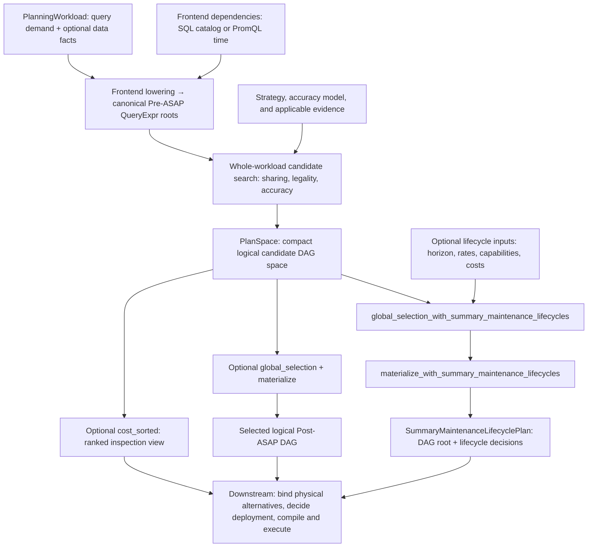

# ASAPPlanner design overview

ASAPPlanner is a reusable planning library. It converts queries and workload
requirements into a deployment-independent space of logical Post-ASAP candidates.
It does not commit, deploy, or execute a physical plan; downstream systems such
as ASAPQuery-backend bind the candidates to physical alternatives, make the
deployment-level decision, and run the selected contract.

For the integration contract, start with [ASAPPlanner input, output, and
workflow](input-output-workflow.md). It defines required and optional inputs,
`PlanSpace`, optional selection and lifecycle helpers, and replanning.

## Planner component flow

`PlanSpace` is the output of logical candidate search. Each target's candidate set holds
alternatives and rejection reasons, but no selected maintenance lifecycle.
The three branches after it are optional: inspect ranked candidates, select
and materialize a logical DAG, or make a workload-aware lifecycle decision.
The last branch needs additional workload and deployment evidence. Its first
call returns a `GlobalSelection`; the second returns a
`SummaryMaintenanceLifecyclePlan` with a materialized root and lifecycle
decisions. No branch by itself deploys or executes a physical plan.

## Module map

| Area | Main crate or module | Responsibility |
|---|---|---|
| Shared IR | `asap-types` | Pre-ASAP and Post-ASAP expressions, schemas, workloads, guarantees, and exported plan data |
| Query frontends | `frontend-sql`, `frontend-promql`, `frontend-metricsql` | Parse source languages and produce canonical Pre-ASAP queries |
| ASAP-aware mapping | `asap-aware-mapping` | Candidate generation, CSE, legality, accuracy propagation, lifecycle expansion, costing, and ranking |
| Developer inspection | `devtools` | Expose planner DAGs, alternatives, decisions, and explanations for inspection |
| End-to-end validation | `integration-tests` | Verify behavior across frontends, mapping, and output IR |

## Inputs and outputs

Planner inputs are intentionally broader than a query string. Selection may
depend on query recurrence, data arrival and distribution, accuracy and latency
requirements, the planning horizon, available materialized state, downstream
capabilities, and complete cost evidence. Missing or stale evidence must remain
explicit rather than being treated as zero.

The primary output is `PlanSpace`; `cost_sorted` derives an optional ranked
view with index-aligned costs. Downstream may inspect compatible choices
across targets rather than assuming the first candidate is a feasible
physical workload plan. Candidates carry logical summary algorithms,
parameters, and guarantees; selected maintenance lifecycle decisions appear
only after a lifecycle-aware helper runs. Rejection reasons are retained in
the candidate space.

ASAPQuery-backend and other downstream applications translate the candidates
into physical alternatives. They own concrete implementations, storage layout,
placement, sharding, deployment-level cost and compatibility, final commitment,
serving, and operational feedback. Their physical planning can reorder
candidates because it has evidence that the reusable Planner does not, but it
must not silently change Planner-owned semantics.

`PlanSpace::global_selection` optionally coordinates structural choices across
targets; `GlobalSelection::materialize` constructs a selected semantic DAG.
Those plain APIs do not establish physical feasibility or a
maintenance-versus-recompute decision. The lifecycle-aware selection call uses
additional workload and evidence inputs; its materialization call returns a
plan with both a root and lifecycle decisions. See the [library guide](../../develop_docs/library-api.md#optional-whole-plan-selection-and-materialization)
for the distinction. Downstream may consume candidates directly and retains
responsibility for physical commitment.

## Further reading

- [Parsing and canonicalization](parse-and-canonicalize.md)
- [Pre-ASAP IR](../concepts/pre-asap-ir.md)
- [Post-ASAP IR](../concepts/post-asap-ir.md)
- [ASAP-aware mapping](asap-aware-mapping.md)
- [Accuracy guarantees](../proposals/asap-aware-mapping/end-to-end-accuracy-guarantees.md)
- [Workload demand and summary lifecycle](../proposals/asap-aware-mapping/workload-demand-and-summary-lifecycle.md)
- [Physical-plan integration](physical-plan-integration.md)
- [Analytical resource cost](../proposals/asap-aware-mapping/analytical-resource-cost.md)
- [Searching over plans](asap-aware-plan-search.md)
- [Explainability](../../develop_docs/replacement-explanations.md)
- [ASAPPlanner and downstream application boundaries](planner-downstream-boundary.md)
