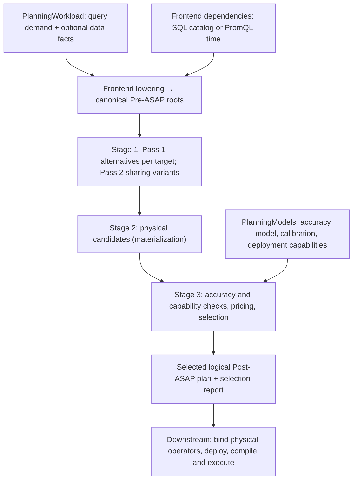

# ASAPPlanner design overview

ASAPPlanner is a reusable planning library. It converts queries and workload
requirements into a selected logical Post-ASAP plan, through the #509 stage
pipeline. It does not deploy or execute a physical plan; downstream systems
such as ASAPQuery-backend bind the plan to physical operators, make the
deployment-level decision, and run the selected contract.

For the integration workflow, start with the
[library API](../../develop_docs/library-api.md);
[ASAPPlanner input, output, and workflows](input-output-workflow.md) defines
the workload inputs.

## Planner component flow

```mermaid
flowchart TD
    W["PlanningWorkload: query demand + optional data facts"]
    F["Frontend dependencies: SQL catalog or PromQL time"]
    M["PlanningModels: accuracy model, calibration, deployment capabilities"]
    PRE["Frontend lowering → canonical Pre-ASAP roots"]
    S1["Stage 1: Pass 1 alternatives per target; Pass 2 sharing variants"]
    S2["Stage 2: physical candidates (materialization)"]
    S3["Stage 3: accuracy and capability checks, pricing, selection"]
    PLAN["Selected logical Post-ASAP plan + selection report"]
    BACKEND["Downstream: bind physical operators, deploy, compile and execute"]
    W --> PRE
    F --> PRE
    PRE --> S1 --> S2 --> S3
    M --> S3
    S3 --> PLAN --> BACKEND
```

Stage 1 lists alternatives without pricing them. Stage 3 rejects a candidate
whose summary estimate misses its query's accuracy target (or has no accuracy
model), that needs a capability the deployment lacks, or that exceeds its
memory budget, and selects the cheapest remaining one. Rejection reasons are
reported with the selection. Cost evidence can rank valid candidates, but it
cannot establish a missing guarantee or turn an unsupported physical
alternative into a deployable plan.

## Module map

| Area | Main crate or module | Responsibility |
|---|---|---|
| Shared IR | `asap-types` | The unified operator IR (`ir`: one `OperatorNode` before and after ASAP optimization), schemas, workloads, guarantees, and exported plan data |
| Front-end common | `frontend-common` | Name-based `UnresolvedOp` tree shared by the front ends, and `resolve_root` into the operator IR |
| Query frontends | `frontend-sql`, `frontend-promql`, `frontend-metricsql` | Parse source languages and produce canonical Pre-ASAP queries |
| ASAP-aware mapping | `asap-logical-optimizer`, `asap-physical-optimizer`, `asap-plan-selection` | #509 Stages 1–3: logical alternatives and sharing; physical candidates; accuracy checks, costing and selection |
| Planner facade | `asap-planner` | Lowering dispatch, the optimization pass (`OptimizationPass`, `StagePipeline`) and `optimize` |
| Developer inspection | `devtools` | Expose planner DAGs, alternatives, decisions, and explanations for inspection |
| End-to-end validation | `integration-tests` | Verify behavior across frontends, mapping, and output IR |

## Inputs and outputs

Planner inputs are intentionally broader than a query string. Selection may
depend on query recurrence, data arrival and distribution, accuracy and latency
requirements, the planning horizon, available materialized state, downstream
capabilities, and complete cost evidence. Missing or stale evidence must remain
explicit rather than being treated as zero.

The output is the selected plan: one logical Post-ASAP root per query
(`PlanOutput`), with the selection report — the priced candidates, the rejected
ones with their reasons, and whether the selection is guaranteed optimal.
`plan_stages` also returns Stage 1's alternatives for inspection.

ASAPQuery-backend and other downstream applications translate the selected plan
into physical alternatives. They own concrete implementations, storage layout,
placement, sharding, deployment-level cost and compatibility, final commitment,
serving, and operational feedback. Their physical planning can reorder
candidates because it has evidence that the reusable Planner does not, but it
must not silently change Planner-owned semantics.

## Further reading

- [Parsing and canonicalization](parse-and-canonicalize.md)
- [Pre-ASAP IR](../concepts/pre-asap-ir.md)
- [Post-ASAP IR](../concepts/post-asap-ir.md)
- [ASAP-aware mapping](asap-aware-mapping.md)
- [Accuracy guarantees](../proposals/asap-aware-mapping/end-to-end-accuracy-guarantees.md)
- [Physical-plan integration](physical-plan-integration.md)
- [Analytical resource cost](../proposals/asap-aware-mapping/analytical-resource-cost.md)
- [Searching over plans](asap-aware-plan-search.md)
- [Explainability](../../develop_docs/replacement-explanations.md)
- [ASAPPlanner planner-runtime contract](planner-runtime-contract.md)
