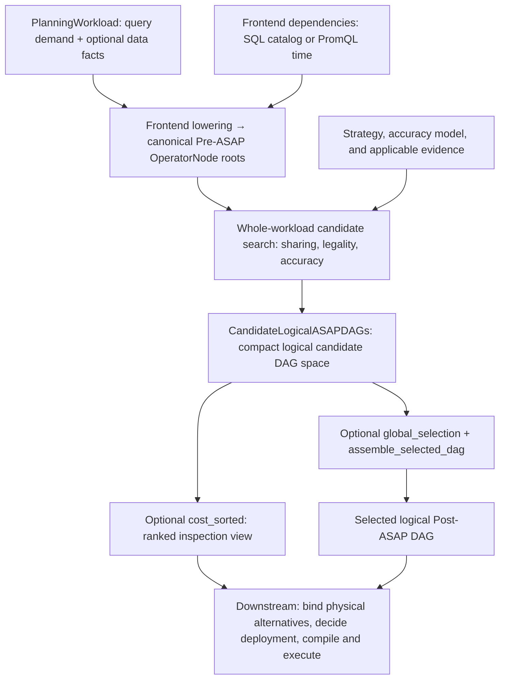

# ASAPPlanner design overview

ASAPPlanner is a reusable planning library. It converts queries and workload
requirements into a deployment-independent space of logical Post-ASAP candidates.
It does not commit, deploy, or execute a physical plan; downstream systems such
as ASAPQuery-backend bind the candidates to physical alternatives, make the
deployment-level decision, and run the selected contract.

For the integration workflow, start with [ASAPPlanner input, output, and
workflows](input-output-workflow.md). It defines inputs, `CandidateLogicalASAPDAGs`, selection
and assembly workflows, and future replanning support.

## Planner component flow

```mermaid
flowchart TD
    W["PlanningWorkload: query demand + optional data facts"]
    F["Frontend dependencies: SQL catalog or PromQL time"]
    E["Strategy, accuracy model, and applicable evidence"]
    PRE["Frontend lowering → canonical Pre-ASAP OperatorNode roots"]
    SEARCH["Whole-workload candidate search: sharing, legality, accuracy"]
    SPACE["CandidateLogicalASAPDAGs: compact logical candidate DAG space"]
    RANK["Optional cost_sorted: ranked inspection view"]
    SELECT["Optional global_selection + assemble_selected_dag"]
    DAG["Selected logical Post-ASAP DAG"]
    BACKEND["Downstream: bind physical alternatives, decide deployment, compile and execute"]
    W --> PRE
    F --> PRE
    PRE --> SEARCH
    E --> SEARCH
    SEARCH --> SPACE
    SPACE --> RANK --> BACKEND
    SPACE --> SELECT --> DAG --> BACKEND
```

`CandidateLogicalASAPDAGs` is the output of logical candidate search. Each target's candidate set holds
alternatives and rejection reasons, but no materialization decision.
Choose between two branches: inspect candidates (optionally ranked), or select
and assemble logical DAGs. Stage 2 materialization (#509) will decide per
sub-DAG whether to materialize and whether at ingestion or query time; until
then every summary runs at query time. No branch by itself deploys or executes
a physical plan.
Known-invalid evidence rejects a logical candidate. Missing accuracy evidence
leaves a constructible candidate visible in `CandidateLogicalASAPDAGs` but uncertified; default
selection does not commit it without the required guarantee. Cost evidence can
rank eligible candidates, but it cannot establish a missing guarantee or turn
an unsupported physical alternative into a deployable plan.

## Module map

| Area | Main crate or module | Responsibility |
|---|---|---|
| Shared IR | `asap-types` | The unified operator IR (`ir`: one `OperatorNode` before and after ASAP optimization), schemas, workloads, guarantees, and exported plan data |
| Front-end common | `frontend-common` | Name-based `UnresolvedOp` tree shared by the front ends, and `resolve_root` into the operator IR |
| Query frontends | `frontend-sql`, `frontend-promql`, `frontend-metricsql` | Parse source languages and produce canonical Pre-ASAP queries |
| ASAP-aware mapping | `asap-logical-optimizer`, `asap-physical-optimizer`, `asap-plan-selection` | #509 Stages 1–3: candidate generation, CSE, legality and accuracy propagation; physical candidates; costing and selection |
| Planner facade | `asap-planner` | Lowering dispatch, the optimization pass (`OptimizationPass`, `StagePipeline`) and `optimize` |
| Developer inspection | `devtools` | Expose planner DAGs, alternatives, decisions, and explanations for inspection |
| End-to-end validation | `integration-tests` | Verify behavior across frontends, mapping, and output IR |

## Inputs and outputs

Planner inputs are intentionally broader than a query string. Selection may
depend on query recurrence, data arrival and distribution, accuracy and latency
requirements, the planning horizon, available materialized state, downstream
capabilities, and complete cost evidence. Missing or stale evidence must remain
explicit rather than being treated as zero.

The primary output is `CandidateLogicalASAPDAGs`; `cost_sorted` derives an optional ranked
view with index-aligned costs. Downstream may inspect compatible choices
across targets rather than assuming the first candidate is a feasible
physical workload plan. Candidates carry logical summary algorithms,
parameters, and guarantees, but no materialization decision. Rejection reasons
are retained in the candidate space.

ASAPQuery-backend and other downstream applications translate the candidates
into physical alternatives. They own concrete implementations, storage layout,
placement, sharding, deployment-level cost and compatibility, final commitment,
serving, and operational feedback. Their physical planning can reorder
candidates because it has evidence that the reusable Planner does not, but it
must not silently change Planner-owned semantics.

`candidate_selection::global_selection` optionally coordinates structural choices across
targets; `GlobalSelection::assemble_selected_dag` constructs a selected semantic DAG.
Those APIs do not establish physical feasibility or a
materialization decision. See the [library guide](../../develop_docs/library-api.md#optional-whole-plan-selection-and-dag-assembly)
for the distinction. Downstream may consume candidates directly and retains
responsibility for physical commitment.

## Further reading

- [Parsing and canonicalization](parse-and-canonicalize.md)
- [Pre-ASAP IR](../concepts/pre-asap-ir.md)
- [Post-ASAP IR](../concepts/post-asap-ir.md)
- [ASAP-aware mapping](asap-aware-mapping.md)
- [Accuracy guarantees](../proposals/asap-aware-mapping/end-to-end-accuracy-guarantees.md)
- [Physical-plan integration](physical-plan-integration.md)
- [Analytical resource cost](../proposals/asap-aware-mapping/analytical-resource-cost.md)
- [Searching over plans](asap-aware-plan-search.md)
- [Explainability](../../develop_docs/replacement-explanations.md)
- [ASAPPlanner planner-runtime contract](planner-runtime-contract.md)
