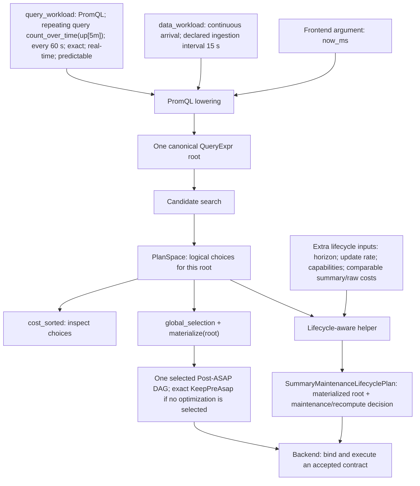
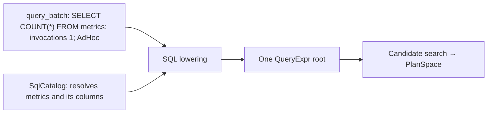

# ASAPPlanner input, output, and workflows

## Overview

ASAPPlanner is a **logical planning library**. Its input is a planning workload
plus the models, evidence, and deployment capabilities needed by the requested
planning workflow. Its canonical output is a `PlanSpace` containing the legal
Post-ASAP alternatives for the workload.

### Input fields at a glance

| Input | Fields | Required |
|---|---|---:|
| `PlanningWorkload.query_workload` | Query language and one-time/repeating query workloads | Yes |
| `PlanningWorkload.data_workload` | Data arrival and optional evidence about ingestion, cardinality, and distribution | Conditional: required for PromQL; otherwise optional |
| Planning evidence and capabilities | Domain, accuracy, cost, and deployment facts supplied through the applicable provider/model interface | Conditional: required only by optimizations that depend on those facts |

As part of the planning workflow, frontend lowering converts the workload
entries into canonical Pre-ASAP `QueryExpr` roots. Those roots and the
candidate-search API that consumes them are internal stages, not additional
end-to-end user inputs. Some frontends require explicit dependencies alongside
the workload; these are listed under
[Frontend-specific dependencies](#frontend-specific-dependencies).

### Output at a glance

| Output | Fields or contents | Meaning |
|---|---|---|
| `PlanSpace<Id>` | The legal candidate Post-ASAP DAGs for the workload, represented compactly as canonical roots, memoized alternatives, and cross-group composition information | The ASAPPlanner output |

[Ranking](#ranked-view), [selection and
materialization](#selection-and-materialization-helper), and
[lifecycle](#lifecycle-aware-helper) APIs are views or helper operations over
this output, not additional top-level Planner outputs.

The candidate DAGs are logical planning artifacts. ASAPPlanner does **not**
produce a deployed executable plan; downstream systems bind physical operators,
choose placement and storage, deploy state, and execute queries.

```text
PlanningWorkload + frontend-specific dependencies
                        |
                        v
                   ASAPPlanner
                        |
                        v
        PlanSpace: candidate Post-ASAP DAGs
```

If required accuracy, semantic, capability, or cost evidence is unavailable, Planner does not assume it. Unsupported optimizations fail closed, while `KeepPreAsap` preserves exact computation where supported.

---

## Running example: a recurring PromQL query

Suppose a dashboard evaluates `count_over_time(up[5m])` once a minute, and
`up` receives a sample every 15 seconds. This diagram traces the concrete
inputs and the three possible uses of the same candidate space:



“Predictable” says the query is known in advance; it is independent of its
one-minute recurrence. The `PlanSpace` may contain an exact count-summary
realization, but it is not a deployed query. Without the extra lifecycle
inputs, the caller can still inspect candidates or obtain a logical DAG; it
cannot conclude that maintaining a summary is cheaper than recomputing raw
results.

For contrast, a one-time SQL query needs a catalog but need not supply data
arrival evidence merely to inspect logical alternatives:



In this SQL example, `data_workload` can be `None` if the chosen lowering and
search rules do not consume it. The lifecycle helper is not needed merely to
inspect the `PlanSpace`.

---

## Inputs

### `PlanningWorkload`

A frontend receives one `PlanningWorkload`. Query demand and facts about the
queried data are separate because they have different sources and update
cycles:

```rust
struct PlanningWorkload {
    query_workload: QueryWorkload,
    data_workload: Option<DataWorkload>,
}
```

| Field | Required | Purpose |
|---|---:|---|
| `query_workload` | Yes | Contains the source language and every one-time or repeating query. |
| `data_workload` | Optional generally; required for PromQL | Describes data arrival and evidence about ingestion, cardinality, and distribution. PromQL additionally requires a nonzero `data_ingestion_interval`. |

#### `query_workload: QueryWorkload`

`QueryWorkload` describes query demand. It deliberately does not describe
whether source data is still arriving.

```rust
struct QueryWorkload {
    language: QueryLanguage,
    query_batch: Option<Vec<BatchEntry>>,
    repeating_queries: Option<Vec<RepeatingEntry>>,
}
```

| Field | Required | Purpose |
|---|---:|---|
| `language` | Yes | Source language shared by every entry: PromQL, a SQL dialect, DataFusion, or Elastic DSL. It selects the frontend. |
| `query_batch` | Optional | Finite one-time query entries. `None` means there is no batch portion. |
| `repeating_queries` | Optional | Recurrent query entries. `None` means there is no repeating portion. |

Both entry collections may be present. `QueryWorkload::entries()` normalizes
them into one ordered stream: batch entries first, followed by repeating
entries. If both are absent, lowering produces no query roots.

##### `query_batch: Option<Vec<BatchEntry>>`

```rust
struct BatchEntry {
    query: Query,
    requirements: QueryRequirements,
    predictability: Predictability,
    invocations: u64,
    execute_at: Option<TimestampMs>,
    time_selection: TimeSelection,
}
```

| Field | Required | Purpose |
|---|---:|---|
| `query` | Yes | Raw query text in `QueryWorkload.language`. |
| `requirements` | Yes | Accuracy and response-latency requirements. Defaults mean exact accuracy and unspecified latency. |
| `predictability` | Yes | Whether the query is ad hoc, known in advance, or unknown. `known_at` may record when a predictable query became known. |
| `invocations` | Yes, nonzero | Number of executions in this finite batch. |
| `execute_at` | Optional | Known execution time. Absence prevents time-specific preparation decisions. |
| `time_selection` | Yes | Whether the query follows current data or a historical interval, its lookback, and any fixed upper bound. Unknown/default values limit lifecycle reasoning. |

##### `repeating_queries: Option<Vec<RepeatingEntry>>`

```rust
struct RepeatingEntry {
    query: Query,
    demand: RepeatedDemand,
    requirements: QueryRequirements,
    predictability: Predictability,
    time_selection: TimeSelection,
}
```

| Field | Required | Purpose |
|---|---:|---|
| `query` | Yes | Raw query text in `QueryWorkload.language`. |
| `demand` | Yes | A nonzero fixed interval, fixed interval with evaluation phase, nonempty explicit schedule, or evidence-backed estimated rate. |
| `requirements` | Yes | Accuracy and response-latency requirements. |
| `predictability` | Yes | Whether future executions are known in advance. This is independent of recurrence. |
| `time_selection` | Yes | Event-time scope, optional lookback, and optional fixed `as_of` time. |

##### Shared entry fields

`BatchEntry` and `RepeatingEntry` both contain `QueryRequirements`,
`Predictability`, and `TimeSelection`. The nested requirement and time-selection
fields expand as follows:

| Structure | Field | Meaning |
|---|---|---|
| `QueryRequirements` | `accuracy` | `Explicit(AccuracyTarget)` or `ImplicitExact`. Use an explicit target when approximation is allowed. |
| `QueryRequirements` | `response_latency` | An optional finite, non-negative maximum in milliseconds. The default is unspecified. |
| `TimeSelection` | `scope` | `RealTime`, `Longitudinal`, `Mixed`, or `Unknown`. |
| `TimeSelection` | `lookback` | Optional event-time duration selected before the upper bound. |
| `TimeSelection` | `as_of` | Optional fixed upper-bound timestamp; `None` means planning/evaluation time. |

Frontend lowering produces one Pre-ASAP `QueryExpr` root for each normalized
query entry. The caller must retain each root's association with its workload
entry for later recurrence and lifecycle planning.

#### `data_workload: Option<DataWorkload>`

`DataWorkload` describes the data being queried. Each empirical field uses
`Evidence<T>` so a value is accompanied by its source and freshness.

```rust
struct DataWorkload {
    arrival: DataArrival,
    data_ingestion_interval: Evidence<DurationMs>,
    ingestion_volume: Evidence<u64>,
    ingestion_rate: Evidence<Rate>,
    input_cardinality: Evidence<u64>,
    distribution: Evidence<DataDistribution>,
}
```

| Field | Required | Purpose and behavior when unavailable |
|---|---:|---|
| `arrival` | Present; may be `Unknown` | Distinguishes data at rest, continuously ingesting data, and mixed data. Continuous-maintenance decisions are limited when unknown. |
| `data_ingestion_interval` | Required and nonzero for PromQL; otherwise optional | Sampling cadence for each PromQL source. Bare instant selectors use it as their explicit selection horizon. |
| `ingestion_volume` | Optional evidence | Total ingestion volume when known. Dependent resource estimates remain unavailable when absent or stale. |
| `ingestion_rate` | Optional evidence | Updates per second used to price continuous maintenance. It must be finite and non-negative; at-rest data cannot declare a positive rate. |
| `input_cardinality` | Optional evidence | Input row/sample count used by applicable sizing, accuracy, or cost rules. |
| `distribution` | Optional evidence | `Zipf`, `Uniform`, or `Bursty` key distribution used only by rules that explicitly consume it. |

##### `Evidence<T>` fields

Every empirical field in `DataWorkload` uses `Evidence<T>`, which has four
fields:

| Field | Meaning |
|---|---|
| `value: Option<T>` | The fact itself; `None` means unavailable. |
| `source: EvidenceSource` | `Declared`, `Observed`, `Derived`, or `Unknown`. |
| `observed_at_ms: Option<u64>` | Observation timestamp used for freshness checks. |
| `valid_for_ms: Option<u64>` | Validity duration. A duration without an observation timestamp is unusable. |

Unavailable or stale data evidence stays unknown. Planner does not reinterpret
it as zero ingestion, zero cardinality, or a favorable distribution.

### Frontend-specific dependencies

These inputs are supplied alongside `PlanningWorkload`, rather than nested
inside it:

| Frontend | Additional lowering inputs |
|---|---|
| PromQL | `now_ms`, plus an optional `HistogramCatalog` when histogram semantics must be resolved |
| SQL | `SqlCatalog`; single-query APIs also receive the accuracy target and optionally an explicit SQL dialect |
| MetricsQL | No catalog; the single-query API receives the query text and accuracy target directly |

They are explicit frontend function arguments, not one generic
`FrontendContext` type.

### Planning evidence inputs

**Evidence is a scoped fact used to establish legality, accuracy, cost, or feasibility.**

Evidence is input to planning. The current library does not collect every kind
in one `PlanningWorkload` field; each fact enters through the interface that
consumes it:

Evidence is not globally required or globally optional. Each item is
**conditionally required** by the decision that consumes it:

| Evidence | Required when | Examples | Supplied through |
|---|---|---|---|
| Semantic/domain | A transformation needs to prove an input precondition | Input range, nonempty population, nonzero denominator | Typed accuracy/domain evidence provider |
| Accuracy | An approximate candidate needs a data-dependent accuracy certificate | Quantile domain, Top-K confidence, composition certificate | Accuracy evidence provider or registered accuracy model |
| Cost | Candidates are compared or selected by deployment cost | CPU time, operation count, memory, scan/storage I/O | Cost model or physical-evidence provider |
| Workload | A frontend or optimization consumes that workload fact | Cardinality, distribution, ingestion rate, recurrence | `PlanningWorkload` query/data workload fields |
| Capability | A candidate must be checked against deployable operations | Supported summaries, merge/delete support, window realization | Deployment capability or lifecycle provider |

Evidence must apply to the relevant workload and implementation. Time-sensitive evidence should also carry freshness information.

Missing optional evidence does not invalidate unrelated candidates. When a
candidate requires missing evidence, that candidate is unavailable rather than
planned using a favorable assumption.
Planner output may record the resulting guarantee, evidence provenance, or a
rejection reason, but evidence itself remains an input.

This completes the canonical input boundary for producing `PlanSpace`.
Lifecycle-specific values such as a planning horizon and deployment lifecycle
capabilities are not additional `PlanSpace` inputs. They are parameters to the
optional [lifecycle-aware helper](#lifecycle-aware-helper) described after the
output.

---

## Output

### `PlanSpace<Id>`

`PlanSpace` is Planner's canonical output. It contains:

* canonical workload roots;
* memo groups for discovered target sub-DAGs;
* legal replacement candidates;
* rejected candidates and reasons; and
* information needed for cross-group selection.

A `PlanSpace` represents a **space of logical DAG choices**, not a single executable plan.

It represents that space compactly instead of eagerly copying every complete
DAG. `PlanSpace` stores the workload's canonical roots once, creates one memo
group for each distinct target sub-DAG, and stores that target's replacement
alternatives once inside the group. Candidate children refer back to canonical
targets, so common subexpressions and shared alternatives are not duplicated
across roots.

For example, if one target has three alternatives and its child has two,
eager enumeration could create six complete DAGs. `PlanSpace` stores the three
parent alternatives, the two child alternatives, and their relationship.
Whole-plan selection chooses compatible alternatives across those groups;
materialization then recursively substitutes the selected alternatives to
construct a complete Post-ASAP DAG. This memoized representation avoids the
Cartesian-product expansion of complete DAGs and preserves shared nodes.

The remaining APIs in this section derive information from that one output;
they do not define separate ASAPPlanner output contracts.

### Ranked view

`PlanSpace::cost_sorted` provides a ranked view for inspection:

```text
Vec<RankedGroup {
    target,
    consumer_count,
    candidates,
    costs,
}>
```

This view is useful for debugging, explanation, or downstream optimization. Candidate presence does not imply physical deployability.

### Selection and materialization helper

`PlanSpace::global_selection*` coordinates decisions across memo groups.

```text
PlanSpace
    |
    v
global_selection
    |
    v
materialize(root)
    |
    v
Post-ASAP DAG
```

The resulting DAG records logical information such as summary operators, parameters, schemas, windows, and accuracy guarantees.

It is still **not an executable deployment plan**. Physical operator binding, placement, storage, and execution remain downstream responsibilities.

### Lifecycle-aware helper

Lifecycle-aware planning is an optional operation on an existing `PlanSpace`.
It is not part of the canonical input-to-`PlanSpace` operation. Its purpose is
to compare maintaining a summary with recomputing the raw query.

The public helper receives these parameters:

| Helper parameter | Source | Required |
|---|---|---:|
| `PlanSpace` | Canonical ASAPPlanner output | Yes |
| Workload binding | `QueryWorkload` plus the workload-entry indices associated with each root | Yes |
| Planning time (`now_ms`) | Caller clock in Unix milliseconds | Yes |
| Planning horizon | Caller policy | Conditional: required for finite totals over recurring demand |
| Data arrival and update rate | `DataWorkload` evidence | Conditional: required to cost continuous maintenance |
| Lifecycle capabilities | Deployment/runtime provider | Yes for checking deployable lifecycle alternatives |
| Summary and raw cost information | Cost model and physical-evidence provider | Yes for a cost-based maintenance-versus-recompute decision |

Recurrence and time selection are already fields of the bound `QueryWorkload`;
they are not duplicated as separate top-level inputs. Similarly, data arrival
and update rate are read from the optional `DataWorkload`. Missing required
facts remain unknown rather than being treated as zero.

`SummaryMaintenanceLifecyclePlan` additionally records:

* the materialized root;
* lifecycle choices for summary state;
* planning horizon and expected reads/updates;
* selected window implementation and guarantees;
* comparable summary and raw-recomputation costs; and
* whether raw recomputation was selected.

---

## Workflows

### 1. Inspect logical alternatives

Use when the caller wants to inspect Planner's candidate space or perform physical optimization downstream.

```text
PlanningWorkload
    -> frontend lowering
    -> search_workload_with_targets
    -> PlanSpace
    -> cost_sorted (optional)
```

This exposes legal logical alternatives but does not choose a deployment.

### 2. Select a logical DAG

Use when Planner should coordinate sharing and composition across the workload.

```text
PlanSpace
    -> global_selection
    -> materialize
    -> selected Post-ASAP DAGs
```

This produces structurally compatible logical plans. It does not determine whether maintaining summaries is cheaper than raw execution.

### 3. Make a lifecycle-aware decision

Use when deciding whether maintained summary state should actually be deployed.

```text
PlanSpace + lifecycle helper parameters
    -> lifecycle-aware selection and materialization
    -> SummaryMaintenanceLifecyclePlan
    -> downstream physical deployment
```

This helper considers recurrence, data arrival, planning horizon, capabilities,
and comparable summary/raw costs. It does not change the canonical
`PlanningWorkload -> PlanSpace` interface.

It is the recommended workflow for deployment decisions.

---

## Replanning (future support)

> **Status: Future support.** ASAPPlanner does not currently define an
> end-to-end replanning or deployment-transition contract.

The intended design will reuse the initial-planning input boundary. A caller
would request replanning whenever a selection-relevant input changes, such as:

* query semantics or accuracy requirements;
* recurrence, horizon, data arrival, or distribution;
* evidence;
* supported capabilities;
* cost calibration; or
* available materialized state.

```text
updated workload + evidence + capabilities
                    |
                    v
              run Planner
                    |
                    v
          new PlanSpace / selection
                    |
                    v
       downstream deployment transition
```

Today, a caller can run Planner again and obtain a new logical candidate space,
but ASAPPlanner does not relate that result to the previous plan. Future support
must define plan identity and compatibility across runs. Deployment diffing,
migration, activation, and rollback remain downstream responsibilities.

## Related documents

* [Planner pipeline](../concepts/planner-pipeline.md)
* [Pre-ASAP IR](../concepts/pre-asap-ir.md)
* [Post-ASAP IR](../concepts/post-asap-ir.md)
* [Planner/downstream boundary](planner-downstream-boundary.md)
* [Plan search internals](asap-aware-plan-search.md)
* [Public library reference](../../develop_docs/library-api.md)
