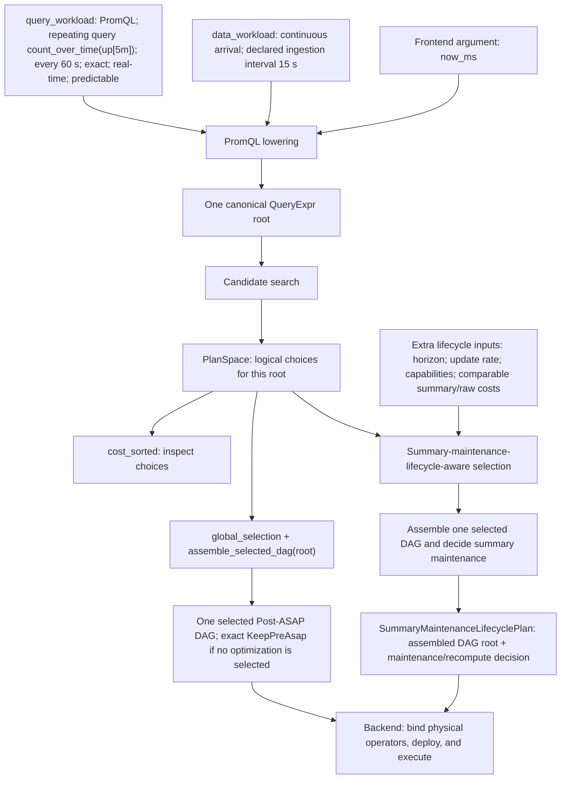
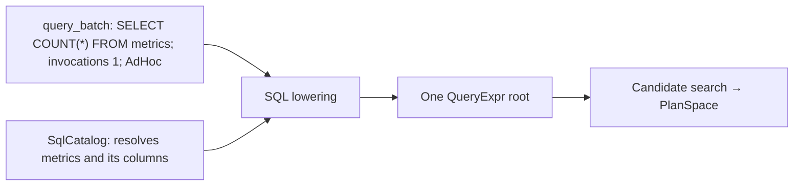

# ASAPPlanner input, output, and workflows

## Overview

This document is for library integrators such as ASAPQuery-backend, not users
submitting queries through a backend.

ASAPPlanner is a **logical planning library**. Its input is a planning workload
plus the models, evidence, and deployment capabilities needed by the requested
planning workflow. Its canonical output is a `PlanSpace` containing the legal
Post-ASAP alternatives for the workload.

### Input fields at a glance

| Input | Fields | Required |
|---|---|---:|
| `PlanningWorkload.query_workload` | Query language and one-time/repeating query workloads | Yes |
| `PlanningWorkload.data_workload` | Data arrival and optional evidence about ingestion, cardinality, and distribution | No implicit default. Set `None` when unavailable for non-PromQL workloads; PromQL requires `Some(DataWorkload)` with a nonzero ingestion interval. |
| Frontend-specific dependencies (outside `PlanningWorkload`) | `SqlCatalog` for SQL; `now_ms` and, when needed, `HistogramCatalog` for PromQL | `SqlCatalog` is required for SQL lowering; `now_ms` is required for PromQL lowering |
| Planning models | Candidate cost/ranking and accuracy composition/checking | Used by the relevant APIs; built-in `DefaultCostModel` and `DefaultAccuracyModel` are available |
| External evidence and capabilities | Domain facts, measured costs, workload statistics, and runtime support | Supply when available and when the chosen optimization or lifecycle decision depends on them; absence is not proof |

Frontend lowering and candidate search are stages within this workflow, not
additional end-to-end inputs. See [Inputs](#inputs) for the nested workload
fields and [frontend dependencies](#frontend-specific-dependencies).

### Output at a glance

| Output | Fields or contents | Meaning |
|---|---|---|
| `PlanSpace<Id>` | The legal candidate Post-ASAP DAGs for the workload, represented compactly as canonical roots, one candidate set per target sub-DAG, and cross-target composition information | The ASAPPlanner output |

[Ranking](#ranked-view), [selection and
DAG assembly](#selection-and-dag-assembly), and
[summary-maintenance lifecycle](#summary-maintenance-lifecycle-aware-helper) APIs operate on this `PlanSpace`.
These are alternative uses of the candidate space, not mandatory sequential
stages. `PlanSpace` itself has no selected summary-maintenance lifecycle.

The candidate DAGs are logical planning artifacts. ASAPPlanner does **not**
produce a deployed executable plan; downstream systems bind physical operators,
choose placement and storage, deploy state, and execute queries.

```text
PlanningWorkload + frontend dependencies + planning models/evidence
                        |
                        v
                   ASAPPlanner
                        |
                        v
        PlanSpace: candidate Post-ASAP DAGs
```

---

## Running example: a recurring PromQL query

Suppose a dashboard evaluates `count_over_time(up[5m])` once a minute, and
`up` receives a sample every 15 seconds. This diagram traces the concrete
inputs and the three possible uses of the same candidate space:



“Predictable” says the query is known in advance; it is independent of its
one-minute recurrence. The `PlanSpace` may contain an exact count-summary
realization, but it is not a deployed query. Without the extra lifecycle
inputs, the caller can still inspect candidates or obtain a logical DAG; it
cannot conclude that maintaining a summary is cheaper than recomputing raw
results.

For contrast, a one-time SQL query needs a catalog but need not supply data
arrival evidence merely to inspect logical alternatives:



In this SQL example, `data_workload` can be `None` if the chosen lowering and
search rules do not consume it. The lifecycle helper is not needed merely to
inspect the `PlanSpace`.

---

## Inputs

### `PlanningWorkload`

A frontend receives one `PlanningWorkload`. Query demand and facts about the
queried data are separate because they have different sources and update
cycles:

```rust
struct PlanningWorkload {
    query_workload: QueryWorkload,
    data_workload: Option<DataWorkload>,
}
```

| Field | Required | Purpose |
|---|---:|---|
| `query_workload` | Yes | Contains the source language and every one-time or repeating query. |
| `data_workload` | Optional generally; required for PromQL | There is no automatic default: explicitly set `None` when unavailable for non-PromQL workloads. PromQL requires `Some(DataWorkload)` with a nonzero `data_ingestion_interval`. |

#### `query_workload: QueryWorkload`

`QueryWorkload` describes query demand. It deliberately does not describe
whether source data is still arriving.

```rust
struct QueryWorkload {
    language: QueryLanguage,
    query_batch: Option<Vec<BatchEntry>>,
    repeating_queries: Option<Vec<RepeatingEntry>>,
}
```

| Field | Required | Purpose |
|---|---:|---|
| `language` | Yes | Source language shared by every entry: PromQL, a SQL dialect, DataFusion, or Elastic DSL. It selects the frontend. |
| `query_batch` | Optional | Finite one-time query entries. `None` means there is no batch portion. |
| `repeating_queries` | Optional | Recurrent query entries. `None` means there is no repeating portion. |

Both entry collections may be present. `QueryWorkload::entries()` normalizes
them into one ordered stream: batch entries first, followed by repeating
entries. If both are absent, lowering produces no query roots.

##### `query_batch: Option<Vec<BatchEntry>>`

```rust
struct BatchEntry {
    query: Query,
    requirements: QueryRequirements,
    predictability: Predictability,
    invocations: u64,
    execute_at: Option<TimestampMs>,
    time_selection: TimeSelection,
}
```

| Field | Required | Purpose | Why it matters / example |
|---|---:|---|---|
| `query` | Yes | Raw query text in `QueryWorkload.language`. | `count(up)` determines the expression to lower and plan. |
| `requirements` | Yes | Accuracy and response-latency requirements. Defaults mean exact accuracy and unspecified latency. | An explicit ε target permits approximate candidates; the exact default does not. |
| `predictability` | Yes as a field; `Unknown` is allowed | Whether the query is ad hoc, known in advance, or unknown. `known_at` records when a predictable query became known. | A report known at 10:00 and scheduled for 11:00 may use a `Prepared` summary before execution. `AdHoc` or `Unknown` does not establish that eligibility. |
| `invocations` | Yes, nonzero | Number of executions in this finite batch. | Ten executions can amortize one summary build differently from one execution. |
| `execute_at` | Optional | Known execution time. | The `Prepared` case above also needs an execution time; without it Planner cannot establish a preparation window. |
| `time_selection` | Yes | Whether the query follows current data or a historical interval, its lookback, and any fixed upper bound. | A moving five-minute window can require deletion/window support that a fixed historical interval does not. |

##### `repeating_queries: Option<Vec<RepeatingEntry>>`

```rust
struct RepeatingEntry {
    query: Query,
    demand: RepeatedDemand,
    requirements: QueryRequirements,
    predictability: Predictability,
    time_selection: TimeSelection,
}
```

| Field | Required | Purpose | Why it matters / example |
|---|---:|---|---|
| `query` | Yes | Raw query text in `QueryWorkload.language`. | `rate(up[5m])` determines the expression to lower and plan. |
| `demand` | Yes | A nonzero fixed interval, fixed interval with evaluation phase, nonempty explicit schedule, or evidence-backed estimated rate. | A query every minute produces more expected reads over a horizon than one every hour. |
| `requirements` | Yes | Accuracy and response-latency requirements. | An exact dashboard query cannot use an approximate summary solely because it is cheaper. |
| `predictability` | Yes as a field; `Unknown` is allowed | Records whether future executions are known in advance; independent of recurrence. | Current lifecycle code does not use this field for repeating entries; set `Unknown` if no predictability claim is available. |
| `time_selection` | Yes | Event-time scope, optional lookback, and optional fixed `as_of` time. | A live five-minute lookback differs from a fixed historical range when checking maintenance capabilities. |

##### Shared entry fields

`BatchEntry` and `RepeatingEntry` both contain `QueryRequirements`,
`Predictability`, and `TimeSelection`. The nested requirement and time-selection
fields expand as follows:

| Structure | Field | Meaning |
|---|---|---|
| `QueryRequirements` | `accuracy` | `Explicit(AccuracyTarget)` or `ImplicitExact`. Use an explicit target when approximation is allowed. |
| `QueryRequirements` | `response_latency` | An optional finite, non-negative maximum in milliseconds. The default is unspecified. |
| `TimeSelection` | `scope` | `RealTime`, `Longitudinal`, `Mixed`, or `Unknown`. |
| `TimeSelection` | `lookback` | Optional event-time duration selected before the upper bound. |
| `TimeSelection` | `as_of` | Optional fixed upper-bound timestamp; `None` means planning/evaluation time. |

Frontend lowering produces one Pre-ASAP `QueryExpr` root for each normalized
query entry. The caller must retain each root's association with its workload
entry for later recurrence and lifecycle planning.

#### `data_workload: Option<DataWorkload>`

`DataWorkload` describes the data being queried. Each empirical field uses
`Evidence<T>` so a value is accompanied by its source and freshness.

```rust
struct DataWorkload {
    arrival: DataArrival,
    data_ingestion_interval: Evidence<DurationMs>,
    ingestion_volume: Evidence<u64>,
    ingestion_rate: Evidence<Rate>,
    input_cardinality: Evidence<u64>,
    distribution: Evidence<DataDistribution>,
}
```

| Field | Required | Purpose and behavior when unavailable |
|---|---:|---|
| `arrival` | Present; may be `Unknown` | Distinguishes data at rest, continuously ingesting data, and mixed data. Continuous-maintenance decisions are limited when unknown. |
| `data_ingestion_interval` | Required and nonzero for PromQL; otherwise optional | Sampling cadence for each PromQL source. Bare instant selectors use it as their explicit selection horizon. |
| `ingestion_volume` | Optional evidence | Total ingestion volume when known. Dependent resource estimates remain unavailable when absent or stale. |
| `ingestion_rate` | Optional evidence | Updates per second used to price continuous maintenance. It must be finite and non-negative; at-rest data cannot declare a positive rate. |
| `input_cardinality` | Optional evidence | Input row/sample count used by applicable sizing, accuracy, or cost rules. |
| `distribution` | Optional evidence | `Zipf`, `Uniform`, or `Bursty` key distribution used only by rules that explicitly consume it. |

##### `Evidence<T>` fields

Every empirical field in `DataWorkload` uses `Evidence<T>`, which has four
fields:

| Field | Meaning |
|---|---|
| `value: Option<T>` | The fact itself; `None` means unavailable. |
| `source: EvidenceSource` | `Declared`, `Observed`, `Derived`, or `Unknown`. |
| `observed_at_ms: Option<u64>` | Observation timestamp used for freshness checks. |
| `valid_for_ms: Option<u64>` | Validity duration. A duration without an observation timestamp is unusable. |

Unavailable or stale data evidence stays unknown. Planner does not reinterpret
it as zero ingestion, zero cardinality, or a favorable distribution.

### Frontend-specific dependencies

These inputs are supplied alongside `PlanningWorkload`, rather than nested
inside it:

| Frontend | Additional lowering inputs |
|---|---|
| PromQL | `now_ms`, plus an optional `HistogramCatalog` when histogram semantics must be resolved |
| SQL | `SqlCatalog`; single-query APIs also receive the accuracy target and optionally an explicit SQL dialect |
| MetricsQL | No catalog; the single-query API receives the query text and accuracy target directly |

They are explicit frontend function arguments, not one generic
`FrontendContext` type.

### Planning evidence inputs

**A model is planning logic; evidence is a scoped fact used by that logic.**
For example, `DefaultAccuracyModel` knows how to combine error bounds, while
an input-domain observation tells it whether a particular quantile ratio has
the required bound. The former can be provided by a built-in default; the
latter cannot be fabricated by one.

| Input | Where it enters / default | Why it matters |
|---|---|---|
| Accuracy model | Target-aware search takes an `AccuracyModel`; `DefaultAccuracyModel` is available. Default strategies also use it for candidate construction. | Composes candidate guarantees and checks them against requested accuracy. The model does not itself provide missing data-domain facts. |
| Cost model | Candidate strategies and `cost_sorted`/`global_selection` use a `CostModel`; `DefaultCostModel` is available. | Ranks or selects candidates. The built-in model is not a measured deployment cost for every physical implementation. |
| Accuracy/domain evidence | `AccuracyEvidenceProvider`; default strategies use `NoAccuracyEvidence` when no provider is supplied. | Input ranges, nonempty populations, Top-K intervals, and similar facts can certify or rule out particular approximations. Missing facts remain unknown. |
| Measured cost evidence | Supplied through a deployment-specific cost model or physical-evidence provider when cost-based physical/lifecycle comparison is needed. | CPU, memory, and I/O estimates must be comparable before claiming a summary beats raw recomputation. |
| Runtime/lifecycle capabilities | Passed to lifecycle APIs or checked by deployment-specific providers; `SummaryMaintenanceLifecycleCapabilities::default()` enables all four lifecycle shapes, so it is not proof of actual backend support. | Prevents choosing a maintenance/window operation the intended executor cannot implement. |

For example, the query `quantile_over_time(0.9, data[5m]) /
quantile_over_time(0.5, data[5m])` does not tell Planner whether the windows
are nonempty or their values strictly positive. Such domain facts help prove
that the denominator is nonzero and derive an approximation error bound;
they are not themselves the complete accuracy proof. A declared constraint or
backend observation must cover the relevant data, not just an earlier window.

Evidence is input; a derived guarantee or rejection reason is output. Missing
facts do not establish either validity or invalidity: Planner cannot claim a
guarantee that depends on them. Candidate retention and selection depend on
the applicable strategy, accuracy target, and helper; missing evidence is not
a blanket reason to discard unrelated candidates. For the direct DDSketch
ratio above, search retains a candidate without a proven root guarantee when
domain evidence is missing; automatic `global_selection` does not choose it.
See the [candidate-search reference](../../develop_docs/library-api.md#generate-and-rank-candidates)
for this backend-selection path.

Additional inputs for a Planner-owned maintenance decision are listed with the
[summary-maintenance-lifecycle-aware helper](#summary-maintenance-lifecycle-aware-helper).

---

## Output

### `PlanSpace<Id>`

`PlanSpace` is Planner's canonical output. It contains:

* canonical workload roots;
* one `TargetSubDAGCandidates` entry for each discovered target sub-DAG;
* legal replacement candidates;
* rejected candidates and reasons; and
* information needed to select compatible candidates across targets.

A `PlanSpace` represents a **space of logical DAG choices**, not a single plan.
It is exposed to integrators because the backend may choose among candidates
using implementation support, measured costs, and available resources that
candidate search does not have. A summary that is cheap on one backend may be
expensive or unsupported on another. Returning only one plan during search
would discard those choices too early.

Callers with suitable models can instead use the [selection workflows](#workflows)
below. A future higher-level API could hide `PlanSpace` behind those decisions;
the current interface lets an integrator own them. DAG assembly connects choices
after selection and does not replace this candidate interface.

Here, a **root** is the top-level `Rc<QueryExpr>` for a workload query. A
**target** is any discovered sub-DAG that may be replaced, including roots.
For `count(up) + 1`, the addition is a root and `count(up)` can be an inner
target. `TargetSubDAGCandidates` holds the alternatives for one such target.

It represents that space compactly instead of eagerly copying every complete
DAG. `PlanSpace` stores the workload's canonical roots once, creates one
`TargetSubDAGCandidates` entry for each distinct target sub-DAG, and stores
that target's replacement alternatives once inside the entry. Candidate
children refer back to canonical
targets, so common subexpressions and shared alternatives are not duplicated
across roots.

For example, if one target has three alternatives and its child has two,
eager enumeration could create six complete DAGs. `PlanSpace` stores the three
parent alternatives, the two child alternatives, and their relationship.
Whole-plan selection chooses compatible alternatives across those targets;
`assemble_selected_dag(root)` then recursively substitutes the selected alternatives to
construct a complete Post-ASAP DAG. Sharing each target's candidate set avoids the
Cartesian-product expansion of complete DAGs and preserves shared nodes.

## Workflows

All paths start by lowering the workload and searching for candidates:

```text
PlanningWorkload + frontend dependencies + planning models/evidence
    -> frontend lowering: one QueryExpr root per normalized query entry
    -> search_workload_with_targets
    -> PlanSpace
```

The integration associates each lowered root with a caller-owned `Id` and its
accuracy target for search; `Id` correlates results, not query semantics.
See the [public library reference](../../develop_docs/library-api.md) for arguments.

Then choose the operation matching the caller's responsibility:

| Purpose | Operation | Result |
|---|---|---|
| Inspect candidates or let the backend choose | [Ranked view](#ranked-view), if ranking is useful | Per-target candidate lists and costs |
| Ask Planner to choose logical computations; backend owns summary maintenance | [Selection and DAG assembly](#selection-and-dag-assembly) | One selected Post-ASAP DAG root per query |
| Ask Planner to also decide summary maintenance versus raw recomputation | [Summary-maintenance-lifecycle-aware helper](#summary-maintenance-lifecycle-aware-helper) | One plan containing a DAG root and maintenance decisions per query |

### Ranked view

`PlanSpace::cost_sorted` returns one `RankedTargetSubDAGCandidates` for each
`TargetSubDAGCandidates` entry. Conceptually, it is the same target's
alternatives in cost-model preference order where the model defines one
(otherwise discovery order), with one displayed cost per alternative. It is
a **view of one decision point**, not a complete DAG or a selected plan.

The return type is `Vec<RankedTargetSubDAGCandidates<'_>>`; each element has this shape:

```rust
struct RankedTargetSubDAGCandidates<'a> {
    target: &'a Rc<QueryExpr>,
    consumer_count: usize,
    candidates: Vec<&'a ReplacementSubDAG>,
    costs: Vec<f64>, // costs[i] describes candidates[i]
}
```

`consumer_count` counts references to this target in the workload. `costs`
may contain `NaN` when the model has no numeric estimate; the ordering is not
itself a deployment-cost certificate. This view is useful for debugging,
explanation, or downstream optimization. Candidate presence does not imply
physical deployability.

### Selection and DAG assembly

The input is `PlanSpace` and a cost model. Call
`PlanSpace::global_selection(&cost_model)` once for the workload, then
`GlobalSelection::assemble_selected_dag(root)` for each wanted query root.
These are two public APIs, not one combined call: N roots require one selection
and N assembly calls. Each successful assembly returns one DAG root; the caller
collects them for the workload, with shared nodes where applicable.

Selection chooses compatible alternatives across the workload. For example,
if two queries can share a summary, their choices must agree on the shared
computation. `assemble_selected_dag(root)` then connects the chosen alternatives
into each query's DAG in memory, preserving shared nodes. Candidate search has
already built candidate sub-DAGs; assembly connects the selected choices into
the result for one query root.

| Input → decisions → output (click a step for details) |
|:---:|
| **Input:** [PlanSpace](asap-aware-plan-search.md) + cost model |
| ↓ |
| **Select:** [global_selection](../../develop_docs/library-api.md#what-does-global-selection-mean) chooses compatible alternatives |
| ↓ |
| **Assemble:** [assemble_selected_dag(root)](../../develop_docs/library-api.md#api-definition-and-example) connects those choices for each query root |
| ↓ |
| **Output:** one selected logical [Post-ASAP DAG](../concepts/post-asap-ir.md) per query root |

Each output DAG specifies the chosen operators, parameters, and accuracy
guarantees. Its root is represented by `Rc<SummaryNode>`; the
[API reference](../../develop_docs/library-api.md#api-definition-and-example)
describes the function signatures and return handling.

This path selects how to compute the query, not how to maintain summary state.

### Summary-maintenance-lifecycle-aware helper

This workflow performs both candidate selection and DAG assembly, incorporating
summary-maintenance lifecycle costs. Use it when ASAPPlanner owns the decision
to maintain summaries versus recompute raw data. It is not needed for candidate
inspection or when the downstream backend owns that decision.

Starting from an existing `PlanSpace`, call these two public helpers in order;
there is no need to run the ordinary selection/assembly workflow first:

1. `global_selection_with_summary_maintenance_lifecycles` uses the workload
   binding, lifecycle capabilities, and comparable costs to choose compatible
   candidates across target sub-DAGs. It returns `GlobalSelection`, not a DAG or a
   deployment plan.
2. For each wanted query root, `assemble_selected_dag_with_summary_maintenance_lifecycles`
   takes that selection and root, constructs a Post-ASAP DAG, compares the
   selected summary's maintenance cost with raw recomputation, and returns
   `Result<Option<SummaryMaintenanceLifecyclePlan>, SummaryMaintenanceLifecycleAssemblyError>`.
   When a summary does not beat a
   known raw cost, or a required comparable cost is unavailable, the result
   retains the exact `KeepPreAsap` root and no summary deployments.

As in ordinary selection, one selection call serves the workload and assembly
is per root. The second helper calls `assemble_selected_dag` internally; callers
do not need a separate assembly call. Neither helper creates a materialized view
or deploys runtime state.
The output is a selected logical DAG with lifecycle decisions, not an executable
deployment plan. Any claim of optimization is relative to the supplied cost
model, evidence, and available candidates.
See the [library guide's lifecycle and capabilities section](../../develop_docs/library-api.md#lifecycle-and-capabilities)
for an API example and the capability contract.

Across the two calls, the caller supplies these parameters:

| Helper parameter | Source | Required |
|---|---|---:|
| `PlanSpace` | Canonical ASAPPlanner output; passed to selection | Yes |
| `GlobalSelection` and one root | Selection result and a root in that `PlanSpace`; passed to DAG assembly | Yes for each assembled root |
| Workload binding | `QueryWorkload` plus the workload-entry indices associated with each root | Yes |
| Planning time (`now_ms`) | Caller clock in Unix milliseconds | Yes |
| Planning horizon | Caller policy | Conditional: required for finite totals over recurring demand |
| Data arrival and update rate | `DataWorkload` evidence | Conditional: required to cost continuous maintenance |
| Lifecycle capabilities | Deployment/runtime provider | Yes for checking deployable lifecycle alternatives |
| Summary and raw cost information | Cost model and physical-evidence provider | Yes for a cost-based maintenance-versus-recompute decision |

Recurrence and time selection are already fields of the bound `QueryWorkload`;
they are not duplicated as separate top-level inputs. Similarly, data arrival
and update rate are read from the optional `DataWorkload`. Missing required
facts remain unknown rather than being treated as zero.

The per-query output, `SummaryMaintenanceLifecyclePlan`, **contains** the
Post-ASAP DAG rather than being a parallel representation. It records:

* the assembled Post-ASAP DAG root (`Rc<SummaryNode>`);
* lifecycle choices for summary state;
* planning horizon and expected reads/updates;
* selected window implementation and guarantees;
* comparable summary and raw-recomputation costs; and
* whether raw recomputation was selected.

---

## Replanning (future support)

> **Status: Future support.** ASAPPlanner does not currently define an
> end-to-end replanning or deployment-transition contract.

Today, a caller can rerun planning when workload, evidence, capabilities, or
costs change, but Planner does not relate the result to the previous plan.
Future support must define plan identity and compatibility across runs.
Deployment diffing, migration, activation, and rollback remain downstream
responsibilities.

## Related documents

* [Planner pipeline](../concepts/planner-pipeline.md)
* [Pre-ASAP IR](../concepts/pre-asap-ir.md)
* [Post-ASAP IR](../concepts/post-asap-ir.md)
* [Planner/runtime responsibilities](planner-runtime-contract.md)
* [Plan search internals](asap-aware-plan-search.md)
* [Public library reference](../../develop_docs/library-api.md)
