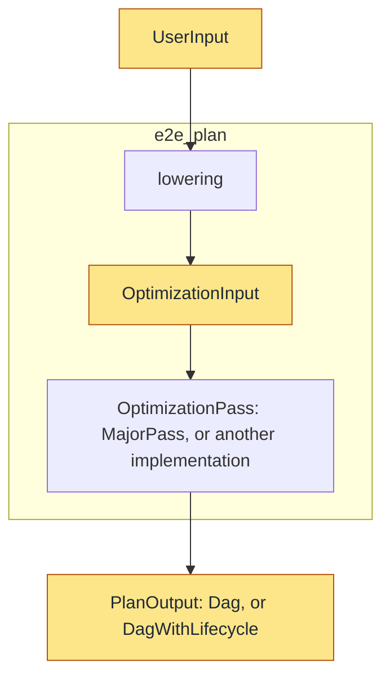

# One entry point, and a pluggable optimization pass

## 1. What is new

1. An **end-to-end function API** to lib users, giving them a one-function-call abstraction from a prepared input to the selected Post-ASAP DAG. 
2. A **pluggable optimization pass**, which gives developers a replaceable optimization stage.

What that buys:

* One call in place of six across three stages. `PlanSpace` and
  `GlobalSelection` no longer appear in user code.
* The root-to-entry bindings a caller used to build by hand are derived, and
  their ordering contract is checked rather than assumed.
* A new optimization algorithm can be freely implemented as a trait implementation, rather than a
  rule disguised to fit a two-phase pipeline it does not share.

Unchanged: `PlanSpace`, `cost_sorted`, `global_selection`, and the interface
[input, output, and workflows](input-output-workflow.md) describes.

```text
PlanningWorkload ──lowering──▶ ParsedWorkload ──OptimizationPass──▶ PlanOutput
    + frontend deps                            + models
                                               + optional lifecycle input
```

---

## 2. The types

This section introduces three key interfacing types of the unified workflow. 

The following diagram illustrates the flow of data through the unified workflow:

`e2e_plan` is the outer, light-blue box: a prepared workload goes in one end, the selected plan comes out the other. 
Inside, the workflow is composed of 2 phases: A fixed lowering phase and a pluggable optimization phase.
`OptimizationInput` is the intermediate type between the lowering and optimization phases.



Details of these types are provided below.

### `UserInput`

| Field | Meaning |
|---|---|
| `workload` | `&PlanningWorkload` |
| `frontend_specific` | `Sql { catalog }` / `Promql { now_ms, histograms }` / `Metricsql`; fixed by `query_workload.language` |
| `models` | Cost model, accuracy model, evidence provider; `PlanningModels::builtin()` for the defaults |
| `lifecycle` | `Some` also asks for the maintenance-versus-recompute decision |
| `pass` | `None` uses `MajorPass` |

### `OptimizationInput`

```rust
pub struct OptimizationInput<'a> {
    pub workload: &'a ParsedWorkload,
    pub models: PlanningModels<'a>,          // same type UserInput uses
    pub lifecycle: Option<LifecycleInput>,   // same type UserInput uses
}
```

`OptimizationInput` is a `UserInput` without the query frontend.

### `PlanOutput`

```rust
pub enum PlanOutput {
    Dag { plans: Vec<QueryPlan> },
    DagWithLifecycle { plans: Vec<QueryLifecyclePlan> },
}

pub struct QueryPlan {
    pub entry_index: usize,        // index into QueryWorkload::entries()
    pub dag: Rc<SummaryNode>,
}

pub struct QueryLifecyclePlan {
    pub entry_index: usize,
    pub plan: SummaryMaintenanceLifecyclePlan,   // its `root` is the DAG
}
```

The variant follows from whether `lifecycle` was supplied in the input.

---

## 3. The pluggable optimization pass

The optimization pass is fully pluggable, as long as the end-to-end behavior is satisfied.
The `MajorPass` described below will be used by default, which corresponds to the current optimization behavior of `ASAPPlanner`.

### 3.1 `MajorPass` — the original optimization pass

`MajorPass` contains the original optimization algorithm the crate has always run, now behind the trait and registered under the name `major`. Its behaviour is unchanged:

| Step | Call |
|---|---|
| Build roots | `Id` is the entry's position in `entries()`; the accuracy target comes from its `requirements` |
| Candidate search | `search_workload_with_targets` with `default_strategies_with_evidence` |
| Select | `global_selection`, or `global_selection_with_summary_maintenance_lifecycles` with a `WorkloadDemand` derived from the `ParsedWorkload` |
| Assemble, per root | `assemble_selected_dag`, or its lifecycle-aware counterpart |

Moving it behind the trait changes one thing for existing developers:
**`ReplacementStrategy` is now a concept of `MajorPass`, not of the optimization
stage.** Adding a rewrite or sharing rule to the shipped algorithm still means
implementing `ReplacementStrategy`. Replacing the algorithm means implementing
`OptimizationPass` instead — the two extension points no longer sit on top of
each other.

### 3.2 Plugging in another pass

To plug in another optimization pass, we only need to implement the trait:

```rust
pub trait OptimizationPass {
    fn name(&self) -> &'static str;
    fn optimize(&self, input: OptimizationInput<'_>) -> Result<PlanOutput, OptimizeError>;
}

struct MyPass { /* its own configuration */ }

impl OptimizationPass for MyPass {
    fn name(&self) -> &'static str { "my-pass" }
    fn optimize(&self, input: OptimizationInput<'_>) -> Result<PlanOutput, OptimizeError> { .. }
}
```

Then select it. Directly, when the caller knows which pass it wants:

```rust
let output = optimize(&my_pass, optimization_input)?;          // the stage alone
let output = e2e_plan(user_input.with_pass(&my_pass)).await?;  // the whole pipeline
```

Or through an optimization pass registry:

```rust
let mut registry = PassRegistry::with_builtin();   // holds "major"
registry.register(Box::new(my_pass))?;
for name in registry.names() {
    optimize(registry.get(name).unwrap(), optimization_input)?;
}
```

`PassRegistry` is caller-owned, not a link-time global, so two tests in one binary cannot see each other's registrations.

### 3.3 The three existing workflows, in this shape

[Input, output, and workflows](input-output-workflow.md) describes three ways to
use the candidate space. Two of them are now what a pass produces; the first is
untouched.

| Workflow there | Here |
|---|---|
| Ranked view (`cost_sorted`) | Not covered by this design, you should handle it with old interfaces |
| Selection and DAG assembly | `lifecycle: None` → `PlanOutput::Dag` |
| Summary-maintenance-lifecycle-aware helper | `lifecycle: Some(..)` → `PlanOutput::DagWithLifecycle` |

The second and third are no longer separate call sequences the caller drives.
Following is an example of how the old workflow maps to the new interface.

```rust
// Before — from a PlanningWorkload and a catalog, with lifecycle decisions.

// 1. Lower every normalized entry, and record which entry each root came from.
//    Not lower_sql_batch: it walks query_batch alone and drops repeating entries.
let mut roots = Vec::new();
let mut entry_indices = Vec::new();
for (index, entry) in workload.query_workload.entries().enumerate() {
    let accuracy = entry.requirements.accuracy.target();
    let expr = lower_sql_dialect(&entry.query.0, &catalog, dialect.clone(), accuracy.clone())
        .await?;
    roots.push((index, Rc::new(expr), Some(accuracy)));
    entry_indices.push(index);
}

// 2. Search for candidates.
let strategies = default_strategies_with_evidence(&cost_model, &evidence);
let space = search_workload_with_targets(roots, &strategies, &accuracy_model);

// 3. Select once for the whole workload, re-binding roots to workload entries.
let demand = WorkloadDemand {
    workload: &workload.query_workload,
    data_workload: workload.data_workload.as_ref(),
    entry_indices: &entry_indices,
};
let selection = global_selection_with_summary_maintenance_lifecycles(
    &space, demand, now_ms, horizon, capabilities, &cost_model)?;

// 4. Assemble once per root.
let mut plans = Vec::new();
for (index, root) in &space.roots {
    let plan = assemble_selected_dag_with_summary_maintenance_lifecycles(
        &selection, root, demand, now_ms, horizon, capabilities, &cost_model)?;
    plans.push((*index, plan));
}
```

```rust
// After.
let output = e2e_plan(
    UserInput::new(&workload, FrontendInput::Sql { catalog: &catalog },
                   PlanningModels::builtin())
        .with_lifecycle(LifecycleInput::new(now_ms, capabilities).with_horizon(horizon))
).await?;
```

Steps 1 and 3 are where the two bindings lived: the `Id` carried through the
roots tuple, and the `&[usize]` rebuilt for `WorkloadDemand`. Both had to agree
with `entries()` order, and nothing checked that they did. `MajorPass` still
runs all four steps; another pass need not run any of them.

## 4. Code layout

| Crate | What it holds |
|---|---|
| `asap-types` | `ParsedWorkload` |
| `asap-aware-mapping` | `OptimizationPass`, `OptimizationInput`, `PlanOutput`, `PlanningModels`, `LifecycleInput`, `optimize`, `PassRegistry`, `MajorPass` |
| `asap-planner` *(new)* | `e2e_plan`, `UserInput`, `FrontendInput`, lowering dispatch |

```text
asap-planner ──┬──> asap-frontend-{sql, promql, metricsql}
               └──> asap-aware-mapping ──> asap-types
                          ▲
                     a pass depends only this far
```

`asap-planner` is separate because it is the only crate depending on every
frontend; before it, the sole facade re-exporting more than one was
`asap-devtools`, a developer-tools crate. `PlanningModels` and `LifecycleInput`
live in `asap-aware-mapping` because both inputs use them, and `asap-planner`
re-exports them.

---

## Related

* [ASAPPlanner input, output, and workflows](input-output-workflow.md)
* [Searching over plans](asap-aware-plan-search.md) — what `MajorPass` does inside
* [Planner/runtime responsibilities](planner-runtime-contract.md)
* [Public library reference](../../develop_docs/library-api.md)
