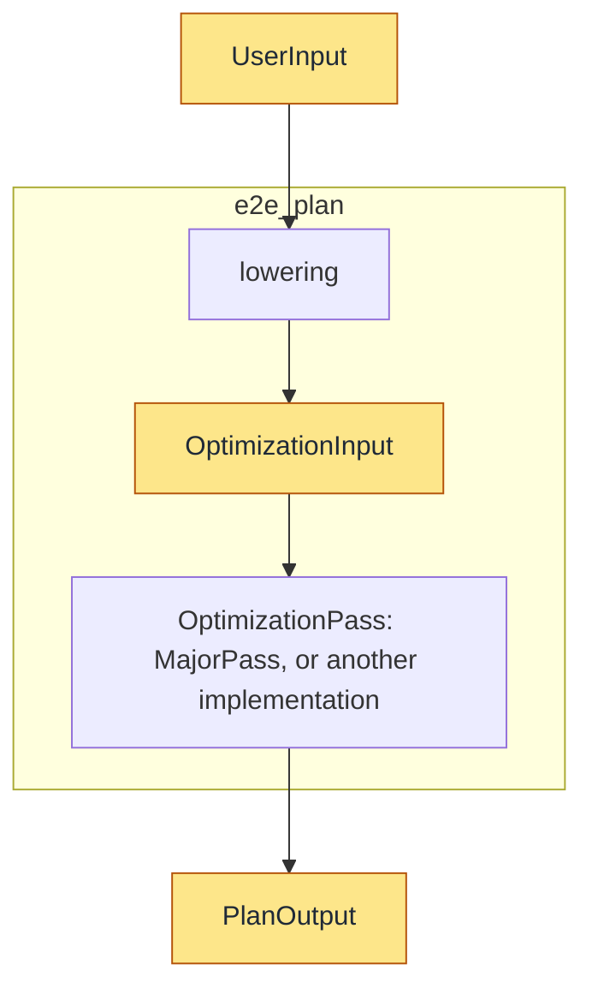

# One entry point, and a pluggable optimization pass

## 1. What is new

1. An **end-to-end function API** to lib users, giving them a one-function-call abstraction from a prepared input to the selected Post-ASAP DAG. 
2. A **pluggable optimization pass**, which gives developers a replaceable optimization stage.

What that buys:

* One call in place of six across three stages. `CandidateLogicalASAPDAGs` and
  `GlobalSelection` no longer appear in user code.
* The root-to-entry binding a caller used to build by hand is derived, and
  its ordering contract is checked rather than assumed.
* A new optimization algorithm can be freely implemented as a trait implementation, rather than a
  rule disguised to fit a two-phase pipeline it does not share.

Unchanged: `CandidateLogicalASAPDAGs`, `cost_sorted`, `global_selection`, and the interface
[input, output, and workflows](input-output-workflow.md) describes.

```text
PlanningWorkload ──lowering──▶ ParsedWorkload ──OptimizationPass──▶ PlanOutput
    + frontend deps                            + models
```

---

## 2. The types

This section introduces three key interfacing types of the unified workflow. 

The following diagram illustrates the flow of data through the unified workflow:

`e2e_plan` is the outer, light-blue box: a prepared workload goes in one end, the selected plan comes out the other. 
Inside, the workflow is composed of 2 phases: A fixed lowering phase and a pluggable optimization phase.
`OptimizationInput` is the intermediate type between the lowering and optimization phases.


```mermaid
flowchart TD
    U["UserInput"]
    OUT["PlanOutput"]

    subgraph e2e_plan
        direction TB
        L["lowering"]
        O["OptimizationInput"]
        PASS["OptimizationPass: MajorPass, or another implementation"]
        L --> O --> PASS
    end

    U --> L
    PASS --> OUT

    classDef data fill:#fde68a,stroke:#b45309,color:#1f2937
    class U,O,OUT data
```

Details of these types are provided below.

### `UserInput`

| Field | Meaning |
|---|---|
| `workload` | `&PlanningWorkload` |
| `frontend_specific` | `Sql { catalog }` / `Promql { now_ms, histograms }` / `Metricsql`; fixed by `query_workload.language` |
| `models` | Cost model, accuracy model, evidence provider; `PlanningModels::builtin()` for the defaults |
| `pass` | `None` uses `MajorPass` |

### `OptimizationInput`

```rust
pub struct OptimizationInput<'a> {
    pub workload: &'a ParsedWorkload,
    pub models: PlanningModels<'a>,          // same type UserInput uses
}
```

`OptimizationInput` is a `UserInput` without the query frontend.

### `PlanOutput`

```rust
pub struct PlanOutput {
    pub plans: Vec<QueryPlan>,   // one per workload entry, in entries() order
}

pub struct QueryPlan {
    pub entry_index: usize,      // index into QueryWorkload::entries()
    pub root: Rc<OperatorNode>,  // selected post-ASAP DAG; shared nodes are the same Rc
}
```

Plans carry no materialization decision. `PlanOutput::execution_timed_dag()`
times every summary at query time until Stage 2 materialization (#509) decides
per sub-DAG whether to materialize and whether at ingestion or query time.

---

## 3. The pluggable optimization pass

The optimization pass is fully pluggable, as long as the end-to-end behavior is satisfied.
The `MajorPass` described below will be used by default, which corresponds to the current optimization behavior of `ASAPPlanner`.

### 3.1 `MajorPass` — the original optimization pass

`MajorPass` contains the original optimization algorithm the crate has always run, now behind the trait and registered under the name `major`. Its behaviour is unchanged:

| Step | Call |
|---|---|
| Build roots | `Id` is the entry's position in `entries()`; the accuracy target comes from its `requirements` |
| Candidate search | `search_workload_with_targets` with `default_strategies_with_evidence` |
| Select | `CandidateLogicalASAPDAGs::global_selection` |
| Assemble, per root | `GlobalSelection::assemble_selected_dag` |
| Share | `asap_types::ir::cse::share_common_sub_dags` across the assembled roots |

Moving it behind the trait changes one thing for existing developers:
**`ReplacementStrategy` is now a concept of `MajorPass`, not of the optimization
stage.** Adding a rewrite or sharing rule to the shipped algorithm still means
implementing `ReplacementStrategy`. Replacing the algorithm means implementing
`OptimizationPass` instead — the two extension points no longer sit on top of
each other.

### 3.2 Plugging in another pass

To plug in another optimization pass, we only need to implement the trait:

```rust
pub trait OptimizationPass {
    fn name(&self) -> &'static str;
    fn optimize(&self, input: OptimizationInput<'_>) -> Result<PlanOutput, OptimizeError>;
}

struct MyPass { /* its own configuration */ }

impl OptimizationPass for MyPass {
    fn name(&self) -> &'static str { "my-pass" }
    fn optimize(&self, input: OptimizationInput<'_>) -> Result<PlanOutput, OptimizeError> { .. }
}
```

Then select it. Directly, when the caller knows which pass it wants:

```rust
let output = optimize(&my_pass, optimization_input)?;          // the stage alone
let output = e2e_plan(user_input.with_pass(&my_pass)).await?;  // the whole pipeline
```

Or through an optimization pass registry:

```rust
let mut registry = PassRegistry::with_builtin();   // holds "major"
registry.register(Box::new(my_pass))?;
for name in registry.names() {
    optimize(registry.get(name).unwrap(), optimization_input)?;
}
```

`PassRegistry` is caller-owned, not a link-time global, so two tests in one binary cannot see each other's registrations.

### 3.3 The existing workflows, in this shape

[Input, output, and workflows](input-output-workflow.md) describes two ways to
use the candidate space. The second is what a pass produces; the first stays
on the old interfaces.

| Workflow there | Here |
|---|---|
| Ranked view (`cost_sorted`) | Not covered by this design, you should handle it with old interfaces |
| Selection and DAG assembly | `PlanOutput` |

Selection and assembly are no longer a call sequence the caller drives.
Following is an example of how the old workflow maps to the new interface.

```rust
// Before — from a PlanningWorkload and a catalog.

// 1. Lower every normalized entry, and record which entry each root came from.
//    Not lower_sql_batch: it walks query_batch alone and drops repeating entries.
let mut roots = Vec::new();
for (index, entry) in workload.query_workload.entries().enumerate() {
    let accuracy = entry.requirements.accuracy.target();
    let expr = lower_sql_dialect(&entry.query.0, &catalog, dialect.clone(), accuracy.clone())
        .await?;
    roots.push((index, expr, Some(accuracy)));
}

// 2. Search for candidates.
let strategies = default_strategies_with_evidence(&cost_model, &evidence);
let space = search_workload_with_targets(roots, &strategies, &accuracy_model);

// 3. Select once for the whole workload.
let selection = space.global_selection(&cost_model);

// 4. Assemble once per root, then share common sub-DAGs across roots.
let mut assembled = Vec::new();
for (index, root) in &space.roots {
    if let Some(dag) = selection.assemble_selected_dag(root)? {
        assembled.push((*index, dag));
    }
}
let plans = share_common_sub_dags(assembled);
```

```rust
// After.
let output = e2e_plan(
    UserInput::new(&workload, FrontendInput::Sql { catalog: &catalog },
                   PlanningModels::builtin())
).await?;
```

Step 1 is where the binding lived: the `Id` carried through the roots tuple had
to agree with `entries()` order, and nothing checked that it did. `MajorPass` still
runs all four steps; another pass need not run any of them.

## 4. Code layout

| Crate | What it holds |
|---|---|
| `asap-types` | `ParsedWorkload` |
| `asap-aware-mapping` | `OptimizationPass`, `OptimizationInput`, `PlanOutput`, `PlanningModels`, `optimize`, `PassRegistry`, `MajorPass` |
| `asap-planner` *(new)* | `e2e_plan`, `UserInput`, `FrontendInput`, lowering dispatch |

```text
asap-planner ──┬──> asap-frontend-{sql, promql, metricsql}
               └──> asap-aware-mapping ──> asap-types
                          ▲
                     a pass depends only this far
```

`asap-planner` is separate because it is the only crate depending on every
frontend; before it, the sole facade re-exporting more than one was
`asap-devtools`, a developer-tools crate. `PlanningModels` lives in
`asap-aware-mapping` because both inputs use it, and `asap-planner` re-exports
it.

---

## Related

* [ASAPPlanner input, output, and workflows](input-output-workflow.md)
* [Searching over plans](asap-aware-plan-search.md) — what `MajorPass` does inside
* [Planner/runtime responsibilities](planner-runtime-contract.md)
* [Public library reference](../../develop_docs/library-api.md)
