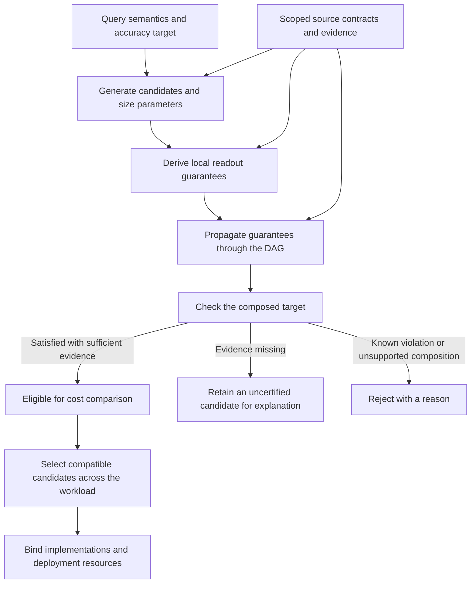

# Accuracy model design

## Purpose and ownership

The accuracy model answers whether a candidate computation can satisfy the
query's accuracy requirement, and what parameters and evidence it needs to do
so. Its unit of reasoning is the result of a computation, including the errors
of its inputs. A locally accurate sketch does not automatically make an entire
query accurate.

Planner owns the interpretation of accuracy targets, estimator models, error
propagation, budget allocation and candidate legality. Deployments provide
source contracts and evidence with a defensible scope. Cost models compare
resource costs; runtime implementations execute the selected semantics and
must honor the conditions attached to them.

This design applies to exact and approximate computation, composed queries and
shared DAGs. HLL is one estimator within this design, not a separate selection
system. Ingestion time and query time change where computation runs, not what
its accuracy guarantee means.

## Requirements, guarantees and evidence

These three concepts have different roles:

| Concept | Meaning | Owner |
|---|---|---|
| Accuracy target | What the caller requires of the result | Query requirements and aggregate intent |
| Result guarantee | What a particular computation can establish | Estimator and composition models in Planner |
| Evidence | Facts or trusted contracts needed to establish that guarantee | Source or deployment evidence provider |

`AccuracyTarget` is the authoritative requirement type:

- `Exact` requires zero error and zero failure probability.
- `Epsilon` constrains the error magnitude in the relevant metric; it does not specify a failure-probability budget.
- `EpsilonDelta` constrains both error magnitude and failure probability.

The target at a query root applies to the entire returned result. An aggregate's
own target guides its local candidate construction. Nested local targets do not
replace the root requirement: the composed result must satisfy it as well.

A `ResultGuarantee` contains an error metric, an error-bound expression, a
failure-probability expression and provenance. The metric is essential:

| Metric | Quantity bounded |
|---|---|
| Absolute value | Distance from the true value, in its units |
| Relative value | Distance normalized by the magnitude of the true value |
| Rank | Quantile rank displacement normalized by population size |
| Cardinality | Relative error of a distinct count |
| Frequency | Point-frequency error normalized by the stream's L1 norm |
| L2 frequency | Point-frequency error normalized by the stream's L2 norm |
| TopK membership | Whether the selected key set equals the true TopK set |

For example, a small quantile rank error does not imply a small error in the
quantile's numeric value. Converting metrics requires an explicit justified
rule and any evidence that rule needs.

Bounds and probabilities can remain symbolic. An unknown population size,
normalization factor or failure probability stays unknown; it is not replaced
by zero. Provenance records estimator parameters and contracts, child
guarantees, composition steps, allocated targets and unavailable evidence.
This makes an accuracy decision explainable without reconstructing it from
query text or cost estimates.

## Planning flow

Candidate generation, certification, selection and deployment binding are
separate decisions. A candidate may remain in the plan space while awaiting
evidence. Current selection excludes candidates marked as missing accuracy
evidence; being present in that space does not authorize execution.

Planner can use an optimistic lower bound while enumerating candidates to
avoid discarding a potentially useful plan solely because evidence is missing.
That bound is a feasibility test, not the candidate's certificate. The original
unknowns remain in its guarantee. Known violations and unsupported propagation
rules are not repaired by optimistic enumeration.

The default target comparator checks only the dimensions requested by the
target; an epsilon-only comparison does not itself check delta. The separate
missing-evidence gate still matters during selection. A successful accuracy
check also does not prove that a runtime implements the plan, that stored state
is ready, or that a complete deployment cost is available.

## Local estimator models and parameter sizing

A local model describes a specific readout of a specific estimator with
committed parameters and applicable assumptions. A family name or a parameter
such as HLL precision is not, by itself, a confidence certificate.

Sizing proposes parameters for a local target. Planner then derives the
actual guarantee from those parameters and checks it. Parameter rounding,
implementation limits, or conservative probability bounds can make a proposed
configuration insufficient; sizing must not bypass that check.

The built-in models currently include:

| Model | Current accuracy contract and limits |
|---|---|
| Exact computation | Exact over exact inputs under the supported operation's semantics; approximate inputs still require propagation |
| KLL | Normalized rank error at the model's fixed 99% empirical calibration; tighter confidence is not inferred from increasing `k` alone |
| DDSketch | Relative value error from alpha under the supported estimator/domain contract; sensitive compositions require additional domain evidence |
| Generic HLL | RSE magnitude with unknown failure probability; not a general confidence theorem |
| Bounded Classic HLL | Source-conditioned relative-error/failure-probability bound and precision sizing for the linear-counting branch |
| CMS | L1-normalized frequency bound from width and depth; does not by itself certify TopK membership |
| CountSketch | L2-normalized frequency bound and median concentration bound, requiring valid odd depth |
| KMV / Theta | Parameter-derived cardinality bounds using the registered variance/Chebyshev model at 99% confidence |
| UnivMon | Exact unit-update total for the supported readout; no universal guarantee for all its statistics |
| Other families/readouts | No default certificate where no accuracy model is registered |

This table describes Planner's registered contracts, not independent
mathematical verification of every estimator or permission to substitute
another implementation with the same algorithm name. In particular, a named
empirical calibration is different from an arbitrary benchmark's maximum
observed error; both its confidence and applicability must remain explicit.

The current interfaces still expose general parameter proposal through
`CostModel::size_params`. Default sizing formulas also remain in candidate
construction. Accuracy validation is independent of those proposals. The new
source-contract path centralizes HLL sizing and guarantee derivation in
Planner's accuracy module, overriding the generic proposal when the applicable
contract is supplied. It does not yet move every algorithm's sizing interface
out of CostModel. The design boundary is that parameter proposals never grant
accuracy authority to the cost model.

## Composing guarantees through a DAG

`AccuracyModel` supplies local guarantees, propagation rules and target
satisfaction. Its default implementation is conservative: an unregistered
composition over approximate inputs is rejected rather than treated as exact.

The principal composition rules are:

| Computation | Accuracy reasoning |
|---|---|
| Supported computation over exact inputs | Only its own local estimator error remains; a supported exact operation remains exact |
| Additive absolute-error composition | Add compatible error bounds and union-bound their failure events |
| Relative-error composition | Include the multiplicative cross term, subject to the required sign/domain conditions |
| Registered Lipschitz transform | Scale the input bound by the registered constant and include local error |
| Exact sum over approximate values | Convert compatible errors to absolute units and account for input multiplicity; missing scale/count evidence remains unknown |
| Exact average or extremum over approximate values | Use the registered absolute-error bound and account for failures across the input population |
| Division | Require the appropriate value-error rule and denominator/domain conditions; arbitrary rank-error division is unsupported |
| Counter rate/increase over approximate samples | No general distribution-free rule for reset detection and extrapolation; exact inputs remain a distinct supported case |
| Candidate-based TopK | Require membership/completeness evidence; frequency accuracy and exact reranking alone are insufficient |

Probability composition uses union bounds, without assuming independence
between child errors. Estimator-local assumptions, such as independent bucket
hashing, must be stated separately. Shared DAG nodes do not create independent
errors merely because several consumers reference them, and sharing does not
justify reducing the failure budget. Per-result guarantees also do not imply
a simultaneous guarantee across every query or evaluation time in a dashboard.

For relative errors, two eligible layers with errors `e1` and `e2` compose as
`(1 + e1)(1 + e2) - 1`, not simply `e1 + e2`. Likewise, an exact sum above
approximate values retains their uncertainty: exact arithmetic does not
recover information lost below it.

## Allocating an end-to-end budget

`AccuracyBudgetAllocator` proposes local targets for a composition. These
allocations create candidates; they are not proofs that the candidates work.
Every proposed composition is checked again using the actual guarantees.

The default equal-split allocator divides an additive error budget across the
approximate layers. For relative error, it uses local error
`(1 + epsilon)^(1/n) - 1` for `n` layers. When the target includes delta, it
splits that budget across the layers for union-bound composition. An exact
target does not receive an approximate allocation.

For example, under a supported two-layer relative-error composition, a 10%
end-to-end budget gives each layer approximately 4.88%, not 5%. If the failure
budget is 1%, each layer receives 0.5%. A model with only a fixed 1% failure
contract cannot automatically satisfy that allocation; another supported
configuration or candidate is needed.

## Evidence and trust boundaries

`AccuracyEvidenceProvider` supplies estimator contracts, quantile input domains
and propagation evidence. The evidence must cover the population to which the
claimed guarantee applies: sources, filters, grouping, evaluation windows and
all merged panes. Evidence for a narrower population cannot silently certify
a wider one. The workload-backed provider checks freshness before exposing
its supported data characteristics.

Source contracts are assertions that the source or deployment must establish
and enforce. They are not inferred from observed cardinality or sampled value
ranges. A source-specific deployment should supply those facts, rather than
reimplement estimator mathematics or candidate legality.

ERP benchmark results can inform resource costs and measured behavior.
A measured maximum error does not establish a failure probability. Benchmark
preference for cost estimation must therefore remain separate from accuracy
certification. If a model uses an empirical accuracy calibration, the contract
must identify its confidence level and scope rather than silently promoting
an observation into a guarantee.

### Example: bounded Classic HLL

A deployment supplies `EstimatorContract::ClassicHll` for the complete aggregate
expression. It asserts the classic estimator, independent uniform bucket
hashing and an enforced maximum distinct population per readout, including
all merged panes. Planner combines this contract with the query or allocated
local target, selects a supported precision, derives the guarantee and uses
the normal propagation and selection checks.

The current model supports maxima from 1 to 4096 and precisions from 4 to 18,
and certifies only configurations that remain in the linear-counting branch.
It bounds collisions across every integer cardinality in the declared domain
and bounds overestimation deterministically. It is not an RSE-to-normal
conversion, nor does it cover HIP/MLE or arbitrary unbounded populations.

Missing evidence leaves generic HLL confidence unknown. Invalid or infeasible
contracts cannot authorize the result. The contract does not certify another
estimator, another expression or an unsupported shared-grid grouping.

## Sharing across consumers

Accuracy reconciliation considers semantically compatible consumers with
different accuracy requirements. A looser consumer may reuse a tighter
consumer's computation when the supported reconciliation rule proves that the
requirements, grouping and row identity permit it.

This creates an explicit reuse candidate and a dependency on the tighter
computation. It does not change ordinary common-subexpression equality, merge
queries with different semantics, or weaken the tighter consumer's target.
Global selection still coordinates compatible choices and accounts for shared
cost. The current reconciliation strategy does not reconcile exact and
approximate requirements merely by ordering their epsilon values.

## Organization and extension contract

The `asap-aware-mapping::accuracy` module groups the shared algebra and budget
allocation, estimator/source-contract integration, algorithm-specific models
such as `hll`, and cross-consumer `reconciliation`. Serializable guarantee and
metric types live in `asap-types` so planning, explanations and downstream
binding share the same contract.

Adding an estimator or composition requires:

1. A precisely defined error metric, estimator/readout semantics and assumptions.
2. Sizing behavior and a guarantee derived from the committed parameters, including unsupported parameter domains.
3. Explicit evidence requirements, population scope and provenance.
4. Propagation rules where supported; rejection or retained unknowns elsewhere.
5. Tests from target and evidence through sizing, composition and selection, including missing evidence and infeasible targets.

Algorithm-specific mathematics belongs behind this common contract. It does
not require a new selection rule for every sketch. Deployment extensions to
`AccuracyModel` remain possible, but carry the same obligation to justify
metrics, assumptions and propagation.

For implementation details, see the [accuracy module](../../../crates/asap-aware-mapping/src/accuracy/mod.rs),
[guarantee representation](../../../crates/types/src/post_asap/guarantee.rs), and
[accuracy propagation companion](../../develop_docs/end-to-end-accuracy-guarantees.md).
