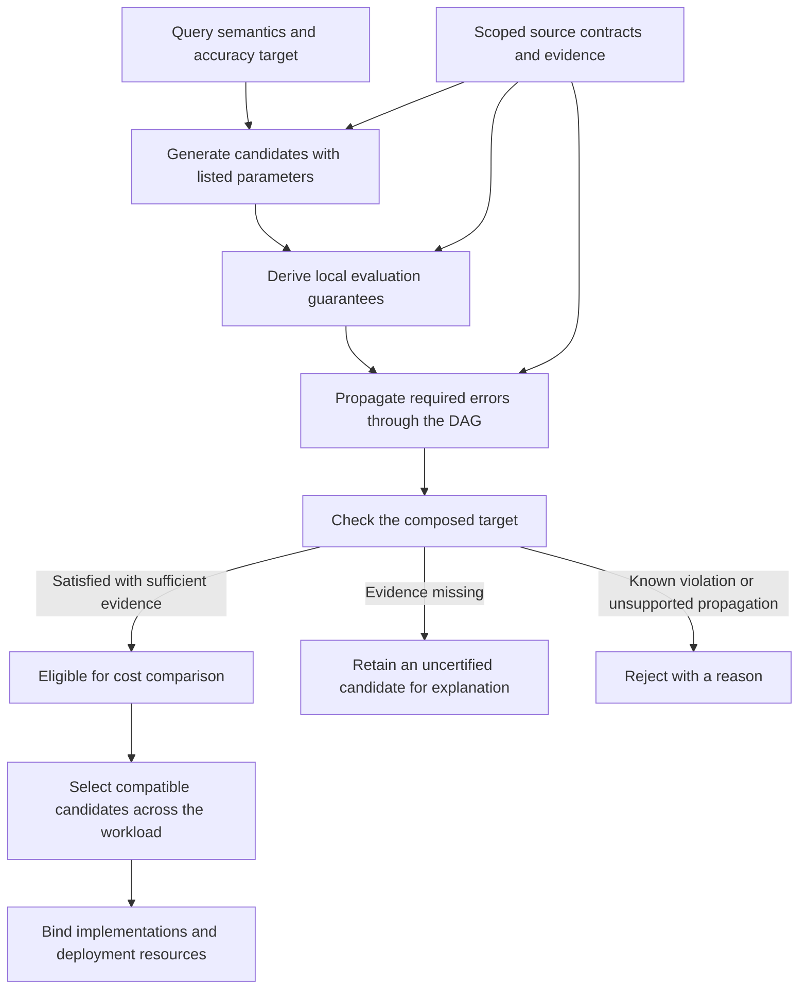
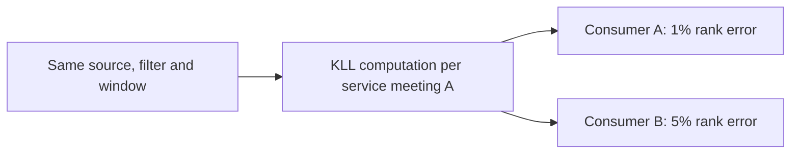

# Accuracy model design

## Purpose and ownership

The accuracy model answers whether a candidate computation can satisfy the
query's accuracy requirement, and what parameters and evidence it needs to do
so. Its unit of reasoning is the result of a computation, including the errors
of its inputs. A locally accurate sketch does not automatically make an entire
query accurate.

Planner owns the interpretation of accuracy targets, estimator models, error
propagation, readout requirements and candidate legality. Deployments provide
source contracts and evidence with a defensible scope. Cost models compare
resource costs; runtime implementations execute the selected semantics and
must honor the conditions attached to them.

This design applies to exact and approximate computation, composed queries and
shared DAGs. HLL is one estimator within this design, not a separate selection
system. Ingestion time and query time change where computation runs, not what
its accuracy guarantee means.

## Requirements, guarantees and evidence

These three concepts have different roles:

| Concept | Meaning | Owner |
|---|---|---|
| Accuracy target | What the caller requires of the result | Query requirements and aggregate intent |
| Result guarantee | What a particular computation can establish | Estimator models and error propagation in Planner |
| Evidence | Facts or trusted contracts needed to establish that guarantee | Source or deployment evidence provider |

`AccuracyTarget` is the authoritative requirement type:

- `AccuracyTarget::exact()` requires zero error and zero failure probability.
- `AccuracyTarget::max_error(ε)` constrains the error magnitude in the relevant metric; it does not specify a failure-probability budget.
- `.failure_probability(δ)` adds a failure-probability bound, so the target constrains both error magnitude and failure probability.
- `.accuracy_metric(m)` optionally fixes the metric ε is stated in; when it is unset, a guarantee in any metric that meets ε and δ is accepted.
- `.accuracy_scope(s)` sets which output values the (ε, δ) statement covers at once (below); the default is the whole result.

The target at a query root applies to the values its scope covers. An
aggregate's own target guides its local candidate construction. Nested local
targets do not replace the root requirement: the composed result must satisfy
it as well.

### Scope

A scope says which values of one evaluation's result must all be within ε at
once, with probability at least 1 − δ:

| `AccuracyScope` | JSON | Values covered (`V`) |
|---|---|---|
| `PerValue` | `"per_value"` | Each value on its own: `V = 1` |
| `WholeResult` (default) | `"whole_result"` | Every value of the result: `V = G`, the values one evaluation returns; unbound when neither every group key's distinct values nor, for a PromQL instant vector, the series count is declared, and always for a range vector and an ungrouped SQL result |
| `GroupsWithRecordShareAtLeast(share)` | `{"groups_with_record_share_at_least": 0.05}` | Every group (result row) holding at least `share` of the records the query aggregates in one evaluation: `V = min(⌊1 / share⌋, G)`, bound even when `G` is not; a smaller group is not covered |

The record-share scope is for queries that watch only their large groups, for
example an anomaly detector reading per-group distinct counts. `share` is a
fraction in (0, 1]; JSON rejects any other value, and one built in Rust
covers an unbound number of values, so its target stays unmet. More
than `⌊1 / share⌋` groups cannot each hold `share` of the records, so at most
100 groups qualify at 1% and 20 at 5%, whatever the number of groups. When a
row reads several aggregations, its group must hold the share of each one's
records. Groups below the share are not covered, so a guarantee over a
share meets a target over a larger share but not a per-value target, and only
a per-value guarantee is restated over a scope.

A scope bounds only the failure probability; the error bound is unchanged.
Every estimator produces a per-value guarantee (for a grouped
query, one per group: a Kmv or HLL distinct count per group, a KLL or DDSketch
quantile per group, a Count-Min or Count Sketch frequency per key, a Hydra
estimate per subpopulation; an exact value fails with probability 0). Stated
over a scope, a per-value failure probability `δ` becomes `V · δ` by the union
bound, without assuming independence, so a sketch shared by several groups
(Hydra, a keyed Count-Min) is covered the same way
(`AccuracyScope::max_values_covered` gives `V`). A guarantee whose own failure probability is
unknown (HLL without a distinct bound) serves no query with an accuracy target
(`RootPruneReason::NoGuarantee`), and a top-k readout is admitted on its
heap size and its value guarantee alone (the contracts table).

Pass 2 gives each sketch readout the error and per-value failure probability
`δ / max(V, R)` it must meet, with `R` the readout values the query's output
can depend on (the values per evaluation of every readout group below it,
summed: the series their scans read): a `max` over 1000 readouts returns
one value yet fails when any readout does, so the union bound gives δ over
every readout read, and `max by (job) (q or r)` reads those of both sides;
Pass 1's candidate takes the first requirement level and Pass 2 adds a copy
per further level. A readout several queries reach gets the union of their
levels. Pass 2 sizes nothing: a state has one build per listed θ, and each
edge checks the guarantee of its producer's θ at the required failure
probability, so a build several readers share serves the readers whose
levels its θ meets. Stage 3 only checks the guarantee; it never resizes. At equal
δ, the scope covering the most values is the strictest: every group (`G`,
when `G` is above 100), then a 1% share (100), then a 5% share (20), then a
single value (1). A whole-result target with an unbound `G`
enlarges nothing and stays unmet. A grouped result's `G` is bound by the
distinct values its sources declare for its group keys
(`SourceFacts.distinct_values_per_label`, and
`distinct_values_per_label_set` for labels that depend on each other): the
smallest product of declared label and label-set counts covering the keys, at
most the series read. With each of 625 endpoints in one of 25 services and
`(service, endpoint)` declared at 625, `by (service, endpoint)` returns at
most 625 values, not 25 x 625. A key counts only when it is a source column passed through
unchanged; a relabeled or computed key leaves `G` unbound. So a sketch meets a whole-result target over SQL groups when
every grouping column's distinct values are declared, and over 25 services
and 25 endpoints requires each group's sketch to meet `δ / 625`. Nothing declared
leaves `G` unbound; no default stands in for it.

An `AccuracyGuarantee` contains an error metric, an error bound and a
failure probability (possibly unknown, as HLL's). The metric is essential:

| Metric | Quantity bounded |
|---|---|
| Absolute value | Distance from the true value, in its units |
| Relative value | Distance normalized by the magnitude of the true value |
| Rank | Quantile rank displacement normalized by population size |
| Cardinality | Relative error of a distinct count |
| Frequency | Point-frequency error normalized by the stream's L1 norm |
| L2 frequency | Point-frequency error normalized by the stream's L2 norm |
| TopK membership | Whether the selected key set equals the true TopK set |

For example, a small quantile rank error does not imply a small error in the
quantile's numeric value. Converting metrics requires an explicit justified
rule and any evidence that rule needs.

Bounds and probabilities can remain symbolic. An unknown population size,
normalization factor or failure probability stays unknown; it is not replaced
by zero. Provenance records that a value is exact, or the sketch evaluation with its
estimator parameters and contract.
This makes an accuracy decision explainable without reconstructing it from
query text or cost estimates.

## Planning flow


```mermaid
flowchart TD
    Request[Query semantics and accuracy target] --> Generate[Generate candidates with listed parameters]
    Evidence[Scoped source contracts and evidence] --> Generate
    Generate --> Local[Derive local evaluation guarantees]
    Evidence --> Local
    Local --> Compose[Propagate required errors through the DAG]
    Evidence --> Compose
    Compose --> Check[Check the composed target]
    Check -->|Satisfied with sufficient evidence| Eligible[Eligible for cost comparison]
    Check -->|Evidence missing| Pending[Retain an uncertified candidate for explanation]
    Check -->|Known violation or unsupported propagation| Reject[Reject with a reason]
    Eligible --> Select[Select compatible candidates across the workload]
    Select --> Bind[Bind implementations and deployment resources]
```

Candidate generation, certification, selection and deployment binding are
separate decisions. A candidate may remain in the plan space while awaiting
evidence. Current selection excludes candidates marked as missing accuracy
evidence; being present in that space does not authorize execution.

Planner can use an optimistic lower bound while enumerating candidates to
avoid discarding a potentially useful plan solely because evidence is missing.
That bound is a feasibility test, not the candidate's certificate. The original
unknowns remain in its guarantee. Known violations and unsupported propagation
rules are not repaired by optimistic enumeration.

The default target comparator checks only the dimensions requested by the
target; an epsilon-only comparison does not itself check delta. The separate
missing-evidence gate still matters during selection. A successful accuracy
check also does not prove that a runtime implements the plan, that stored state
is ready, or that a complete deployment cost is available.

## Local estimator models and parameter lists

A local model describes a specific evaluation of a specific estimator with
committed parameters and applicable assumptions. A family name or a parameter
such as HLL precision is not, by itself, a confidence certificate.

Planner does not size parameters for a target. Each algorithm has a listed
set of parameters θ; Planner derives the guarantee of each listed θ at the
required failure probability and checks it against the requirement.
Implementation limits or conservative probability bounds can make a listed θ
insufficient for a requirement; that θ then serves no reader that needs more.

The built-in models currently include:

| Model | Current accuracy contract and limits |
|---|---|
| Exact computation | Exact over exact inputs under the supported operation's semantics; approximate inputs still require error propagation |
| KLL | Normalized rank error from the empirical 99% calibration `2.296 / k^0.9723`, fitted on Apache DataSketches' C++ KLL (`a9b42755072b`); below a failure probability of 0.01 that error is scaled by the Gaussian quantile ratio `z(1 − δ/2) / z(1 − 0.01/2)`, a model rather than a measurement, and the guarantee names that contract apart |
| DDSketch | Relative value error from alpha under the supported estimator/domain contract; a quantile's bound holds only over values of one sign (the state column's `column_signs` non-negative or non-positive, "Sign conditions"), else its failure probability is unknown and the readout serves no query with an accuracy target |
| Classic HLL | Relative error certified at the required failure probability over a source declaring at most `max_distinct_per_evaluation` distinct items (summed over the sources scanned below the state), from the linear-counting collision bound under independent uniform bucket hashes; without such a bound, or above the contract's range (`m/2` items at precision `p`), only the RSE magnitude with unknown failure probability |
| CMS | L1-normalized frequency bound from width and depth; does not by itself certify TopK membership |
| CountSketch | L2-normalized frequency bound and median concentration bound, requiring valid odd depth |
| KMV | Provable distinct-count bound from the `k` smallest hashes |
| UnivMon | Exact unit-update total for the supported evaluation; no universal guarantee for all its statistics |
| Other families/evaluations | No default certificate where no accuracy model is registered |

This table describes Planner's registered contracts, not independent
mathematical verification of every estimator or permission to substitute
another implementation with the same algorithm name. In particular, a named
empirical calibration is different from an arbitrary benchmark's maximum
observed error; both its confidence and applicability must remain explicit.

The θ lists are each algorithm's predefined parameter list, `parameter_list`
(`crates/types/src/summary_type/parameter_lists.rs`), weakest first. Pass 1
and Pass 2 add one build per listed θ, and the logical-edge check keeps an
edge only when the guarantee of the producer's θ, at the readout's required
failure probability, is within the required error. Where an error bound grows
as the failure probability shrinks (a KLL's `k`), the same θ meets a reader
at 1e-2 and misses one at 1e-6; no θ is resized for a reader. Accuracy
validation is independent of cost: the guarantee is derived from the
committed parameters, and the cost model never grants accuracy authority.

## Propagating errors through a DAG

The accuracy crate supplies theoretical guarantees (`theoretical_guarantee`),
each operator's error contract (`ErrorContract`, gathered per memo state in
`ErrorMetricsOfMemo`) and the comparison of a bound with a target
(`within_limit`); the deployment's measurements
(`AccuracyEvidence::measured_guarantee`) take precedence over a theoretical
guarantee, except for a θ whose theoretical guarantee can be deterministic
(DDSketch's relative error α): a measurement never replaces a guarantee that
holds with failure probability zero. Only a sketch readout introduces error. Every other operator
passes its inputs' errors on through a contract, and the contracts are
conservative: an operator with no contract for a metric fails the edge of an
input whose error is in that metric (`RootPruneReason::MetricRule`), so an
approximate value is never treated as exact.

A contract is a linear bound: the consumer's output error is at most
`Σ β_i · ε_i` over its inputs' errors `ε_i`, valid while each input stays
within its validity cap `b_i` (`ErrorContract::error_factor_per_input` and
`linear_bound_holds_up_to_per_input`). The principal contracts are:

| Operator | Contract |
|---|---|
| Sort, TimeRange, TimeShift, Concat, a readout, a finalize, a summary merge | `β = 1` in any metric |
| Filter on columns copied from a source (labels and keys) | `β = 1` in any metric; a filter comparing a computed value has none |
| PromQL `and`, `unless`, `or`; `label_replace`, `label_join` of labels | `β = 1` in any metric on each input whose values are copied; `β = 0` on the right input of `and` and `unless`, whose values are not read. This needs each side's series to be exact: no operator with a contract drops a row by its value, and a readout emits the series the exact evaluation does. A relabel reading a computed value has none |
| Project | Judged on the items reading a computed value (labels, the time and the series identity are copied): `β = 1` in any metric for a copied column; absolute error, `β = 1`, for `abs`, `clamp`, `clamp_min`, `clamp_max` (also PromQL's `promql_` functions) and a negation; relative error, `β = 1`, for `abs` and a negation (`\|−x̂ − (−x)\| = \|x̂ − x\|`, `\|\|x̂\| − \|x\|\| ≤ \|x̂ − x\|`, and `\|−x\| = \|\|x\|\| = \|x\|`) and for a product with or quotient by a nonzero constant |
| Aggregate or exact-accumulator build of counts, min, max, avg, sum | Counts `β = 0`; min and max absolute or relative with `β = 1`; avg absolute with `β = 1`; sum and avg relative with `β = 1` when the values they aggregate are of one sign (the input column's `column_signs` is non-negative or non-positive): `\|Σ (x̂_i − x_i)\| ≤ ε Σ \|x_i\| = ε \|Σ x_i\|`; only when every group-by key is copied from a source (a `by` key as listed; for `without`, every column but the time, the sample value and the excluded ones); none with measure filters or `HAVING`, or with a key reading an estimate |
| `+`, `-` | Absolute error, `β = 1` |
| `/` | Relative error, `β = 1/(1 − b)` on both operands, the denominator capped at `b` |
| `*` | Relative error, `β = (1 + b, 1)`, the right operand capped at `b` |
| Sum in absolute error or of values of unknown sign, comparison, ranking, counter rate or increase, any other function | No contract: the edge of an approximate input fails |
| Top-k over a sketch | Checked: the heap size is at least `k`, and the readout's value guarantee meets the requirement; membership has no check of its own |

`b` is `RELATIVE_OPERAND_VALIDITY_CAP`, 0.1, the weakest error of every
algorithm's list, so it never excludes a listed θ. For relative errors `x`
and `y` with `y ≤ b`, `(1 + x)(1 + y) − 1 ≤ (1 + b)·x + y`, and a ratio of
relative errors `a` over `b` is within `(a + b)/(1 − b)`. A relative bound
below 1 keeps zero at zero and keeps the sign, so a zero denominator gives the
same non-finite answer exactly and approximately, except the sign of a zero:
an exact −0.0 may be read as +0.0, which flips the infinity's sign. The ratio
rule relies on each operand's own relative guarantee (for DDSketch, its
estimator contract: one-signed values within the mapping's range). A sum or
difference of
relative errors has no relative bound (cancellation), and a rank error (KLL)
has no value bound, so neither passes through division. Likewise, an exact
sum above approximate values retains their uncertainty: exact arithmetic does
not recover information lost below it.

Probability is not propagated through operators. A query's failure
probability is split into a per-value one for each readout; a composed query
whose readouts' failure events add up (a ratio of two quantiles) reads each at
a level of a failure-probability grid, and the levels sum within the query's
per-value failure probability by the union bound, without assuming
independence between child errors. Estimator-local assumptions, such as
independent bucket hashing, must be stated separately. Shared DAG nodes do
not create independent errors merely because several consumers reference
them, and sharing does not justify reducing the failure budget. Per-result
guarantees also do not imply a simultaneous guarantee across every query or
evaluation time in a dashboard.

### Sign conditions

Two rules hold only over values of one sign. Both read the group property
`column_signs` (declared per source column in `SourceFacts::column_signs`, a
counter's value non-negative, and derived through each operator: a negation
flips it, `abs` makes it non-negative) and test it with
`ValueSign::is_one_sign`, non-negative or non-positive:

- DDSketch's relative bound on a quantile. The state column's sign
  (`GroupProperties::state_column_sign`, the sign of the values the states
  were updated with) must be one sign; otherwise the guarantee
  (`guarantee/ddsketch.rs`) keeps its metric, relative error, with an unknown
  failure probability, so the readout serves no query with an accuracy target
  (`RootPruneReason::NoGuarantee`) and `theoretical_guarantee` returns none.
  `quantile_over_time(0.99, latency[1h])` with `latency` declared
  non-negative holds at α; over a gauge of unknown sign it does not.
- A sum's or an average's relative error (the contracts table): the input
  column's sign must be one sign, as `|Σ (x̂_i − x_i)| ≤ ε Σ |x_i| =
  ε |Σ x_i|` holds then, while values of unknown sign may cancel.

The cost model reads whether a DDSketch state's values are non-negative from
the sources' declared signs instead, so it can disagree with this rule where
an operator changes the sign (DDSketch over `-latency`).

## Readout requirements for composed queries

Pass 2 gives each readout the accuracy it is required to meet. A query's
target error is divided by the factors `β` of the consumers on the path from
the readout to the query root, and capped by the validity caps on the way: the
largest error the readout's output may have for that query.

- A query whose path reads one readout gives one requirement level: the
  target divided by the path's factor, at the target's failure probability per
  value: a whole-result δ split over the larger of `n_q` and the readout
  values the query's output can depend on, summed over every readout group
  below it (`Memo::max_values_per_evaluation` each: at most the series
  scanned below it, the declared distinct values of its state's keys, one
  without keys), since a reduction such as `max` fails when any readout it
  reads does. `SELECT count(DISTINCT dst) FROM flows` at δ = 0.01 reads
  one distinct count, so its readout keeps 0.01. `max by (job) (q or r)`
  with 3 series per side reads 6 readout values, so each gets δ / 6; a
  bare `q or r` copies each output value from one readout value, but its
  whole result still fails when any of them does, so it too splits δ over
  the readout values of both sides.
- A composed query (several readouts whose errors reach its output, `β > 0`,
  such as a ratio; `q and r` reads one, since `r`'s values are not read, and
  `q or r` combines none, since each output value is copied from one side
  and its error is that side's) gives every level of the error grid (10%,
  5%, 2%, 1%, 0.5%, 0.2%, 0.1%) and the failure-probability grid (powers of
  ten from 1e-2 down to 1e-5, continued down to the first one at or below a
  tenth of the query's per-value failure probability) not looser than the
  cap. The logical-edge check then keeps the levels a producer's θ meets.
- A readout reached by several queries gets the union of their levels.
- A count reads no value (`β = 0`), and neither does the right input of
  `and` and `unless`: the readouts below it get no level through it, and
  an operator above it combines no error of them (`q / count(r)` reads
  one readout's error).
- A query whose target sets a failure probability with no per-value one
  (`n_q` or the values per evaluation of a readout below it unknown) gives
  no level. A
  readout no query gives a level is pruned
  (`RootPruneReason::ValuesPerEvaluationUnknown`); one another query gives a
  level stays, and the query reads its group only exactly.

The metric rule cuts a readout's edge when no query reaching it accepts its
metric, a union over the queries. Per query, Pass 2 also lists the groups it
may read only exactly
(`LogicalASAPMemoCandidates::exact_only_groups_of_query`, from
`ErrorMetricsOfMemo::exact_only_groups_of_query`), walking the live
candidates: the groups it reaches through a consumer without a contract for
its target's metric, and the readout groups whose error metric its target
does not allow. With Q0 = `p99 / p50` and Q1 = `p99 / p50 > 1` sharing the
ratio, Q0 may read the DDSketch readouts while Q1 reads the ratio and every
group below it only exactly; with `quantile_over_time(0.9, m[5m])` asked once
at a rank target and once at a relative one, each reads the other's readout
groups only exactly. Pass 2 only computes the list; Stage 3 enforces it per
query, in the query's own selection context (the selection MILP's
constraint (X)): no execution on the query's selected path, from its output
down, in a group on its list is a candidate with sketch parameters, while
another query may still read that candidate through its own path. A scalar
root's operands are roots: `scalar(v)` and a scalar subquery keep the
target's metrics, and any other scalar expression reads its operands only
exactly.

The list is per group, so it is conservative where one group holds
candidates a query may and may not read: `avg by (job)(count_over_time(m[1m]))`
at an absolute target reads `avg` with a contract and the exact accumulator's
sum and count without one, so the group below is exact-only for that query
even through `avg`. A finer list needs Stage 3 to enforce the metric rule per
query on each edge.

A PromQL subquery (`<expr>[10m:30s]`) has no error contract, so every sketch
readout below one serves no query with a target (sound). A contract for it
must split the failure probability over the subquery's inner steps (series ×
range / resolution), not over the series alone.

An exact target gets no approximate level. A model with only a fixed 1%
failure contract cannot meet a level that needs a smaller failure probability;
another supported configuration or candidate is needed.

## Checking each query's target in selection: constraint (K)

Pass 2 gives each readout requirement levels, and the logical-edge check keeps
the producers that meet them. A composed query reads several readouts, each
at one of its levels, and only the selection decides which: Stage 3's
selection MILP checks that the readouts a selection combines compose within
each query's target. This is constraint (K).

**Variables.** Per execution `c` (a candidate in one evaluation context)
that a query with a target reaches, and that is its own original (not in a
copy of an equivalent context): its error bound `E_{c,m}` per metric `m` and
its failure probability `D_c`, continuous; per input `i`, `F_{c,i,m}` and
`H_{c,i}`, what it reads from the producer selected on `i`.

**Rows.** With `y_{u,c,i}` the edge variables and `z_{q,v}` the choice of
execution `v` answering query `q`:

- `E_{c,m} ≥ ε_c[m = m_c] + Σ_i β_{c,i,m} F_{c,i,m}`, with
  `F_{c,i,m} ≥ E_{u,m} − M_{u,m}(1 − y_{u,c,i})` per selectable producer `u`;
  `ε_c` is a readout's own error, its required accuracy
  (`CandidateForMemoGroup::required_accuracy`), 0 for any other candidate.
- The metric rule on the selected path: `E_{u,m} ≤ M_{u,m}(1 − y_{u,c,i})`
  when `c` has no contract in `m`. An input with `β = 0` passes none.
- The validity cap: `F_{c,i,m} ≤ b_{c,i}` where the contract's linear bound
  holds only up to `b` (a ratio's denominator).
- `D_c ≥ δ_c + Σ_i H_{c,i}`, `H_{c,i} ≥ D_u − M_u(1 − y_{u,c,i})`: a union
  bound over the producers selected.
- At each output of a query with a target: `E_{v,m} ≤ ε_q + M(1 − z_{q,v})`
  in each metric the root allows (the target's at an operator root, none for
  the operands of a scalar expression no contract covers, 0 elsewhere), and
  `D_v ≤ δ_q / V + M(1 − z_{q,v})` with `V` the values the target's scope
  covers (`AccuracyTarget::failure_probability_per_output_value`, `n_q` for a
  whole result); no `D` row without a δ. Each limit is widened as the edge
  check widens it (`tolerated_limit`).

`D` adds each selected producer's δ once, not once per readout value an
output value depends on: `max(q)` over 1,000 series reads 1,000 readout
values. That is sound because Pass 2's levels already split the query's δ
over the readout values its output can depend on, so each readout's δ is the
query's over 1,000.

**Constant errors.** A readout's state is exact, so its error is its own
requirement under every selection: it has no `E` or `D` variable, and its
consumers read `Σ_u ε_u y_{u,c,i}` (at most one `y` of an input is 1). This is
exactly the variable form with `E_u = ε_u`, and it removes the big-M rows of
every readout.

**Ceilings.** `M` is the largest error any selection gives an execution,
computed in one pass in the memo's topological order (every selectable edge
reads a group ordered before the consumer's), each input taking its largest
producer's ceiling, by the same composition rule as the rows. The rule is
written once (`AccuracyRules::compose`), and also checks a whole selection
(`AccuracyRules::selection_meets_targets`): the greedy upper bound that prunes
executions dearer than a feasible plan uses its plan only when it meets (K),
since the cheapest readouts of a ratio may each meet their level and compose
above the target.

**Solver tolerance.** HiGHS's feasibility tolerances are absolute, 1e-7 by
default, while a per-value δ is often far smaller: δ = 0.01 over a whole
result of 1e4 values is 1e-6 per value, of which 1e-7 is a tenth: two
readouts failing with 5.4e-7 each compose to 1.08e-6 and pass that limit
within the default tolerance. So HiGHS first solves at its defaults, and the
selection is then checked exactly (`AccuracyRules::selection_meets_targets`,
in f64). A selection that misses a target is solved once more at primal and
MIP feasibility tolerance 1e-10, the least HiGHS accepts, and checked again.
A row may still pass its limit by up to 1e-10, which for a per-value δ near
or below 1e-10 can be orders of magnitude: at δ = 1e-12 per value (δ = 0.01
over 1e10 values) the solver may select readouts failing with 1.08e-12 in
all. A selection that misses a target after the second solve is an error
naming the query and its per-value δ ("an accuracy target is below the
solver's precision"); planning never returns a plan that may not meet its
target. The stricter tolerance is paid for only when the check needs it:
solving every (K) at 1e-10 made RangeHeavy-8users about 6× slower, deriving
the tolerance from the smallest limit solved RollupHeavy-8users about 2.8×
slower, and scaling (K)'s rows by their limits solved RangeHeavy-8users
about 4× slower.

**Context copies.** A copy of an equivalent evaluation context shares its
original's variables and has no rows of its own. Two contexts are copies only
when each output's root limits (the tolerated error per metric and failure
probability per output value) are equal, so the copy's rows would repeat the
original's: queries at δ = 0.01 per value returning 10 and 100 values are
copies; over a whole result they are not.

### Example: allocation in a ratio

A is `quantile_over_time(0.95, latency[1h])` at rank error 0.01, and B is
`quantile_over_time(0.99, latency[1h]) / quantile_over_time(0.5, latency[1h])`
at relative error 0.03, over non-negative `latency`. A reads a KLL readout at
rank 0.01. B's ratio passes each operand's relative error on with factor
`1/(1 − 0.1) = 1.111`, so Pass 2 gives each DDSketch readout below it the
levels of the grid up to its cap; with levels 0.02 (cost 1) and 0.01 (cost 3):

| p99 readout | p50 readout | B's composed error | meets 0.03 |
|---|---|---|---|
| 0.02 | 0.02 | 1.111 · 0.04 = 0.044 | no |
| 0.02 | 0.01 | 1.111 · 0.03 = 0.033 | no |
| 0.01 | 0.01 | 1.111 · 0.02 = 0.022 | yes |

(K) selects both 0.01 readouts, cost 6. A greedy plan reading the two
cheapest readouts (cost 2) misses B's target, so it bounds nothing.

## Evidence and trust boundaries

`AccuracyEvidence` supplies the deployment's measured guarantees. The evidence must cover the population to which the
claimed guarantee applies: sources, filters, grouping, evaluation windows and
all merged tumbling windows. Evidence for a narrower population cannot silently certify
a wider one. `MeasuredSketchAccuracy`, the measured table, is keyed per θ
(sketch parameters, statistic, metric) and does not depend on the population:
each recorded error is the worst over the merge counts the calibration
measured. That it covers the populations the deployment plans for is the
deployment's responsibility, not checked by the planner. Data-workload facts are declared: the planner has no clock, so the caller
drops facts that no longer hold before planning.

Source contracts are assertions that the source or deployment must establish
and enforce. They are not inferred from observed cardinality or sampled value
ranges. A source-specific deployment should supply those facts, rather than
reimplement estimator mathematics or candidate legality.

ERP benchmark results can inform resource costs and measured behavior.
A measured maximum error does not establish a failure probability. Benchmark
preference for cost estimation must therefore remain separate from accuracy
certification. If a model uses an empirical accuracy calibration, the contract
must identify its confidence level and scope rather than silently promoting
an observation into a guarantee.

### Example: HLL distinct counts

HLL's generic guarantee is its relative standard error, `1.04 / √m` for `m`
buckets, with an unknown failure probability. Its readout's metric is relative
error, but no failure probability can be evaluated, so without more a distinct
count read from HLL serves no query with an accuracy target
(`RootPruneReason::NoGuarantee`). When the data workload bounds the distinct
items one evaluation counts (`SourceFacts::max_distinct_per_evaluation`,
summed over the sources scanned below the state), classic HLL's
linear-counting branch is certified: `COUNT(DISTINCT user_id)` within relative
0.05 at δ = 0.01 holds at precision 18 over at most 9,636 distinct users, and
over 1,000,000 (above the contract's `m/2`) it does not. KMV's distinct count,
whose bound does not depend on the number of distinct items, serves such a
query without a bound. Missing evidence leaves generic HLL confidence unknown.
Invalid or infeasible contracts cannot authorize the result.

## Sharing across consumers

Accuracy reconciliation considers semantically compatible consumers with
different accuracy requirements. A looser consumer may reuse a tighter
consumer's computation when the supported reconciliation rule proves that the
requirements, grouping and row identity permit it.

This creates an explicit reuse candidate and a dependency on the tighter
computation. It does not change ordinary common-subexpression equality, merge
queries with different semantics, or weaken the tighter consumer's target.
Global selection still coordinates compatible choices and accounts for shared
cost. The current reconciliation strategy does not reconcile exact and
approximate requirements merely by ordering their epsilon values.

### Example: two consumers of the same grouped quantile

Suppose two queries compute the 95th-percentile latency from the same source,
filter, time window and `service` grouping. They have identical output columns
and differ only in accuracy requirements:

| Consumer | Requested result | Rank error target | Failure-probability target |
|---|---|---|---|
| A | p95 latency per service | 1% | 1% |
| B | p95 latency per service | 5% | 1% |

Planner can propose building the tighter KLL computation required by A and
letting B read that same result. A result certified to 1% rank error also meets
B's 5% rank-error target, at the same confidence. The `service` grouping
provides the stable row identity required by the current reconciliation rule.
These percentages bound rank displacement, not latency-value error.


```mermaid
flowchart LR
    Input[Same source, filter and window] --> Shared[KLL computation per service meeting A]
    Shared --> A[Consumer A: 1% rank error]
    Shared --> B[Consumer B: 5% rank error]
```

B's own candidate, a θ meeting only B, remains available. Global selection compares
that candidate with the reuse candidate and preserves the dependency on A's
tighter computation if it chooses reuse. Sharing is therefore an explicit
planning choice, not an unconditional rewrite or two separately charged builds.

This reconciliation does not apply if B instead asks for p99, uses a different
window or filter, or groups by another key: those queries differ in semantics,
not just accuracy. Nor does this example justify serving B at a failure target
of 0.1%; A's 1% failure guarantee would not meet it. A separate supported reuse
rule or a different estimator configuration would be needed in those cases.

When the consumers' failure targets differ, each reads the shared KLL at
its own required failure probability: a θ whose guarantee meets both
requirements serves both, and one meeting only the looser does not serve
the tighter consumer. No θ is resized for sharing.

## Organization and extension contract

The `asap_accuracy` crate separates these responsibilities:

```text
accuracy/src/
├── lib.rs              # Re-exports: the public interfaces
├── evidence.rs         # AccuracyEvidence: the deployment's measured accuracy
├── measured.rs         # MeasuredSketchAccuracy: the measured table per θ,
│                       # statistic and metric; its validation and lookup
├── error_contract/     # ErrorContract: each operator's error contract per
│                       # metric
├── metric_rule/        # ErrorMetricsOfMemo: the contracts, allowed metrics and
│                       # readout metrics of one memo state; the metric rule per
│                       # query (exact_only_groups_of_query)
├── readout/            # readout_error_metric: the metric of a readout's error
├── readout_caps/       # readout_levels → ReadoutRequiredAccuracy: caps through
│                       # the error contracts, each readout's required-accuracy
│                       # levels; MAX_ERROR_LEVELS
├── logical_edge/       # ErrorMetricsOfMemo::edge_meets_logical_requirements
│                       # (α^log); within_limit and tolerated_limit, the
│                       # requirement comparison
└── guarantee/
    ├── mod.rs          # theoretical_guarantee (one lookup at a failure
    │                   # probability per algorithm)
    ├── binomial.rs     # binomial_upper_tail
    ├── kll/
    ├── ddsketch.rs     # relative error α; its sign condition
    ├── hll/            # HLL: classic certificate over a distinct bound, else
    │                   # RSE (unknown failure probability)
    ├── cms/
    ├── count_sketch/
    ├── cardinality/    # KMV model
    └── univmon/
```

A directory is a module (`mod.rs`) with its unit tests beside it
(`tests.rs`). Each estimator module owns its local accuracy formulas: the
guarantee of a listed θ at a failure probability. The unified entry point delegates to these models; it does not
contain a second copy of their mathematics. Serializable guarantee and metric
types live in `asap-types` so planning, explanations and downstream binding
share the same contract.

Adding an estimator or an operator's error contract requires:

1. A precisely defined error metric, estimator/evaluation semantics and assumptions.
2. A θ list and a guarantee derived from each listed θ at a required failure probability, including unsupported parameter domains.
3. Explicit evidence requirements, population scope and provenance.
4. Propagation rules where supported; rejection or retained unknowns elsewhere.
5. Tests from target and evidence through the guarantee at the required failure probability, error propagation and selection, including missing evidence and infeasible targets.

Algorithm-specific mathematics belongs behind this common contract. It does
not require a new selection rule for every sketch. A deployment's measured
guarantees (`AccuracyEvidence`) carry the same obligation to justify
metrics, assumptions and propagation.

For implementation details, see the [accuracy crate](../../../crates/accuracy/src/lib.rs),
[guarantee representation](../../../crates/types/src/accuracy/guarantee.rs), and
[accuracy propagation companion](../../develop_docs/end-to-end-accuracy-guarantees.md).
