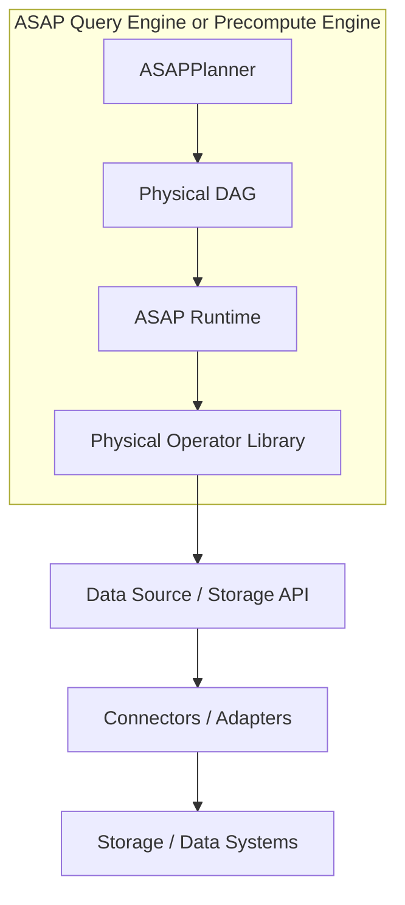

# Shared physical operators and DAG execution

## Decision

ASAP owns an independent physical operator library and DAG runtime. Precompute
and query engines bind inputs and consume outputs from the same library. The
operator defines computation; the engine supplies ingestion time or query time,
window boundaries, storage access and publication. There is no second execution
algorithm selected by phase.

The library lives in the ASAPPlanner workspace as `asap-physical-operators`,
alongside `asap-types` and logical-to-physical lowering. It depends on those local
IR types and never on ASAPQuery-backend. New IR nodes and their implementations
can be reviewed and tested in one Planner PR. Private implementation tests live
inside their owning crate; integration tests exercise exported physical DAGs.
Its native operators can execute independently of either backend engine.
Engine integration must use these operators for computation, rather than merely
using the shared scheduler around a second implementation.

## Engine and storage architecture



Planner describes source identities, schemas and computation. The runtime
schedules operators and owns shared execution, backpressure, cancellation and
resource accounting. Scan reads raw rows through the data-source interface;
Filter, Project, joins, aggregation and summary construction execute inside ASAP.
The same interface serves ingestion time and query time.

Connectors own system-specific access and decoding. Prometheus, S3, Parquet,
Kafka and Iceberg are possible integrations, not built-in dependencies or claims
of implemented support. A file format adapter and a storage transport can be
composed; they need not each be a separate query engine. Asking an external
system to execute the complete query remains external execution, not raw Scan.

The shared API exchanges typed native batches. Ordinary columns preserve
Planner types; other operator edges can carry ASAP summary states without an
Arrow representation. Raw Scan accepts ordinary rows only. Reading stored
summary state remains a distinct storage operation, with its own compatibility
and coverage requirements.

### Raw Scan contract

The library provides Scan, a registry keyed by Planner table/time-series source
identity, and an immutable in-memory connector. A deployment registers its
connectors before binding the physical DAG. Binding resolves metadata and
validates schemas and predicates without opening a reader. Execution lazily
opens one cursor per reachable Scan per run, even when multiple consumers share
that node. Each run gets a fresh cursor; dropping it releases connector resources.

Scan evaluates Planner leaf predicates itself with three-valued boolean logic:
only TRUE retains a row. Predicate pushdown is not assumed. Projection, time-range
selection and aggregation remain explicit downstream operations; Scan does not
silently interpret query evaluation time as a lookback or replay Kafka offsets.
Connectors receive the execution context for cancellation and resource control;
a deployment must bind any required snapshot/offset and bound its I/O buffers.
Reader errors and schema drift fail execution, rather than becoming empty results.

The current post-ASAP IR retains raw Scan as a leaf expression in its `Fallback`
payload. The source-aware binder recognizes only that Scan expression and runs
it locally; other retained expressions are still rejected. This does not invoke
an external fallback or introduce another operator vocabulary. Explicit stored
frontiers can still cut a DAG at a precomputed result.

Acceptance includes a raw-only Scan → Sort → Limit DAG at both phases, shared
consumers, independent runs, cancellation before opening, schema drift, reader
errors, null predicates, empty inputs and memory limits. This establishes the
library path. A backend must register a real reader before it can serve raw-only
plans; a Prometheus reader and other external connectors are not implemented here.

## Workspace organization

[DataFusion's physical-plan crate](https://github.com/apache/datafusion/tree/main/datafusion/physical-plan)
is the ownership reference: it owns the execution-plan interface, concrete
operators, streams, metrics and operator tests within the same repository as
planning. ASAP follows that repository boundary, while retaining its own DAG
execution model.

| Responsibility | ASAP owner |
| --- | --- |
| post-ASAP nodes, schemas, parameters and execution phase | `asap-types` |
| Logical-to-physical lowering and candidate correctness | `asap-aware-mapping` |
| Physical operator implementations, input/output validation and streams | `asap-physical-operators` |
| Shared-producer scheduling, cancellation and resource accounting | `asap-physical-operators` |
| Summary state encoding | `asap_sketch_codec` |
| Scan and data-source interface; reference memory connector | `asap-physical-operators` |
| External connectors, durable stores, publication and serving protocols | Deployment repositories |

The IR crate does not depend on execution. The physical operator crate depends
on the local IR crate. Operator unit tests can exercise private implementation
details; Planner integration tests check that emitted DAGs bind and execute.
Runtime values preserve the IR schema instead of redefining its type semantics.

### Module ownership

```text
src/
  plan/          PhysicalDag, PhysicalOperator, properties and validation
  runtime/       streams, shared producers, context, memory and cancellation
  expressions/   scalar evaluation and Planner expression adaptation
  operators/
    projection.rs
    filter.rs
    joins/
    aggregate/   ordinary and temporal reductions
    sort.rs
    limit.rs
    summary/     build, merge and readout
    source.rs    literal/batch sources, union and scalar conversion
  sources/       raw-source API, Scan and memory connector
  binding/       Planner executable DAG to physical operators
  summary_operators/  mathematical summary kernels, factory and traits
  stored_state/  decoding, delta application and persisted-state readout
  capability.rs kernel and native operator support checks
  values.rs     typed rows and state payload validation
```

The graph owns topology and static checks; the runtime owns each execution's
producer state. Operator modules own both construction checks and computation.
The `Operator` enum dispatch remains a small internal routing point. This does
not change `SummaryExpr`, Planner semantics or shared-producer identity.

`Expression` is the typed native builder; `CompiledExpression` validates and
adapts Planner scalar expressions. Both are owned by `expressions`, with shared
numeric execution. Planner-specific coercions and checked PromQL division remain
explicit at their respective binding boundaries. No expression evaluator lives
inside the projection or filter implementation.

Deployment engines normally use `binding`, `plan`, `runtime` and `sources`.
`summary_operators` exposes update kernels for pane maintenance; `stored_state`
serves deployments reconstructing persisted panes. Kernel traits include state
serialization because persistence consumes those states, but neither the graph
nor its scheduler depends on serialization. Existing `dag`, `accumulators`, `factory`, `traits` and
`arithmetic` import paths are thin compatibility re-exports.

## Execution contract

An immutable plan describes typed nodes and dependency edges. Each execution
creates its own operator state. One producer may have multiple consumers; the
producer executes once in that run and sends the same outputs to all consumers.
Separate runs, query evaluation times and ingestion windows do not share mutable
state. Request-local caching of intermediate results is scoped to execution.

The runtime validates dependencies, schemas, arity and cycles before sources
start. Each consumer advances independently. Bounded queues apply backpressure;
dropping one consumer does not cancel other consumers. Whole-run cancellation
wakes readers and releases queued work as streams are polled or dropped.

Execution runs on the caller's worker without an internal thread pool. Active
streams are worker-local. Deployments poll all consumers concurrently. The byte
budget accounts for retained outputs and native operator state, including outputs
held after queue eviction. It is not an RSS limit: source-owned data, temporary
allocation peaks and allocator overhead remain outside that estimate. Blocking
operators currently have no spill implementation. Join results and membership
sets, grouping workspace, sort scratch space and merged summary-state estimates
are charged while retained. Long row loops and sort merge steps yield to the
caller, so cancellation and other consumers can progress within a single batch.
Individual kernel calls and scalar evaluations remain synchronous; memory
estimates are not allocator-exact peak bounds.

### Finite input and emission

`PhysicalOperator::properties` reports output boundedness and emission mode.
Unknown source boundedness is conservative: it cannot satisfy a finite-input
requirement. `PhysicalDag::properties` derives these facts together with topology
and schema validation before `start` is called on any source.

Sort, ordinary aggregate, temporal reductions, both joins, scalar/keyed summary build and summary merge
and vector-to-scalar require bounded inputs and emit after input ends. Summary
build updates incrementally but still finalizes at end-of-input. Projection,
filter, limit, union and readout emit incrementally. A global Limit bounds its
output cardinality; a grouped Limit inherits input boundedness because new
groups may continue arriving. Neither declaration promises a time deadline.

`RawSource::boundedness` defaults to Unknown. Connectors must explicitly promise
that a snapshot or window ends; merely receiving a query/ingestion `Scope` is
insufficient. The memory connector declares Bounded. Installed physical source
frontiers preserve their supplied properties through the checked binding wrapper.

## Operator coverage

Native operations include raw Scan and scalar sources, typed Project and Filter, arithmetic
and boolean expressions, exact grouped aggregation, relational joins (including semi-join), grouped Sort and
Limit, Union, vector-to-scalar conversion, and summary construction, merge and
readout. Window operators consume Planner aggregate intents for Rate, Increase,
Sum, Avg, Min, Max, Count and histogram quantiles. Deployments supply window
boundaries and bound columns; the computation is identical in either phase.
Count outputs Int64. Binary expressions use Planner arithmetic/comparison kinds
and enforce its checked-division domains.

Grouped TopK composes Sort and Limit within each group. A weighted summary can
consume per-series rates directly: each job has its own CMS or CountSketch with a candidate heap,
with service as the item and rate as the weight. Sum accumulation inside the
summary replaces the exact grouped-sum materialization. Typed readout returns
candidate identities and estimated scores; a semi-join is not required for this
realization. Both score error and membership require accuracy guarantees.

The `summary_operators` module owns typed summary kernels. Its modules use operation
names, such as `count_min_sketch`, `exact` and `sum`, without an
`_accumulator` filename suffix or old-path aliases. Native weighted CMS and CountSketch
use Float64 counters and preserves typed item identities, including numeric and
NULL keys. Neither uses the integer-count codec or fixed-point counter-delta
updates. The DAG binder supports column weights and explicit column/tuple item
identities for both families; unsupported families or identities are rejected.
CMS accepts nonnegative weights and estimates each score using the minimum row
counter. CountSketch accepts signed weights, uses separate bucket/sign hash seeds,
and takes the median of sign-corrected estimates across a positive odd number of
rows. Candidate heaps rank estimated scores, not absolute magnitudes. A bounded
heap alone does not establish candidate completeness, including after signed
updates or merges. Missing accuracy evidence remains a candidate requirement;
physical binding does not impose deployment's accuracy acceptance policy.
Versioned Float64 states carry their algorithm and dimensions; cross-family or
incompatible-shape merges are rejected, without integer-state compatibility decoding.
Summary construction and readout run in either ingestion or query scope, as
chosen by deployment. Each run constructs independent partition state; deployment
must supply one complete evaluation window, or an equivalent maintained snapshot.
The candidate capacity is independent of the grouped Limit's output count.

Values retain Planner types and nullability. Native summary batches currently
support exact Sum/Count/Min/Max/Rate/Increase, KLL, DDSketch, HLL and Float64 weighted CMS and CountSketch with candidate heaps. Stored-summary decoding, delta reconstruction, exact finalization and
family-specific SketchQuery readout also live in this library. Deployment code
selects compatible panes and supplies source batches. Stored-state kernels do
not imply native batch bindings for every family. Unsupported expressions,
state families and parameters must be rejected during binding, without an
implicit external fallback. The backend retains source, storage, publication and protocol adapters.
Computation must bind to Planner operations without a second backend operator
vocabulary. Binding rejects unsupported Planner nodes before starting sources.

Deployments provide explicit storage or ingestion source frontiers and may bind
raw Scan through the shared data-source interface. The memory connector proves
the library contract; backend raw-data access still requires a deployment connector.

### Capability levels

| Level | Acceptance contract | Scope |
| --- | --- | --- |
| Update kernel | `capability::validate_summary_kernel` | Family, parameters, grouping and item/update layout; used by the accumulator factory |
| Native state edge | `capability::validate_native_family` | Exact accumulators, KLL, DDSketch, HLL and Float64 weighted CMS and CountSketch with compatible parameters |
| Scalar native readout | `capability::validate_native_readout` | Supported native state plus statistic/readout arguments |
| Keyed native readout | `Operator::keyed_readout` | Weighted CMS family, heap capacity, typed identity/score schema and preserved partition columns |
| Complete physical plan | `binding::bind` / `bind_with_data_sources` | Node support, expressions, schemas, source frontiers and bounded input requirements |
| Persisted state | `stored_state` decoders and readout functions | Stored format and family-specific reconstruction/readout support |

For example, a valid CMS update kernel does not imply a native CMS batch edge.
Stored-state support also does not register a native operator. Consumers must
use the contract for the path they intend to execute rather than treating kernel
availability as whole-plan acceptance.

Partitioned parallel execution, disk spill, cost-based algorithm selection,
physical ordering/distribution properties and per-operator Explain/Analyze
metrics remain future extensions. This change establishes finite-input and
emission contracts without claiming those additional DataFusion capabilities.

## DataFusion reuse vs independent implementation

The [execution comparison survey](datafusion-execution-comparison.md) examines
runtime costs, Arrow/sketch representation, producer sharing, logical/physical
extension points, optimization reuse, native maintenance cost and a benchmark
plan against pinned upstream sources.

| Decision dimension | DataFusion backend | Native ASAP execution |
| --- | --- | --- |
| Runtime overhead | Partition streams; ordinary operators do not each require a separate task. Conversion, state transport and exchanges depend on the chosen integration | Local streams and native state edges; producer queues, per-row values, validation and copies still have costs |
| Summary representation | Internal accumulators may remain native Rust objects; standard physical edges use Arrow batches, with binary/structured state or custom adapters | Native summary objects can cross edges directly |
| Shared execution | Shared plan references do not automatically share results; fusion, materialization or custom run-scoped producer coordination can implement reuse | One producer per node per run, with independent consumer cursors |
| Extension effort | Both logical and physical extension APIs exist; conventional custom nodes need not require an upstream fork | Direct control of both interfaces and implementations |
| Generic computation | Mature relational kernels, partitioning and spill infrastructure, subject to correct custom properties and state contracts | Supported vocabulary implemented locally; partitioned execution and spill remain deferred |
| Maintenance cost | Adapter, semantic and upstream-version integration | Ownership of operators, scheduler, resource contracts and future generic execution features |

The native decision in this PR is scoped to direct ownership of summary-state
edges and shared DAG execution. It does not establish that DataFusion is slower,
that Arrow requires serializing every sketch update, or that DataFusion cannot
implement fan-out. Multiple quantiles of one KLL can often be fused into one
readout; independent downstream branches may still require general sharing.

Borrowing DataFusion's module boundaries is useful regardless of backend choice.
Porting its algorithms also means adapting their array, expression, memory,
partition and spill dependencies and maintaining those adaptations. The survey
specifies the measurements needed to compare full DataFusion, native execution
and coarse hybrid subplans without confusing algorithm improvements with runtime
overhead. No comparative benchmark is claimed here.

## Acceptance

Independent tests must execute shared-producer diamonds without duplicated work
or deadlock, exercise slow and dropped consumers, propagate cancellation and
errors, retain memory accounting, and isolate separate executions. Operator tests
must cover types, nulls, grouped limits, state compatibility and unsupported
bindings. The same summary pipeline must run at ingestion time and query time.

Backend integration adds deployment acceptance for source binding, window and revision
scope, durable publication and query output adaptation. External exact forwarding
does not count as evidence that a local operator was implemented.
