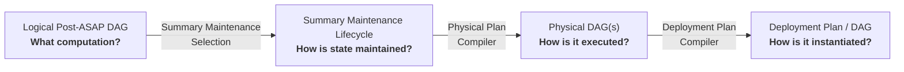

# Physical Planning, Summary Maintenance, and Deployment

## 1. Architecture

A Post-ASAP computation is progressively realized through four layers:



| Layer | Defines |
| --- | --- |
| **Logical Post-ASAP DAG** | Computation semantics |
| **Summary Maintenance Lifecycle** | Build, retention, reuse, and window strategy |
| **Physical DAG(s)** | Concrete executable operators and input boundaries |
| **Deployment Plan / DAG** | Concrete data/state bindings and operational lifecycle |

ASAPPlanner owns the first three layers and the shared physical operator
implementation library. Deployment systems such as ASAPQuery and asap-fusion
own deployment compilation and operation. The lifecycle is a planning contract
associated with the logical DAG, not a separate computation IR.

### Running example

Suppose p50 and p99 are requested over the same five-minute latency population,
and ASAP selects KLL with `k=200`. Assume query windows align with one-minute
pane boundaries and that the selected parameters satisfy the required guarantees.
Operator names below are illustrative; the example defines the design, not a
claim that the entire deployment integration is implemented.

The example evolves through the architecture as follows:

```text
1. Logical Post-ASAP DAG

raw latency
     ↓
KLLBuild(k=200)
     ↓
KLLMerge
   ┌─┴─────┐
   ↓       ↓
  p50     p99

          │
          │ Summary Maintenance Selection
          ▼

2. Summary Maintenance Lifecycle

KLLBuild(k=200)
  strategy = continuously maintain
  window   = 1-minute panes
  reuse    = p50 + p99
  query    = merge panes covering requested aligned 5 minutes

          │
          │ Physical Plan Compiler
          ▼

3. Physical DAGs

Maintenance DAG:
RawInput<Latency, 1m>
        ↓
NativeKllBuild(k=200)
        ↓
KllStateOutput

Query DAG:
InputSlot<KllState>[5 panes]
        ↓
NativeKllMerge(k=200)
      ┌─┴────────┐
      ↓          ↓
 NativeP50   NativeP99

          │
          │ Deployment Plan Compiler
          ▼

4. Deployment Plan / DAG

Maintenance:
OTLP latency source
        ↓
run KLL build over each complete 1-minute input pane
        ↓
store as latency-kll-1m/<window>

Query:
resolve five latency-kll-1m states
        ↓
execute query Physical DAG
        ↓
return p50 / p99
```

Each stage adds a different class of decision while preserving the preceding
contracts. Here, continuous maintenance means recurring production of pane state;
the bounded build DAG does not itself implement an unbounded streaming window.

## 2. Logical Post-ASAP DAG → Summary Maintenance Lifecycle

The **Logical Post-ASAP DAG** defines computation semantics:

```text
Scan(latency)
     ↓
KLLBuild(k=200)
     ↓
KLLMerge
   ┌─┴────────────┐
   ↓              ↓
Quantile(.5)  Quantile(.99)
```

It establishes that KLL with `k=200` is used and that the merge is shared by the
two readouts. It does not determine when KLL states are built or retained.

**Summary Maintenance Selection** makes that decision using workload demand,
window/freshness requirements, and physical feasibility/cost.

For the running example, assume it selects:

```text
producer: KLLBuild(k=200)

strategy:
    continuously maintain

window realization:
    1-minute panes

query requirement:
    combine panes covering the requested aligned 5-minute range

reuse:
    one merged state serves p50 and p99
```

This produces the **Summary Maintenance Lifecycle**.

The lifecycle specifies how the selected logical summary should be maintained,
but not its concrete operator implementation or storage location.

Physical feasibility may feed back into selection. For example, if the required
pane-based maintenance cannot be implemented, this lifecycle candidate cannot be
selected. One-minute panes alone also cannot cover an arbitrarily phased query
window; that requires supported boundary handling or a different candidate.

## 3. Summary Maintenance Lifecycle → Physical DAG

The **Physical Plan Compiler** consumes both computation semantics and maintenance
requirements:

```text
Logical Post-ASAP DAG
+ Summary Maintenance Lifecycle
+ physical capabilities
        ↓
Physical Plan Compiler
        ↓
Physical DAG(s)
```

For the running example, the lifecycle creates two execution boundaries.

### Maintenance Physical DAG

```text
RawInputSlot<Latency>(
    window = 1m,
    bounded = true
)
        ↓
NativeKllBuild(k=200)
        ↓
KllStateOutput(k=200)
```

This DAG implements construction of each maintained one-minute pane. Its input
contract requires the complete pane population; the deployment supplies that
bounded input from its source integration.

### Query Physical DAG

```text
InputSlot<KllState>(
    k = 200,
    coverage = requested aligned 5m
)
        ↓
NativeKllMerge(k=200)
      ┌─┴──────────────────┐
      ↓                    ↓
NativeQuantile(.50)   NativeQuantile(.99)
```

The Physical Plan Compiler chooses `NativeKllBuild`, `NativeKllMerge`, and the
physical quantile implementations, validates state compatibility, and preserves
the shared merge. It also resolves expressions, schemas, ordered dependencies
and execution properties.

The resulting Physical DAGs know that compatible KLL states are required, but
do not know where those states are stored.

For example:

```text
InputSlot<KllState>
```

is physical, while:

```text
s3://.../latency-kll/12:01
```

is deployment-specific. Placement and scheduling also remain outside the Physical
DAG. If the required behavior cannot be realized, physical compilation fails.

### Physical candidates include precompute computation

Materialization frontiers are Planner decisions. A candidate records both the
precompute Physical DAG and the query Physical DAG, with typed outputs connecting
them. The deployment compiler binds those outputs; it does not move operators.

For `sum by(job)(rate(m[1m]))`, legal physical candidates can include:

```text
Candidate A:
  precompute: compatible per-series counter states → per-series Rate
  materialized output: per-series rate values for window/evaluation/revision
  query: stored per-series rate values → grouped Sum

Candidate B:
  precompute: compatible per-series counter states → per-series Rate → grouped Sum
  materialized output: grouped values for window/evaluation/revision
  query: stored grouped values → result
```

Both preserve reset-aware Rate before Sum. Summing raw counters before Rate is
not equivalent. The counter-state build may be another maintenance DAG; typed
state inputs do not imply that a deployment can construct or bind those states.

The shared library exposes `physical_planner::compile_candidates(...)` to lower
explicit frontier candidates to `PhysicalCandidate { precompute, query,
materialized_outputs }`. `select_candidate(...)` accepts deployment feasibility
and scoped complete-workload costs and chooses the lowest-cost feasible
candidate. Costs must describe the same workload and planning horizon; missing
feasibility is rejected before pricing. The optimizer supplies candidate
frontiers and cost evidence, including updates, retention, recurrence and sharing.
`enumerate_frontiers` constructs bounded, reachable antichain frontiers above explicit input boundaries, including query-only and fully precomputed results. It fails explicitly when the candidate budget is exceeded. Maintenance selection must still reject frontiers that violate window, freshness, or reuse requirements; deployment feasibility is checked before pricing.

Physical compilation opens no readers. Bounded precompute outputs become typed
query inputs. Their build window, evaluation time, population, readiness and
revision contracts must accompany the selected lifecycle and be checked during
deployment binding. Type compatibility alone does not establish reuse legality.

The Planner integration test executes both candidates through the shared runtime
and reverses the selected frontier with two controlled cost fixtures. It also
rejects shadowed/duplicate boundaries and incomparable planning horizons. This
establishes Planner capability; it does not establish that ASAPQuery currently
supports persisting every scalar/result-output frontier.

## 4. Physical DAG → Deployment Plan / DAG

The **Deployment Plan Compiler** binds the Physical DAGs to the concrete deployment:

```text
Physical DAGs
+ Summary Maintenance Lifecycle
+ deployment catalog/state
+ sources/materializations
+ operational policy
        ↓
Deployment Plan Compiler
        ↓
Deployment Plan / DAG
```

For the maintenance DAG, it may produce:

```text
Source:
    RawInputSlot<Latency>
        → complete bounded panes from the OTLP latency source

Schedule:
    each 1-minute pane, once its completion requirements are met

Execution:
    RawInput → NativeKllBuild(k=200)

Output:
    KllStateOutput
        → latency-kll-1m/<window>
```

For a query over `(12:00, 12:05]`, its input-binding rule resolves:

```text
InputSlot<KllState>[5 panes]
    ├── latency-kll-1m/(12:00,12:01]
    ├── latency-kll-1m/(12:01,12:02]
    ├── latency-kll-1m/(12:02,12:03]
    ├── latency-kll-1m/(12:03,12:04]
    └── latency-kll-1m/(12:04,12:05]
              ↓
        Query Physical DAG
              ↓
           p50, p99
```

The Deployment Plan Compiler establishes bindings and checks that their contracts
satisfy the physical inputs and selected lifecycle, including KLL parameters,
grouping, population, window coverage and revision scope. The deployment engine
resolves request-specific states and checks their actual coverage, revisions and
readiness at execution time. A compiled plan cannot establish future readiness.

The compiler does not replace `NativeKllMerge`, choose another sketch, or decide
to maintain different windows. Such changes require replanning. A Deployment
Plan / DAG is an operational instantiation, not another computation IR.

## 5. Responsibility Boundary

The complete example makes the ownership boundary explicit:

| Stage | KLL example decision |
| --- | --- |
| **Logical Post-ASAP DAG** | Use `KLL(k=200)` with shared merge for p50/p99 |
| **Summary Maintenance Selection** | Maintain 1-minute panes and reuse them for aligned five-minute queries |
| **Summary Maintenance Lifecycle** | Record pane/window/freshness/reuse requirements |
| **Physical Plan Compiler** | Lower to native KLL build, merge, and readout operators |
| **Physical DAG** | Define maintenance and query DAGs with typed input/output boundaries |
| **Deployment Plan Compiler** | Bind raw input and KLL state slots to concrete sources/materializations |
| **Deployment Plan / DAG** | Specify maintenance schedules, stored-pane resolution and query execution |

```text
Logical:
    "Use KLL for p50/p99."

Lifecycle:
    "Maintain reusable 1-minute KLL panes."

Physical:
    "Execute NativeKllBuild and
     NativeKllMerge → {p50, p99}."

Deployment:
    "Read OTLP here, store panes here,
     and bind these five panes for this aligned query."
```

The deployment engine executes the bound Physical DAGs through ASAPPlanner's
shared physical operator implementation library, `asap-physical-operators`, and
its DAG runtime. The merge executes once per run for both consumers. Execution
does not introduce additional planning decisions.

Each maintained pane contributes its finalized population once. A replacement
snapshot updates that pane's state; it does not introduce another population
when the shared runtime merges panes for a query.

## 6. Executable acceptance coverage

The tests cover optimizer-selected lifecycle execution and automatic temporal
pane compilation, alongside independent operator/runtime fixtures:

| Test | Contract exercised |
| --- | --- |
| `summary_maintenance_lifecycle_e2e::selected_temporal_lifecycle_compiles_panes_and_executes` | PromQL p50/p99 workloads → selected continuous lifecycle and Sliding framework → automatically generated maintenance/query DAGs → real codec round-trip → adjacent aligned windows; checks filters, entity identity, sample counts, missing/duplicate panes and phase rejection before opening readers |
| `summary_maintenance_lifecycle_e2e::continuous_lifecycle_compiles_and_executes_spatial_kll` | PromQL workload → selected continuous lifecycle → logical DAG → compiled maintenance/query candidate → results in independent revisions; an unbounded candidate fails before pricing, and a bounded request candidate returns the same population |
| `kll_pane_execution::five_panes_roundtrip_and_shared_merge_runs_once` | Explicit one-minute maintenance DAGs → real MessagePack state bytes → five required query inputs → shared native merge → p50/p99; counts every sample once, checks adjacent aligned windows and instruments one merge start per run |
| `kll_pane_execution::restored_panes_reject_corruption_parameters_schema_and_missing_binding` | Corrupt bytes, parameter relabelling, incompatible schemas and absent bindings fail explicitly |
| `precompute_candidates::grouped_rate_can_be_materialized_before_or_after_grouped_sum` | Cost changes select different legal precompute frontiers; both selected candidates execute with the same reset-sensitive result; uncompilable candidates are not priced |
| `sql_to_physical::sql_filter_grouped_sum_executes_and_rebinds` | SQL text → candidate search → physical compilation → shared Scan predicates and grouped summary execution; NULL samples are ignored and fresh bindings produce new results |

`physical_planner::compile_temporal_pane_candidate` consumes the logical DAG,
selected lifecycle/framework and a generic pane/entity input contract. It
generates pane construction, scan predicates, ordered state slots, a shared
merge, quantile readouts and run-scoped timestamps. A physical pane output has
its own identity: one minute of state cannot masquerade as the logical
five-minute summary. The returned candidate retains the maintenance contract.

This initial realization supports bounded, complete KLL panes with known phase
and resolved entity identity, for Sliding windows or a single Tumbling window.
Source capability evidence must declare all entity keys or isolate one entity;
usage-derived PromQL columns alone cannot establish that identity. Partial edge
panes, exponential histograms and cross-run delta accumulation require further
physical candidates and are rejected by this entry point.

Physical execution checks pane timestamps and duplicate entity states. Concrete
stored identity, revisions, readiness and completeness evidence remain
deployment responsibilities. Real storage and HTTP execution belong to
deployment-repository E2E tests.
