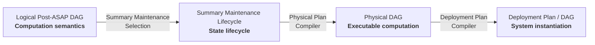

# Physical Planning, Summary Maintenance, and Deployment

## 1. Architecture

A Post-ASAP computation is progressively realized through four layers:



| Layer | Defines |
| --- | --- |
| **Logical Post-ASAP DAG** | What computation should happen |
| **Summary Maintenance Lifecycle** | How summary state is maintained |
| **Physical DAG** | How the computation is executed |
| **Deployment Plan / DAG** | How it is instantiated in a concrete system |

ASAPPlanner owns computation, maintenance selection, physical planning, and the
shared physical operator implementation library. Deployment systems such as
ASAPQuery and asap-fusion own deployment compilation and operation.

## 2. Logical Post-ASAP DAG → Summary Maintenance Lifecycle

The Logical Post-ASAP DAG defines computation semantics:

```text
Scan → KLLBuild(k=200) → KLLMerge ─┬→ Quantile(0.50)
                                └→ Quantile(0.99)
```

It specifies operators, summary parameters, dependencies, sharing, and guarantees.
It does not specify how summary state is maintained.

**Summary Maintenance Selection** chooses the lifecycle of each summary producer
using workload demand, window/freshness requirements, physical feasibility, and cost.

Typical strategies are:

- build per request;
- build, retain, and reuse; or
- continuously maintain.

The result is a **Summary Maintenance Lifecycle** describing the selected strategy
and applicable window, freshness, reuse, and retention requirements.

```text
Logical Post-ASAP DAG
+ workload requirements
+ physical feasibility/cost
        ↓
Summary Maintenance Selection
        ↓
Summary Maintenance Lifecycle
```

The lifecycle is a planning contract associated with the logical computation, not
a separate computation IR. Selection may request physical candidates and use their
feasibility and cost to reconsider maintenance candidates; this is not an
irreversible pass.

## 3. Summary Maintenance Lifecycle → Physical DAG

The **Physical Plan Compiler** lowers the logical computation and selected lifecycle
into executable physical operators:

```text
Logical Post-ASAP DAG
+ Summary Maintenance Lifecycle
+ physical capabilities
        ↓
Physical Plan Compiler
        ↓
Physical DAG(s)
```

It selects physical implementations, compiles expressions, resolves types and
schemas, preserves dependencies and sharing, creates typed input boundaries, and
validates physical requirements.

For example:

```text
InputSlot<KllState>(k=200, grouping=G)
        ↓
NativeKllMerge(k=200)
        ├──→ NativeQuantile(0.50)
        └──→ NativeQuantile(0.99)
```

A **Physical DAG** contains concrete operators, compiled expressions, typed input
slots, dependencies, output roots, and execution properties.

It remains deployment-independent: materialization IDs, storage locations,
placement, and scheduling are not part of the Physical DAG.

If the selected lifecycle cannot be physically realized, compilation fails and
planning may reconsider the candidate.

## 4. Physical DAG → Deployment Plan / DAG

The **Deployment Plan Compiler** binds a Physical DAG to a concrete deployment:

```text
Physical DAG(s)
+ Summary Maintenance Lifecycle
+ deployment catalog/state
+ sources/materializations
+ operational policy
        ↓
Deployment Plan Compiler
        ↓
Deployment Plan / DAG
```

It determines:

- concrete source and materialization bindings;
- storage and placement;
- scheduling and lifecycle execution;
- readiness and revision checks; and
- persistence, publication, or serving behavior.

For example:

```text
InputSlot<KllState>
        ↓
materialization "latency-kll-5m"
        ↓
object-store reader
```

The deployment compiler does not lower logical operators or choose a different
physical algorithm. If the selected physical computation cannot be bound correctly,
it fails or requests replanning. A Deployment Plan / DAG is an operational
instantiation, not another computation IR.

## 5. Materialized Boundaries

A selected maintenance strategy may place a materialized boundary inside the
logical computation:

```text
Scan → KLLBuild → KLLMerge → Quantile
          ↑
     materialized
```

The corresponding query Physical DAG becomes:

```text
InputSlot<KllState> → KLLMerge → Quantile
```

Responsibilities remain separated:

- **Summary Maintenance Selection** decides that the KLL state should be maintained
  and reused.
- **Physical Plan Compiler** constructs the Physical DAG with an explicit typed
  boundary.
- **Deployment Plan Compiler** binds that boundary to a concrete compatible
  materialization.

Reuse requires compatible summary family and parameters, schema, grouping,
population, window coverage, revision scope, and guarantees.

## 6. Execution

The deployment engine resolves the Deployment Plan and calls ASAPPlanner's shared
physical operator implementation library, `asap-physical-operators`:

```text
Deployment Plan / DAG
        ↓ deployment engine resolves inputs and invokes
Physical DAG + resolved inputs + RunContext
        ↓
ASAPPlanner shared physical operator implementation library
    concrete operators + DAG runtime
        ↓
Results
```

The runtime executes the supplied Physical DAG. It does not select maintenance
strategies, discover materializations, or make deployment decisions.

Shared producers execute once per run, while failure, cancellation, backpressure,
and resource management follow the common runtime contract.
