# ASAPPlanner Planning Stages Design

Status: proposal. Audience: designers and developers of ASAPPlanner and of deployments such
as ASAPQuery-backend.

Read Stages for the overview, the stage sections for the rules, and the
examples for why the rules are needed.

## Goal

ASAPPlanner takes a [query workload](https://github.com/ProjectASAP/ASAPPlanner/blob/main/crates/types/src/workload.rs), a [data workload](https://github.com/ProjectASAP/ASAPPlanner/blob/main/crates/types/src/workload.rs#L531) and the deployment's
inputs (TODO: define this data structure in a follow-up PR), and returns one optimal physical plan. It decides what is computed, how
it is computed, and which plan is best. The deployment only supplies inputs and
executes the plan: it supplies its own empirical cost estimation, empirical accuracy estimation and capabilities of deployment but never does the query planning or plan selection.

## Stages

`x` represents Cartesian product for enumerating and combining different optimization angles in planning. 

```text
 Query workload
   (PromQL / SQL / MetricsQL,
    query recurrence,
    accuracy requirements,
    latency requirements)

 + Data workload
   (streaming vs. data at rest,
    data distribution,
    cardinality)

 + Deployment inputs
   (cost model,
    accuracy model,
    deployment capabilities)
                         │
                         ▼
┌────────────────────────────── ASAPPlanner ──────────────────────────────┐
│                                                                        │
│ 0. Language-specific frontends                                         │
│    Parse and convert source-language queries into a common logical     │
│    representation. Reject unsupported query expressions.               │
│                                                                        │
│    Output: CandidateLogicalDAGs                                        │
│                                                                        │
│                         │                                              │
│                         ▼                                              │
│ Logical planning — what to compute                                     │
│                                                                        │
│ 1. Logical ASAP-aware optimization                                     │
│    Explore semantically equivalent and legal logical candidates:       │
│                                                                        │
│      summary families                                                  │
│      × query rewrites                                                  │
│      × sharing one summary across multiple computations                │
│                                                                        │
│    Output: CandidateLogicalASAPDAGs                                    │
│                                                                        │
│                         │                                              │
│                         ▼                                              │
│ Physical planning — how to compute                                     │
│                                                                        │
│ 2. Physical ASAP-aware optimization                                    │
│    Explore executable implementations of each logical candidate:       │
│                                                                        │
│      materialization decisions                                         │
│      × physical operator implementations                               │
│      × parallelism and partitioning                                    │
│      × resource management                                             │
│                                                                        │
│    Output: CandidatePhysicalASAPDAGs                                   │
│                                                                        │
│                         │                                              │
│                         ▼                                              │
│ 3. Plan selection                                                      │
│    Evaluate complete physical candidates using the deployment's        │
│    empirical cost and accuracy models. Reject candidates that violate  │
│    accuracy, latency, or capability constraints.                       │
│                                                                        │
│    Choose the cheapest valid plan for the whole workload.              │
│                                                                        │
└────────────────────────────────┬───────────────────────────────────────┘
                                 │
                                 ▼
                    one selected PhysicalASAPDAG
                                 │
                                 ▼
┌────────────────────────────── Deployment ───────────────────────────────┐
│                                                                        │
│ 4. Execution                                                           │
│   deployment executes the selected DAG (plan).                         │
│                                                                        │
└────────────────────────────────────────────────────────────────────────┘
```

The planner receives three groups of inputs:

| Input | Contents |
|---|---|
| Query workload | Source-language expressions, recurrence, predictability, time selection, accuracy requirements, and latency requirements |
| Data workload | Data arrival pattern, sampling cadence, ingestion volume and rate, cardinality, and distribution |
| Deployment inputs | Empirical cost model, empirical accuracy model, and execution capabilities |

## Stages and their decisions

Stages 0 to 2 each output a candidate set holding every semantically equivalent
and legal candidate DAG of that stage; stage 3 is the only step that chooses
one candidate DAG as output. Candidate sets are internal to ASAPPlanner and may
be shared or enumerated lazily. A stage may prune a candidate early only when
it is provably invalid (for example, a summary family that cannot meet the
query's accuracy target), and every rejected candidate carries a reason.

A candidate is a DAG for the **whole workload**, not for one query. Each stage
combines its choices for every sub-DAG with the candidates it receives (the ×
in the diagram), so the candidate set grows from stage to stage until
selection picks one; in the implementation, each stage can early prune invalid candidates. Example 1 traces this growth step by step.

| Stage | Input | Decides | Output |
|---|---|---|---|
| 0. Frontends | `query`, `language` | Parse and lower to a common logical form; reject what cannot be represented | `CandidateLogicalDAGs` |
| 1. Logical ASAP-aware optimization | Logical DAGs; accuracy, `time_selection`, repetition interval | Summary replacement (Pass 1); ASAP-aware CSE (Pass 2) | `CandidateLogicalASAPDAGs` |
| 2. Physical ASAP-aware optimization | Logical ASAP DAGs; `recurrence`, `predictability`, `DataWorkload` | Materialization; physical operators; parallelism and resources (TODO) | `CandidatePhysicalASAPDAGs` |
| 3. Plan selection | Physical candidates; `requirements`; cost model, accuracy model, capabilities | Reject invalid candidates; pick the cheapest plan for the whole workload | One `PhysicalASAPDAG` |
| 4. Execution (deployment) | The selected `PhysicalASAPDAG` | Run ingestion, storage and query-time computation | Query results |

The sections below describe each stage.

### 0. Language-specific frontends

The frontend converts each query into a `LogicalDAG`. Nodes represent logical
query operations, including selectors, transformations, aggregations, grouping
and window semantics. They contain no ASAP summary choices. A construct that cannot be represented
faithfully is rejected.

The frontend preserves source-language behavior, including series identity,
evaluation timing and missing-data semantics.

### 1. Logical ASAP-aware optimization

Logical optimization runs in two passes. Pass 1 generates candidates for each
computation on its own; Pass 2 finds candidates that share computation across
sub-DAGs and queries. Decisions about materialization, execution
placement are taken in later stages.

#### Pass 1: Local candidate generation

For each eligible sub-DAG, Pass 1 identifies its computation semantics, applies
rewrite rules, and generates every candidate that can meet its accuracy
requirement.

Example for summary candidates:

| Original computation | Local candidates |
|---|---|
| `Sum(x) by (g)` | Exact grouped sum |
| `TopK(k, x) by (g)` | Exact sort and limit per group, Count-Min Sketch with a top-*k* heap per group, Hydra over all groups |
| `Distinct(x)` | Exact distinct, a specialized distinct summary, UnivMon |
| `Entropy(x)` | Exact entropy, a specialized entropy summary, UnivMon |
| `L2(x)` | Exact L2 norm, a specialized norm summary, UnivMon |
| `Quantile(x, window)` | Exact quantile, KLL over the requested window |

Each candidate records its input expression, filter, grouping, window,
supported estimates and accuracy requirement. Pass 2 uses these to decide
whether candidates can share a summary node.

A summary-based candidate uses three kinds of summary nodes:

* A **summary build node** builds and maintains a summary from input data, for
  example a KLL sketch over `latency_ms`.
* A **summary merge node** combines summaries into one, for example merging
  five 1-min KLL panes into one 5-min KLL, or merging lower-level summaries
  into a coarser one.
* A **summary estimation node** computes an answer from a summary, for example
  the p99 estimate from a KLL, or the entropy estimate from a UnivMon.
* **summary subtract node** and **summary delete node** design is TODO. 

One summary build node can feed several estimation nodes, which is what Pass 2
exploits.

#### Pass 2: ASAP-aware common-subexpression elimination

ASAP-aware CSE extends traditional CSE with summary-specific sharing rules.
Computations can share work when they use identical expressions, when one
summary build node supports several estimates, or when one window summary can answer
their overlapping windows.

The rules compare computations by their **summary input data**: what a summary for
that computation would ingest, namely the data source, the filters, and the key
or value being summarized together with its grouping. The summary input data does
not include the window; the window-composition rule compares windows
separately.

The window-composition rule distinguishes what a query reads from what the
planner stores:

* A **window** is the time range one query evaluation reads, for example the
  last 5 min. Consecutive evaluations of a repeating query read overlapping
  windows; this is a **sliding window**.
* A **pane** is what the planner summarizes and stores. The time axis is cut
  into back-to-back panes of equal length (a tumbling window), each with one
  summary. A window is answered by merging the summaries of the panes it
  covers, so overlapping windows reuse the same panes instead of each building
  its own summary. Most summaries cannot remove old data, so one summary cannot
  simply slide forward; panes avoid that, because the oldest pane is dropped
  rather than subtracted. The pane length must divide both the window length
  and the evaluation interval, so that every window starts and ends on a pane
  boundary and never needs part of a pane: a 5-min window evaluated every
  1 min uses 1-min panes, and each window merges exactly 5 whole panes.
* A **bucket** of an Exponential Histogram plays the same role, but bucket
  lengths grow with age: recent data sits in short buckets and older data in
  longer ones. This keeps few buckets over a long history, at the cost that old
  window boundaries may fall inside a bucket and are then approximate.
* A **window summary** is a summary organized as panes or buckets so that it
  can answer many windows, for example a sliding window of panes, a tumbling
  window, or an Exponential Histogram.

| ASAP-aware CSE rule | Sharing condition | Shared computation |
|---|---|---|
| Identical-expression rule | The input and computation semantics are identical. | One common computation node serving multiple consumers. |
| Summary-capability rule | The computations have the same summary input data and the same window, and one summary supports all requested computations and their accuracy requirements. | One summary build node feeding several estimation nodes, e.g. UnivMon → distinct count, entropy, L2 norm. |
| Window-composition rule | The computations have the same summary input data, and one window summary can reconstruct the requested windows within their accuracy requirements. | One window summary feeding per-window merge and estimation nodes, e.g. KLL panes in a sliding window, or KLL buckets in an Exponential Histogram. |

The examples behind these rules:

* **Summary-capability rule (Example 2).** One UnivMon over `src_ip` from
  `flows` in the last minute serves three queries refreshed every 10 s:
  `COUNT(DISTINCT src_ip)`, the entropy of the `src_ip` distribution, and the
  L2 norm of per-`src_ip` counts. Each flow record updates the UnivMon once; a
  distinct-count, an entropy and an L2 estimation node each compute their
  statistic from it. The UnivMon is sized for the strictest of the three accuracy
  requirements.
* **Window-composition rule, sliding window (Example 3, Pattern B).** One
  sliding window of 1-min KLL panes serves every evaluation of
  `quantile_over_time(0.99, latency_ms[5m])`, repeated every minute. Each
  evaluation merges the latest 5 panes with a merge node and computes p99 with
  an estimation node, so consecutive evaluations share 4 of their 5 panes.
* **Window-composition rule, Exponential Histogram (Example 3, Pattern A).**
  One Exponential Histogram of KLL buckets over the last 5 years serves the p99
  queries over `[5y]`, `[1y]`, `[1y] offset 1y`, `[1y] offset 2y` and
  `[3y] offset 2y`. Each query's merge node merges the buckets covering
  its interval, and its estimation node computes p99 from the merged KLL.
* **Other quantiles share for free.** One KLL answers every quantile, so adding
  `quantile_over_time(0.5, latency_ms[5m])` to the sliding-window dashboard
  adds only a p50 estimation node next to the p99 one, reading the same 5 merged
  panes, with no new summary.

Rules are defined by each summary family's capabilities and semantic
requirements. A shared summary must meet the strictest accuracy requirement
among its consumers. Applying a rule adds a shared candidate and keeps the
independent candidates, so selection can compare both.

### 2. Physical ASAP-aware optimization

Physical optimization turns each logical candidate into executable candidates.
It makes two ASAP-specific decisions, described below. Parallelism, partitioning
and resource management are TODO.

#### Materialization

Materialization decides, for each sub-DAG, whether its output is kept (persistent to disk or kept in memory) across
(batch) query executions, and if so, when it is computed and how long it is
stored. Materialization does not imply ingestion time; a sub-DAG has three
options:

* **Materialized at ingestion time:** the sub-DAG runs as data arrives, and its
  output is stored before any query asks for it. For example, the 1-min KLL
  panes in Example 4, Pattern B.
* **Materialized at query time:** the sub-DAG runs when a query first needs
  it, and its output is stored so that later executions, or other queries in
  the same batch, reuse it instead of recomputing it. For example, an
  Exponential Histogram built when the batch in Example 4, Pattern A runs and
  read by all five of its queries.
* **Not materialized:** the sub-DAG runs at query time for each execution, and
  its output is discarded afterward.

Whichever option is chosen for each sub-DAG, the plan must also satisfy these
constraints:

* A materialized output is stored for as long as any of its consumers still
  needs it.
* Every node upstream of an ingestion-time node also runs at ingestion time.

The decision depends on the workload's `recurrence` and `predictability` and on
the `DataWorkload`. Typical outcomes:

* Read by repeated queries while data keeps arriving: materialize at ingestion
  time.
* Read by several queries in one batch, or over data at rest: materialize at
  query time.
* Read once by an ad hoc query: do not materialize.

A shared summary is materialized once for all its consumers. See Example 4.

#### Physical operator implementation

Physical operator implementation lowers every node to physical operators, for
example TopK as a sort followed by a limit, or a KLL node as summary build,
merge and quantile estimation operators.

### 3. Plan selection

Selection rejects every candidate that misses an accuracy target or a latency
bound, or that needs a capability the deployment lacks, and then picks the
cheapest remaining plan. It is the only stage that uses the deployment's cost
and accuracy models, and the only stage that discards valid candidates. Accuracy is
estimated by the deployment's accuracy model, not assumed from a summary's
nominal bound. Cost is evaluated for the whole workload rather than per query,
which is what lets one shared summary beat several cheaper independent ones:
a shared summary is costed once, with the demand of all its consumers.

### 4. Execution

Execution runs outside ASAPPlanner. The deployment runs the selected plan as
given: it does not choose among summaries or decide what to materialize.

## End-to-end examples

Each example's workload is shown as tables. Field names in code font are the
fields of
[`workload.rs`](https://github.com/ProjectASAP/ASAPPlanner/blob/main/crates/types/src/workload.rs).
Each query reads the event-time window [`as_of` − `lookback`, `as_of`] (fields
of `TimeSelection`). `as_of` is the window's end; `lookback` is its length. An
`as_of` of "evaluation time" means `as_of: None`: the window ends whenever the
query runs, so it moves forward with each evaluation. A fixed `as_of`, such as
T − 1 y, pins the window to a historical interval. Approximate accuracy targets are `EpsilonDelta`: the answer's error
is at most ε with probability at least 1 − δ.

| Example | Shows |
|---|---|
| 1. Aggregation over dimensions | How the candidate set grows through every stage |
| 2. One summary for several computations | Pass 2: summary-capability rule |
| 3. Aggregation over windows | Pass 1 and Pass 2: window-composition rule |
| 4. Materialization of window summaries | Stage 2: materialization, decoupled from stage 1 |

In the diagrams below, grey cylinders are input data, white boxes are exact
operations and summary merges, blue boxes are summary build nodes, and green
rounded boxes are summary estimation nodes.

### Shared data workload

Unless an example says otherwise, every example uses this data workload:

| `DataWorkload` field | Meaning | Value |
|---|---|---|
| `arrival` | Whether the data is at rest, still arriving, or both | `continuously_ingesting` |
| `data_ingestion_interval` | How often each series delivers one sample (the scrape interval in Prometheus). PromQL uses it as the look-back horizon of instant selectors. | 15 s |
| `ingestion_volume` | Total amount of ingested data | unknown |
| `ingestion_rate` | Samples arriving per second across all series | about 66,667 samples/s |
| `input_cardinality` | Number of distinct series (or keys) | 1,000,000 series |
| `distribution` | How samples are spread over keys | `zipf` |

With 1,000,000 series each sampled every 15 s, the ingestion rate is
1,000,000 / 15 ≈ 66,667 samples/s.

### Example 1: Aggregation over dimensions — the candidate set through every stage

**Query workload.** Two PromQL dashboard panels over the last minute. The
first needs an exact total; the second tolerates error.

| Workload field | Value (both queries) |
|---|---|
| `language` | `promql` |
| Entry type | `repeating_queries` |
| `demand` | every 10 s (`fixed_interval`) |
| `predictability` | `predictable` |
| `time_selection.scope` | `real_time` |

| Query | `lookback` | `as_of` | Accuracy requirement | Latency requirement |
|---|---|---|---|---|
| `sum by (job) (rate(http_requests_total[1m]))` | 1 m | evaluation time | exact (`implicit_exact`) | unspecified |
| `topk by (job) (10, sum_over_time(http_requests_total[1m]))` | 1 m | evaluation time | ε = 0.01, δ = 0.001 | ≤ 100 ms |

This example follows the workload's candidate set through every stage. Each
candidate covers both queries. To keep the counts small, it leaves out the
pane candidates that the window-composition rule would also add (Example 3
covers them).

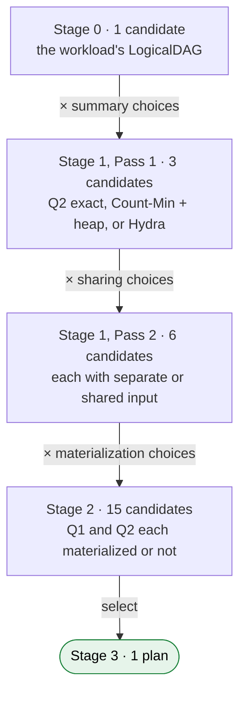

**Stage 0: 1 candidate.** The frontend lowers both queries into one workload
`LogicalDAG` with no summaries:

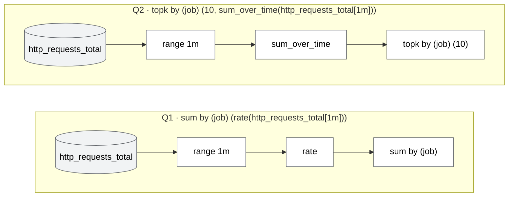

**Stage 1, Pass 1: 3 candidates.** Pass 1 finds local options for each query:

* **Q1** has one option, the exact per-series rate and per-`job` sum. Its
  accuracy requirement is `implicit_exact`, and an exact grouped sum is
  already small.
* **Q2** has three options. The exact one keeps a per-series sum and sorts
  within each `job`, which is costly at one million Zipf-distributed series.
  The `EpsilonDelta` target also admits a **Count-Min Sketch with a top-*k*
  heap per `job`**, and **Hydra over the whole `job` column**, where one sketch
  covers every (`job`, series) key.

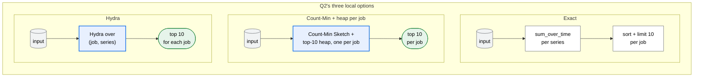

Combining them gives 1 × 3 = 3 workload candidates:

| Candidate | Q1 | Q2 |
|---|---|---|
| L1 | exact | exact |
| L2 | exact | Count-Min + heap |
| L3 | exact | Hydra |

**Stage 1, Pass 2: 6 candidates.** Both queries read the same range selector,
`http_requests_total[1m]`, so the identical-expression rule adds, for each of
L1–L3, a variant in which Q1 and Q2 share one input node: L1s, L2s and L3s. The
originals are kept. No summary is shared, because Q1 must be exact and no
summary supports both queries.

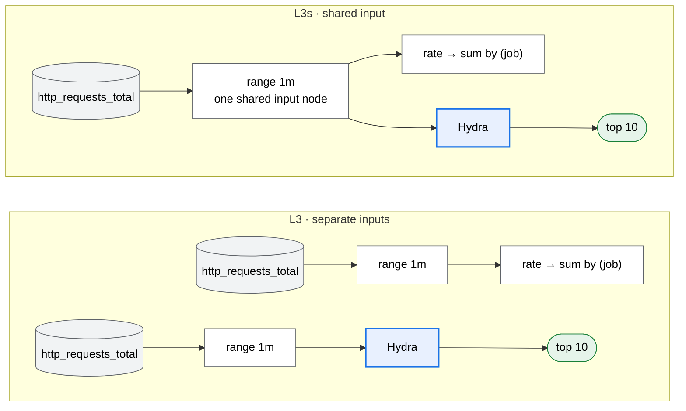

**Stage 2: 15 candidates.** For every logical candidate, stage 2 decides
separately for Q1 and Q2 whether to materialize the computation at ingestion
time or recompute it from raw samples at every refresh:

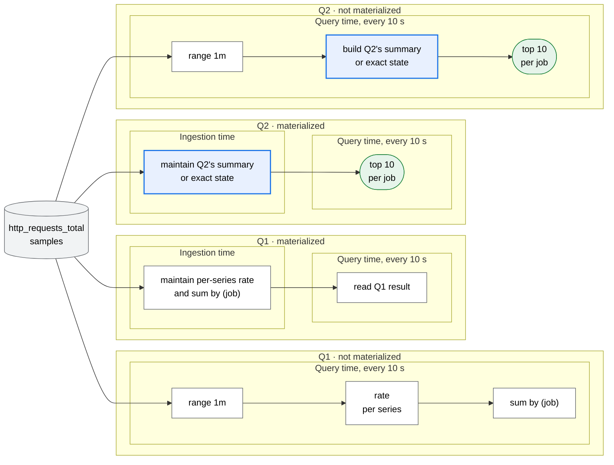

That gives 2 × 2 = 4 materialization choices per logical candidate. A shared
input node only matters when both queries read raw samples at query time; in
the other three choices, the shared-input variant is the same plan as its
original. So each Q2 option yields 5 distinct physical candidates, 15 in all:

| Q2 option (logical candidates) | Q1 mat., Q2 mat. | Q1 mat., Q2 not | Q1 not, Q2 mat. | Q1 not, Q2 not, separate inputs | Q1 not, Q2 not, shared input |
|---|---|---|---|---|---|
| Exact (L1, L1s) | P1 | P2 | P3 | P4 | P5 |
| Count-Min + heap (L2, L2s) | P6 | P7 | P8 | P9 | P10 |
| Hydra (L3, L3s) | P11 | P12 | P13 | P14 | P15 |

**Stage 3: 1 plan.** Selection first rejects invalid candidates. The
deployment's accuracy model checks the summary candidates against ε = 0.01,
δ = 0.001, and its cost model estimates Q2's latency against the 100 ms bound;
for example, an exact top-k sorted over one million series at query time (P2,
P4, P5) may miss it. Among the rest, it picks the cheapest for the whole
workload. Because both panels refresh every 10 s over arriving data, a
candidate that materializes both queries usually wins: with many small jobs,
P11 (Hydra); with a few large jobs, P6 (Count-Min per `job`). The
not-materialized candidates win only when storage is expensive and raw data is
available at query time.

### Example 2: One summary for several computations — the summary-capability rule in Pass 2

**Query workload.** A network-monitoring dashboard computes three statistics of
source IPs over the last minute.

| Workload field | Value (all three queries) |
|---|---|
| `language` | `sql` (`datafusion_sql`) |
| Entry type | `repeating_queries` |
| `demand` | every 10 s (`fixed_interval`) |
| `predictability` | `predictable` |
| `time_selection.scope` | `real_time` |
| `as_of` | evaluation time |
| Latency requirement | unspecified |

```sql
-- Q1: Distinct(src_ip)
SELECT COUNT(DISTINCT src_ip)
FROM flows
WHERE ts >= now() - INTERVAL '1 minute';

-- Q2: Entropy(src_ip)
SELECT -SUM(p * LN(p))
FROM (
  SELECT COUNT(*) * 1.0 / SUM(COUNT(*)) OVER () AS p
  FROM flows
  WHERE ts >= now() - INTERVAL '1 minute'
  GROUP BY src_ip
);

-- Q3: L2(src_ip)
SELECT SQRT(SUM(c * c))
FROM (
  SELECT src_ip, COUNT(*) AS c
  FROM flows
  WHERE ts >= now() - INTERVAL '1 minute'
  GROUP BY src_ip
);
```

| Query | Computation | `lookback` | Accuracy requirement |
|---|---|---|---|
| Q1 | `Distinct(src_ip)` | 1 m | ε = 0.02, δ = 0.01 |
| Q2 | `Entropy(src_ip)` | 1 m | ε = 0.05, δ = 0.01 |
| Q3 | `L2(src_ip)` | 1 m | ε = 0.01, δ = 0.01 |

The data workload differs from the shared one in two fields:

| `DataWorkload` field | Value |
|---|---|
| `input_cardinality` | 10,000,000 distinct source IPs |
| `data_ingestion_interval` | not needed for SQL |

**Pass 1.** Rewrite rules recognize the three computations, and each gets its
local candidates from the Pass 1 table: exact, a specialized summary, or
UnivMon. Combined, that is 3 × 3 × 3 = 27 workload candidates.

**Pass 2.** All three computations have the same summary input data (`src_ip`
from `flows`, no other filter) and the same 1-min window. UnivMon supports all three
estimates, so the summary-capability rule adds a shared candidate: **one
UnivMon build node feeding three estimation nodes**. It must be sized for the strictest
requirement, ε = 0.01. The independent candidates are kept as well. Pass 2
also adds candidates where only two of the three share a UnivMon and the third
keeps any of its own 3 options (3 pairs × 3 = 9), so stage 1 outputs
27 + 1 + 9 = 37 candidates. The figure shows the all-three case.

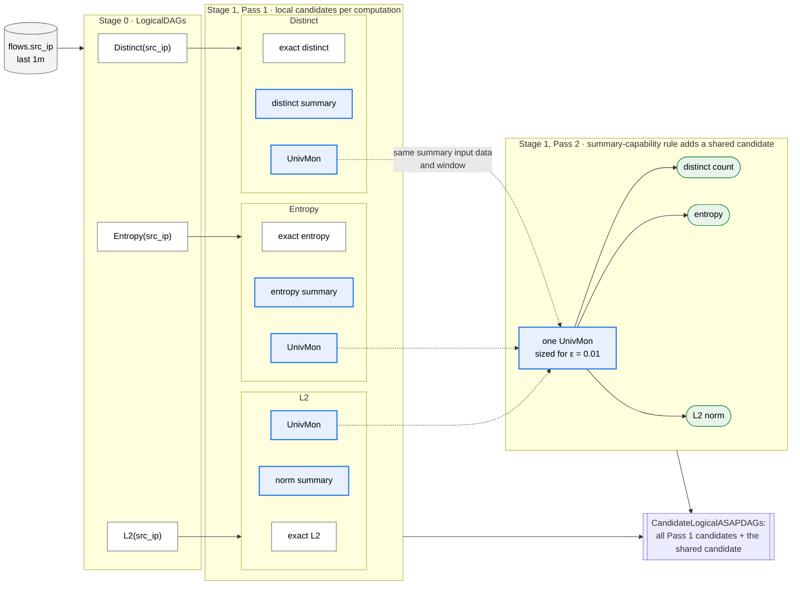

The three UnivMon options from Pass 1 (dashed arrows) are merged by Pass 2 into
one shared UnivMon. The independent candidates are kept, so stage 1 outputs
both.

**Stage 3.** Selection compares one UnivMon sized for ε = 0.01 against three
separate summaries, each sized for its own requirement. The shared candidate
usually wins because each flow record updates one summary instead of three.

### Example 3: Aggregation over windows — the window-composition rule in Pass 2

This example has two workload patterns that both lead to a shared window
summary.

**Pattern A: a batch of sub-interval queries over historical data.** An analyst
submits a batch of p99 latency reports over different historical intervals,
all executed together at time T.

| Workload field | Value (all five queries) |
|---|---|
| `language` | `promql` |
| Entry type | `query_batch` |
| `invocations` | 1 |
| `execute_at` | T |
| `predictability` | `ad_hoc` |
| `time_selection.scope` | `longitudinal` |
| Accuracy requirement | ε = 0.005, δ = 0.01 |
| Latency requirement | unspecified |

| Query | `lookback` | `as_of` |
|---|---|---|
| `quantile_over_time(0.99, latency_ms[5y])` | 5 y | T |
| `quantile_over_time(0.99, latency_ms[1y])` | 1 y | T |
| `quantile_over_time(0.99, latency_ms[1y] offset 1y)` | 1 y | T − 1 y |
| `quantile_over_time(0.99, latency_ms[1y] offset 2y)` | 1 y | T − 2 y |
| `quantile_over_time(0.99, latency_ms[3y] offset 2y)` | 3 y | T − 2 y |

The data workload is the shared one, except `arrival` is `mixed`: five years
of data at rest, plus data still arriving.

* **Pass 1.** Each `quantile_over_time` gets an exact candidate and a KLL over
  its own interval: five independent KLL candidates over overlapping data.
* **Pass 2.** Every interval is a sub-interval of [T − 5 y, T], and KLL is
  mergeable. The window-composition rule adds a shared candidate: **one
  Exponential Histogram of KLL buckets over [T − 5 y, T]**, with one
  merge and estimation node per query that merges the buckets covering
  its interval. The independent candidates are kept.

Counted at the workload level, Pass 1 gives each query 2 options (exact or
KLL), so 2⁵ = 32 candidates. Pass 2 adds a candidate for every subset of two
or more queries that shares one Exponential Histogram while the others keep
their own options, 131 more, for 163 in total. Counts like this are why
candidate sets may be enumerated lazily.

The five query intervals overlap, and all lie inside the last five years:

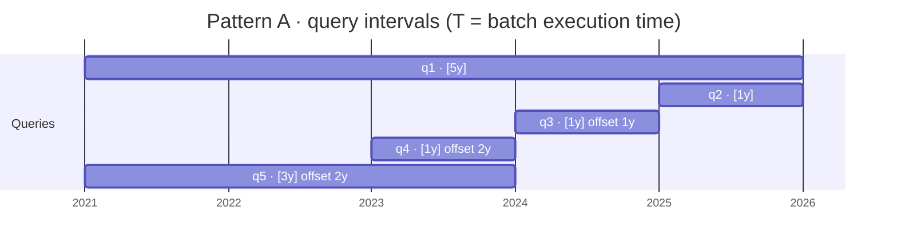

The shared candidate replaces five KLL sketches with one Exponential Histogram
and a merge and estimation node per query:

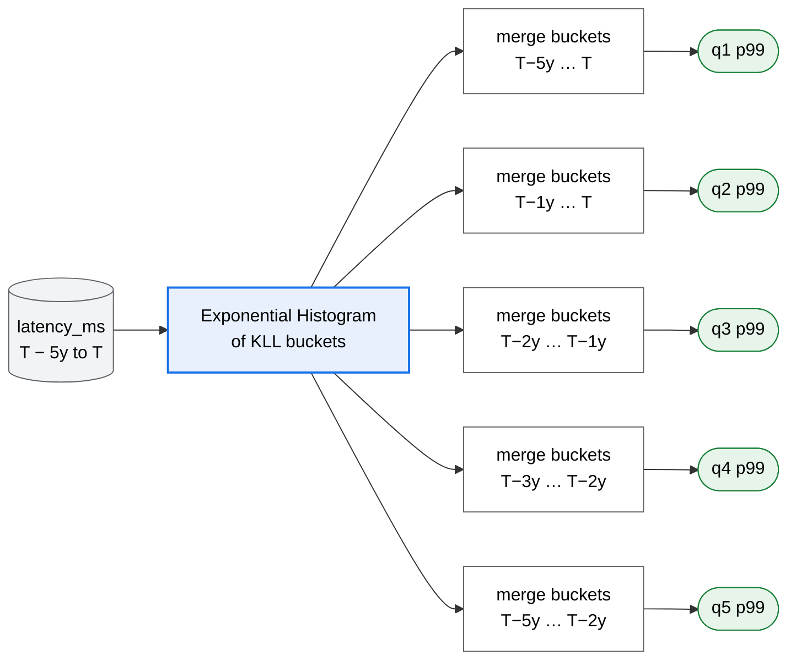

**Pattern B: one repeating query over a sliding window.** A real-time p99 panel
over the last 5 min, refreshed every minute.

| Workload field | Value |
|---|---|
| `language` | `promql` |
| Entry type | `repeating_queries` |
| `demand` | every 1 min (`fixed_interval`) |
| `predictability` | `predictable` |
| `time_selection.scope` | `real_time` |

| Query | `lookback` | `as_of` | Accuracy requirement | Latency requirement |
|---|---|---|---|---|
| `quantile_over_time(0.99, latency_ms[5m])` | 5 m | evaluation time | ε = 0.01, δ = 0.01 | ≤ 200 ms |

* **Pass 1.** One KLL over 5 min for each evaluation.
* **Pass 2.** Consecutive evaluations overlap by 4 of their 5 minutes. The
  window-composition rule adds a shared candidate: **a sliding window of
  1-min KLL panes**, where each evaluation merges the latest 5 panes. With the
  exact candidate, stage 1 outputs 3 candidates.

Each evaluation reads five 1-min panes, and consecutive evaluations share
four of them:

```mermaid
gantt
  title Pattern B · 1-min KLL panes and 5-min evaluations
  dateFormat HH:mm
  axisFormat %H:%M
  section KLL panes
  pane 1 :p1, 00:00, 1m
  pane 2 :p2, 00:01, 1m
  pane 3 :p3, 00:02, 1m
  pane 4 :p4, 00:03, 1m
  pane 5 :p5, 00:04, 1m
  pane 6 :p6, 00:05, 1m
  pane 7 :p7, 00:06, 1m
  section Evaluations
  eval at 00:05 (panes 1–5) :e1, 00:00, 5m
  eval at 00:06 (panes 2–6) :e2, 00:01, 5m
  eval at 00:07 (panes 3–7) :e3, 00:02, 5m
```

Example 4 shows how stage 2 decides whether to store these window summaries.

### Example 4: Materialization of window summaries in physical planning

Stage 2 takes the shared window summaries from Example 3 and decides whether to
materialize them. This example shows only the physical candidates of the
shared logical candidate; every other logical candidate from Example 3 gets
its own physical candidates the same way. That choice is driven by the workload's `recurrence`,
`predictability` and `data_workload.arrival`.

**Pattern A (sub-interval batch).**

| Candidate | Materialized | When the Exponential Histogram is built |
|---|---|---|
| A1 | The Exponential Histogram, at query time | At query time, when the batch runs at T; read by all five queries, then discarded |
| A2 | The Exponential Histogram, at ingestion time | At ingestion time, with each new sample; old data backfilled once |

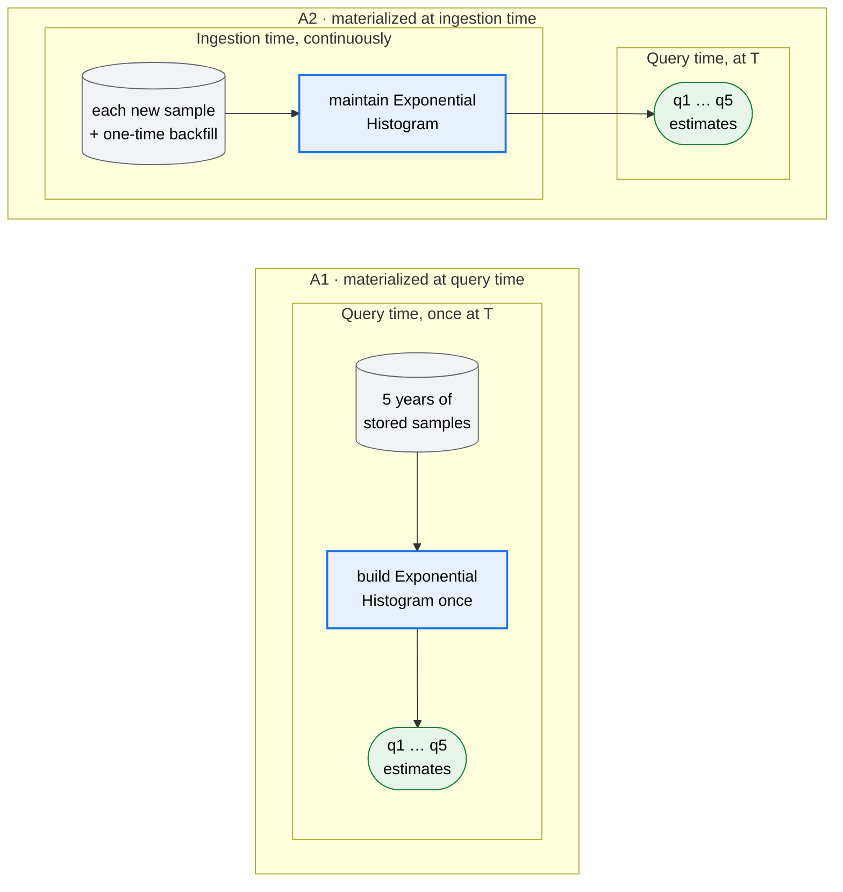

Which candidate wins depends on the workload:

* **As given** (`invocations: 1`, `ad_hoc`): selection picks A1. A2 would
  maintain the histogram for years only to serve one batch.
* **Repeated monthly and `Predictable { known_at }`:** A2 can win, because its
  maintenance cost is shared by many batches.
* **Data `"at_rest"`:** A2 is not generated, because there is no ingestion to
  maintain the histogram.

**Pattern B (sliding window, repeating).**

| Candidate | Materialized | At ingestion time | At query time |
|---|---|---|---|
| B1 | 1-min KLL panes, retained 5 min | Build one KLL pane per minute | Merge the latest 5 panes, read p99 |
| B2 | Nothing | Nothing | Read 5 min of raw samples, build one KLL, read p99 |

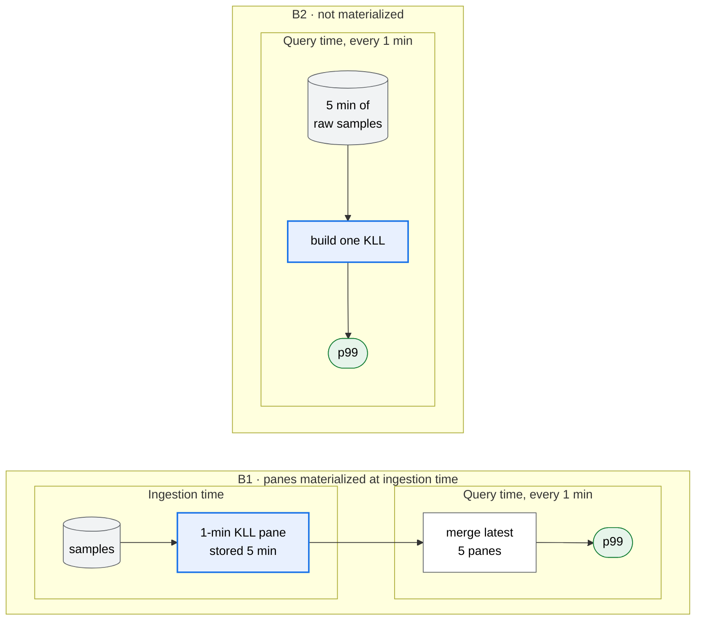

The query repeats every minute and the data is continuously ingesting, so B1
builds each pane once and reuses it in five evaluations, while B2 rescans raw
data every time. Selection usually picks B1. B2 wins only if storage is
expensive and raw data is available at query time.

**What this shows.** The same logical candidate (one shared Exponential
Histogram, or a sliding window of KLL panes) yields different physical plans depending
only on recurrence, predictability and data arrival. This is why window-summary
replacement happens in logical planning, while materialization is decided
separately in physical planning.
