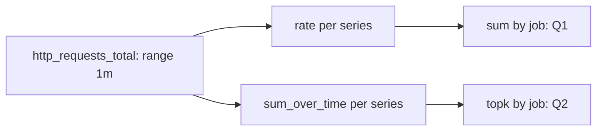
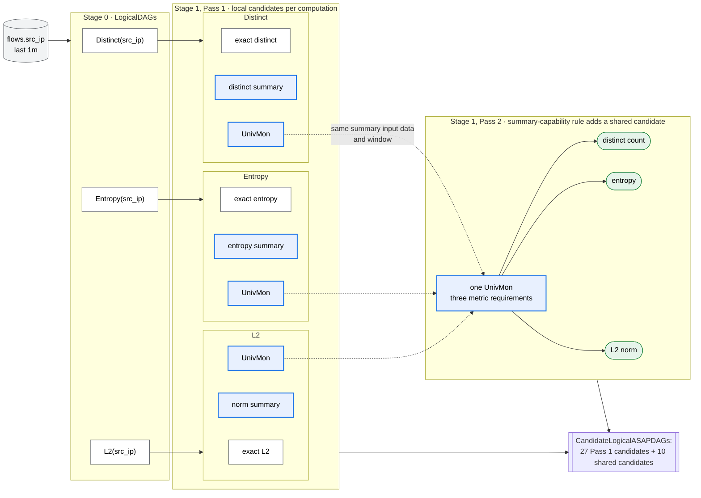
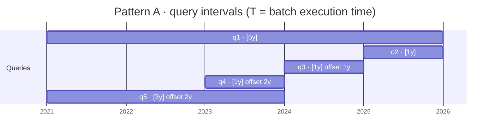
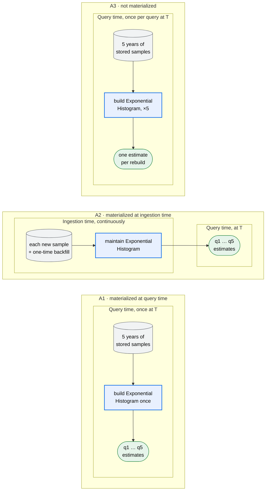

# ASAPPlanner Planning Stages Design

Status: proposal. Audience: designers and developers of ASAPPlanner and of deployments such
as ASAPQuery-backend.

## Goal

ASAPPlanner takes a [query workload](https://github.com/ProjectASAP/ASAPPlanner/blob/main/crates/types/src/workload.rs), a [data workload](https://github.com/ProjectASAP/ASAPPlanner/blob/main/crates/types/src/workload.rs#L531) and the deployment's
inputs (concrete deployment-input types remain a follow-up), and returns the
lowest-cost feasible physical plan within the explored search space, or an
explanation that no candidate qualifies. It decides what is computed, how
it is computed, and which plan is best. The deployment supplies cost/accuracy models and capabilities, then executes the
selected plan. Planning and selection remain inside ASAPPlanner.

## Stages

In the diagram, × means the Cartesian product: each stage combines every option along one dimension with every option along the others.

```text
 Query workload
   (PromQL / SQL / MetricsQL,
    query recurrence,
    accuracy requirements,
    latency requirements)

 + Data workload
   (streaming vs. data at rest,
    data distribution,
    cardinality)

 + Deployment inputs
   (cost model,
    accuracy model,
    deployment capabilities)
                         │
                         ▼
┌────────────────────────────── ASAPPlanner ──────────────────────────────┐
│                                                                        │
│ 0. Language-specific frontends                                         │
│    Parse and convert source-language queries into a common logical     │
│    representation. Reject unsupported query expressions.               │
│                                                                        │
│    Output: CandidateLogicalDAGs                                        │
│                                                                        │
│                         │                                              │
│                         ▼                                              │
│ Logical planning — what to compute                                     │
│                                                                        │
│ 1. Logical ASAP-aware optimization                                     │
│    Explore semantically equivalent and legal logical candidates:       │
│                                                                        │
│      summary families                                                  │
│      × query rewrites                                                  │
│      × sharing one summary across multiple computations                │
│                                                                        │
│    Output: CandidateLogicalASAPDAGs                                    │
│                                                                        │
│                         │                                              │
│                         ▼                                              │
│ Physical planning — how to compute                                     │
│                                                                        │
│ 2. Physical ASAP-aware optimization                                    │
│    Explore executable implementations of each logical candidate:       │
│                                                                        │
│      materialization decisions                                         │
│      × physical operator implementations                               │
│      × parallelism and partitioning                                    │
│      × resource management                                             │
│                                                                        │
│    Output: CandidatePhysicalASAPDAGs                                   │
│                                                                        │
│                         │                                              │
│                         ▼                                              │
│ 3. Plan selection                                                      │
│    Evaluate complete physical candidates using the deployment's        │
│    empirical cost and accuracy models. Reject candidates that violate  │
│    accuracy, latency, or capability constraints.                       │
│                                                                        │
│    Choose the cheapest valid plan for the whole workload.              │
│                                                                        │
└────────────────────────────────┬───────────────────────────────────────┘
                                 │
                                 ▼
                    one selected PhysicalASAPDAG
                                 │
                                 ▼
┌────────────────────────────── Deployment ───────────────────────────────┐
│                                                                        │
│ 4. Execution                                                           │
│   deployment executes the selected DAG (plan).                         │
│                                                                        │
└────────────────────────────────────────────────────────────────────────┘
```

The planner receives three groups of inputs:

| Input | Contents |
|---|---|
| Query workload | Source-language expressions, recurrence, predictability, time selection, accuracy requirements, and latency requirements |
| Data workload | Data arrival pattern, sampling cadence, ingestion volume and rate, cardinality, and distribution |
| Deployment inputs | Empirical cost model, empirical accuracy model, and execution capabilities |

## Stages and their decisions

Stages 0–2 retain alternatives generated by the supported rewrite rules and
parameter domains; stage 3 selects a plan. This is not enumeration of every
possible equivalent program. Candidate sets may be represented lazily. Early
rejection requires a structural or semantic proof, such as a family lacking a
required operation; unknown empirical accuracy is deferred to selection, not
assumed acceptable. Rejections carry reasons. Valid alternatives are not removed
on estimated cost before stage 3.

Each candidate covers the **whole workload**, preserving the mapping from query
identities to their results. Alternatives combine only when their dependencies,
input contracts and evaluation contexts are compatible. Equivalent generated
candidates may be deduplicated, so counts need not grow monotonically.

| Stage | Input | Decides | Output |
|---|---|---|---|
| 0. Frontends | `query`, `language` | Parse and lower to a common logical form; reject what cannot be represented | `CandidateLogicalDAGs` |
| 1. Logical ASAP-aware optimization | Logical DAGs; accuracy requirements, `time_selection`, repetition interval | Summary replacement (Pass 1); ASAP-aware CSE (Pass 2) | `CandidateLogicalASAPDAGs` |
| 2. Physical ASAP-aware optimization | Logical ASAP DAGs; `recurrence`, `predictability`, `DataWorkload` | Materialization; physical operators; parallelism and resources (TODO) | `CandidatePhysicalASAPDAGs` |
| 3. Plan selection | Physical candidates; `requirements`; cost model, accuracy model, capabilities | Reject invalid candidates; pick the cheapest plan for the whole workload | One `PhysicalASAPDAG`, or no feasible candidate with reasons |
| 4. Execution (deployment) | The selected `PhysicalASAPDAG` | Run ingestion, storage and query-time computation | Query results |

### Proposed stage interfaces

These are design contracts, not new Rust API declarations. The stage names below
refer to sets of workload plans; they do not require separate operator enums.
Use the common `OperatorNode` / `Operator` / `ScalarExpr` model proposed in
[#511](https://github.com/ProjectASAP/ASAPPlanner/pull/511). That proposal owns node
structure and validation; this one owns planning responsibilities.

| Interface value | Required contents and invariant |
|---|---|
| `CandidateLogicalDAGs` | Resolved ordinary operator graphs and scalar expressions; a result binding for every workload query; source-language evaluation contexts, schemas and requirements. No ASAP choices. |
| `CandidateLogicalASAPDAGs` | The same query bindings, plus summary families, update/readout semantics, window composition and logical sharing. Retain each consumer's accuracy requirement and any remaining family-parameter alternatives; execution timing may be unassigned. |
| `CandidatePhysicalASAPDAGs` | Concrete implementations and summary parameters; assigned execution timing; materialization lifetimes, startup/backfill and raw-data dependencies. Each graph is structurally executable subject to deployment validation; empirical accuracy, latency and capability feasibility are checked at selection. |
| Selection result | One complete `PhysicalASAPDAG` with its evaluated cost and per-query feasibility evidence, or a no-feasible-candidate outcome with rejection reasons. Unknown required accuracy/capability evidence is not success. |

Logical planning chooses a family and its semantic parameters (such as requested
quantile). Physical planning enumerates concrete size/precision configurations
within the supported parameter domain. Selection evaluates those configurations
with deployment models; it does not silently resize a selected plan. A search
limit must be reported: the result is optimal only among the explored candidates.
Concrete containers, deployment-model signatures and diagnostic types remain TODO.

### 0. Language-specific frontends

The frontend lowers each query and assembles workload `LogicalDAG` candidates.
Nodes represent selectors, transformations, aggregations, grouping and windows,
without ASAP choices. Constructs that cannot be represented faithfully are rejected.

The frontend preserves source-language behavior, including series identity,
evaluation timing and missing-data semantics.

### 1. Logical ASAP-aware optimization

Logical optimization runs in two passes. Pass 1 generates candidates for each
computation on its own; Pass 2 finds candidates that share computation across
sub-DAGs and queries. Physical planning assigns materialization and execution timing.

#### Pass 1: Local candidate generation

For each eligible sub-DAG, Pass 1 identifies its computation semantics, applies
registered rewrite rules, and retains alternatives whose semantic contracts
are established and whose accuracy is not provably infeasible.

Illustrative families, admitted only with registered semantic contracts:

| Original computation | Local candidates |
|---|---|
| `Sum(x) by (g)` | Exact grouped sum |
| `TopK(k, x) by (g)` | Exact sort and limit per group, Count-Min Sketch with a top-*k* heap per group, Hydra over all groups |
| `Distinct(x)` | Exact distinct, a specialized distinct summary, UnivMon |
| `Entropy(x)` | Exact entropy, a specialized entropy summary, UnivMon |
| `L2(x)` | Exact L2 norm, a specialized norm summary, UnivMon |
| `Quantile(x, window)` | Exact quantile, KLL over the requested window |

Each candidate records its input expression, filter, grouping, window,
supported estimates and accuracy requirement. Pass 2 uses these to decide
whether candidates can share a summary node.

Summary-based candidates distinguish these operations:

* A **summary build node** builds and maintains a summary from input data, for
  example a KLL sketch over `latency_ms`.
* A **summary merge node** combines summaries into one, for example merging
  five 1-min tumbling-window KLLs into one 5-min KLL, or merging lower-level
  summaries into a coarser one.
* A **summary estimation node** computes an answer from a summary, for example
  the p99 estimate from a KLL, or the entropy estimate from a UnivMon.
* **Summary subtract** and **summary delete** remain TODO. Merge is also a
  capability-gated operation: #511 reserves its payload pending a complete
  family-specific contract; the examples here do not establish runtime support.

#### Pass 2: ASAP-aware common-subexpression elimination

ASAP-aware CSE adds summary-capability and window-composition rules to
identical-expression reuse. Reuse must preserve evaluation context, volatility,
series identity and missing-data behavior, not merely match expression text.

The rules compare computations by their **summary input data**: what a summary for
that computation would ingest, namely the data source, the filters, and the key
or value being summarized together with its grouping. The summary input data does
not include the window; the window-composition rule compares windows
separately.

A **window** is the time range read by one query evaluation. A **window summary**
organizes state across windows so overlapping evaluations can reuse work:

| Window organization | Update and readout | Required contract |
|---|---|---|
| Sliding | Keep one summary per active window; update every window containing an arriving sample. Read the completed window without merging. A 5-min window refreshed every minute has 5 active summaries. | Valid per-window updates and bounded state lifetime; mergeability is unnecessary. |
| Tumbling | Keep nonoverlapping fixed-length buckets; merge those covering each query window. A 5-min window refreshed every minute can merge 5 one-minute buckets. | Merge semantics for the complete state. Bucket width divides window length and refresh interval, and bucket origin aligns with evaluation boundaries. |
| Exponential Histogram (EH) | Keep nonoverlapping buckets of varying size, merging adjacent buckets as they age; read an interval from its covering buckets. | A defined boundary-bucket rule and error bound, including both boundaries of historical intervals. Coarser old buckets may include data outside the requested interval. |

The EH+KLL case is conditional: KLL mergeability alone does not bound interval
boundary error. Missing boundary semantics must be defined before candidate
generation; empirical accuracy assessment cannot supply an undefined operation.

| ASAP-aware CSE rule | Sharing condition | Shared computation |
|---|---|---|
| Identical-expression rule | The input and computation semantics are identical. | One common computation node serving multiple consumers. |
| Summary-capability rule | The computations have the same summary input data and the same window, and one summary supports all requested computations and their accuracy requirements. | One summary build node feeding several estimation nodes, e.g. UnivMon → distinct count, entropy, L2 norm. |
| Window-composition rule | The computations have the same summary input data, and one window summary can answer the requested windows within their accuracy requirements. | One window summary feeding per-query merge (where needed) and estimation nodes, e.g. a sliding-window or tumbling-window KLL, or an Exponential Histogram with a KLL per EH bucket. |

Examples 2 and 3 illustrate summary-capability and window-composition sharing.
A shared configuration must satisfy **each** consumer's metric and confidence
requirement; ε values for different statistics cannot be ordered as one common
precision target. A second quantile may reuse a KLL if the existing configuration
meets its requirement, but its estimation work still contributes to cost.
Sharing adds alternatives; independent plans remain available to selection.

### 2. Physical ASAP-aware optimization

Physical optimization turns each logical candidate into executable candidates.
It makes two ASAP-specific decisions, described below. Parallelism, partitioning
and resource management are TODO.

#### Materialization

Materialization records which intermediate outputs are retained, their lifetime,
and when they are computed:

| Choice | Computation and reuse |
|---|---|
| Ingestion-time materialization | Build/update as data arrives; keep output for later query evaluations. |
| Query-time materialization | Build when first needed; retain for other consumers in the batch or subsequent evaluations. |
| No materialization | Execute at query time without a retained result for later reuse. A producer may still feed multiple consumers during that execution. |

Logical producer identity exposes possible reuse; it does not force storage.
Physical planning may duplicate a producer only when repeated evaluation preserves
semantics, including volatility and randomized-summary guarantees. Such copies
are explicit in the physical graph and are costed separately. A producer executed
once is costed once with all consumer demand. Example 4 contrasts these choices.

Retain output until its last planned consumer has finished. An ingestion-time node
cannot depend on query-time work; its upstream computation must be available in
the ingestion phase. Every retained-state plan specifies initialization/backfill,
retention, and the handling of missed evaluations or late data. Incremental costs
in the examples describe steady state after initialization. Ingestion-time
maintenance requires data arrival and sufficient advance notice; an ad hoc query
cannot assume that years of maintenance have already occurred.

#### Physical operator implementation

Physical operator implementation lowers every node to physical operators, for
example choosing a sorting implementation for an exact top-k plan or a backend
implementation for each KLL build, merge and readout. Logical build/merge/readout
semantics are already explicit; physical lowering implements those operations.

### 3. Plan selection

Selection rejects every candidate that misses an accuracy target or a latency
bound, or that needs a capability the deployment lacks, and then picks the
cheapest remaining plan. It is the only stage that uses the deployment's cost
and accuracy models, and the only stage that discards valid candidates. Its
accuracy evidence must use the requested metric;
a nominal family bound or an empirical point estimate alone is not a confidence
guarantee. Cost is evaluated for the whole workload rather than per query,
which is what lets one shared summary beat several cheaper independent ones:
a physically shared summary is costed once, with the demand of all its consumers.
Cost includes startup/backfill, maintenance, storage and query execution over the
workload horizon. If no candidate satisfies every requirement, return reasons
rather than a best-effort plan that violates the workload contract.

### 4. Execution

Execution runs outside ASAPPlanner. The deployment runs the selected plan as
given: it does not choose among summaries or decide what to materialize.

## End-to-end examples

Field names in code font refer to
[`workload.rs`](../../../crates/types/src/workload.rs). `TimeSelection.lookback`
is the window length and `as_of` its end; `as_of: None` uses the evaluation time.
Endpoint inclusion follows the source language: PromQL ranges use
`(as_of − lookback, as_of]`; SQL follows its predicates. PromQL `1y` is 365 days,
not a calendar year. The diagrams use years only as schematic labels.

The examples reuse `AccuracyTarget::EpsilonDelta` and existing
[`ErrorMetric` / `ResultGuarantee`](../../../crates/types/src/post_asap/guarantee.rs).
Each target needs its result's metric, normalization and failure-probability scope:

| Result | Metric used in these examples |
|---|---|
| Quantile | `Rank`: normalized rank error, not error in the returned latency value. |
| Distinct count | `Cardinality`: relative count error. |
| Entropy | `AbsoluteValue`: absolute error in nats, matching `LN`. |
| L2 norm | `RelativeValue`: relative norm error; the model must cover the zero case. |
| Top-k | A per-key `Frequency` bound does not establish `TopKMembership`. Selection needs membership evidence as well as score bounds, or a separately specified approximate-membership contract. |

Here δ applies per query result per evaluation; simultaneous guarantees across
queries or time require an explicit joint failure budget. No independence is
assumed for shared summaries. A model must cover update, merge, boundary selection
and readout errors before a candidate is selectable.

| Example | Shows |
|---|---|
| 1. A workload through every stage | Candidate generation, physical alternatives and selection |
| 2. One summary for several computations | Pass 2: summary-capability rule |
| 3. Aggregation over windows | Pass 1 and Pass 2: window-composition rule |
| 4. Materialization of window summaries | Stage 2: materialization, decoupled from stage 1 |

In the colored diagrams, grey cylinders are inputs, blue boxes build summaries,
and green nodes read estimates. White merge nodes do not imply exact estimates;
readout guarantees include the merge contract.

### Shared data workload

Unless an example says otherwise, every example uses this data workload:

| `DataWorkload` field | Meaning | Value |
|---|---|---|
| `arrival` | Whether the data is at rest, still arriving, or both | `continuously_ingesting` |
| `data_ingestion_interval` | Sampling cadence, analogous to the Prometheus scrape interval; distinct from instant-selector lookback. | 15 s |
| `ingestion_volume` | Total amount of ingested data | unknown |
| `ingestion_rate` | Samples arriving per second across all series | about 66,667 samples/s |
| `input_cardinality` | Number of distinct series (or keys) | 1,000,000 series |
| `distribution` | How samples are spread over keys | `zipf` |

With 1,000,000 series each sampled every 15 s, the ingestion rate is
1,000,000 / 15 ≈ 66,667 samples/s. Instant-selector lookback is a separate
query setting (Prometheus defaults to 5 min), not derived from that cadence.
See the [Prometheus selector semantics](https://prometheus.io/docs/prometheus/latest/querying/basics/#staleness).

### Example 1: A workload through every stage

Two PromQL panels refresh every 10 s over the same 1-min input range:

| Query | Accuracy requirement | Latency requirement |
|---|---|---|
| Q1: `sum by (job) (rate(http_requests_total[1m]))` | Exact | None |
| Q2: `topk by (job) (10, sum_over_time(http_requests_total[1m]))` | Score ε = 0.01, δ = 0.001 under `Frequency`, plus `TopKMembership` evidence | ≤ 100 ms |

Assume nonnegative finite float samples for Q2. Its sum ranks sampled counter
values; it is not a request-rate ranking. Retain the complete series labels.
The membership requirement is additional to score error; unknown membership
evidence prevents selection of a sketch plan.

**Stage 0.** One workload graph contains both query results:



The common input is a possible sharing point, shown once for readability;
frontend lowering need not perform CSE.

**Stage 1, Pass 1.** Q1 keeps its exact evaluation. Q2 has an exact sort/limit
option and possible Count-Min+heap or Hydra alternatives. The sketch alternatives
require registered update/readout contracts for these weighted series values and
membership evidence at selection. Family names alone do not qualify a rewrite.
If all three alternatives have semantic contracts, there are initially
`1 × 3 = 3` workload candidates, not three selected plans.

**Stage 1, Pass 2.** Add an alternative sharing the raw range input. Window
composition adds further alternatives only for operations with valid update and
merge contracts. Q1 stays on raw samples in this example:
[`rate()`](https://prometheus.io/docs/prometheus/latest/querying/functions/#rate)
handles counter resets and extrapolation at the full window boundaries; six
10-s rates cannot simply be merged into one 1-min rate. A future exact-state
rewrite must retain enough ordered boundary/reset information and prove the same
result before becoming an alternative.

For Q2, compare a direct 1-min computation with active sliding windows or aligned
10-s tumbling windows. A mergeable frequency sketch does not automatically make
its candidate-key heap mergeable or preserve top-k membership. A tumbling option
requires a contract for the complete state and readout, including labels, absent
series and numerical behavior. Undefined merges are excluded; empirical accuracy
assessment is not a substitute for defined semantics.

**Stage 2.** Each admitted Q2 window form has these physical alternatives:

| Logical form | Physical alternatives |
|---|---|
| Direct 1-min computation | Rebuild at each refresh; no cross-refresh state reuse. |
| Active sliding windows | Retain and update at ingestion time, or at query time from newly available raw samples. |
| Aligned tumbling windows | Retain at ingestion time, retain at query time, or rebuild the required buckets per evaluation. |

If all forms qualify, that is `1 + 2 + 3 = 6` options for a Q2 family before
combining with input-sharing and parameter choices. This is illustrative
branching, not a fixed total: shared inputs must have compatible evaluation times,
phases and fetched intervals, and duplicate physical plans count once.

**Stage 3.** Evaluate each complete workload plan. Reject Q2 candidates without
both score and membership evidence or exceeding 100 ms. Compare total costs of
the remaining raw, maintained and rebuilt variants; Q1's exact computation remains
part of every cost. Return the cheapest qualifying plan, or the no-feasible-plan
outcome. No winner is implied without deployment model results.

### Example 2: One summary for several computations — the summary-capability rule in Pass 2

**Query workload.** A network-monitoring dashboard computes three statistics of
source IPs over the last minute.

```sql
-- Q1: Distinct(src_ip)
SELECT COUNT(DISTINCT src_ip)
FROM flows
WHERE ts > now() - INTERVAL '1 minute' AND ts <= now();

-- Q2: Entropy(src_ip)
SELECT -SUM(p * LN(p))
FROM (
  SELECT COUNT(*) * 1.0 / SUM(COUNT(*)) OVER () AS p
  FROM flows
  WHERE ts > now() - INTERVAL '1 minute' AND ts <= now()
  GROUP BY src_ip
);

-- Q3: L2(src_ip)
SELECT SQRT(SUM(c * c))
FROM (
  SELECT src_ip, COUNT(*) AS c
  FROM flows
  WHERE ts > now() - INTERVAL '1 minute' AND ts <= now()
  GROUP BY src_ip
);
```

| Query | Computation | Repeats | `lookback` | `as_of` | Accuracy requirement |
|---|---|---|---|---|---|
| Q1 | `Distinct(src_ip)` | every 10 s | 1 m | evaluation time | ε = 0.02, δ = 0.01 |
| Q2 | `Entropy(src_ip)` | every 10 s | 1 m | evaluation time | ε = 0.05, δ = 0.01 |
| Q3 | `L2(src_ip)` | every 10 s | 1 m | evaluation time | ε = 0.01, δ = 0.01 |

The data workload differs from the shared one in two fields:

| `DataWorkload` field | Value |
|---|---|
| `input_cardinality` | 10,000,000 distinct source IPs |
| `data_ingestion_interval` | not needed for SQL |

Assume non-null `src_ip`, a nonempty window and arithmetic that does not overflow.
All queries use the same bound evaluation time. Empty-input and NULL cases require
their own semantics-preserving lowering; this example does not infer them.

**Pass 1.** Given registered contracts for these computations, each gets its
local candidates from the Pass 1 table: exact, a specialized summary, or
UnivMon. Combined, that is 3 × 3 × 3 = 27 workload candidates.

**Pass 2.** All three computations have the same summary input data (`src_ip`
from `flows`, no other filter) and the same 1-min window. UnivMon supports all three
estimates, so the summary-capability rule adds a shared candidate: **one
UnivMon build node feeding three estimation nodes**. Physical configuration must
satisfy cardinality, entropy and L2 requirements separately; choosing the smallest
ε is not sufficient. Pass 2 also adds candidates where two queries share a
UnivMon and the third keeps any of its own 3 options (3 pairs × 3 = 9), so stage 1 outputs
27 + 1 + 9 = 37 structural candidates, before parameter choices and feasibility
assessment, assuming all illustrated contracts are available. The figure shows
the all-three case; window alternatives are omitted to isolate this sharing rule.



**Stage 2.** Enumerate retained or rebuilt implementations as in Example 1.
Tumbling-window options require a registered merge contract, including compatible
configuration and randomness; merging state does not make estimates exact.

**Stage 3.** Compare shared configurations that meet all three requirements with
independent summaries sized for their own requirements. Updating one structure
may save work, but its required size, readout costs and maintenance determine
whether sharing wins.

### Example 3: Aggregation over windows — the window-composition rule in Pass 2

The two patterns below share window state across queries or evaluations.
`quantile_over_time` operates per series: each depicted KLL or window structure
is instantiated per series, preserving its labels; it never mixes different
series into one quantile. Assume finite float samples and nonempty windows for
the illustrated readouts.

**Pattern A: a batch of sub-interval queries over historical data.** An analyst
submits a batch of p99 latency reports over different historical intervals,
all executed together at time T.

| Workload field | Value (all five queries) |
|---|---|
| Entry type | `query_batch`, run once (`invocations: 1`) at T |
| `predictability` | `ad_hoc` |
| Accuracy requirement | ε = 0.005, δ = 0.01 |

| Query | `lookback` | `as_of` |
|---|---|---|
| `quantile_over_time(0.99, latency_ms[5y])` | 5 y | T |
| `quantile_over_time(0.99, latency_ms[1y])` | 1 y | T |
| `quantile_over_time(0.99, latency_ms[1y] offset 1y)` | 1 y | T − 1 y |
| `quantile_over_time(0.99, latency_ms[1y] offset 2y)` | 1 y | T − 2 y |
| `quantile_over_time(0.99, latency_ms[3y] offset 2y)` | 3 y | T − 2 y |

The data workload is the shared one, except `arrival` is `mixed`: five years
of data at rest, plus data still arriving.

* **Pass 1.** Each `quantile_over_time` gets an exact candidate and a KLL over
  its own interval: five independent KLL candidates over overlapping data.
* **Pass 2.** Every interval is a sub-interval of [T − 5 y, T], and KLL is
  mergeable. The window-composition rule adds a shared candidate: **one
  Exponential Histogram over [T − 5 y, T], with a KLL per EH bucket**, with one
  merge and estimation node per query that merges the EH buckets covering
  its interval. This is conditional on a defined two-boundary interval contract
  and composed rank-error bound; without them, only the aligned tumbling option
  below is justified.

Tumbling buckets of 365 days, aligned to T, cover these intervals without
boundary approximation. EH is an additional proposal for nonaligned intervals,
not an automatic consequence of KLL mergeability. Pass 1 gives each query
2 options (exact or KLL), so 2⁵ = 32 candidates, and Pass 2 adds one candidate
for each admitted grouping of two or more queries onto shared window summaries.
The total depends on admitted window contracts and parameter choices.

The five query intervals overlap, and all lie inside the last five years:



The conditional EH alternative has a merge and estimation node per query:


**Pattern B: one repeating query with overlapping windows.** A real-time p99 panel
over the last 5 min, refreshed every minute.

| Query | Repeats | `lookback` | `as_of` | Accuracy requirement | Latency requirement |
|---|---|---|---|---|---|
| `quantile_over_time(0.99, latency_ms[5m])` | every 1 min | 5 m | evaluation time | ε = 0.01, δ = 0.01 | ≤ 200 ms |

* **Pass 1.** Exact quantile or one KLL over 5 min for each evaluation.
* **Pass 2.** Consecutive evaluations overlap by 4 of their 5 minutes. The
  window-composition rule adds two shared candidates for each Pass 1 option:
  a **sliding window**, where each sample updates the 5 active 5-min windows,
  and **1-min tumbling windows**, where each evaluation merges the latest 5.
  With a valid merge contract for both exact state (for example, retaining
  samples) and KLL, this illustrates 2 × 3 = 6 structural alternatives before
  parameter choices. A compact exact-quantile accumulator is not assumed.

With 1-min tumbling windows, each evaluation merges five of them, and
consecutive evaluations share four:

```mermaid
gantt
  title Pattern B · 1-min tumbling KLL windows and 5-min evaluations
  dateFormat HH:mm
  axisFormat %H:%M
  section 1-min tumbling windows
  window 1 :p1, 00:00, 1m
  window 2 :p2, 00:01, 1m
  window 3 :p3, 00:02, 1m
  window 4 :p4, 00:03, 1m
  window 5 :p5, 00:04, 1m
  window 6 :p6, 00:05, 1m
  window 7 :p7, 00:06, 1m
  section Evaluations
  eval at 00:05 (windows 1–5) :e1, 00:00, 5m
  eval at 00:06 (windows 2–6) :e2, 00:01, 5m
  eval at 00:07 (windows 3–7) :e3, 00:02, 5m
```



Example 4 shows how stage 2 decides whether to store these window summaries.

### Example 4: Materialization of window summaries in physical planning

Stage 2 takes the shared window summaries from Example 3 and decides whether to
materialize them. That choice is driven by the workload's `recurrence`,
`predictability` and `data_workload.arrival`. This example shows only the
physical alternatives of the shared logical candidate. The conditional EH
case assumes the interval/error contract required in Example 3 has been supplied.

**Pattern A (sub-interval batch).**

| Candidate | Materialized | When the Exponential Histogram is built |
|---|---|---|
| A1 | The Exponential Histogram, at query time | At query time, when the batch runs at T; read by all five queries, then discarded |
| A2 | The Exponential Histogram, at ingestion time | At ingestion time, with each new sample; old data backfilled once |
| A3 | Nothing | Physical planning explicitly duplicates the producer: each query rebuilds and discards its own state, if reevaluation preserves its contract |



For the one-off ad hoc batch, A1 avoids repeated builds; selection still compares
its storage and readout costs against A3. A2 is eligible only if advance notice or
existing state and a feasible backfill schedule make it available by T. It cannot
retroactively maintain five years of history. A recurring predictable workload
may amortize that startup cost. For data entirely at rest there is no ongoing
ingestion-maintenance option; query-time builds remain available.

**Pattern B (overlapping windows, repeating).**

| Candidate | Materialized | At ingestion time | At query time |
|---|---|---|---|
| B1 | 1-min tumbling KLLs, kept 5 min | Build one tumbling KLL per minute | Merge the latest 5, read p99 |
| B2 | Nothing | Nothing | Read 5 min of raw samples, rebuild all 5 tumbling KLLs, merge them, read p99 |
| B3 | 1-min tumbling KLLs, at query time, kept 5 min | Nothing | Build only the newest tumbling KLL from raw samples, merge it with the 4 kept ones, read p99 |


B1 shifts bucket construction out of query latency; B2 trades retention for
repeated scans; B3 adds only the newest bucket build in steady state. B3's first
execution must initialize all five buckets, and a missed evaluation may require
several new buckets. Retention must cover the last consumer, not expire a bucket
before its final read. Selection compares these costs under the same latency and
accuracy requirements. Sliding-window variants use the materialization choices
already listed in Example 1.
