# ASAPPlanner Planning Stages Design

Status: proposal. Audience: designers and developers of ASAPPlanner and of deployments such
as ASAPQuery-backend.

Read Problem Definition for the motivation and requirements, ASAPPlanner Design
for the design intuition, assumptions and stage overview, the stage sections for
the rules, the examples for why the rules are needed, and Scenarios for how the
design is extended.

## Contents

- [Problem Definition](#problem-definition)
  - [Motivation](#motivation)
  - [Design Requirements for ASAPPlanner](#design-requirements-for-asapplanner)
- [ASAPPlanner Design](#asapplanner-design)
  - [Design Intuition](#design-intuition)
  - [Assumptions](#assumptions)
  - [ASAPPlanner System Overview: Planning Stages](#asapplanner-system-overview-planning-stages)
- [ASAPPlanner Detailed Design: Planning Stages and their decisions/Strategies](#asapplanner-detailed-design-planning-stages-and-their-decisionsstrategies)
  - [0. Language-specific frontends](#0-language-specific-frontends)
  - [1. Logical ASAP-aware optimization](#1-logical-asap-aware-optimization)
    - [Pass 1: Per-computation candidate generation](#pass-1-per-computation-candidate-generation)
    - [Pass 2: ASAP-aware common-subexpression elimination](#pass-2-asap-aware-common-subexpression-elimination)
  - [2. Physical ASAP-aware optimization](#2-physical-asap-aware-optimization)
    - [Materialization](#materialization)
    - [Physical operator implementation](#physical-operator-implementation)
  - [3. Plan selection](#3-plan-selection)
  - [4. Execution](#4-execution)
- [End-to-end examples](#end-to-end-examples)
  - [Shared data workload](#shared-data-workload)
  - [Example 1: Aggregation over dimensions — the candidate set through every stage](#example-1-aggregation-over-dimensions--the-candidate-set-through-every-stage)
  - [Example 2: One summary for several computations — the summary-capability rule in Pass 2](#example-2-one-summary-for-several-computations--the-summary-capability-rule-in-pass-2)
  - [Example 3: Aggregation over windows — the window-composition rule in Pass 2](#example-3-aggregation-over-windows--the-window-composition-rule-in-pass-2)
  - [Example 4: Materialization of window summaries in physical planning](#example-4-materialization-of-window-summaries-in-physical-planning)
- [Scenarios](#scenarios)
  - [Adding a new query to a workload](#adding-a-new-query-to-a-workload)
  - [Supporting a new query construct](#supporting-a-new-query-construct)
  - [Adding a new summary family](#adding-a-new-summary-family)
  - [Adding a better cost or accuracy estimation](#adding-a-better-cost-or-accuracy-estimation)
- [Appendix: Windows and window summaries](#appendix-windows-and-window-summaries)

## Problem Definition

### Motivation

* Existing query planners miss the opportunity to share the benefits of ASAP primitives across domains and use cases. ASAP Primitives can be sketches, sampling, statistical models, wavelets, machine learning generative models, etc, such algorithms preserving the a certain semantic information from the raw data. 

* ASAP Primitives can accelerate query execution, but the existing efforts are pretty ad-hoc and a point solution to a point use case scenario. For example, sketch for network monitoring, wavelets or sampling for AQP Query. There is no unified framework for leveraging the acceleration and cost-reduction benefits from mulitple primitive types. 
  * Lacking a unified way / systematical way to leverage existing primitives for benefits, where the primitives are already a lot of algorithms proposed in the literature. 
  * Duplicated efforts will be rediscovered when various use case scenarios trying to optimize with ASAP Primitives, they will re-discover and add the similar optimization rules again and again. But among use cases, they have the potential to share the common optimization with ASAP primitives, benefiting more use cases.

* Therefore, ASAPPlanner aims for building a framework with the capbility to support ASAP Primitives within query execution plans, preserving the original query semantics, as well as fitting to differnet use case scenarios, for reusing the primitive acceleration ideas.

### Design Requirements for ASAPPlanner

* Query planner/optimizer should consider the query and data workloads of different use cases when doing query optimization. 
  * Example use case workloads can be streaming or batch data input, and repeated, batch or ad hoc queries. The query engine and optimzer should be more specialized for targeted workload modeling. (This is not a novelty argument but we should model the workloads and optimize based on specific workload.)
  * For example, repeated dashboard queries over time should be optimized by considering the overlapping computation between two same query expression over time, which is partially considered in time series databases. Modeling the workloads is the first step for futher optimization plan generation. 

* In order to preserve the query semantics/application semantics and generate valid query plans, ASAPPlanner should model:
  * *Logical Plan*: what data is needed and what computation is needed over the data.
  * *Physical Plan*: How to retrieve/process data and what algorithm to use for a computation.
  * We assume the use case deployment will generate the *execution plan* given a physical plan for now, given different use cases have different deployment constraints. 

* In order to leverage the benefits from ASAP Primitives for query acceleration and cost reduction, we need to 
  - (a) express the operations over ASAP Primitives, as well as
  - (b) constructing the rules (replacement strategies) for replacing the original logical query plan with ASAP Primitive aware logical plans, where in this stage, summary/synopsis built from raw data is needed and computation over them is needed, in addition to over raw data. 

* ASAPPlanner should selecting the optimal physical plan. 
  * The optimization goals include reducing total query execution costs, obeying the application accuracy target.
  * The use case deployment can take the physical plan and determine how the engines runs the plan at runtime (execution). So deployment constraints can be the input to ASAPPlanner for some invalid plans early pruning (e.g., if the deployment has no materialized view computation engine, MV is not an optimziation option).
  * *Efficiency of selecting optimal physical plan*: ASAPPlanner currently doesn't consider how to early remove sub-optimal plans but just generates all possible candidates and then select an optimal one among all of them.
  
As a summary, in order to achieve the requirements, ASAPPlanner needs to abstract the following modeling:

| Modeling | Contents |
|---|---|
| Query workload | Queries with recurrence (repeated, batch, ad hoc), predictability, time selection, and accuracy and latency requirements |
| Data workload | Arrival (streaming, at rest, or both), volume, rate, cardinality and distribution |
| Deployment inputs | Empirical cost model, empirical accuracy model and execution capabilities |
| ASAP Primitive operators | Supported operation abstraction over ASAP Primitives, such as SummaryCreation, SummaryUpdate, SummaryMerge, SummaryDeletion, SummarySubtraction|
| ASAP Primitive operation replacement strategies | Rules that replace a sub-DAG of the query expression with summary operators, forming a new ASAP-primitive-aware sub-DAG, preserving the same query semantic |

## ASAPPlanner Design

### Design Intuition 

The design of ASAPPlanner is largely inspired by the existing DB Query engine work. 

* *Semantic preserving*: We should borrow the DB Query Engine plan stages, i.e., the logical planning, physical planning separation. 
  * So that we can have a framework for analyzing the semantics of the queries, and easily design replacement strategies for replacing a query intent with a set of ASAP Primitive operations with the same semantic. 
  * We can add information of workload patterns over the planning framework and adds our own optimization rules targeting specific workloads.

* *Materialized View (MV)*: Given that ASAP Primitives mostly work as summary over data, we leverage the idea of Materilzed View (MV) in Database world, and treat ASAP Primitives as MV, and automatically design optimization rules for rewriting queries, mapping queries, based on the operations ASAP primitives can support. 
  * MV serves as an good integration opportunity for ASAP Primitives to work for semantic-preserving query computation. ASAPPlanner designs MV rules with aware of ASAP Primitives, as well as workload, e.g., we can build MV/incremental MV for repeated queries over time, specifically considering the window summary in ASAP Primitive library. The assumption that we can leverage MV is also, we observed the query and data workloads, where querie can be repated or sharing computation among a batch of queries, the query patterns persist long enough, and queries can be answered by the stored information based on ASAP primitives. 
  * ASAPPlanner also provides the option of not computing materialized view at all but just execute the query over ASAP Primitive operators once and no reusing; this can potentially accelerate the queries as well due to the algorithmic complexity of ASAP Primitive computation and space is usually smaller than computing from raw data exactly. 

> https://dl.acm.org/doi/10.1145/376284.375706
> https://cloudberry.apache.org/docs/performance/optimize-queries/use-auto-materialized-view-to-answer-queries/
> https://www.alibabacloud.com/blog/detailed-explanation-of-query-rewriting-based-on-materialized-views_598129
> https://docs.aws.amazon.com/redshift/latest/dg/materialized-view-auto-rewrite.html

* *Common Subexpression Elimination (CSE)*: In DB, CSE refers to identifying the common sub-query-expression within a query or multiple queires, and compute the same subexpression once and reuse to eliminate redundant processing.
  * One example can be the `(price * (1 - discount))` is computed once and being reused, rather than twice. 

    ```SQL
    SELECT (price * (1 - discount)) AS net_price
    FROM orders
    WHERE (price * (1 - discount)) > 100;
    ```

  * CSE also serves as a good integration opportunity for ASAP Primitives, because many ASAP Primitives support the pattern of one data structure supporting multiple query intent. For example, one UnivMon sketch supports L2 norm, entropy, and cardinality 3 query intents; one arbitrary sub-window query framework, e.g., Exponential Histogram suports queries within arbitrary sub-window within the outter-most window; wavelets coefficients set in a way can support all linear operations, such as sum, avg, count; and many other examples.  

### Assumptions

ASAPPlanner relies on the assumptions below. 

1. **Summary-family capabilities are given.** For each summary family, an algorithm
   developer declares which computations it can answer, which estimates it can
   read out, how it is sized for an accuracy target, its error bound, and
   whether it can be merged, subtracted or deleted. ASAPPlanner does not
   automatically discover these capabilities.

2. **Query replacement strategies are given, ASAPPlanner implements some strategies as a default set of strategies** Rewrite and replacement strategies (for
   example, `avg` as `sum`/`count`, or a TopK as a Count-Min Sketch with a
   heap) are written by developers or algorithm designers. ASAPPlanner does not automatically discover or generate them. 
   * For ASAPPlanner, given one batch of queries (as a multi-root DAG), the strategies can be applied to a sub-DAG inside the DAG, one sub-DAG (part of the query execution) can be mapped to different candidates based on the strategies, this gives us an initial brute-force version of plan candidate generation.  
   * The semantic/structure of the strategies (rules) are based on the logical DAG representation, where a pattern of a sub-DAG in the DAG can be identified, and being replace by another sub-DAG with ASAP-aware operators (primitive operators).
   * These strategies can be potentially shared in different use cases and workloads, we depend on the cost model to rank all possible plans. For example, both the repeated dashboard query over time series data, and the batch query execution over data at rest, can leverage the TopK as a Count-Min Sketch replacement strategy. 
   The strategies we have applied in ASAPPlanner, see Section [Stages and their decisions](#asapplanner-detailed-design-planning-stages-and-their-decisionsstrategies). 
 
3. **Query-language frontend (e.g., SQL or PromQL query language themselves) semantics are given.** Each frontend preserves its source
   language's behavior, and ASAPPlanner obeys their semantic behavior.

4. **Workload descriptions are inputs.** Recurrence, predictability,
   requirements and the data workload are supplied with the workload.
   ASAPPlanner does not infer them from traffic.
5. **Cost and accuracy come from models.** ASAPPlanner does not measure
   execution. It uses the deployment's cost and accuracy models, or built-in
   defaults when the deployment supplies none.
6. **Optimal is relative to the candidate space.** The selected plan is the
   cheapest valid plan among the candidates produced by the given rules and
   capabilities, as estimated by the given models. It is not optimal over
   plans those rules cannot produce.
7. **Efficiency of selecting optimal physical plan**: ASAPPlanner currently doesn't consider how to early prune sub-optimal plans but just generates all possible candidates and then select an optimal one among all of them.
8. **The deployment executes the plan as given.** It does not change summary
   choices or materialization.

### ASAPPlanner System Overview: Planning Stages

ASAPPlanner takes a [query workload](https://github.com/ProjectASAP/ASAPPlanner/blob/main/crates/types/src/workload.rs), a [data workload](https://github.com/ProjectASAP/ASAPPlanner/blob/main/crates/types/src/workload.rs#L531) and the deployment's
inputs (TODO: define this data structure, issue [#525](https://github.com/ProjectASAP/ASAPPlanner/issues/525)), and returns one optimal physical plan. It decides what is computed, how it is computed, and which plan is best. The deployment only supplies data and query inputs and
executes the plan: it provides its empirical cost model, empirical accuracy
model and capabilities, but never optimize queries.

In the diagram, × means the Cartesian product: each stage combines every option based on the replacement strategies along one dimension with every option along the others.

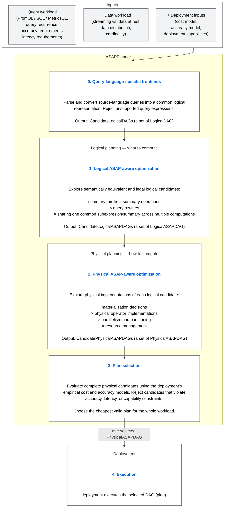

Stage details: 
- [0. Frontends](#0-language-specific-frontends) ·
- [1. Logical ASAP-aware optimization](#1-logical-asap-aware-optimization) ·
- [2. Physical ASAP-aware optimization](#2-physical-asap-aware-optimization) ·
- [3. Plan selection](#3-plan-selection) ·
- [4. Execution](#4-execution)

## ASAPPlanner Detailed Design: Planning Stages and their decisions/Strategies

Stages 0 to 2 (logical and physical planning stages) each output a candidate set holding every semantically equivalent and legal candidate DAG of that stage; stage 3 is the only step that chooses one candidate DAG as output currently (TODO: early selection for valid and more efficient candidates of stage 0-2 can be designed later). Candidate sets are internal to ASAPPlanner and may
be shared or enumerated lazily. Two kinds of removal are kept apart:

* **Pruning** removes an **invalid** candidate. Any stage may prune, but only
  when the candidate is provably invalid (for example, a summary family that
  cannot meet the query's accuracy target), and every pruned candidate carries
  a reason.
* **Selection** discards **valid** candidates. Only stage 3 does this, when it
  picks the cheapest one.

A candidate is a DAG for the **whole workload**, not for one query. Each stage
combines its choices for every sub-DAG with the candidates it receives (the ×
in the diagram), so the candidate set grows from stage to stage until
selection picks one. [Example 1](#example-1-aggregation-over-dimensions--the-candidate-set-through-every-stage) traces this growth step by step.

| Stage | Input | Decides | Output |
|---|---|---|---|
| 0. Frontends | `query`, `language` | Parse and convert to a common logical form; reject what cannot be represented | `CandidateLogicalDAGs` |
| 1. Logical ASAP-aware optimization | Logical DAGs; accuracy requirements, `time_selection`, repetition interval | Summary replacement (Pass 1); ASAP-aware Common Subexpression Elimination (CSE) (Pass 2) | `CandidateLogicalASAPDAGs` |
| 2. Physical ASAP-aware optimization | Logical ASAP DAGs; `recurrence`, `predictability`, `DataWorkload` | Materialization; physical operators; parallelism and resources (TODO) | `CandidatePhysicalASAPDAGs` |
| 3. Plan selection | Physical candidates; `requirements`; cost model, accuracy model, capabilities | Reject invalid candidates; pick the cheapest plan for the whole workload | One `PhysicalASAPDAG` |
| 4. Execution (deployment) | The selected `PhysicalASAPDAG` | Run ingestion, storage and query-time computation | Query results |

The sections below describe each stage.

### 0. Language-specific frontends

The frontend converts each query into a `LogicalDAG`. Nodes represent logical
query operations, including selectors, transformations, aggregations, grouping
and window semantics. They contain no ASAP summary choices. A construct that cannot be represented
faithfully is rejected.

The frontend preserves source-language behavior, including series identity,
evaluation timing and missing-data semantics.

### 1. Logical ASAP-aware optimization

Logical optimization runs in two passes. Pass 1 generates candidates for each
computation on its own; Pass 2 finds candidates that share computation across
sub-DAGs and queries. Materialization and execution
placement are decided in later stages.

#### Pass 1: Per-computation candidate generation

**Per-computation** means each sub-DAG is considered on its own: its candidates
depend only on its own computation and accuracy requirement, not on any other
sub-DAG or query in the workload, so pass 1 doesn't consider the common subexpression sharing optimization. Sharing across sub-DAGs and queries is left to Pass 2.

For each eligible sub-DAG, Pass 1 identifies its computation semantics, applies
rewrite rules, and generates every candidate that is not provably unable to
meet its accuracy requirement.

Example for summary candidates:

| Original computation | Per-computation candidates |
|---|---|
| `Sum(x) by (g)` | Exact grouped sum |
| `TopK(k, x) by (g)` | Exact sort and limit per group, Count-Min Sketch with a top-*k* heap per group, Hydra over all groups |
| `Distinct(x)` | Exact distinct, a specialized distinct summary, UnivMon |
| `Entropy(x)` | Exact entropy, a specialized entropy summary, UnivMon |
| `L2(x)` | Exact L2 norm, a specialized norm summary, UnivMon |
| `Quantile(x, window)` | Exact quantile, KLL over the requested window |

Each candidate records its input expression, filter, grouping, window,
supported estimates and accuracy requirement. Pass 2 uses these to decide
whether candidates can share a summary node.

A summary-based candidate uses three kinds of summary nodes:

* A **summary build node** builds and maintains a summary from input data, for
  example a KLL sketch over `latency_ms`.
* A **summary merge node** combines summaries into one, for example merging
  five 1-min tumbling-window KLLs into one 5-min KLL, or merging lower-level
  summaries into a coarser one.
* A **summary estimation node** computes an answer from a summary, for example
  the p99 estimate from a KLL, or the entropy estimate from a UnivMon.
* **summary subtract node** and **summary delete node** design is TODO. 

One summary build node can feed several estimation nodes, which is what Pass 2
exploits.

**Algorithm 1: Logical Pass 1 — Candidate generation without considering CSE**

```text
Input:  D   — CandidateLogicalDAGs from stage 0 (each a whole-workload LogicalDAG)
        R   — rewrite / replacement rules
        F   — summary-family capabilities
        acc — accuracy requirement of each computation
Output: C1  — CandidateLogicalASAPDAGs with each sub-DAG replaced independently (no sharing)

1:  C1 ← ∅
2:  for each LogicalDAG d in D do
3:      for each eligible sub-DAG s in d do
4:          sem(s) ← IDENTIFY_SEMANTICS(s)        // e.g., input expression, filter, grouping, window, computation
5:          Replacements(s) ← { EXACT(s) }        // the exact computation is always a candidate
6:          for each rule r in R such that r.pattern matches s do
7:              for each candidate c in r.APPLY(s, F) do     // Algorithm 1.1
8:                  // c is exact operators plus summary build / estimation nodes (no merge nodes yet)
9:                  if c provably cannot meet acc(s) then
10:                     PRUNE(c, reason)
11:                 else
12:                     ANNOTATE(c, input, filter, grouping, window, estimates, acc(s))
13:                     Replacements(s) ← Replacements(s) ∪ { c }
14:                 end if
15:             end for
16:         end for
17:     end for
18:     // one whole-workload candidate per combination of per-sub-DAG replacements
19:     for each choice (c_1, …, c_n) in Replacements(s_1) × … × Replacements(s_n) do
20:         C1 ← C1 ∪ { SUBSTITUTE(d, s_1 ↦ c_1, …, s_n ↦ c_n) }
21:     end for
22: end for
23: return C1
```

*Example for Algorithm 1* (the workload of [Example 1](#example-1-aggregation-over-dimensions--the-candidate-set-through-every-stage)). Q1 needs an
exact answer, so every summary replacement for it is pruned and only the exact
computation remains. Q2 tolerates error and gets three replacements. The
Cartesian product gives 1 × 3 = 3 whole-workload candidates.

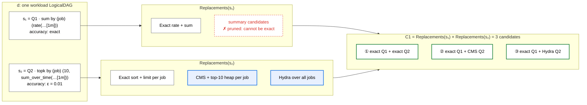

**Algorithm 1.1: r.APPLY(s, F) — Applying one rewrite rule to a sub-DAG**

A rule `r` has a **pattern**, the shape of logical sub-DAG it matches (for
example `TopK(k, x) by (g)`), and one or more **replacement templates**, each a
sub-DAG of ASAP-aware operators with a summary slot to fill (for example "a
summary that estimates per-key frequency, one per group, plus a top-*k* heap").
A template with no summary slot is a pure query rewrite, such as `avg` as
`sum` / `count`.

```text
Input:  r — a rewrite rule (pattern, replacement templates)
        s — a sub-DAG that matches r.pattern
        F — summary-family capabilities
Output: Out — candidate replacement sub-DAGs for s

1:  b ← MATCH(r.pattern, s)                 // binds input expression, filter, key / value, grouping,
2:                                          // window, and parameters such as k or the quantile q
3:  Out ← ∅
4:  for each template t in r.templates do  // e.g. TopK: CMS + heap per group, Hydra over all groups
5:      if t has no summary slot then
6:          Out ← Out ∪ { t.INSTANTIATE(b) }                 // pure query rewrite
7:          continue
8:      end if
9:      for each family f in F such that f supports t.required_estimates(b)
10:                                    and f supports t.grouping_mode(b) do   // per group or over all groups
11:         build ← SUMMARY_BUILD(f, b.input, b.filter, b.key_or_value, b.grouping, b.window)
12:         est   ← SUMMARY_ESTIMATE(f, build, t.estimate(b))   // e.g. p99, top-k, entropy
13:         c ← t.INSTANTIATE(b, build, est)   // wires in the remaining exact operators, e.g. the heap
14:         Out ← Out ∪ { c }
15:     end for
16: end for
17: return Out
```

Summary nodes are created unsized. Algorithm 1 checks whether a family can
meet `acc(s)` at all, and the summary is sized for the accuracy requirement
later, since Pass 2 may tighten it to the strictest requirement among shared
consumers. Pass 1 creates no merge nodes: each candidate summarizes exactly its
own window, and merging across windows comes from the window-composition rule
in Pass 2.

*Example for Algorithm 1.1* (Q2 of [Example 1](#example-1-aggregation-over-dimensions--the-candidate-set-through-every-stage)). MATCH binds the
parameters of Q2. The TopK rule has two templates: one summary per group,
or one summary over all groups. For each template, only families that support
the needed estimate are used: the Count-Min Sketch fills the per-group
template, Hydra fills the all-groups template, and KLL is skipped because it
cannot estimate per-key frequencies.

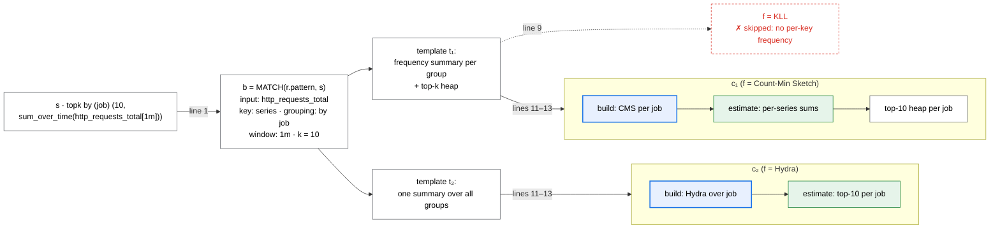

#### Pass 2: ASAP-aware common-subexpression elimination

**Sub-DAG sharing** means several consumers reference one operator and its
upstream dependencies. Traditional Common-Subexpression Elimination (CSE) provides common sub-DAG sharing for
eligible, structurally identical computations. ASAP-aware CSE extends it with
summary-specific sharing rules.
Computations can share work when they use identical expressions, when one
summary build node supports several estimates, or when one window summary can answer
their overlapping windows.

| ASAP-aware CSE rule | Sharing condition | Shared computation |
|---|---|---|
| Identical-expression rule | The input and computation semantics are identical. | One common computation node serving multiple consumers. |
| Summary-capability rule | The computations have the same summary input data and the same window, and one summary supports all requested computations and their accuracy requirements. | One summary build node feeding several estimation nodes, e.g. UnivMon → distinct count, entropy, L2 norm. |
| Window-composition rule | The computations have the same summary input data, and one window summary can answer the requested windows within their accuracy requirements. | One window summary feeding per-query merge (where needed) and estimation nodes, e.g. a sliding-window or tumbling-window KLL, or an Exponential Histogram with a KLL per EH bucket. |

The rules compare computations by their **summary input data**: what a summary for
that computation would ingest, namely the data source, the filters, and the key
or value being summarized together with its grouping. The summary input data does
not include the window; the window-composition rule compares windows
separately.

The examples behind these rules:

* **Summary-capability rule ([Example 2](#example-2-one-summary-for-several-computations--the-summary-capability-rule-in-pass-2)).** One UnivMon over `src_ip` from
  `flows` in the last minute serves three queries refreshed every 10 s:
  `COUNT(DISTINCT src_ip)`, the entropy of the `src_ip` distribution, and the
  L2 norm of per-`src_ip` counts. Each flow record updates the UnivMon once; a
  distinct-count, an entropy and an L2 estimation node each compute their
  statistic from it. The UnivMon is sized for the strictest of the three accuracy
  requirements.
* **Window-composition rule, sliding or tumbling window ([Example 3,
  Pattern B](#example-3-pattern-b)).** For `quantile_over_time(0.99, latency_ms[5m])` repeated every
  minute, one window summary serves every evaluation. With a sliding-window
  KLL, each sample updates the 5 active windows, and each evaluation reads the
  one that has just completed. With 1-min tumbling-window KLLs, each sample
  updates one window, and each evaluation merges the latest 5 with a merge
  node; consecutive evaluations share 4 of them.
* **Window-composition rule, Exponential Histogram ([Example 3, Pattern A](#example-3-pattern-a)).**
  One Exponential Histogram over the last 5 years, with a KLL per EH bucket,
  serves the p99
  queries over `[5y]`, `[1y]`, `[1y] offset 1y`, `[1y] offset 2y` and
  `[3y] offset 2y`. Each query's merge node merges the EH buckets covering
  its interval, and its estimation node computes p99 from the merged KLL.
* **Other quantiles share for free ([Example 3, Pattern B](#example-3-pattern-b)).** One KLL answers every quantile, so adding
  `quantile_over_time(0.5, latency_ms[5m])` to the sliding-window dashboard
  adds only a p50 estimation node next to the p99 one, reading the same KLL,
  with no new summary.

Windows, sliding windows, tumbling windows and Exponential Histograms are defined in
[Appendix: Windows and window summaries](#appendix-windows-and-window-summaries).

Rules are defined by each summary family's capabilities and semantic
requirements. A shared summary must meet the strictest accuracy requirement
among its consumers. Applying a rule adds a shared candidate and keeps the
independent candidates, so selection can compare both.

**Algorithm 2: Logical Pass 2 — ASAP-aware common-subexpression elimination**

```text
Input:  C1 — CandidateLogicalASAPDAGs from Pass 1
        F  — summary-family capabilities (estimates, sizing, error bound, mergeable)
Output: C2 — CandidateLogicalASAPDAGs with sharing

1:  C2 ← C1                                    // independent candidates are kept
2:  for each candidate d in C1 do
3:      Opts ← ∅                               // sharing options found in d
4:
5:      // Identical-expression rule
6:      for each group G of nodes in d with identical input and computation semantics, |G| ≥ 2 do
7:          Opts ← Opts ∪ { one common node serving all consumers in G }
8:      end for
9:
10:     // Summary-capability rule
11:     for each group G of computations in d with the same summary input data and window, |G| ≥ 2 do
12:         for each family f in F that supports every estimate requested in G do
13:             a ← strictest accuracy requirement in G
14:             if f can be sized to meet a for every computation in G then
15:                 Opts ← Opts ∪ { one build node of f sized for a → one estimation node per computation }
16:             end if
17:         end for
18:     end for
19:
20:     // Window-composition rule (G may be a single repeating query)
21:     for each group G of computations in d with the same summary input data do
22:         for each family f in F that supports every estimate requested in G do
23:             for each window summary w in WINDOW_SUMMARIES(G) do
24:                 if CAN_SHARE(w, f, G) then
25:                     Opts ← Opts ∪ { SHARED_WINDOW_SUMMARY(w, f, G) }
26:                 end if
27:             end for
28:         end for
29:     end for
30:
31:     for each non-empty, non-conflicting subset O ⊆ Opts do
32:         C2 ← C2 ∪ { APPLYSHARING(d, O) }
33:     end for
34: end for
35: return C2


WINDOW_SUMMARIES(G):     // candidate window summaries for G; each q in G has
                         // window length W_q and evaluation interval E_q
    Tumbling(L)      for every L that divides every W_q and every E_q
    Sliding(L, s)    for every L that divides every W_q,
                     and every s < L that divides L and every E_q     // s = L is Tumbling(L)
    EH               one EH covering the oldest data any q in G reads

PIECES(w, q):            // how many summaries of w one evaluation of q reads
    Tumbling(L)      W_q / L
    Sliding(L, s)    W_q / L                       // 1 when L = W_q: read one completed window
    EH               number of EH buckets that overlap q's window

CAN_SHARE(w, f, G):      // can one w over f answer every query in G?
    if some q in G has PIECES(w, q) > 1 and f is not mergeable then
        return false
    return w over f, sized for the strictest accuracy in G, meets every q's accuracy
                         // for EH this includes the bucket-boundary error

SHARED_WINDOW_SUMMARY(w, f, G):
    one window-summary node: w over f, sized for the strictest accuracy in G
    for each q in G:
        merge node: merges the PIECES(w, q) pieces covering q's window   // omitted when PIECES = 1
        estimation node: computes q's estimate from the merged result (or the single piece)
```

The divisibility conditions make every summary a query needs a completed one
when the query evaluates; see
[Appendix: Windows and window summaries](#appendix-windows-and-window-summaries).
For example, `quantile_over_time(0.99, latency_ms[5m])` every 1 min
(W = 5 min, E = 1 min) gives `Tumbling(1 min)` with PIECES = 5, and
`Sliding(5 min, 1 min)` with PIECES = 1, which needs no merge node and so works
even for a summary that cannot be merged.

*Example for Algorithm 2, summary-capability rule* ([Example 2](#example-2-one-summary-for-several-computations--the-summary-capability-rule-in-pass-2)).
Pass 1 gave each of the three queries its own UnivMon. All three have the same
summary input data (`src_ip` from `flows`) and the same 1-min window, and
UnivMon supports all three estimates, so lines 11–15 add one shared UnivMon,
sized for the strictest accuracy requirement. The separate UnivMons stay in
C2 as well.

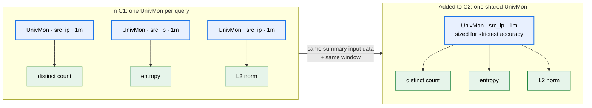

*Example for Algorithm 2, window-composition rule* ([Example 3, Pattern
B](#example-3-pattern-b)). G holds one query, a p99 over 5 min evaluated every
1 min (W = 5 min, E = 1 min). Counting in whole minutes, `WINDOW_SUMMARIES(G)`
returns `Tumbling(1m)`, since 1 min is the only length that divides both 5 and
1, plus `Sliding(5m, 1m)` and one EH. KLL is mergeable, so all three pass
`CAN_SHARE` (line 24) and become options. They all replace the same computation and
therefore conflict, so line 31 adds each one as a separate candidate.

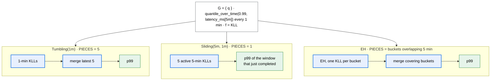

### 2. Physical ASAP-aware optimization

Physical optimization turns each logical candidate into physical candidates.
It makes two ASAP-specific decisions, described below. Parallelism, partitioning
and resource management are TODO.

#### Materialization

Materialization decides, for each sub-DAG, whether its output is stored, on disk
or in memory, across (batch) query executions. Stage 2 makes this decision in three steps:

1. **Materialize or not.** A sub-DAG that is not materialized always runs at
   query time and keeps nothing.
2. **If materialized, ingestion time or query time.** This is when the output
   is computed. A sub-DAG that runs at ingestion time is therefore always
   materialized, because its output must be kept until a query reads it.
3. **Where and how long to store it:** on disk or in memory, and for how long.
   The deployment's cost model estimates the cost of each choice.

This gives each sub-DAG three options:

* **Materialized at ingestion time:** the sub-DAG runs as data arrives, and its
  output is stored before any query asks for it. For example, the 1-min
  tumbling-window KLLs in Example 4, Pattern B.
* **Materialized at query time:** the sub-DAG runs when a query first needs
  it, and its output is stored so that later executions, or other queries in
  the same batch, reuse it instead of recomputing it. For example, an
  Exponential Histogram built when the batch in Example 4, Pattern A runs and
  read by all five of its queries.
* **Not materialized:** the sub-DAG runs at query time for each execution, and
  its output is discarded afterward.

Whichever option is chosen for each sub-DAG, the plan must also satisfy these
constraints:

* A materialized output is stored for as long as any of its consumers still
  needs it.
* Every node upstream of an ingestion-time node also runs at ingestion time.

The decision depends on the workload's `recurrence` and `predictability` and on
the `DataWorkload`. Typical outcomes:

* Read by repeated queries while data keeps arriving: materialize at ingestion
  time.
* Read by several queries in one batch, or over data at rest: materialize at
  query time.
* Read once by an ad hoc query: do not materialize.

A shared summary is materialized once for all its consumers. See Example 4.

#### Physical operator implementation

Physical operator implementation converts every node to physical operators, for
example TopK as a sort followed by a limit, or a KLL node as summary build,
merge and quantile estimation operators.

**Algorithm 3: Physical ASAP-aware optimization**

```text
Input:  C2 — CandidateLogicalASAPDAGs from stage 1
        recurrence, predictability, DataWorkload
Output: C3 — CandidatePhysicalASAPDAGs

1:  C3 ← ∅
2:  for each LogicalASAPDAG d in C2 do
3:      // Materialization: options per sub-DAG
4:      for each sub-DAG s in d do
5:          Opt(s) ← { NotMaterialized }
6:          for each medium in {memory, disk} do
7:              Opt(s) ← Opt(s) ∪ { MatAtIngestion(medium), MatAtQuery(medium) }
8:          end for
9:      end for
10:
11:     for each assignment m in Opt(s_1) × … × Opt(s_n) do
12:         // constraint: everything upstream of an ingestion-time node also runs at ingestion time
13:         if some s with m(s) = MatAtIngestion has an upstream node u with m(u) ≠ MatAtIngestion then
14:             PRUNE(m, "upstream of ingestion-time node not at ingestion time")
15:             continue
16:         end if
17:         // constraint: keep a materialized output as long as any consumer needs it
18:         for each s with m(s) ≠ NotMaterialized do
19:             retention(s) ← latest time any consumer of s reads it    // from recurrence, windows
20:         end for
21:         // a shared summary is one node, so it is materialized once for all consumers
22:
23:         // Physical operator implementation
24:         for each node v in d do
25:             Impl(v) ← physical operator implementations of v      // e.g. TopK → sort + limit
26:         end for
27:         for each choice (i_1, …, i_k) in Impl(v_1) × … × Impl(v_k) do
28:             C3 ← C3 ∪ { BUILDPHYSICAL(d, m, retention, i_1, …, i_k) }
29:         end for
30:     end for
31:     // TODO: parallelism, partitioning, resource management
32: end for
33: return C3
```

`recurrence`, `predictability` and the `DataWorkload` do not prune options
here; they determine the cost of each option, which stage 3 uses to pick the
cheapest plan (the typical outcomes above).

*Example for Algorithm 3* ([Example 4, Pattern B](#example-4-materialization-of-window-summaries-in-physical-planning)).
The logical candidate is the `Tumbling(1m)` KLL option from Algorithm 2. The
diagram shows three of its materialization assignments, each drawn as a copy
of the DAG with every node colored by its materialization. Line 13 enforces one
rule: a node can run at ingestion time only if every node it reads from also
runs at ingestion time, because otherwise its input does not exist yet when
data arrives. In m₂ the merge node is placed at ingestion time, but the 1-min
KLLs it merges are built only at query time, so there is nothing to merge
while data is arriving, and m₂ is pruned. Assignments m₁ and m₃ are both
valid, and stage 3 chooses between them by cost.

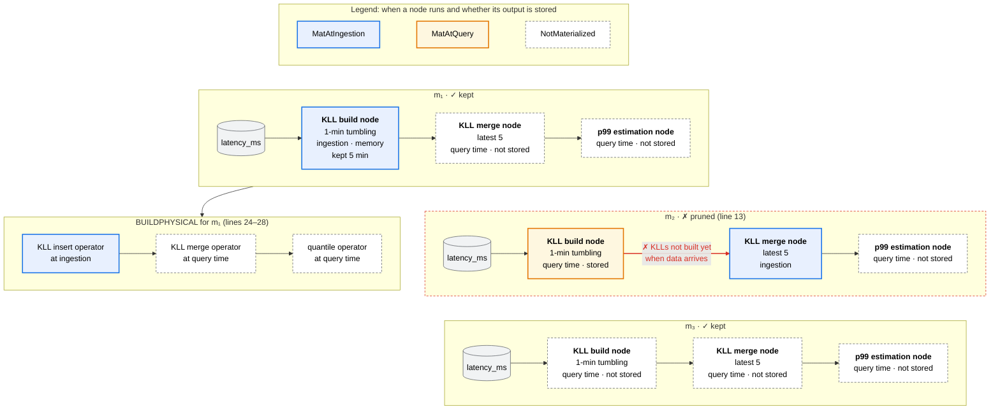

### 3. Plan selection

Selection rejects every candidate that misses an accuracy target or a latency
bound, or that needs a capability the deployment lacks, and then picks the
cheapest remaining plan. It is the only stage that uses the deployment's cost
and accuracy models, and the only stage that discards valid candidates;
earlier stages only prune provably invalid ones. Accuracy is
estimated by the deployment's accuracy model, not assumed from a summary's
nominal bound. Cost is evaluated for the whole workload rather than per query,
which is what lets one shared summary beat several cheaper independent ones:
the cost of a shared summary is estimated once, with the demand of all its
consumers.

### 4. Execution

Execution runs outside ASAPPlanner. The deployment runs the selected plan as
given: it does not choose among summaries or decide what to materialize.

## End-to-end examples

To see examples in DAG Viewer, following the instructions [here](TODO: write an instruction and link here).

Each example's workload is shown as tables. Field names in code font are the
fields of
[`workload.rs`](https://github.com/ProjectASAP/ASAPPlanner/blob/main/crates/types/src/workload.rs).
Each query reads the event-time window [`as_of` − `lookback`, `as_of`] (fields
of `TimeSelection`). `as_of` is the window's end; `lookback` is its length. An
`as_of` of "evaluation time" means `as_of: None`: the window ends whenever the
query runs, so it moves forward with each evaluation. A fixed `as_of`, such as
T − 1 y, pins the window to a historical interval. Approximate accuracy targets are `EpsilonDelta`: the answer's error
is at most ε with probability at least 1 − δ.

| Example | Shows |
|---|---|
| 1. Aggregation over dimensions | How the candidate set grows through every stage |
| 2. One summary for several computations | Pass 2: summary-capability rule |
| 3. Aggregation over windows | Pass 1 and Pass 2: window-composition rule |
| 4. Materialization of window summaries | Stage 2: materialization, decoupled from stage 1 |

In the diagrams below, grey cylinders are input data, white boxes are exact
operations and summary merges, blue boxes are summary build nodes, and green
rounded boxes are summary estimation nodes.

### Shared data workload

Unless an example says otherwise, every example uses this data workload:

| `DataWorkload` field | Meaning | Value |
|---|---|---|
| `arrival` | Whether the data is at rest, still arriving, or both | `continuously_ingesting` |
| `data_ingestion_interval` | How often each series delivers one sample (the scrape interval in Prometheus). PromQL uses it as the look-back horizon of instant selectors. | 15 s |
| `ingestion_volume` | Total amount of ingested data | unknown |
| `ingestion_rate` | Samples arriving per second across all series | about 66,667 samples/s |
| `input_cardinality` | Number of distinct series (or keys) | 1,000,000 series |
| `distribution` | How samples are spread over keys | `zipf` |

With 1,000,000 series each sampled every 15 s, the ingestion rate is
1,000,000 / 15 ≈ 66,667 samples/s.

### Example 1: Aggregation over dimensions — the candidate set through every stage

**Query workload.** Two PromQL dashboard panels over the last minute. The
first needs an exact total; the second tolerates error.

| Query | Repeats | `lookback` | `as_of` | Accuracy requirement | Latency requirement |
|---|---|---|---|---|---|
| Q1: `sum by (job) (rate(http_requests_total[1m]))` | every 10 s | 1 m | evaluation time | exact | none |
| Q2: `topk by (job) (10, sum_over_time(http_requests_total[1m]))` | every 10 s | 1 m | evaluation time | ε = 0.01, δ = 0.001 | ≤ 100 ms |

This example follows the workload's candidate set through every stage. Each
candidate covers both queries.

**Stage 0: 1 candidate.** The frontend converts both queries into one workload
`LogicalDAG` with no summaries:

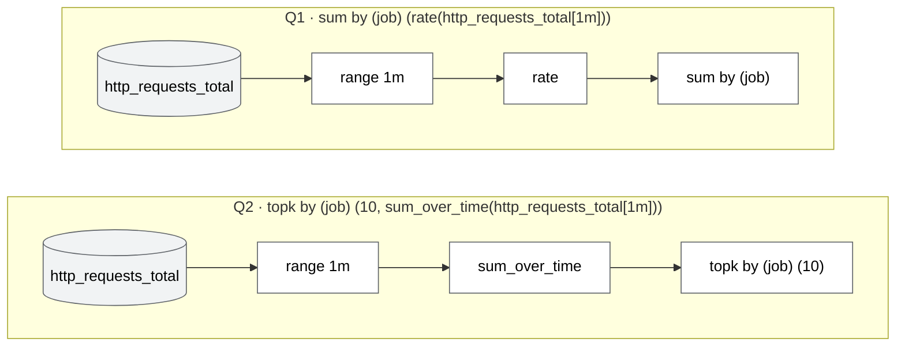

**Stage 1, Pass 1: 3 candidates.** Pass 1 finds per-computation options for each query:

* **Q1** has one option, the exact per-series rate and per-`job` sum. Its
  accuracy requirement is exact, so no summary qualifies.
* **Q2** has three options. The exact one keeps a per-series sum and sorts
  within each `job`, which is costly at one million Zipf-distributed series.
  The `EpsilonDelta` target also admits a **Count-Min Sketch with a top-*k*
  heap per `job`**, and **Hydra over the whole `job` column**, where one sketch
  covers every (`job`, series) key and a top-*k* heap is still kept per `job`.

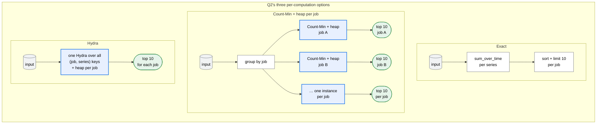

Combining them gives 1 × 3 = 3 workload candidates:

| Logical candidate | Q1 | Q2 |
|---|---|---|
| Exact | exact | exact |
| Count-Min | exact | Count-Min + heap |
| Hydra | exact | Hydra |

**Stage 1, Pass 2: 54 candidates.** Pass 2 applies two ASAP-aware CSE rules
to each of the 3 candidates, and keeps every original:

* **Identical-expression rule.** Both queries read the same range selector,
  `http_requests_total[1m]`, so Pass 2 adds a variant in which Q1 and Q2 share
  one input node. No summary is shared, because Q1 must be exact and no
  summary supports both queries.
* **Window-composition rule.** Each query reads a 1-min window every 10 s, so
  consecutive evaluations overlap by 50 s. For each query, Pass 2 adds two
  variants: a **sliding window** with L = 1 min and a 10-s slide, where each
  sample updates the 6 active windows, and **10-s tumbling windows**, merged 6
  at a time at every refresh. (Shorter sliding windows that are merged, such
  as 30-s windows with a 10-s slide, would add more candidates; this example
  leaves them out.)
  Tumbling windows need a mergeable summary. Q1's rates and sums, Q2's exact
  sums and Hydra merge exactly; Count-Min sketches do too, but their top-10
  heaps merge only approximately, so that candidate is kept and the accuracy
  model judges it in stage 3.

Each Pass 1 candidate therefore has 2 input choices (separate or shared) ×
3 window forms for Q1 (none, sliding, tumbling) × 3 for Q2, so stage 1 outputs
3 × 2 × 3 × 3 = 54 logical candidates.

The window-composition rule applied to Q2 in the Hydra candidate:

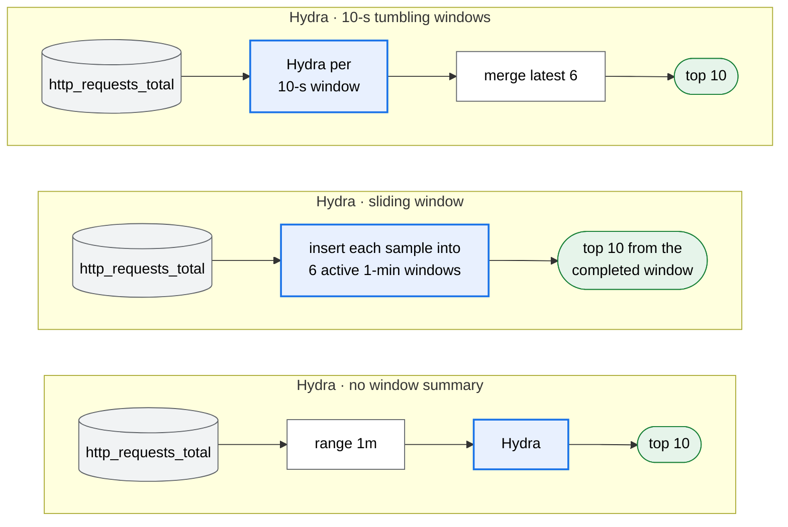

**Stage 2: 156 candidates.** Stage 2 picks, for each query, when its state is
computed and whether it is kept. What it can choose depends on the query's
window form from Pass 2:

| Window form | Physical options |
|---|---|
| None | **Raw:** rebuild the state from the last 1 min of raw samples at every refresh. It cannot be materialized: the window slides every 10 s, and most summaries cannot drop old data. |
| Sliding window | **Sliding, ingestion time:** insert each sample into the 6 active windows as it arrives (materialized at ingestion time). **Sliding, query time:** at each refresh, insert the last 10 s of raw samples into the 6 kept active windows (materialized at query time). Building the window from raw samples at query time without keeping it is the same plan as Raw. |
| 10-s tumbling windows | **Tumbling, ingestion time:** build each tumbling window as samples arrive and keep the last 6. **Tumbling, query time:** at each refresh, build only the newest tumbling window from the last 10 s of raw samples and reuse the 5 kept ones. **Tumbling, rebuilt:** at each refresh, build all 6 tumbling windows from the last 1 min of raw samples, merge them, and discard them (not materialized). |

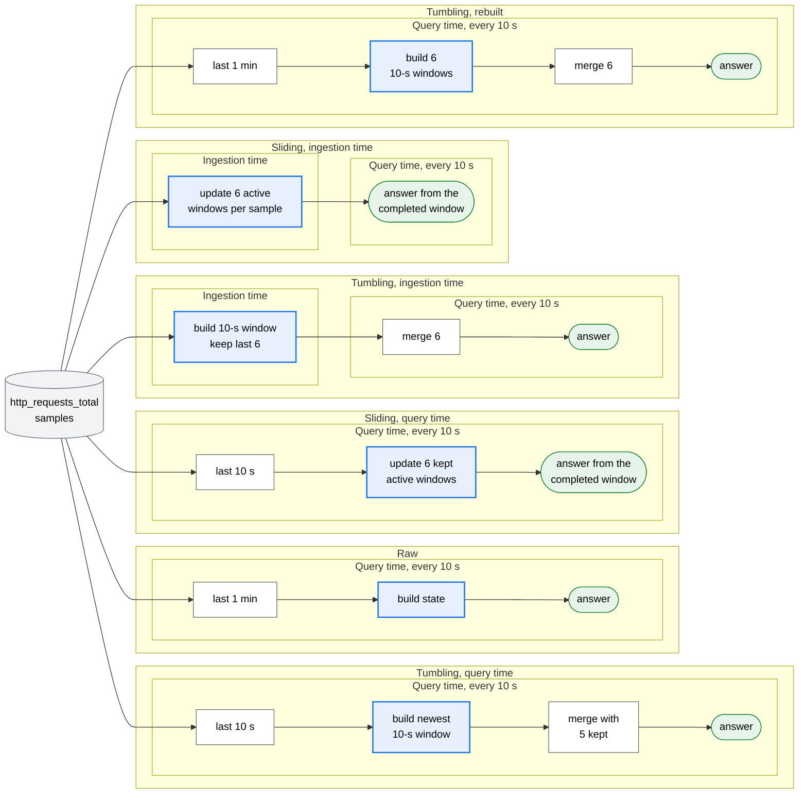

Across the three window forms, each query has 1 + 2 + 3 = 6 physical options,
so each Q2 option gives 6 × 6 = 36 combinations. The shared-input variant only
changes the plan when both queries read raw samples at query time, which 4 of
the 6 options do (all except the two ingestion-time ones). That adds
4 × 4 = 16 shared-input plans, for 52 plans per Q2 option and
3 × 52 = 156 physical candidates.

**Stage 3: 1 plan.** Selection first rejects invalid candidates. The
deployment's accuracy model checks the summary candidates against ε = 0.01,
δ = 0.001, including the approximate heap merge of Count-Min with tumbling
windows. Its cost model estimates Q2's latency against the 100 ms bound; for
example, an exact top 10 rebuilt from one million series at every refresh may
miss it. Among the rest, selection picks the cheapest plan for the whole
workload. Typical winners:

* **Hydra for Q2, with both queries on tumbling windows at ingestion time**,
  when there are many small jobs: each sample updates one window, and each
  refresh merges 6 small summaries.
* **Count-Min + heap for Q2 on a sliding window at ingestion time**, with Q1
  on tumbling windows, when there are a few large jobs: the heaps do not merge
  cleanly, so updating 6 active windows per sample is worth it.
* **Query-time variants** of either, when ingestion-time work is expensive.
* **Raw with a shared input** for both queries, when storage is expensive and
  raw data is available at query time.

The other candidates, such as tumbling windows rebuilt at every refresh, stay
in the candidate set because they are valid, and selection rules them out on
cost.

### Example 2: One summary for several computations — the summary-capability rule in Pass 2

**Query workload.** A network-monitoring dashboard computes three statistics of
source IPs over the last minute.

```sql
-- Q1: Distinct(src_ip)
SELECT COUNT(DISTINCT src_ip)
FROM flows
WHERE ts >= now() - INTERVAL '1 minute';

-- Q2: Entropy(src_ip)
SELECT -SUM(p * LN(p))
FROM (
  SELECT COUNT(*) * 1.0 / SUM(COUNT(*)) OVER () AS p
  FROM flows
  WHERE ts >= now() - INTERVAL '1 minute'
  GROUP BY src_ip
);

-- Q3: L2(src_ip)
SELECT SQRT(SUM(c * c))
FROM (
  SELECT src_ip, COUNT(*) AS c
  FROM flows
  WHERE ts >= now() - INTERVAL '1 minute'
  GROUP BY src_ip
);
```

The SQL frontend does not yet recognize the Q2 and Q3 forms as `Entropy` and
`L2`. TODO: add this recognition to the per-language frontends.

| Query | Computation | Repeats | `lookback` | `as_of` | Accuracy requirement |
|---|---|---|---|---|---|
| Q1 | `Distinct(src_ip)` | every 10 s | 1 m | evaluation time | ε = 0.02, δ = 0.01 |
| Q2 | `Entropy(src_ip)` | every 10 s | 1 m | evaluation time | ε = 0.05, δ = 0.01 |
| Q3 | `L2(src_ip)` | every 10 s | 1 m | evaluation time | ε = 0.01, δ = 0.01 |

The data workload differs from the shared one in two fields:

| `DataWorkload` field | Value |
|---|---|
| `input_cardinality` | 10,000,000 distinct source IPs |
| `data_ingestion_interval` | not needed for SQL |

**Pass 1.** Rewrite rules recognize the three computations, and each gets its
per-computation candidates from the Pass 1 table: exact, a specialized summary, or
UnivMon. Combined, that is 3 × 3 × 3 = 27 workload candidates.

**Pass 2.** All three computations have the same summary input data (`src_ip`
from `flows`, no other filter) and the same 1-min window. UnivMon supports all three
estimates, so the summary-capability rule adds a shared candidate: **one
UnivMon build node feeding three estimation nodes**. It must be sized for the strictest
requirement, ε = 0.01. The independent candidates are kept as well. Pass 2
also adds candidates where only two of the three share a UnivMon and the third
keeps any of its own 3 options (3 pairs × 3 = 9), so stage 1 outputs
27 + 1 + 9 = 37 candidates. The figure shows the all-three case. The
window-composition rule would also add sliding-window and 10-s tumbling-window
variants, exactly as in Example 1; they are left out here to keep the focus on
the summary-capability rule.

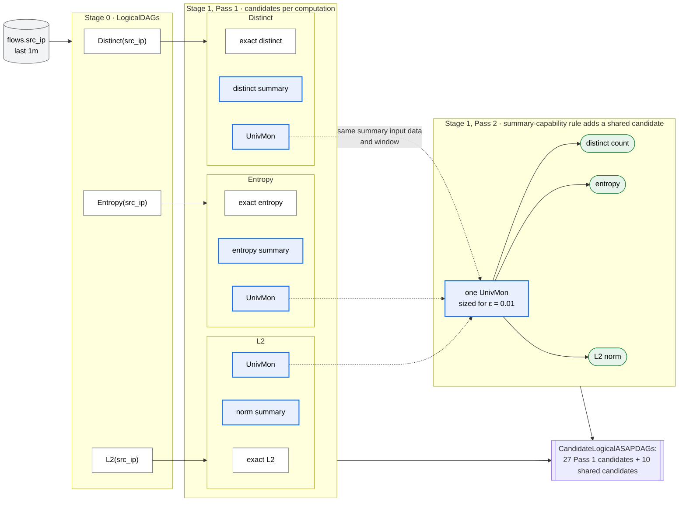

The three UnivMon options from Pass 1 (dashed arrows) are merged by Pass 2 into
one shared UnivMon. The independent candidates are kept, so stage 1 outputs
both kinds.

**Stage 2.** The same options as in Example 1 apply: a summary without a
window summary is rebuilt from raw samples at every refresh, while a
sliding-window or tumbling-window UnivMon can be kept from ingestion time or
from query time (and tumbling windows can also be rebuilt). Because the
dashboard repeats over arriving data, ingestion-time window summaries are
usually cheapest. UnivMon merges exactly, so tumbling windows suit it.

**Stage 3.** Selection compares one UnivMon sized for ε = 0.01 against three
separate summaries, each sized for its own requirement. The shared candidate
usually wins because each flow record updates one summary instead of three.

### Example 3: Aggregation over windows — the window-composition rule in Pass 2

This example has two workload patterns that both lead to a shared window
summary.

<a id="example-3-pattern-a"></a>
**Pattern A: a batch of sub-interval queries over historical data.** An analyst
submits a batch of p99 latency reports over different historical intervals,
all executed together at time T.

| Workload field | Value (all five queries) |
|---|---|
| Entry type | `query_batch`, run once (`invocations: 1`) at T |
| `predictability` | `ad_hoc` |
| Accuracy requirement | ε = 0.005, δ = 0.01 |

| Query | `lookback` | `as_of` |
|---|---|---|
| `quantile_over_time(0.99, latency_ms[5y])` | 5 y | T |
| `quantile_over_time(0.99, latency_ms[1y])` | 1 y | T |
| `quantile_over_time(0.99, latency_ms[1y] offset 1y)` | 1 y | T − 1 y |
| `quantile_over_time(0.99, latency_ms[1y] offset 2y)` | 1 y | T − 2 y |
| `quantile_over_time(0.99, latency_ms[3y] offset 2y)` | 3 y | T − 2 y |

The data workload is the shared one, except `arrival` is `mixed`: five years
of data at rest, plus data still arriving.

* **Pass 1.** Each `quantile_over_time` gets an exact candidate and a KLL over
  its own interval: five independent KLL candidates over overlapping data.
* **Pass 2.** Every interval is a sub-interval of [T − 5 y, T], and KLL is
  mergeable. The window-composition rule adds a shared candidate: **one
  Exponential Histogram over [T − 5 y, T], with a KLL per EH bucket**, with one
  merge and estimation node per query that merges the EH buckets covering
  its interval. The independent candidates are kept.

Yearly tumbling windows would also work here, since every interval is a whole
number of years; the Exponential Histogram is shown because it also handles
intervals that are not. Counted at the workload level, Pass 1 gives each query
2 options (exact or KLL), so 2⁵ = 32 candidates, and Pass 2 adds one candidate
for every way of grouping two or more queries onto shared window summaries.
That quickly reaches hundreds of candidates, which is why candidate sets may be
enumerated lazily.

The five query intervals overlap, and all lie inside the last five years:

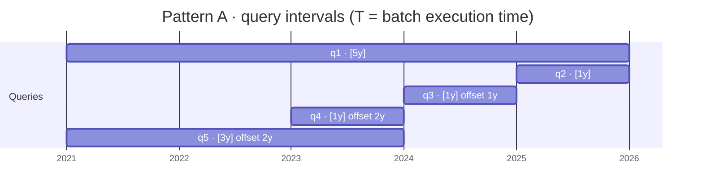

The shared candidate replaces five KLL sketches with one Exponential Histogram
and a merge and estimation node per query:

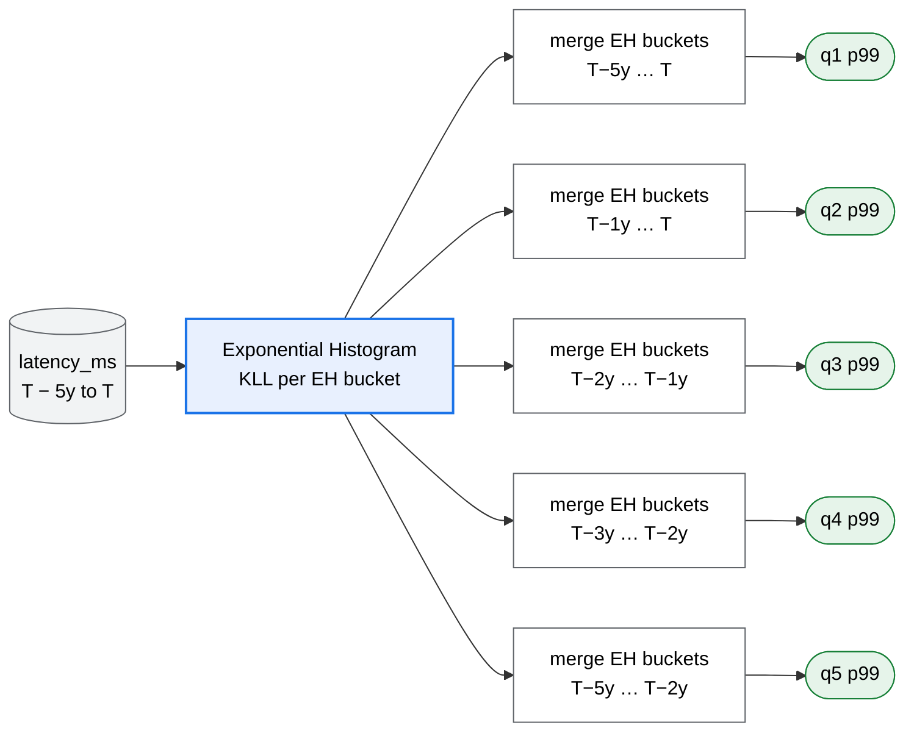

<a id="example-3-pattern-b"></a>
**Pattern B: one repeating query with overlapping windows.** A real-time p99 panel
over the last 5 min, refreshed every minute.

| Query | Repeats | `lookback` | `as_of` | Accuracy requirement | Latency requirement |
|---|---|---|---|---|---|
| `quantile_over_time(0.99, latency_ms[5m])` | every 1 min | 5 m | evaluation time | ε = 0.01, δ = 0.01 | ≤ 200 ms |

* **Pass 1.** One KLL over 5 min for each evaluation.
* **Pass 2.** Consecutive evaluations overlap by 4 of their 5 minutes. The
  window-composition rule adds two shared candidates for each Pass 1 option:
  a **sliding window**, where each sample updates the 5 active 5-min windows,
  and **1-min tumbling windows**, where each evaluation merges the latest 5.
  With exact and KLL from Pass 1, each in 3 window forms (none, sliding,
  tumbling), stage 1 outputs 2 × 3 = 6 candidates.

With 1-min tumbling windows, each evaluation merges five of them, and
consecutive evaluations share four:

```mermaid
gantt
  title Pattern B · 1-min tumbling KLL windows and 5-min evaluations
  dateFormat HH:mm
  axisFormat %H:%M
  section 1-min tumbling windows
  window 1 :p1, 00:00, 1m
  window 2 :p2, 00:01, 1m
  window 3 :p3, 00:02, 1m
  window 4 :p4, 00:03, 1m
  window 5 :p5, 00:04, 1m
  window 6 :p6, 00:05, 1m
  window 7 :p7, 00:06, 1m
  section Evaluations
  eval at 00:05 (windows 1–5) :e1, 00:00, 5m
  eval at 00:06 (windows 2–6) :e2, 00:01, 5m
  eval at 00:07 (windows 3–7) :e3, 00:02, 5m
```

Example 4 shows how stage 2 decides whether to store these window summaries.

### Example 4: Materialization of window summaries in physical planning

Stage 2 takes the shared window summaries from Example 3 and decides whether to
materialize them. That choice is driven by the workload's `recurrence`,
`predictability` and `data_workload.arrival`. This example shows only the
physical candidates of the shared logical candidate; every other logical
candidate from Example 3 gets its own physical candidates the same way.

**Pattern A (sub-interval batch).**

| Candidate | Materialized | When the Exponential Histogram is built |
|---|---|---|
| A1 | The Exponential Histogram, at query time | At query time, when the batch runs at T; read by all five queries, then discarded |
| A2 | The Exponential Histogram, at ingestion time | At ingestion time, with each new sample; old data backfilled once |
| A3 | Nothing | At query time, once per query: each of the five queries rebuilds it for itself and discards it |


Which candidate wins depends on the workload:

* **As given** (`invocations: 1`, `ad_hoc`): selection picks A1. A2 would
  maintain the histogram for years only to serve one batch, and A3 builds it
  five times instead of once.
* **Repeated monthly and `Predictable { known_at }`:** A2 can win, because its
  maintenance cost is shared by many batches.
* **Data `"at_rest"`:** A2 is not generated, because there is no ingestion to
  maintain the histogram.

**Pattern B (overlapping windows, repeating).**

| Candidate | Materialized | At ingestion time | At query time |
|---|---|---|---|
| B1 | 1-min tumbling KLLs, kept 5 min | Build one tumbling KLL per minute | Merge the latest 5, read p99 |
| B2 | Nothing | Nothing | Read 5 min of raw samples, rebuild all 5 tumbling KLLs, merge them, read p99 |
| B3 | 1-min tumbling KLLs, at query time, kept 5 min | Nothing | Build only the newest tumbling KLL from raw samples, merge it with the 4 kept ones, read p99 |

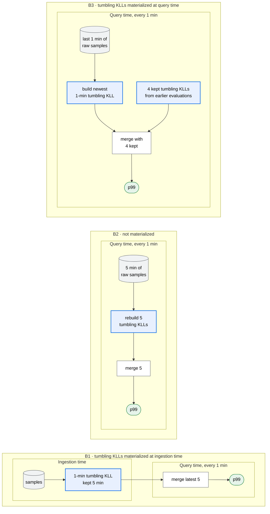

This table covers the tumbling-window candidate. The query repeats every
minute and the data is continuously ingesting, so B1 builds each tumbling KLL
once and reuses it in five evaluations, while B2 rescans raw data every time.
B3 also builds each tumbling KLL once, but at query time, so it needs raw data
at query time and adds the newest build to each evaluation's latency.
Selection usually picks B1. B3 can win when ingestion-time work is expensive,
and B2 only when storage is expensive and raw data is available at query time.

The sliding-window candidate from Example 3 gets its own physical candidates
the same way: kept from ingestion time (each sample updates the 5 active
windows) or from query time (each evaluation inserts the last minute of raw
samples into the 5 kept windows). It does more ingestion work than B1 but
needs no merge, so it wins only for a summary that merges poorly.

**What this shows.** The same logical candidate (one shared Exponential
Histogram, or 1-min tumbling KLL windows) yields different physical plans depending
only on recurrence, predictability and data arrival. This is why window-summary
replacement happens in logical planning, while materialization is decided
separately in physical planning.

## Scenarios

Each scenario lists what a developer or user gives (Assumptions 1–4), what
ASAPPlanner then does automatically, and what does not change.  

### Adding a new query to a workload

**Given:** one more workload entry: the query, its recurrence (repeating demand
or batch), predictability, time selection and accuracy and latency
requirements. No code changes.

**Automatic:** the language-specific frontend converts the query. Pass 1 of logical ASAP-aware optimization generates its
exact and summary candidates from the existing rules and capabilities. Pass 2 of logical ASAP-aware optimization
checks whether it can share a summary with the queries already in the workload.
Physical ASAP-aware optimization and plan selection re-plan the whole workload, so adding a query can
change the plan of other queries, for example when a summary becomes shared.

**Unchanged:** rules, summary families, models and every other workload entry.

### Supporting a new query construct

For a function, operator or aggregate a frontend does not support yet.

**Given:**

1. The language-specific frontend conversion to the common IR, or an explicit
   rejection.
2. If it is a new computation, its semantics in the IR (an `AggIntent`), and
   whether it is exact-only, mergeable, or approximable.
3. If it is approximable, the rewrite rules and the summary families that may
   answer it (Assumptions 1 and 2).
4. Its exact physical operator implementation.

**Automatic:** everything from Pass 1 of logical ASAP-aware optimization onward, as for any other query.

**Unchanged:** the stages, the selection rule and other queries' candidates.

### Adding a new summary family

For example, a new quantile sketch.

**Given** (Assumption 2):

1. The family and its parameters.
2. The computations it answers and the estimates it reads out.
3. Its sizing rule for an accuracy target and its error bound.
4. Whether its states can be merged, subtracted or deleted.
5. Which state fields identify it, so that equal states are shared in Pass 2 of logical ASAP-aware optimization.
6. Its physical kernel: build, merge and estimate.

**Automatic:** Pass 1 of logical ASAP-aware optimization offers the family wherever its declared computations
appear, sizes it per query and prunes it where it cannot meet the accuracy
target. Pass 2 of logical ASAP-aware optimization shares it across queries, sized for the strictest consumer.
Selection compares it with every other candidate using the deployment's models.

**Unchanged:** frontends, rewrite rules, the stages and existing queries.

### Adding a better cost or accuracy estimation

**Given:** a cost model or accuracy model supplied by the deployment, for
example one fitted to its own measurements.

**Automatic:** only plan selection changes. The candidate sets of the
language-specific frontends, logical ASAP-aware optimization and physical
ASAP-aware optimization stay the same, except where a model also changes sizing or admits a
summary that has no built-in guarantee. The model is used for every
query in the workload, and a shared summary is costed once.

**Unchanged:** frontends, rules, summary families and the deployment's
execution.

## Appendix: Windows and window summaries

The window-composition rule in [Pass 2](#pass-2-asap-aware-common-subexpression-elimination) distinguishes the window a query reads from the
window summary that answers it:

* A **window** is the time range one query evaluation reads, for example the
  last 5 min. Consecutive evaluations of a repeating query read overlapping
  windows. Most summaries cannot remove old data, so one summary cannot simply
  slide forward with the window.
* A **window summary** keeps summaries so that many windows can be answered.
  Three window summaries are considered for now:
  * **Sliding window:** summaries over windows of a fixed length L that start
    every s (the slide), so several windows are active at once. Each arriving
    sample is inserted into every active window that contains it, at the cost
    of more ingestion work and memory. A query window of length W is answered
    from completed windows:
    * **L = W:** each evaluation reads one completed window, with no merge.
      For a 5-min window evaluated every 1 min, L = 5 min and s = 1 min, so 5
      windows are active and each sample updates all 5. This works even for
      summaries that cannot be merged.
    * **L shorter than W:** the query window is covered by W / L
      non-overlapping completed windows, which are merged[^sliding-merge]. For
      example, a 10-min window evaluated every 1 min merges two 5-min windows
      with a 1-min slide. This needs a mergeable summary.

    L must divide W, and s must divide both L and the evaluation interval, so
    the windows a query needs have always just completed.
  * **Tumbling window:** back-to-back, non-overlapping windows of one fixed
    length, each with one summary; a sliding window whose slide equals its
    length. A longer query window is answered by
    merging the tumbling windows it covers. The tumbling length must divide
    both the query window length and the evaluation interval, so that every
    query window starts and ends on a tumbling boundary: a 5-min window
    evaluated every 1 min uses 1-min tumbling windows and merges exactly 5 of
    them. It needs a mergeable summary.
  * **Exponential Histogram (EH):** a sequence of EH buckets that covers a
    long history. A query window is answered by merging the EH buckets it
    covers. Few EH buckets cover a long history, at the cost that an old
    query-window boundary may fall inside an EH bucket and is then
    approximate.
    * An **EH bucket** is one non-overlapping time range of the history with
      one summary of the data in it. Unlike tumbling windows, EH buckets are
      not all the same length: they grow with age, so recent data sits in
      short EH buckets and older data in longer ones. Adjacent EH buckets are
      merged into a longer one as they age.

  TODO: evaluate other sliding-window frameworks for sketches as further
  window summaries, such as Smooth Histograms[^smooth-histograms],
  MicroscopeSketch[^microscope-sketch] and Sliding Sketches[^sliding-sketches].

[^smooth-histograms]: V. Braverman and R. Ostrovsky. [Smooth Histograms for Sliding Windows](https://web.cs.ucla.edu/~rafail/PUBLIC/82.pdf). FOCS 2007. An alternative to EH.
[^microscope-sketch]: Y. Wu et al. [MicroscopeSketch: Accurate Sliding Estimation Using Adaptive Zooming](https://yangtonghome.github.io/uploads/MicroscopeSketch_SIGKDD_23_final_paper.pdf). KDD 2023.
[^sliding-sketches]: X. Gou et al. [Sliding Sketches: A Framework using Time Zones for Data Stream Processing in Sliding Windows](https://dl.acm.org/doi/10.1145/3394486.3403144). KDD 2020.
[^sliding-merge]: A. Arasu and G. S. Manku. [Approximate Counts and Quantiles over Sliding Windows](https://dl.acm.org/doi/10.1145/1055558.1055598). PODS 2004.
