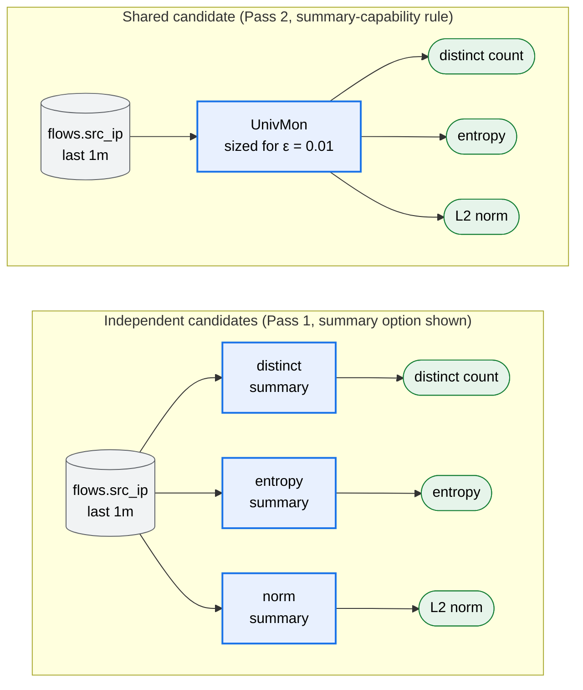
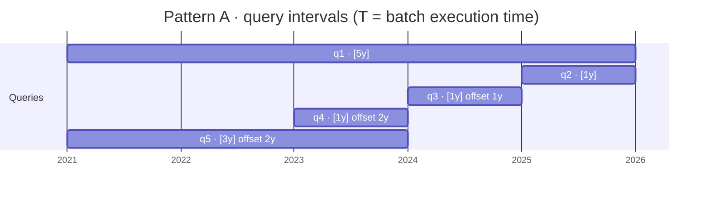
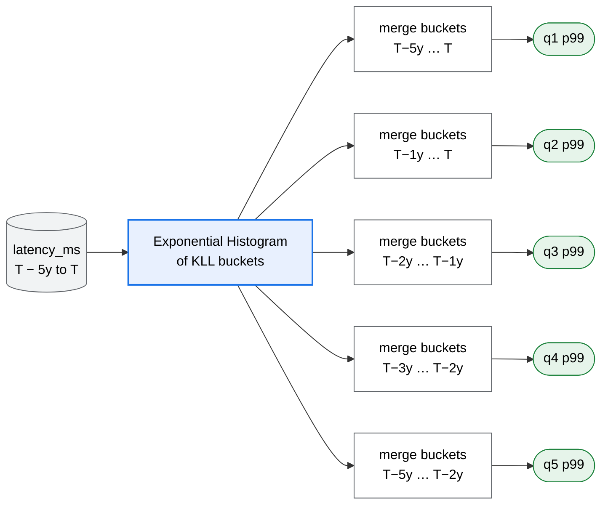
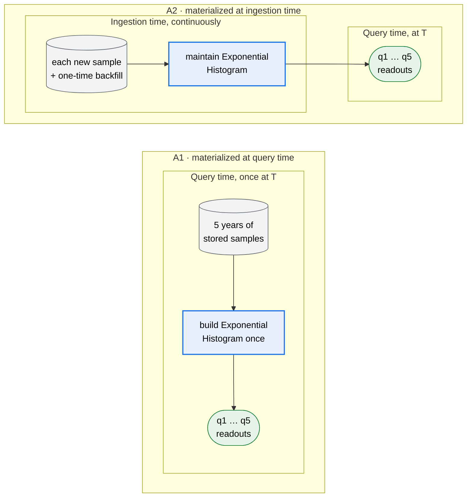

# ASAPPlanner Layering Design

Status: proposal. Audience: designers and developers of ASAPPlanner and of deployments such
as ASAPQuery-backend.

## Goal

ASAPPlanner takes a [query workload](https://github.com/ProjectASAP/ASAPPlanner/blob/main/crates/types/src/workload.rs), a [data workload](https://github.com/ProjectASAP/ASAPPlanner/blob/main/crates/types/src/workload.rs#L531) and the [deployment's
inputs](TODO: A data structure should be explicitly defined in another PR), and returns one optimal physical plan. It decides what is computed, how
it is computed, and which plan is best. The deployment only supplies inputs and
executes the plan: it supplies its own empirical cost estimation, empirical accuracy estimation and capabilities of deployment but never does the query planning or plan selection.

## Layers

x represents Cartesian product for enumerating and combining different optimization angles in planning. 

```text
 Query workload
   (PromQL / SQL / MetricsQL,
    query recurrence,
    accuracy requirements,
    latency requirements)

 + Data workload
   (streaming vs. data at rest,
    data distribution,
    cardinality)

 + Deployment inputs
   (cost model,
    accuracy model,
    deployment capabilities)
                         │
                         ▼
┌────────────────────────────── ASAPPlanner ──────────────────────────────┐
│                                                                        │
│ 0. Language-specific frontends                                         │
│    Parse and convert source-language queries into a common logical     │
│    representation. Reject unsupported query expressions.               │
│                                                                        │
│    Output: CandidateLogicalDAGs                                        │
│                                                                        │
│                         │                                              │
│                         ▼                                              │
│ Logical planning — what to compute                                     │
│                                                                        │
│ 1. Logical ASAP-aware optimization                                     │
│    Explore semantically equivalent and legal logical candidates:       │
│                                                                        │
│      summary families                                                  │
│      × query rewrites                                                  │
│      × sharing one summary across multiple computations                │
│                                                                        │
│    Output: CandidateLogicalASAPDAGs                                    │
│                                                                        │
│                         │                                              │
│                         ▼                                              │
│ Physical planning — how to compute                                     │
│                                                                        │
│ 2. Physical ASAP-aware optimization                                    │
│    Explore executable implementations of each logical candidate:       │
│                                                                        │
│      materialization decisions                                         │
│      × physical operator implementations                               │
│      × parallelism and partitioning                                    │
│      × resource management                                             │
│                                                                        │
│    Output: CandidatePhysicalASAPDAGs                                   │
│                                                                        │
│                         │                                              │
│                         ▼                                              │
│ 3. Plan selection                                                      │
│    Evaluate complete physical candidates using the deployment's        │
│    empirical cost and accuracy models. Reject candidates that violate  │
│    accuracy, latency, or capability constraints.                       │
│                                                                        │
│    Choose the cheapest valid plan for the whole workload.              │
│                                                                        │
└────────────────────────────────┬───────────────────────────────────────┘
                                 │
                                 ▼
                    one selected PhysicalASAPDAG
                                 │
                                 ▼
┌────────────────────────────── Deployment ───────────────────────────────┐
│                                                                        │
│ 4. Execution                                                           │
│   deployment executes the selected DAG (plan).                         │
│                                                                        │
└────────────────────────────────────────────────────────────────────────┘
```

The planner receives three groups of inputs:

| Input | Contents |
|---|---|
| Query workload | Source-language expressions, recurrence, predictability, time selection, accuracy requirements, and latency requirements |
| Data workload | Data arrival pattern, sampling cadence, ingestion volume and rate, cardinality, and distribution |
| Deployment inputs | Empirical cost model, empirical accuracy model, and execution capabilities |

Logical planning decides **what** to compute: summary families, query rewrites,
and sharing across computations and windows. Physical planning decides **how**
to compute it: materialization, execution placement, physical operators,
partitioning, parallelism, and resource allocation. Selection evaluates
complete physical candidates and chooses one plan for the whole workload.

## Layers/DAGs and what decisions each layer makes

Stages 0 to 2 each output a candidate set holding every semantically equivalent
and legal candidate DAG of that stage; stage 3 is the only step that chooses
one candidate DAG as output. Candidate sets are internal to ASAPPlanner and may
be shared or enumerated lazily. A stage may prune a candidate early only when
it is provably invalid (for example, a summary family that cannot meet the
query's accuracy target), and every rejected candidate carries a reason.

| Stage | Input | Decides | Output |
|---|---|---|---|
| 0. Frontends | Each `QueryWorkloadEntry.query` and `QueryWorkload.language` | Language semantics, and converting source-language queries into a common logical representation. Rejects constructs it cannot represent faithfully. | `CandidateLogicalDAGs`; nodes are logical operations with no summary operations |
| 1. Logical ASAP-aware optimization | Logical DAGs, and each query's accuracy requirements across the workload | **Pass 1 — Summary replacement and query rewriting:** apply query rewriting rules to each eligible sub-DAG and generate exact and summary-based candidates that satisfy its semantics and accuracy requirements. **Pass 2 — ASAP-aware CSE:** apply traditional CSE and summary-specific CSE rules across sub-DAGs and queries to generate shared computation candidates, while preserving independent candidates. | `CandidateLogicalASAPDAGs`; nodes include summary and window-primitive operations |
| 2. Physical ASAP-aware optimization | Logical ASAP DAGs, each entry's `recurrence` and `predictability`, the `DataWorkload` | **Materialization:** for each sub-DAG, whether its output is materialized and therefore computed at ingestion time or query time, and how long it is retained. **Physical operator implementation:** physical operators for every node. **Parallelism, partitioning, resources:** TODO. | `CandidatePhysicalASAPDAGs` |
| 3. Plan selection | Physical ASAP DAG candidates, `requirements`, the deployment's cost model, accuracy model and capabilities | Rejects candidates that miss an accuracy target, a latency bound or a capability; picks the cheapest valid plan for the whole workload. A shared state is costed once with all its consumers' demand. | One `PhysicalASAPDAG` |
| 4. Execution (deployment) | The selected `PhysicalASAPDAG` | Executes ingestion, storage, precomputation and query-time computation. | Query results |

### 0. Language-specific frontends

The frontend converts each query into a `LogicalDAG`. Nodes represent logical
query operations, including selectors, transformations, aggregations, grouping
and window semantics. They contain no ASAP summary choices.

The frontend preserves source-language behavior, including series identity,
evaluation timing and missing-data semantics. A construct that cannot be
represented faithfully is rejected.

### 1. Logical ASAP-aware optimization

Logical optimization runs in two passes. Pass 1 generates candidates for each
computation on its own; Pass 2 finds candidates that share computation across
sub-DAGs and queries. Neither pass decides materialization or execution
placement, and neither picks one summary per computation: every candidate is
kept for selection.

#### Pass 1: Local candidate generation

For each eligible sub-DAG, Pass 1 identifies its computation semantics, applies
rewrite rules, and generates every candidate that can meet its accuracy
requirement.

Example for summary candidates:
| Original computation | Local candidates |
|---|---|
| `Sum(x) by (g)` | Exact grouped sum |
| `TopK(k, x) by (g)` | Exact sort and limit per group, Count-Min Sketch with a top-*k* heap per group, Hydra over all groups |
| `Distinct(x)` | Exact distinct, a specialized distinct summary, UnivMon |
| `Entropy(x)` | Exact entropy, a specialized entropy summary, UnivMon |
| `L2(x)` | Exact L2 norm, a specialized norm summary, UnivMon |
| `Quantile(x, window)` | Exact quantile, KLL over the requested window |

Each candidate records its input expression, filter, grouping, window,
supported readouts and accuracy requirement. Pass 2 uses these to decide
whether candidates can share a producer.

A summary-based candidate has two kinds of nodes. The **summary node** builds
and maintains the summary from the input data, for example a KLL sketch over
`latency_ms`. A **readout node** computes a query's answer from that summary,
for example the p99 estimate from the KLL, or the entropy estimate from a
UnivMon. One summary node can feed several readout nodes, which is what Pass 2
exploits.

#### Pass 2: ASAP-aware common-subexpression elimination

ASAP-aware CSE extends traditional CSE with summary-specific sharing rules.
Computations can share a producer when they use identical expressions, when
one summary supports multiple readouts, or when summary composition supports
their overlapping windows.

The rules compare computations by their **summary input data**: what a summary for
that computation would ingest, namely the data source, the filters, and the key
or value being summarized together with its grouping. The summary input data does
not include the window; the window-composition rule compares windows
separately.

| ASAP-aware CSE rule | Sharing condition | Shared computation |
|---|---|---|
| Identical-expression rule | The input and computation semantics are identical. | One common computation node serving multiple consumers. |
| Summary-capability rule | The computations have the same summary input data and the same window, and one summary supports all requested computations and their accuracy requirements. | One summary node connected to multiple readout nodes; for example, one UnivMon over `src_ip` from `flows` in the last minute serves three queries refreshed every 10 s: `COUNT(DISTINCT src_ip)`, the entropy of the `src_ip` distribution, and the L2 norm of per-`src_ip` counts. Each flow record updates the one UnivMon node once; a distinct-count readout node, an entropy readout node and an L2 readout node each read their statistic from it. The UnivMon is sized for the strictest of the three accuracy requirements (Example 2). |
| Window-composition rule | The computations have the same summary input data, and the summary's merge and window capabilities can reconstruct the requested windows within their accuracy requirements. | Shared window-summary nodes connected to window-specific reconstruction and readout nodes; for example, (1) one sliding window of 1-min KLL panes serves every evaluation of `quantile_over_time(0.99, latency_ms[5m])` repeated every minute: each evaluation's readout node merges the latest 5 panes, so consecutive evaluations share 4 of their 5 panes (Example 3, Pattern B); (2) one Exponential Histogram of KLL buckets over the last 5 years serves the p99 queries over `[5y]`, `[1y]`, `[1y] offset 1y`, `[1y] offset 2y` and `[3y] offset 2y`: each query's reconstruction node merges the buckets covering its interval, and its readout node reads p99 from the merged KLL (Example 3, Pattern A). The same panes or buckets also serve other quantiles, since one KLL answers every quantile: adding `quantile_over_time(0.5, latency_ms[5m])` to the dashboard in (1) adds only a p50 readout node next to the p99 one, both reading the same 5 merged panes, with no new summary. |

Rules are defined by each summary family's capabilities and semantic
requirements. A shared summary must meet the strictest accuracy requirement
among its consumers. Applying a rule adds a shared candidate and keeps the
independent candidates, so selection can compare both.

### 2. Physical ASAP-aware optimization

Physical optimization turns each logical candidate into executable candidates.
It makes two ASAP-specific decisions, described below. Parallelism, partitioning
and resource management are TODO.

#### Materialization

Materialization decides, for each sub-DAG, whether its output is kept across
(batch) query executions, and if so, when it is computed and how long it is
stored. Materialization does not imply ingestion time; a sub-DAG has three
options:

* **Materialized at ingestion time:** the sub-DAG runs as data arrives, and its
  output is stored before any query asks for it. For example, the 1-min KLL
  panes in Example 4, Pattern B.
* **Materialized at query time:** the sub-DAG runs when a query first needs
  it, and its output is stored so that later executions, or other queries in
  the same batch, reuse it instead of recomputing it. For example, an
  Exponential Histogram built when the batch in Example 4, Pattern A runs and
  read by all five of its queries.
* **Not materialized:** the sub-DAG runs at query time for each execution, and
  its output is discarded afterward.

Whichever option is chosen for each sub-DAG, the plan must also satisfy these
constraints:

* A materialized output is stored for as long as any of its consumers still
  needs it.
* Query-time work cannot feed ingestion-time work, so every node feeding an
  ingestion-time sub-DAG also runs at ingestion time.
* Readout nodes, which compute a query's answer from a summary, always run at
  query time.

The decision depends on the workload's `recurrence` and `predictability` and on
the `DataWorkload`, none of which logical planning reads. Typical outcomes:

* Read by repeated queries while data keeps arriving: materialize at ingestion
  time.
* Read by several queries in one batch, or over data at rest: materialize at
  query time.
* Read once by an ad hoc query: do not materialize.

A shared summary is materialized once for all its consumers. See Example 4.

#### Physical operator implementation

Physical operator implementation lowers every node to physical operators, for
example TopK as a sort followed by a limit, or a KLL node as summary build,
merge and quantile readout operators.

### 3. Plan selection

Selection rejects every physical candidate that the deployment's accuracy model
estimates will miss an accuracy target, that misses a latency bound, or that
needs a capability the deployment lacks. Among the remaining candidates, it
uses the deployment's cost model to choose the cheapest plan for the whole
workload. A shared state is costed once, with the demand of all its consumers.

### 4. Execution

The deployment executes the selected `PhysicalASAPDAG`: ingestion, storage,
precomputation and query-time computation. It makes no planning decisions.

## End-to-end examples

Every example below is a `PlanningWorkload` in the serialized form of
[`workload.rs`](https://github.com/ProjectASAP/ASAPPlanner/blob/main/crates/types/src/workload.rs).
Times and durations are milliseconds.

| Example | Shows |
|---|---|
| 1. Aggregation over dimensions | Pass 1: summary replacement |
| 2. One summary for several computations | Pass 2: summary-capability rule |
| 3. Aggregation over windows | Pass 1 and Pass 2: window-composition rule |
| 4. Materialization of window summaries | Stage 2: materialization, decoupled from stage 1 |

In the diagrams below, grey cylinders are input data, white boxes are exact
operations, blue boxes are summary nodes, and green rounded boxes are readout
nodes.

### Shared data workload

Unless an example says otherwise, the queried metric is scraped every 15 s
from about one million series with Zipf-distributed keys, and is still
arriving:

```json
"data_workload": {
  "arrival": "continuously_ingesting",
  "data_ingestion_interval": {"value": 15000, "source": "declared", "observed_at_ms": null, "valid_for_ms": null},
  "ingestion_volume":        {"value": null,    "source": "unknown",  "observed_at_ms": null, "valid_for_ms": null},
  "ingestion_rate":          {"value": 66667.0, "source": "declared", "observed_at_ms": null, "valid_for_ms": null},
  "input_cardinality":       {"value": 1000000, "source": "declared", "observed_at_ms": null, "valid_for_ms": null},
  "distribution":            {"value": "zipf",  "source": "declared", "observed_at_ms": null, "valid_for_ms": null}
}
```

### Example 1: Aggregation over dimensions — summary replacement in Pass 1

**Query workload.** Two dashboard panels refresh every 10 s over the last
minute. The first needs an exact total; the second tolerates error.

```json
"query_workload": {
  "language": "promql",
  "query_batch": null,
  "repeating_queries": [
    {
      "query": "sum by (job) (rate(http_requests_total[1m]))",
      "demand": {"fixed_interval": 10000},
      "requirements": {"accuracy": "implicit_exact", "response_latency": "unspecified"},
      "predictability": {"predictable": {"known_at": null}},
      "time_selection": {"scope": "real_time", "lookback": 60000, "as_of": null}
    },
    {
      "query": "topk by (job) (10, sum_over_time(http_requests_total[1m]))",
      "demand": {"fixed_interval": 10000},
      "requirements": {
        "accuracy": {"explicit": {"EpsilonDelta": {"epsilon": 0.01, "delta": 0.001}}},
        "response_latency": {"explicit_max_ms": 100.0}
      },
      "predictability": {"predictable": {"known_at": null}},
      "time_selection": {"scope": "real_time", "lookback": 60000, "as_of": null}
    }
  ]
}
```

**Stage 0.** The two `LogicalDAG`s are
`range m[1m] → rate → sum by (job)` and
`range m[1m] → sum_over_time → topk by (job) (10)`.

**Stage 1, Pass 1.**

* `sum by (job) (rate(...))`: the accuracy requirement is `implicit_exact`, and
  an exact grouped sum already keeps one value per `job`. The only candidate is
  a per-series Rate feeding an exact per-`job` Sum. No summary helps here.
* `topk by (job) (10, ...)`: the exact candidate keeps a per-series sum and
  sorts within each `job`, which is costly at one million Zipf-distributed
  series. The `EpsilonDelta` target admits two summary candidates:
  1. **Count-Min Sketch with a top-*k* heap per `job`.** One sketch per group;
     each answers its own top 10.
  2. **Hydra over the whole `job` column.** One sketch covers every (`job`,
     series) key and answers the top 10 for any `job`.

  Pass 1 keeps all three candidates. The better summary depends on the number
  of jobs and on costs that only the deployment knows.

```mermaid
flowchart LR
  subgraph L["Stage 0 · LogicalDAG"]
    direction LR
    a1[("http_requests_total<br/>last 1m")]:::data --> a2["sum_over_time"]:::exact --> a3["topk by (job) (10)"]:::exact
  end
  subgraph C["Stage 1, Pass 1 · CandidateLogicalASAPDAGs"]
    direction TB
    subgraph E["Exact"]
      direction LR
      e1[("input")]:::data --> e2["sum_over_time<br/>per series"]:::exact --> e3["sort + limit 10<br/>per job"]:::exact
    end
    subgraph CM["Count-Min + heap per job"]
      direction LR
      c1[("input")]:::data --> c2["Count-Min Sketch +<br/>top-10 heap, one per job"]:::summary --> c3(["top 10<br/>per job"]):::readout
    end
    subgraph H["Hydra"]
      direction LR
      h1[("input")]:::data --> h2["Hydra over<br/>(job, series)"]:::summary --> h3(["top 10<br/>for each job"]):::readout
    end
  end
  S{{"Stage 3 · cheapest valid candidate<br/>many small jobs → Hydra<br/>few large jobs → Count-Min per job"}}
  L --> C --> S
  classDef data fill:#f1f3f4,stroke:#5f6368,color:#000;
  classDef exact fill:#fff,stroke:#5f6368,color:#000;
  classDef summary fill:#e8f0fe,stroke:#1a73e8,stroke-width:2px,color:#000;
  classDef readout fill:#e6f4ea,stroke:#188038,color:#000;
```



**Stage 3.** The deployment's accuracy model checks that each summary candidate
meets ε = 0.01, δ = 0.001, and its cost model compares per-`job` sketches with
one Hydra sketch. With many small jobs, one shared Hydra sketch is typically
cheaper; with a few large jobs, per-`job` Count-Min sketches may win.

### Example 2: One summary for several computations — the summary-capability rule in Pass 2

**Query workload.** A network-monitoring dashboard computes three statistics of
source IPs over the last minute, every 10 s. Each SQL query below is one
`RepeatingEntry` with `"demand": {"fixed_interval": 10000}` and
`"time_selection": {"scope": "real_time", "lookback": 60000, "as_of": null}`,
in a workload with `"language": {"sql": "datafusion_sql"}`.

| Query | Computation | Accuracy |
|---|---|---|
| `SELECT COUNT(DISTINCT src_ip) FROM flows WHERE ts >= now() - INTERVAL '1 minute'` | `Distinct(src_ip)` | ε = 0.02, δ = 0.01 |
| `SELECT -SUM(p * LN(p)) FROM (SELECT COUNT(*) * 1.0 / SUM(COUNT(*)) OVER () AS p FROM flows WHERE ts >= now() - INTERVAL '1 minute' GROUP BY src_ip)` | `Entropy(src_ip)` | ε = 0.05, δ = 0.01 |
| `SELECT SQRT(SUM(c * c)) FROM (SELECT src_ip, COUNT(*) AS c FROM flows WHERE ts >= now() - INTERVAL '1 minute' GROUP BY src_ip)` | `L2(src_ip)` | ε = 0.01, δ = 0.01 |

The data workload is as above, except that `input_cardinality` is the number of
distinct source IPs (say 10 million) and `data_ingestion_interval` is not
needed for SQL.

**Pass 1.** Rewrite rules recognize the three computations, and each gets its
local candidates from the Pass 1 table: exact, a specialized summary, or
UnivMon.

**Pass 2.** All three computations have the same summary input data (`src_ip`
from `flows`, no other filter) and the same 1-min window. UnivMon supports all three
readouts, so the summary-capability rule adds a shared candidate: **one
UnivMon node feeding three readout nodes**. It must be sized for the strictest
requirement, ε = 0.01. The independent candidates are kept as well.



Exact candidates for each computation are also kept but omitted from the
diagram.

**Stage 3.** Selection compares one UnivMon sized for ε = 0.01 against three
separate summaries, each sized for its own requirement. The shared candidate
usually wins because each flow record updates one summary instead of three.

### Example 3: Aggregation over windows — the window-composition rule in Pass 2

This example has two workload patterns that both lead to a shared window
summary.

**Pattern A: a batch of sub-interval queries over historical data.** An analyst
submits a batch of p99 latency reports over different historical intervals,
executed together at T = `1790000000000`:

| Query | `lookback` | `as_of` |
|---|---|---|
| `quantile_over_time(0.99, latency_ms[5y])` | 5 y | T |
| `quantile_over_time(0.99, latency_ms[1y])` | 1 y | T |
| `quantile_over_time(0.99, latency_ms[1y] offset 1y)` | 1 y | T − 1 y |
| `quantile_over_time(0.99, latency_ms[1y] offset 2y)` | 1 y | T − 2 y |
| `quantile_over_time(0.99, latency_ms[3y] offset 2y)` | 3 y | T − 2 y |

Each row is a `BatchEntry` such as:

```json
{
  "query": "quantile_over_time(0.99, latency_ms[1y] offset 1y)",
  "requirements": {"accuracy": {"explicit": {"EpsilonDelta": {"epsilon": 0.005, "delta": 0.01}}}, "response_latency": "unspecified"},
  "predictability": "ad_hoc",
  "invocations": 1,
  "execute_at": 1790000000000,
  "time_selection": {"scope": "longitudinal", "lookback": 31536000000, "as_of": 1758464000000}
}
```

The data workload has `"arrival": "mixed"`: five years at rest plus data still
arriving.

* **Pass 1.** Each `quantile_over_time` gets an exact candidate and a KLL over
  its own interval: five independent KLL candidates over overlapping data.
* **Pass 2.** Every interval is a sub-interval of [T − 5 y, T], and KLL is
  mergeable. The window-composition rule adds a shared candidate: **one
  Exponential Histogram of KLL buckets over [T − 5 y, T]**, with one
  reconstruction and readout node per query that merges the buckets covering
  its interval. The five independent candidates are kept.

The five query intervals overlap, and all lie inside the last five years:



The shared candidate replaces five KLL sketches with one Exponential Histogram
and a reconstruction and readout node per query:



**Pattern B: one repeating query over a sliding window.** A real-time p99 panel
over the last 5 min, refreshed every minute:

```json
{
  "query": "quantile_over_time(0.99, latency_ms[5m])",
  "demand": {"fixed_interval": 60000},
  "requirements": {"accuracy": {"explicit": {"EpsilonDelta": {"epsilon": 0.01, "delta": 0.01}}}, "response_latency": {"explicit_max_ms": 200.0}},
  "predictability": {"predictable": {"known_at": null}},
  "time_selection": {"scope": "real_time", "lookback": 300000, "as_of": null}
}
```

* **Pass 1.** One KLL over 5 min for each evaluation.
* **Pass 2.** Consecutive evaluations overlap by 4 of their 5 minutes. The
  window-composition rule adds a shared candidate: **a sliding window of
  1-min KLL panes**, where each evaluation merges the latest 5 panes.

Each evaluation reads five 1-min panes, and consecutive evaluations share
four of them:

```mermaid
gantt
  title Pattern B · 1-min KLL panes and 5-min evaluations
  dateFormat HH:mm
  axisFormat %H:%M
  section KLL panes
  pane 1 :p1, 00:00, 1m
  pane 2 :p2, 00:01, 1m
  pane 3 :p3, 00:02, 1m
  pane 4 :p4, 00:03, 1m
  pane 5 :p5, 00:04, 1m
  pane 6 :p6, 00:05, 1m
  pane 7 :p7, 00:06, 1m
  section Evaluations
  eval at 00:05 (panes 1–5) :e1, 00:00, 5m
  eval at 00:06 (panes 2–6) :e2, 00:01, 5m
  eval at 00:07 (panes 3–7) :e3, 00:02, 5m
```



In both patterns, stage 1 decides only **which** window summary computes the
answer. It says nothing about when panes or buckets are built or whether they
are stored.

### Example 4: Materialization of window summaries in physical planning

Stage 2 takes the shared window summaries from Example 3 and decides whether to
materialize them. That choice is driven by the workload's `recurrence`,
`predictability` and `data_workload.arrival`, none of which stage 1 reads.

**Pattern B (sliding window, repeating).**

| Candidate | Materialized | At ingestion time | At query time |
|---|---|---|---|
| B1 | 1-min KLL panes, retained 5 min | Build one KLL pane per minute | Merge the latest 5 panes, read p99 |
| B2 | Nothing | Nothing | Read 5 min of raw samples, build one KLL, read p99 |


The query repeats every minute and the data is continuously ingesting, so B1
builds each pane once and reuses it in five evaluations, while B2 rescans raw
data every time. Selection usually picks B1. B2 wins only if storage is
expensive and raw data is available at query time.

**Pattern A (sub-interval batch).**

| Candidate | Materialized | When the Exponential Histogram is built |
|---|---|---|
| A1 | The Exponential Histogram, at query time | At query time, when the batch runs at T; read by all five queries, then discarded |
| A2 | The Exponential Histogram, at ingestion time | At ingestion time, with each new sample; old data backfilled once |



Which candidate wins depends on the workload:

* **As given** (`invocations: 1`, `ad_hoc`): selection picks A1. A2 would
  maintain the histogram for years only to serve one batch.
* **Repeated monthly and `Predictable { known_at }`:** A2 can win, because its
  maintenance cost is shared by many batches.
* **Data `"at_rest"`:** A2 is not generated, because there is no ingestion to
  maintain the histogram.

**What this shows.** The same logical candidate (a sliding window of KLL panes,
or one shared Exponential Histogram) yields different physical plans depending
only on recurrence, predictability and data arrival. This is why window-summary
replacement happens in logical planning, while materialization is decided
separately in physical planning.
