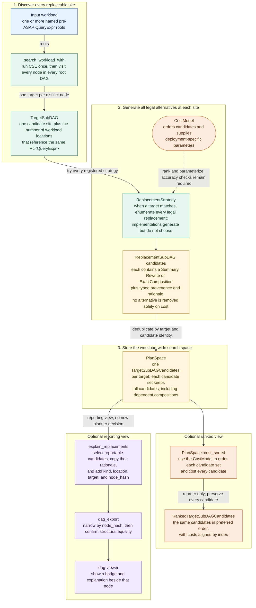
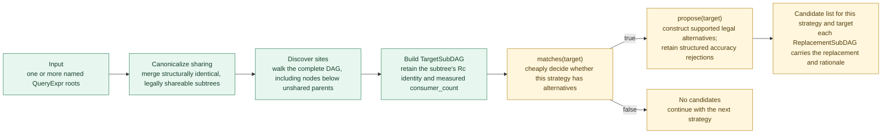

# ASAP-Aware Mapping architecture

This document explains the architecture of ASAP-aware mapping: the planning
layer that turns logical query operations into alternative `Realization`
values built from ASAP primitives, such as exact summaries and approximate
sketches. Here, a **realization** is one candidate physical form of
one logical operation—not a selected workload plan or a deployed executable.
Read it to understand how strategies, realizations, and costing interact.

For procedural work—adding a `ReplacementStrategy`, changing a `CostModel`, or
writing the expected tests—use [Extend ASAP-aware mapping](extend-asap-aware-mapping.md).

For the higher-level motivation and replacement-plan-search design, see the
[ASAP-aware mapping overview](../design_docs/architecture/asap-aware-mapping.md). Current interfaces are
defined in [mapping contracts](asap-aware-mapping-contracts.md).

Names such as `MyStrategy`, `MyCostModel`, and `PreferDDSketch` are
illustrative; they do not ship with this crate. Samples that use real public
types and functions follow the APIs exported by `asap-aware-mapping`.

If you only need to find the right extension point, start with the [extension map](extend-asap-aware-mapping.md#7-current-extension-map). If you are implementing a strategy, read this mental model, the [mapping contracts](asap-aware-mapping-contracts.md), and the [extension guide](extend-asap-aware-mapping.md).

---

## Code architecture

## 1. Mental model

ASAP-aware mapping has two different jobs that should remain separate:

1. **Generate valid alternatives.**
2. **Rank alternatives and optionally coordinate compatible selections.**

`ReplacementStrategy` is responsible for the first job.

`CostModel` supplies preferences and cost evidence for the second; search and
selection APIs apply those decisions while preserving legality.

A strategy should answer:

> Does this transformation apply here, and if so, what are all semantically valid replacements?

A cost model should answer:

> Given valid choices, which choices are preferable, and how should they be parameterized?

Do not put cost-based pruning into a `ReplacementStrategy`. A strategy must enumerate every valid alternative, even when the default cost model clearly prefers one. See [Rule 2](extend-asap-aware-mapping.md#rule-2-enumerate-do-not-rank).

---

## 2. Architecture overview

The diagram below follows a workload of one or more query roots through target discovery, candidate generation, ranking, reporting, and downstream visualization. Section 3 focuses on the replacement-strategy path.

Terminology used in the diagram:

- A **workload** is the set of named queries planned together. A **query root**
  is the top-level `QueryExpr` (the logical query-expression type) for one of
  those queries. **Pre-ASAP** means this logical input form, before the planner
  realizes an operation as a concrete ASAP realization; **post-ASAP** means
  the resulting realization form.
- A **DAG** (directed acyclic graph) represents query operators whose subtrees
  may be shared. **CSE** (common subexpression elimination) finds equivalent
  subtrees and represents legal reuse by making them the same shared node.
  Rust's `Rc<T>` (reference-counted pointer) records that shared node identity.
- A **target** is one replaceable site. A **candidate** is one valid alternative
  for it. `Replacement::Summary` is a constructed post-ASAP summary—maintained state
  such as an exact accumulator or an approximate sketch—while
  `Replacement::Rewrite` is another pre-ASAP logical expression.
  `Replacement::ExactComposition` refers to a child target whose realization
  must remain undecided until compatible selection. A **sketch**
  is a compact data structure that trades exactness for bounded error. A
  query's **accuracy target** states the allowed error and failure probability.
  A candidate's **rationale** is its human-readable explanation.
- `PlanSpace` is a compact candidate space with one
  `TargetSubDAGCandidates` per target instead of one full plan per combination of choices.
  A `node_hash` is a structural fingerprint used to narrow explanation lookup;
  exact structural equality is still checked afterward.

The generic `ReplacementStrategy` box is the extension point. The default
registry supplies summary realization, Hydra grouping, shared-subtree,
average-rewrite and exact-composition strategies. Section 3.3 describes the
registries and the workload-derived roll-up rule.

---

## 3. How the current pieces fit together

The planner repeats one operation throughout the workload: find a target, ask
each registered strategy for every valid replacement, and store those
replacements as alternatives for that target. Ranking happens only after the
complete alternative set has been built.

### 3.1 Discover targets across the workload

Use `search_workload` or `search_workload_with` for normal planner search. The
search performs these steps:

1. Run CSE once to merge structurally identical subtrees that may legally be
   shared.
2. Walk the complete DAG beneath every query root, including nodes below
   unshared parents.
3. Construct one `TargetSubDAG` per distinct node, with the node's measured
   `consumer_count`.
4. Run every registered `ReplacementStrategy` against each target to a
   **fixpoint**: repeat until no new candidates are discovered, subject to
   `MAX_SEARCH_ITERATIONS`. Search also prepares compatible compositions.
   `search_workload_with_targets` applies explicit per-root accuracy targets
   before ranking.

The discovery and strategy-invocation path is:

`consumer_count` is workload information, not an estimate of runtime
executions. It matters to strategies such as `SharedSubtreeStrategy`, which
only has a share-versus-recompute choice when a target has multiple consumers.

### 3.2 Generate candidates through `ReplacementStrategy`

For each target, the planner first calls `matches(target)`. A matching strategy
then supplies accepted candidates and structured rejections through
`propose(target)`. Its default wraps `replacements(target)`; strategies with
accuracy checks can override it.

Each returned `ReplacementSubDAG` contains:

- a `Replacement`: a constructed summary, logical rewrite or dependent exact
  composition;
- the proposing strategy name and typed provenance; and
- the rationale for offering that replacement.

The containing `TargetSubDAGCandidates` records the target. Legality includes required schema,
capability and accuracy checks; supported algorithm applicability alone is not
a result certificate.

The complete `replacements()` result is the candidate set produced by one
strategy for one target. A strategy may order or parameterize candidates with
help from a `CostModel`, but it must not remove a valid candidate because of
cost.

### 3.3 Current concrete strategies

The default context-free registry contains five `ReplacementStrategy` implementations:

- `SketchAlgorithmStrategy` matches supported aggregate and binary shapes. Its
  `replacements(target)` method constructs every legal post-ASAP `SummaryNode`,
  including applicable sketch, exact-accumulator, and pass-through
  realizations. Candidates are sized and ordered for the target's accuracy
  requirement; candidates without a sufficient guarantee are rejected before
  costing.
- `SharedSubtreeStrategy` uses `consumer_count` to identify shared targets. It
  emits both build-once-and-share and recompute-independently rewrites when a
  target has multiple consumers.
- `HydraGroupingStrategy` proposes eligible shared multi-subpopulation layouts.
- `AvgToSumOverCountStrategy` proposes supported average rewrites.
- `ExactCompositionStrategy` preserves child-target references for compatible
  composition selection.

`default_strategies_with` uses `SemanticEquivalentRewriteStrategy` in its rewrite
slot. The evidence-aware registry supplies the accuracy evidence provider to
summary and Hydra construction. Search derives `RollupStrategy` after CSE from
the actual sibling set. See the
[registry definitions](../../crates/asap-aware-mapping/src/replacement.rs).

The important rule is:

> Strategies should reuse existing decision and implementation logic where possible instead of reimplementing it.

These strategies expose their alternatives through the same
`ReplacementSubDAG` interface, so search and reporting do not need
strategy-specific discovery logic.

### 3.4 Store and rank the complete search space

Workload search deduplicates candidates into a `PlanSpace`. Each distinct
target has one `TargetSubDAGCandidates` containing retained alternatives and
rejection reasons. This
compact representation preserves independent choices without enumerating a flat
list of `2^N` complete plans for `N` replaceable targets.

`PlanSpace::cost_sorted` ranks each target's existing candidates with the
supplied `CostModel`. It returns the same candidates in preferred order, with
costs aligned by index; ranking does not select or remove a candidate.

### 3.5 Single-target use and final selection

`TargetSubDAG::new(&root)` creates a target for one isolated node and sets
`consumer_count` to `1`. It is useful for tests and focused tooling, but it does
not discover targets or provide workload-level sharing information. Use
`search_workload` or `search_workload_with` whenever accurate consumer counts
matter.

A single-target inspection caller may take the first
candidate with `.into_iter().next()` and handle the empty case according to its
execution policy. Constructing all candidates before taking the first costs
more than constructing only the preferred candidate, but it keeps the strategy
contract consistent and preserves the full choice set for other callers.

`PlanSpace::global_selection` optionally coordinates cross-target sharing and
composition choices. `GlobalSelection::assemble_selected_dag` constructs the selected
semantic DAG. These plain APIs do not establish lifecycle or physical deployment
feasibility. Recurrence and lifecycle-aware variants require the corresponding
workload and evidence inputs; downstream owns physical commitment and execution.
See the [library workflow](library-api.md#optional-whole-plan-selection-and-dag-assembly).

---
