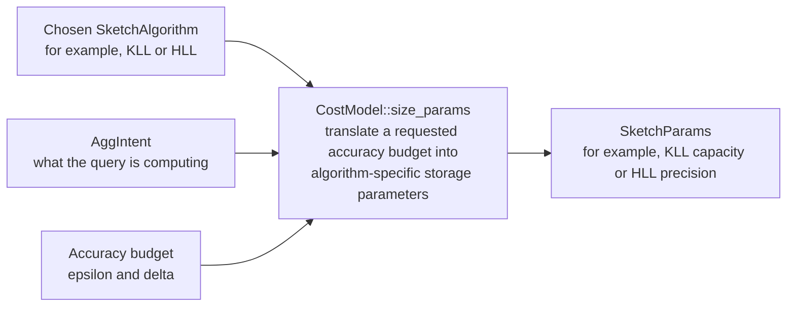

# Customize a cost model

Audience: developers changing ordering, sizing, or cost evidence. Read the
[shared contracts](asap-aware-mapping-contracts.md#cost-and-accuracy) first.


### Adding a custom `CostModel`

Use a custom `CostModel` when you want to change preferences or cost assumptions without changing transformation legality.

A minimal model can override only the hook it cares about.

For example (illustrative — `PreferDDSketch` is not a real type in this crate):

```rust
struct PreferDDSketch;

impl CostModel for PreferDDSketch {
    fn rank_candidates(
        &self,
        _intent: &AggIntent,
        candidates: &[SketchAlgorithm],
    ) -> Vec<SketchAlgorithm> {
        let mut ranked = candidates.to_vec();

        if let Some(pos) =
            ranked.iter().position(
                |k| *k == SketchAlgorithm::DDSketch
            )
        {
            let dd = ranked.remove(pos);
            ranked.insert(0, dd);
        }

        ranked
    }
}
```

Then inject it into code that accepts a `&dyn CostModel`:

```rust
let model = PreferDDSketch;

let strategy =
    SketchAlgorithmStrategy::new(&model);

let replacements =
    strategy.replacements(&target);
```

Important: changing `rank_candidates` changes the preferred ordering, but `SketchAlgorithmStrategy` still enumerates every valid sketch candidate.

A custom cost model should not change which alternatives are semantically legal.

---

### Which `CostModel` hook should I implement?

Use this as a practical guide.

#### `rank_candidates`

Use when you want to change the preference among valid sketch algorithms.

Example:

```text
KLL vs. DDSketch
HLL vs. Theta vs. KMV
```

Signature:

```rust
fn rank_candidates(
    &self,
    intent: &AggIntent,
    candidates: &[SketchAlgorithm],
) -> Vec<SketchAlgorithm>;
```

The returned vector should rank candidates from most to least preferred.

It must return a permutation of the supplied candidates: every input candidate exactly once, with no additions or removals. Planner call sites enforce this contract and panic if a cost model violates it.

---

#### `size_params`

Use when the sketch algorithm is already known and you want to choose its parameters from an accuracy target.

Signature:

```rust
fn size_params(
    &self,
    kind: SketchAlgorithm,
    intent: &AggIntent,
    eps: f64,
    delta: f64,
) -> SketchParams;
```

Typical uses include:

- choosing KLL capacity,
- choosing HLL precision,
- selecting sketch-specific error parameters.

Conceptually:



---

#### `realize_extension`

Use for extension-defined implementation kinds.

```rust
fn realize_extension(
    &self,
    ext_kind: &str,
    payload: &serde_json::Value,
) -> Implementation;
```

This is the hook for turning an extension description into a concrete `Implementation`.

Use it for implementation families that are intentionally outside the built-in enum dispatch.

---

#### `readout_extension`

Use when an extension-defined summary also needs custom query/readout behavior.

```rust
fn readout_extension(
    &self,
    ext_kind: &str,
    payload: &serde_json::Value,
    col: &ColumnRef,
) -> SketchQuery;
```

This complements `realize_extension`: realization defines what gets maintained; readout defines how it is queried (see the [mapping contracts](asap-aware-mapping-contracts.md#cost-and-accuracy)).

---

#### `cse_recompute_cost`

Use to estimate the cost of computing a common subtree independently at each consumer.

```rust
fn cse_recompute_cost(
    &self,
    candidate: &CseCandidate,
) -> Cost;
```

---

#### `cse_shared_maintenance_cost`

Use to estimate the cost of computing and maintaining a shared subtree.

```rust
fn cse_shared_maintenance_cost(
    &self,
    candidate: &CseCandidate,
) -> Cost;
```

---

#### `cse_share_decision`

Use when the ranking path needs a share-vs.-recompute preference.

```rust
fn cse_share_decision(
    &self,
    candidate: &CseCandidate,
) -> ShareDecision;
```

The replacement-strategy layer should still expose both valid alternatives where appropriate. This hook is the cost-sensitive decision point for code paths that need to commit to one answer.

---

#### `estimate_cost`

Use when callers need a comparable numeric cost for each replacement, in addition to relative ordering.

```rust
fn estimate_cost(
    &self,
    candidate: &ReplacementSubDAG,
    target: &TargetSubDAG<'_>,
) -> f64;
```

The default returns `f64::NAN`, making the absence of a numeric model explicit. Override this hook when passing the model to `PlanSpace::cost_sorted` if downstream code displays or otherwise consumes the `costs` values. Prefer to derive the result from the same inputs used by `rank_candidates` and the CSE cost hooks so numeric costs do not disagree with relative ordering.

---

### Testing a new cost model

A cost-model test should focus on the hook being customized.

For ranking:

```rust
let ranked =
    model.rank_candidates(
        &intent,
        &[SketchAlgorithm::Kll,
          SketchAlgorithm::DDSketch],
    );

assert_eq!(
    ranked[0],
    SketchAlgorithm::DDSketch
);
```

Then test integration through a consumer of the cost model.

For example:

```rust
let strategy =
    SketchAlgorithmStrategy::new(&model);

let replacements =
    strategy.replacements(&target);
```

The important assertion is usually not that other valid candidates disappeared. They should not.

Instead verify that:

- the model changes ordering or parameters as intended,
- all legal candidates remain available to the replacement layer.

For sizing, test representative accuracy targets and assert the resulting `SketchParams`.

For CSE costing, create a representative `CseCandidate` and test recompute cost, shared-maintenance cost, and the resulting `ShareDecision`.

---


## Accuracy and evidence boundaries

Parameter sizing proposes a configuration. Derive accuracy again from the
committed parameters, including rounding and clamps, and reject a configuration
that cannot satisfy the target. Add a test showing that an attractive cost does
not admit an accuracy-illegal candidate.

Use the [library guide](library-api.md#choose-strategies-and-models) to inject
models consistently into generation and ranking. For physical or lifecycle
comparisons, use the corresponding evidence-aware model and preserve unavailable
costs; do not replace missing physical evidence with a structural estimate.
See [physical operator evidence](physical-operator-reference.md) and
[offline sketch evidence](offline-sketch-evidence.md).
