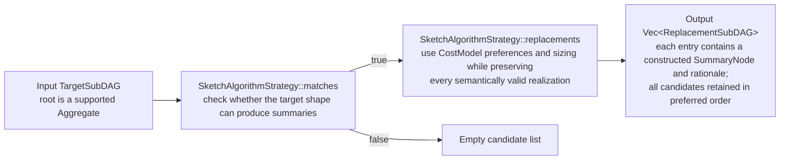
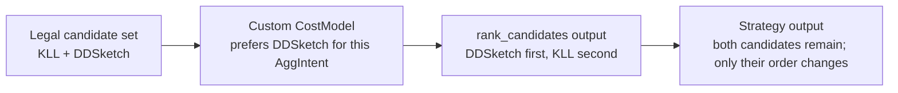
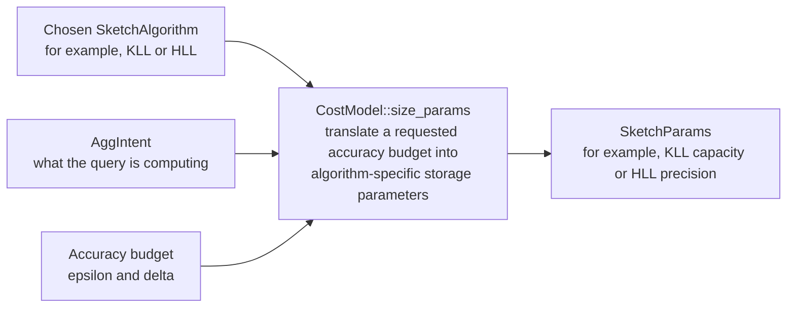
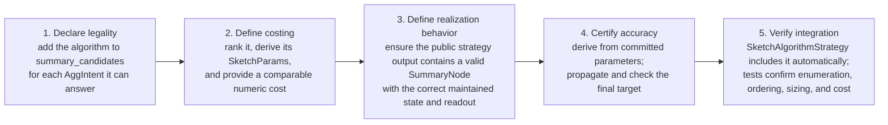

# Extend ASAP-aware mapping

Use this guide after reading the [mapping architecture](asap-aware-mapping-architecture.md)
and consulting the [mapping contracts](asap-aware-mapping-contracts.md).

## Add or change planner behavior

## 1. Adding a new `ReplacementStrategy`

A new optimization should normally be introduced as a new implementation of `ReplacementStrategy`.

Do not change the trait just because a new optimization is added.

Start with this skeleton (illustrative — `MyStrategy` is not a real type in this crate):

```rust
pub struct MyStrategy;

impl ReplacementStrategy for MyStrategy {
    fn matches(&self, target: &TargetSubDAG<'_>) -> bool {
        // Return true only when this transformation is applicable.
        todo!()
    }

    fn replacements(
        &self,
        target: &TargetSubDAG<'_>,
    ) -> Vec<ReplacementSubDAG> {
        if !self.matches(target) {
            return Vec::new();
        }

        // Enumerate every semantically valid replacement.
        todo!()
    }
}
```

There are four decisions to make.

---

### Define the target shape

`matches` should contain the minimum structural and semantic checks needed to determine whether the strategy applies.

For example, the aggregate path in `SketchAlgorithmStrategy` requires a
supported shape:

- the node is an `Aggregate`,
- it has one aggregation intent,
- it does not have `HAVING`.

The strategy also handles supported binary and temporal-average shapes. Consult
its current `matches` and `propose` implementations instead of assuming that every
target is an aggregate.

A strategy that depends on cross-query context may additionally inspect `consumer_count`.

For example:

```rust
fn matches(&self, target: &TargetSubDAG<'_>) -> bool {
    target.consumer_count >= 2
}
```

is enough for the current shared-subtree strategy.

#### Guideline

Keep `matches` cheap and unsurprising.

It should answer *whether the strategy applies here* in the plain English sense — not `explanation.rs`'s formal `ReplacementExplanation` concept (issue #257, a separate reporting layer over this trait's own output — see [mapping contracts](asap-aware-mapping-contracts.md#2-replacement-explanations-explanationrs)). `matches` isn't that machinery and doesn't need to produce anything it consumes; it should also not perform ranking or choose a winner.

---

### Enumerate every valid alternative

`replacements` should return every semantically valid candidate for a matched target.

For example, if a quantile can be represented by:

```text
KLL
DDSketch
```

then both should be returned.

Do not write:

```rust
if kll_is_cheaper {
    vec![kll]
} else {
    vec![ddsketch]
}
```

inside a strategy.

That would throw away part of the search space before the cost model can compare complete plans.

Instead:

```rust
vec![kll, ddsketch]
```

and let costing decide later.

---

### Choose `Summary` vs. `Rewrite`

Return:

```rust
Replacement::Summary(...)
```

when the candidate is a fully constructed post-ASAP summary.

Return:

```rust
Replacement::Rewrite(...)
```

when the candidate is a logical pre-ASAP rewrite.

Use `Replacement::ExactComposition` when a candidate depends on a child target
whose implementation must be selected compatibly later. Do not bind it to the
first child alternative during enumeration.

This distinction matters because a rewrite may enable more transformations
later, while a constructed summary represents a concrete summary realization.

---

### Add a rationale

Every `ReplacementSubDAG` should explain why the candidate exists.

Good:

```rust
ReplacementSubDAG {
    replacement: ...,
    strategy: "MyStrategy",
    provenance: ..., // typed role, e.g. LogicalRewrite
    rationale: "derive service-level aggregate by rolling up the \
                mergeable service+region aggregate".into(),
}
```

Less useful:

```rust
rationale: "candidate 2".into()
```

The rationale should help a developer understand a planner trace without reading the strategy implementation.

Do not encode machine-readable state into the string.

---

### Strategy contract

Every new strategy should follow these rules.

#### Rule 1: `matches == false` should be safe

The existing strategies return an empty vector when `replacements` is called on a target they do not match.

Follow the same convention:

```rust
if !self.matches(target) {
    return Vec::new();
}
```

Do not panic simply because the caller skipped a prior `matches` call.

---

#### Rule 2: enumerate; do not rank

A strategy owns **legality and enumeration**.

A cost model owns **preference and costing**.

This separation is the most important extension rule in this module.

---

#### Rule 3: do not duplicate an existing decision procedure

If another module already knows how to determine whether something is legal or
how to realize it, wrap that logic.

Do not create a second implementation of the same semantics inside the strategy.

The existing `SketchAlgorithmStrategy` is the model to follow: it reuses
`replacement.rs`'s existing candidate list and summary-construction path.

---

#### Rule 4: preserve semantics

Every returned replacement must be semantically valid for the target.

Cost differences do not justify semantic differences.

If a transformation is only valid under additional summary properties, grouping assumptions, or accuracy constraints, check those conditions before returning the candidate.

---

#### Rule 5: a strategy does not need to discover the whole workload

`TargetSubDAG` is passed into the strategy.

The strategy is responsible for deciding what to do with that target, not for walking every workload root to discover targets.

If your transformation requires context not currently represented in `TargetSubDAG`, that is a design question about target metadata or search/discovery — not a reason to hide a second workload traversal inside `replacements`.

---

### Example: current `SketchAlgorithmStrategy`

`SketchAlgorithmStrategy` is the reference implementation for a strategy that
produces constructed post-ASAP summaries.

Construction:

```rust
let strategy =
    SketchAlgorithmStrategy::default_cost_model();
```

or with a custom cost model:

```rust
let model = MyCostModel; // illustrative
let strategy = SketchAlgorithmStrategy::new(&model);
```

The strategy matches supported aggregate nodes.

At a high level:



For an approximate quantile, both KLL and DDSketch remain candidates when
their committed parameters and evidence satisfy the applicable accuracy checks,
even if the cost model prefers one. When only one realization is legal, such as an exact accumulator or pass-through, the strategy returns that single candidate.

---

#### Observable behavior

Call the public strategy interface and inspect every returned candidate:

```rust
let strategy = SketchAlgorithmStrategy::new(&cost_model);
let candidates = strategy.replacements(&target);

for candidate in candidates {
    match candidate.replacement {
        Replacement::Summary(summary) => {
            // Inspect or execute this constructed SummaryNode.
        }
        Replacement::Rewrite(_) => unreachable!(
            "SketchAlgorithmStrategy produces summary candidates"
        ),
    }
}
```

The public contract is the behavior contributors should preserve: every legal
candidate is returned, ordering follows the supplied `CostModel`, each summary
is fully constructed, and each candidate carries a useful rationale. Nested
aggregate choices remain independent.

---

### Example: current `SharedSubtreeStrategy`

`SharedSubtreeStrategy` is the reference implementation for a logical rewrite strategy.

It applies when:

```rust
target.consumer_count >= 2
```

and returns two alternatives:

```text
1. Build once and share.
2. Build independently for each consumer.
```

The shared candidate reuses the same `Rc<QueryExpr>`:

```rust
Replacement::Rewrite(Rc::clone(target.root))
```

The independent candidate creates a structurally equal but separately allocated node:

```rust
Replacement::Rewrite(
    Rc::new((**target.root).clone())
)
```

This strategy does **not** decide whether sharing is cheaper.

That preference belongs to the cost model.
`PlanSpace::cost_sorted` calls `CostModel::cse_share_decision` when it ranks a
share-versus-recompute candidate pair. The strategy still returns both
alternatives because enumeration and ranking are separate steps:

- `consumer_count >= 2` means `share_common_subtrees` has already merged the expression into one shared `Rc`. The shared alternative is therefore an `Rc::clone`; the independent alternative requires a deep clone.
- `cse_share_decision` is used by the ranking path, not by
  `SharedSubtreeStrategy`.
- The strategy must return both valid alternatives even if the current cost model strongly prefers one. A future whole-plan search may choose differently from today's local comparison.

This example is useful when implementing transformations such as:

- roll-up vs. recompute,
- shared grouping vs. per-group instances,
- semantic rewrite vs. original expression.

Each strategy can expose the alternatives without choosing between them.

---

### Using a strategy

The basic calling pattern is:

```rust
let target = TargetSubDAG::new(&root);
let strategy =
    SketchAlgorithmStrategy::default_cost_model();

if strategy.matches(&target) {
    let candidates =
        strategy.replacements(&target);

    for candidate in candidates {
        println!("{}", candidate.rationale);
    }
}
```

A caller may also safely call `replacements` directly and treat an empty vector as "not applicable":

```rust
let candidates =
    strategy.replacements(&target);

if candidates.is_empty() {
    // No candidate from this strategy.
}
```

For strategies that require workload context:

```rust
let target =
    TargetSubDAG::with_consumer_count(
        &root,
        consumer_count,
    );
```

The caller is responsible for providing correct cross-workload metadata.

---

### Testing a new strategy

Every new strategy should have focused tests for its contract.

At minimum, test the following.

#### Applicability

A matching target should satisfy:

```rust
assert!(strategy.matches(&target));
```

A non-matching target should satisfy:

```rust
assert!(!strategy.matches(&target));
```

---

#### Safe non-match behavior

Also call `replacements` on a non-matching target:

```rust
assert!(
    strategy.replacements(&target).is_empty()
);
```

This verifies that the strategy does not depend on callers always invoking `matches` first.

---

#### Exhaustive candidate enumeration

If the target has N valid alternatives:

```rust
let replacements =
    strategy.replacements(&target);

assert_eq!(replacements.len(), N);
```

Check the identities or kinds of all candidates, not just the preferred one.

The current sketch-family tests explicitly verify that:

- quantile returns both KLL and DDSketch,
- cardinality returns HLL, Theta, and KMV.

This is the most important regression test for a strategy.

---

#### Rationale

Verify that every candidate has a non-empty rationale:

```rust
assert!(
    replacements
        .iter()
        .all(|r| !r.rationale.is_empty())
);
```

For a strategy whose explanation includes important context, also test that context.

For example, the shared-subtree tests verify that the consumer count appears in the rationale.

---

#### Structural semantics

For logical rewrites, test the structural property that distinguishes the alternatives.

For example, the current shared-subtree tests verify:

```rust
Rc::ptr_eq(shared, &q)
```

for the shared candidate, and:

```rust
!Rc::ptr_eq(independent, &q)
```

plus structural equality for the independent candidate.

Do not test only the rationale string; test the actual replacement semantics.

---

#### Custom cost model behavior

If a strategy accepts a cost model, verify that a custom model changes the intended costing behavior without changing the exhaustive candidate set.

The current sketch strategy does exactly this:



That is the expected separation between enumeration and ranking.

---

## 2. Adding or customizing a `CostModel`

### Adding a custom `CostModel`

Use a custom `CostModel` when you want to change preferences or cost assumptions without changing transformation legality.

A minimal model can override only the hook it cares about.

For example (illustrative — `PreferDDSketch` is not a real type in this crate):

```rust
struct PreferDDSketch;

impl CostModel for PreferDDSketch {
    fn rank_candidates(
        &self,
        _intent: &AggIntent,
        candidates: &[SketchAlgorithm],
    ) -> Vec<SketchAlgorithm> {
        let mut ranked = candidates.to_vec();

        if let Some(pos) =
            ranked.iter().position(
                |k| *k == SketchAlgorithm::DDSketch
            )
        {
            let dd = ranked.remove(pos);
            ranked.insert(0, dd);
        }

        ranked
    }
}
```

Then inject it into code that accepts a `&dyn CostModel`:

```rust
let model = PreferDDSketch;

let strategy =
    SketchAlgorithmStrategy::new(&model);

let replacements =
    strategy.replacements(&target);
```

Important: changing `rank_candidates` changes the preferred ordering, but `SketchAlgorithmStrategy` still enumerates every valid sketch candidate.

A custom cost model should not change which alternatives are semantically legal.

---

### Which `CostModel` hook should I implement?

Use this as a practical guide.

#### `rank_candidates`

Use when you want to change the preference among valid sketch algorithms.

Example:

```text
KLL vs. DDSketch
HLL vs. Theta vs. KMV
```

Signature:

```rust
fn rank_candidates(
    &self,
    intent: &AggIntent,
    candidates: &[SketchAlgorithm],
) -> Vec<SketchAlgorithm>;
```

The returned vector should rank candidates from most to least preferred.

It must return a permutation of the supplied candidates: every input candidate exactly once, with no additions or removals. Planner call sites enforce this contract and panic if a cost model violates it.

---

#### `size_params`

Use when the sketch algorithm is already known and you want to choose its parameters from an accuracy target.

Signature:

```rust
fn size_params(
    &self,
    kind: SketchAlgorithm,
    intent: &AggIntent,
    eps: f64,
    delta: f64,
) -> SketchParams;
```

Typical uses include:

- choosing KLL capacity,
- choosing HLL precision,
- selecting sketch-specific error parameters.

Conceptually:



---

#### `realize_extension`

Use for extension-defined implementation kinds.

```rust
fn realize_extension(
    &self,
    ext_kind: &str,
    payload: &serde_json::Value,
) -> Realization;
```

This is the hook for turning an extension description into a concrete `Realization`.

Use it for implementation families that are intentionally outside the built-in enum dispatch.

---

#### `readout_extension`

Use when an extension-defined summary also needs custom query/readout behavior.

```rust
fn readout_extension(
    &self,
    ext_kind: &str,
    payload: &serde_json::Value,
    col: &ColumnRef,
) -> SketchQuery;
```

This complements `realize_extension`: realization defines what gets maintained; readout defines how it is queried (see the [CostModel reference](asap-aware-mapping-contracts.md#costmodel)).

---

#### `cse_recompute_cost`

Use to estimate the cost of computing a common subtree independently at each consumer.

```rust
fn cse_recompute_cost(
    &self,
    candidate: &CseCandidate,
) -> Cost;
```

---

#### `cse_shared_maintenance_cost`

Use to estimate the cost of computing and maintaining a shared subtree.

```rust
fn cse_shared_maintenance_cost(
    &self,
    candidate: &CseCandidate,
) -> Cost;
```

---

#### `cse_share_decision`

Use when the ranking path needs a share-vs.-recompute preference.

```rust
fn cse_share_decision(
    &self,
    candidate: &CseCandidate,
) -> ShareDecision;
```

The replacement-strategy layer should still expose both valid alternatives where appropriate. This hook is the cost-sensitive decision point for code paths that need to commit to one answer.

---

#### `estimate_cost`

Use when callers need a comparable numeric cost for each replacement, in addition to relative ordering.

```rust
fn estimate_cost(
    &self,
    candidate: &ReplacementSubDAG,
    target: &TargetSubDAG<'_>,
) -> f64;
```

The default returns `f64::NAN`, making the absence of a numeric model explicit. Override this hook when passing the model to `PlanSpace::cost_sorted` if downstream code displays or otherwise consumes the `costs` values. Prefer to derive the result from the same inputs used by `rank_candidates` and the CSE cost hooks so numeric costs do not disagree with relative ordering.

---

### Testing a new cost model

A cost-model test should focus on the hook being customized.

For ranking:

```rust
let ranked =
    model.rank_candidates(
        &intent,
        &[SketchAlgorithm::Kll,
          SketchAlgorithm::DDSketch],
    );

assert_eq!(
    ranked[0],
    SketchAlgorithm::DDSketch
);
```

Then test integration through a consumer of the cost model.

For example:

```rust
let strategy =
    SketchAlgorithmStrategy::new(&model);

let replacements =
    strategy.replacements(&target);
```

The important assertion is usually not that other valid candidates disappeared. They should not.

Instead verify that:

- the model changes ordering or parameters as intended,
- all legal candidates remain available to the replacement layer.

For sizing, test representative accuracy targets and assert the resulting `SketchParams`.

For CSE costing, create a representative `CseCandidate` and test recompute cost, shared-maintenance cost, and the resulting `ShareDecision`.

---

## 3. Adding a new sketch algorithm

A new sketch algorithm generally touches more than `ReplacementStrategy`.

Declare built-in sketch applicability through the public candidate registry:

```rust
summary_candidates(intent)
```

`SketchAlgorithmStrategy` consumes this registry through its public `replacements` method.

Therefore, when adding a new built-in sketch algorithm, the intended flow is:



This keeps one source of truth for sketch applicability. Applicability alone
is not an accuracy certificate: define the estimator-specific metric, bound and
failure probability in `AccuracyModel::local_guarantee`, derive them from the
committed parameters after rounding/clamping, and propagate through supported
composition rules. Supply typed evidence and budget allocation where required.
Missing or insufficient proof must keep the candidate ineligible before cost
ranking; preserve exact fallback and structured rejection information.

See the [accuracy implementation companion](end-to-end-accuracy-guarantees.md)
for formulas and evidence requirements. For a new algorithm, also update its
parameter, readout, schema and serialization definitions in `asap-types`.

Do not special-case the new sketch inside `SketchAlgorithmStrategy` unless the strategy itself needs fundamentally new behavior.

### Verifying a new sketch algorithm

Cover an admitted guarantee and rejection for insufficient parameters, missing
or malformed evidence, incompatible metrics and unsupported composition. Test
root-target checking before cost ranking, exact fallback, and exported rejection
or guarantee data. A cheaper estimate must never admit an accuracy-illegal plan.

After wiring the new algorithm into `summary_candidates` and giving the cost model a real `rank_candidates`/`size_params` opinion about it, check two things. First, that `SketchAlgorithmStrategy::replacements()` for a matching `TargetSubDAG` actually includes a candidate realizing the new algorithm — extend a test shaped like `replacement.rs`'s own test-module coverage-matrix tests (e.g. `agg_intent_to_summary_kind_coverage_matrix`) to cover the new algorithm's `AggIntent`. Second, that `cost_sorted`/`estimate_cost` produce sane, comparable numbers for the new candidate rather than a `NaN` placeholder or an outlier that swamps every other candidate.

---

## 4. Adding both a strategy and a cost model

Some features require both.

For example, suppose we add:

```text
roll up a finer group-by
vs.
compute the coarser group-by independently
```

The responsibilities should be divided as follows.

### Strategy

The new strategy determines:

- whether the two group-bys have the required relationship,
- whether the aggregation is mergeable,
- whether roll-up preserves semantics,
- and then returns both valid alternatives.

Conceptually:

```rust
vec![
    rollup_candidate,
    recompute_candidate,
]
```

### Cost model

The cost model determines:

- maintenance cost of the finer-grained summary,
- cost of roll-up,
- cost of independent computation,
- expected query frequency,
- and which complete plan is cheaper.

Do not encode:

```text
"only return roll-up when roll-up is cheaper"
```

inside the strategy.

That turns a cost decision into a legality decision and prevents later global plan search from seeing both options.

---

## 5. Common mistakes

### Mistake: choosing the cheapest candidate inside a strategy

Wrong:

```rust
fn replacements(...) -> Vec<ReplacementSubDAG> {
    vec![choose_cheapest_candidate()]
}
```

Right:

```rust
fn replacements(...) -> Vec<ReplacementSubDAG> {
    all_valid_candidates()
}
```

---

### Mistake: maintaining a second sketch-applicability table

If `replacement.rs` already defines which sketch algorithms satisfy an `AggIntent`, reuse that source.

Otherwise implementation enumeration and the replacement strategy can
silently disagree.

---

### Mistake: reimplementing summary construction inside a strategy

If the candidate should produce a normal `SummaryNode`, use the existing
summary-construction path.

A strategy should steer or wrap that path when necessary, not recreate schema derivation, column resolution, readout construction, or parameter sizing.

---

### Mistake: treating `rationale` as planner state

`rationale` is explanatory text.

If downstream logic needs a fact, represent it in the plan or another typed structure instead of parsing the rationale.

---

### Mistake: hiding workload traversal in a strategy

A `ReplacementStrategy` operates on the `TargetSubDAG` it is given.

Workload-wide target discovery, deduplication, and consumer counting are separate concerns.

---

### Mistake: assuming `Rc` structural equality and identity mean the same thing

For CSE-style decisions, pointer identity can encode actual sharing.

Two `Rc<QueryExpr>` values can be structurally equal but deliberately represent independent computation.

Use the distinction intentionally.

---

## 6. Extension checklist

When adding a new strategy:

- [ ] Define the exact target shape.
- [ ] Implement `ReplacementStrategy::matches`.
- [ ] Implement `ReplacementStrategy::replacements`.
- [ ] Return every semantically valid replacement.
- [ ] Return an empty vector for non-matching targets.
- [ ] Use `Replacement::Summary` for constructed post-ASAP output.
- [ ] Use `Replacement::Rewrite` for logical pre-ASAP alternatives.
- [ ] Add a useful rationale to every candidate.
- [ ] Reuse existing legality and implementation logic instead of duplicating it.
- [ ] Keep ranking and cost-based pruning out of the strategy.
- [ ] Test positive and negative applicability.
- [ ] Test exhaustive enumeration.
- [ ] Test the actual structural semantics of each replacement.
- [ ] Test behavior with a custom cost model if the strategy uses one.

When adding a new cost model:

- [ ] Override only the hooks whose behavior should change.
- [ ] Keep semantic applicability outside the cost model.
- [ ] Use `rank_candidates` for algorithm preference; return every input candidate exactly once.
- [ ] Use `size_params` for accuracy-to-parameter mapping.
- [ ] Use extension hooks for extension-defined implementations/readouts.
- [ ] Use CSE hooks for recompute-vs.-sharing costs.
- [ ] Override `estimate_cost` if consumers require numeric costs instead of `NaN`.
- [ ] Test the hook directly.
- [ ] Test integration through a consumer such as `SketchAlgorithmStrategy`.
- [ ] Verify that changing cost preferences does not silently remove valid replacement candidates.

---

## 7. Current extension map

Use this table to find the right place for a change.

| I want to... | Primary extension point |
|---|---|
| Add a new logical optimization | new `impl ReplacementStrategy` |
| Add a new replacement for an existing target shape | `ReplacementStrategy::replacements` |
| Change when a strategy applies | `ReplacementStrategy::matches` |
| Add a new built-in sketch candidate | `replacement.rs`'s summary-candidate mapping plus realization and accuracy contracts |
| Prefer one sketch algorithm over another | `CostModel::rank_candidates` |
| Change sketch sizing for an accuracy target | `CostModel::size_params` |
| Add extension-defined implementation behavior | `CostModel::realize_extension` |
| Add extension-defined readout behavior | `CostModel::readout_extension` |
| Change CSE recomputation cost | `CostModel::cse_recompute_cost` |
| Change shared-maintenance cost | `CostModel::cse_shared_maintenance_cost` |
| Change current share/recompute choice | `CostModel::cse_share_decision` |
| Decide whether an available implementation satisfies a required one | `impl Matcher` |
| Produce a normal (ranked-first) post-ASAP summary for one target | `SketchAlgorithmStrategy::replacements(...).into_iter().next()` |
| Search a whole workload for supported legal candidates | `search_workload`/`search_workload_with` |
| Enforce per-root result accuracy requirements | `search_workload_with_targets` |
| Coordinate compatible choices across groups | `PlanSpace::global_selection` |
| Materialize the selected semantic DAG | `GlobalSelection::assemble_selected_dag` |
| Get every candidate ranked best-first, across a whole workload | `PlanSpace::cost_sorted` |
| Get a real numeric cost per candidate, not just a relative rank | `CostModel::estimate_cost` |
| Enumerate valid sketch algorithms | `summary_candidates` |
| Build a target with no workload context | `TargetSubDAG::new` |
| Build a target with known sharing context | `TargetSubDAG::with_consumer_count` |
| Explain why a replacement exists, where, and why | `explanation::explain_replacements`/`explain_replacements_with` |
| Add a new kind of replacement explanation | new `impl ReplacementStrategy`, wired into `default_strategies`/`default_strategies_with` — not a new explanation-specific trait, see §8 |

---

## 8. Using and extending explanation.rs

### Using it

```rust
use asap_aware_mapping::{explain_replacements, ExplanationKind};

let explanations = explain_replacements(vec![("dashboard_p99", query)]);
for explanation in &explanations {
    match explanation.kind {
        ExplanationKind::SketchApproximation => { /* ... */ }
        ExplanationKind::CommonSubexpressionReuse => { /* ... */ }
        _ => { /* ExplanationKind is #[non_exhaustive] */ }
    }
}
```

To plug in a deployment-specific strategy or `CostModel`, use `explain_replacements_with` with a strategy set built the same way `default_strategies_with` builds one — see [§2](#2-adding-or-customizing-a-costmodel) and [§4](#4-adding-both-a-strategy-and-a-cost-model).

### Adding a new kind of replacement explanation

There is no separate checklist here: follow [§1](#1-adding-a-new-replacementstrategy) to add the new `ReplacementStrategy` and wire it into `default_strategies`/`default_strategies_with`, then add an `ExplanationKind` variant and ensure `explain_replacements` returns that kind for the new public candidate shape. Test the behavior through `explain_replacements` or `explain_replacements_with`; explanation reporting should not introduce a second discovery rule.
