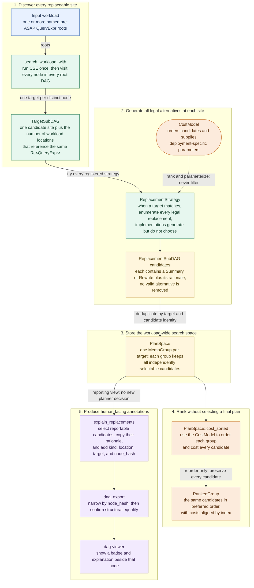
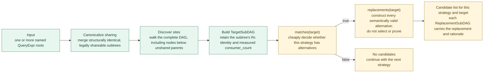
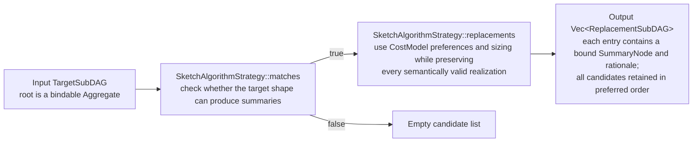
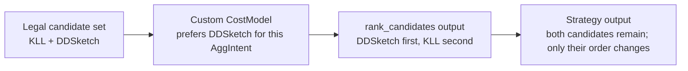
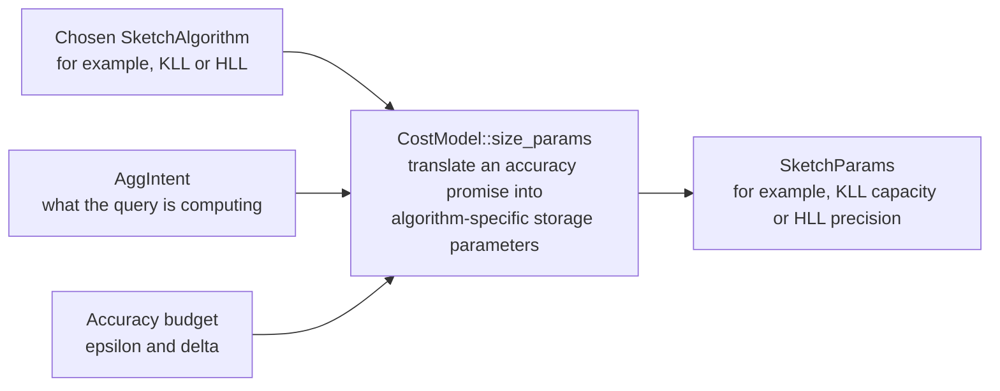
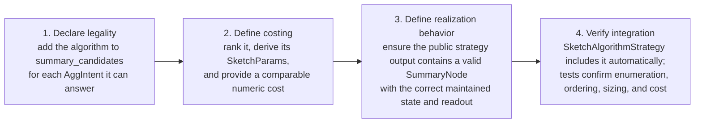

# ASAP-Aware Mapping: Developer Guide

This guide explains how to extend ASAP-aware mapping in the current codebase. Use it when you want to:

- add a new `ReplacementStrategy`,
- add or customize a `CostModel`,
- understand how strategies, binding, and costing interact,
- add a new kind of replacement without duplicating existing planner logic,
- write the tests expected for a new extension.

The focus here is the **current code interfaces and their contracts**. For the higher-level motivation and replacement-plan-search design, see the separate design document, [`docs/design_docs/asap_aware_mapping.md`](../design_docs/asap_aware_mapping.md).

Names such as `MyStrategy`, `MyCostModel`, and `PreferDDSketch` are illustrative; they do not ship with this crate. Samples that use real public types—such as `SketchAlgorithmStrategy`, `SharedSubtreeStrategy`, `PlanSpace`, and `search_workload`—follow the APIs exported by `asap-aware-mapping`.

If you only need to find the right extension point, start with the [extension map](#7-current-extension-map) (Part 3 §7). If you are implementing a strategy, read Part 1 §1 (Mental model), Part 2 §1 (Glossary), and Part 3 §1 (Adding a new `ReplacementStrategy`) first.

---

# Part 1 — Code Architecture

## 1. Mental model

ASAP-aware mapping has two different jobs that should remain separate:

1. **Generate valid alternatives.**
2. **Choose among alternatives.**

`ReplacementStrategy` is responsible for the first job.

`CostModel` is responsible for the second.

A strategy should answer:

> Does this transformation apply here, and if so, what are all semantically valid replacements?

A cost model should answer:

> Given valid choices, which choices are preferable, and how should they be parameterized?

Do not put cost-based pruning into a `ReplacementStrategy`. A strategy must enumerate every valid alternative, even when the default cost model clearly prefers one. See [Rule 2](#rule-2-enumerate-do-not-rank).

---

## 2. Architecture overview

The diagram below follows a workload of one or more query roots through target discovery, candidate generation, ranking, reporting, and downstream visualization. Section 3 focuses on the replacement-strategy path.



The generic `ReplacementStrategy` box is the extension point. The default
registry currently supplies these concrete implementations separately:

- `SketchAlgorithmStrategy` generates the legal summary realizations for a
  bindable aggregate.
- `SharedSubtreeStrategy` generates share-versus-recompute rewrites for a
  target with multiple consumers.

---

## 3. How the current pieces fit together

The public strategy API is the source of truth for valid replacements:

- `SketchAlgorithmStrategy::replacements(target)` returns every valid bound `SummaryNode` for a bindable aggregate, ranked by preference and sized to the target's accuracy requirement. It does not discard any candidate.
- A caller that needs one executable answer uses `.into_iter().next()` and handles the empty case according to its execution policy.

In the [design document](../design_docs/asap_aware_mapping.md), each `ReplacementSubDAG` is a candidate. The complete `replacements()` result is the set of alternatives for one location in the plan.

**Tradeoff:** a single-target call sizes and constructs every valid sketch candidate before the caller keeps the first one. This costs more than constructing only the preferred candidate, but it preserves the complete choice set. Nested aggregates are evaluated independently, so a choice at one target does not force choices in its children.

For workload-wide search, `search_workload`/`search_workload_with` discover every candidate `TargetSubDAG`, run every registered `ReplacementStrategy` against each target to a fixpoint, and deduplicate the results into a `PlanSpace`. Each distinct target has one `MemoGroup` containing every discovered alternative. `PlanSpace::cost_sorted` ranks those candidates with the supplied cost model. This MEMO representation avoids materializing a flat list of `2^N` complete plans while preserving every independent choice.

**This crate does not select or materialize one final answer for a workload.** Callers receive every candidate, ranked with cost, from `search_workload`/`search_workload_with` and make the final choice using deployment information such as placement.

### Replacement-strategy path

`search_workload_with` is the planner entry point that discovers targets. It runs CSE, walks the complete DAG under every root, and constructs each `TargetSubDAG` with its measured `consumer_count`. That count directly controls strategies such as `SharedSubtreeStrategy`:



`TargetSubDAG::new(&root)` invokes a strategy against one node in isolation and sets `consumer_count` to `1`. It is useful for tests and focused tooling, but it is not a target-discovery or plan-search entry point. Use `search_workload`/`search_workload_with` whenever strategies need workload context or accurate sharing counts.

The important rule is:

> Strategies should reuse existing decision and binding logic where possible instead of reimplementing it.

`SketchAlgorithmStrategy` follows this rule: it exposes every legal realization through `ReplacementStrategy::replacements`, and each result uses the same public `ReplacementSubDAG` shape.

---

# Part 2 — Interfaces and Definitions

## 1. Glossary

### `TargetSubDAG`

A pre-ASAP `QueryExpr` node that a strategy may replace.

```rust
pub struct TargetSubDAG<'a> {
    pub root: &'a Rc<QueryExpr>,
    pub consumer_count: usize,
}
```

`root` is the actual `Rc<QueryExpr>` from the workload.

`consumer_count` counts structural references, not runtime executions. It is the number of places in the workload DAG that point to this exact `Rc<QueryExpr>` node.

For example, consider two top-level queries:

- `sum by (service) (rate(m[5m]))`
- `avg by (service) (rate(m[5m]))`

After `share_common_subtrees` merges their identical `rate(m[5m])` subtrees, both query trees point to the same `Rc`. That node's `consumer_count` is `2`, regardless of how often either query executes.

Use:

```rust
let target = TargetSubDAG::new(&root);
```

when you are inspecting a node in isolation.

Use:

```rust
let target = TargetSubDAG::with_consumer_count(&root, count);
```

when the caller already knows the real number of consumers.

`TargetSubDAG::new` assumes one consumer.

---

### `Replacement`

The actual object that substitutes the target.

There are currently two forms:

```rust
pub enum Replacement {
    Summary(Rc<SummaryNode>),
    Rewrite(Rc<QueryExpr>),
}
```

Use `Replacement::Summary` when the alternative is already bound into a post-ASAP summary plan.

Use `Replacement::Rewrite` when the alternative is still a logical pre-ASAP `QueryExpr`.

Examples:

```text
Quantile(...)
    -> KLL SummaryNode
```

is a `Summary`.

```text
compute independently
    vs.
reuse an already shared logical subtree
```

is represented as a `Rewrite`.

---

### `ReplacementSubDAG`

One candidate replacement plus an explanation.

```rust
pub struct ReplacementSubDAG {
    pub replacement: Replacement,
    pub rationale: String,
}
```

The `rationale` is for debugging, reporting, and explaining planner choices. It is human-readable text, not a machine-readable protocol.

Every candidate should carry a useful rationale.

---

### `ReplacementStrategy`

The main extension point for adding a new optimization or replacement source.

```rust
pub trait ReplacementStrategy {
    fn matches(&self, target: &TargetSubDAG<'_>) -> bool;

    fn replacements(
        &self,
        target: &TargetSubDAG<'_>,
    ) -> Vec<ReplacementSubDAG>;
}
```

The two methods have intentionally different responsibilities.

`matches` answers:

> Does this strategy have anything to offer for this target?

`replacements` answers:

> What are all semantically valid alternatives for this target?

`replacements` must be **exhaustive, not ranked, and not cost-filtered**.

---

### `Implementation`

One valid realization of an `AggIntent`. It may be an approximate sketch, an exact mergeable accumulator, or a pass-through with no summary. `SketchAlgorithmStrategy::replacements()` exposes each valid realization as a bound `ReplacementSubDAG`; it returns all candidates in preferred order without selecting a winner. At workload scale, `search_workload`/`search_workload_with` preserve the same never-prune contract across every `TargetSubDAG`. Selecting which candidate to build and where to place it remains a downstream deployment decision.

In short: `ReplacementStrategy` enumerates, packages, and binds every candidate, and the caller selects when it needs a single executable answer. Part 1 §3 shows the complete flow.

---

### `CostModel`

`CostModel` covers every deployment-specific numeric or configuration decision—not only which candidate is cheapest. For example, sketch sizing trades memory and update cost for accuracy, so it belongs here too.

The crate cannot hardcode real deployment costs: `asap-aware-mapping` depends on `asap-types`, not on a runtime or deployment model. Most hooks therefore provide the crate's built-in static behavior as a default. Override only the decisions your deployment needs to change.

| Hook | Use it to | Default? |
|---|---|---|
| `rank_candidates` | Order valid sketch algorithms | No |
| `size_params` | Convert an accuracy target into sketch parameters | Yes |
| `realize_extension` | Map a custom intent to an implementation | Yes |
| `readout_extension` | Query a custom extension summary | Panics until paired with a custom realization |
| `cse_recompute_cost` | Estimate independent recomputation | Yes |
| `cse_shared_maintenance_cost` | Estimate shared maintenance | Yes |
| `cse_share_decision` | Choose sharing or recomputation | Yes |
| `estimate_cost` | Attach a comparable numeric cost to a replacement | Returns `NaN`; `DefaultCostModel` provides real values |

- **`rank_candidates`** — order the sketch candidates for one `AggIntent`, best first. This is the only required hook.

  ```rust
  fn rank_candidates(&self, intent: &AggIntent, candidates: &[SketchAlgorithm]) -> Vec<SketchAlgorithm>;
  ```

- **`size_params`** — choose parameters, such as sketch capacity, for an already-selected `SketchAlgorithm` and accuracy target `(eps, delta)`. It is separate from ranking so a deployment can customize sizing without changing algorithm preference. The trait provides a default implementation.

  ```rust
  fn size_params(&self, kind: SketchAlgorithm, intent: &AggIntent, eps: f64, delta: f64) -> SketchParams;
  ```

- **`realize_extension`** — map a deployment-defined `AggIntent::Extension` to a post-ASAP `Implementation`. The default is `Implementation::PassThrough`.

  Use `AggIntent::Extension { ext_kind, payload }` for intent shapes that only your deployment needs. Core treats both fields as opaque. For example, a deployment can tag an approximate-frequency intent with `ext_kind: "frequency"` and recognize it in `realize_extension`:

  ```rust
  fn realize_extension(&self, ext_kind: &str, _payload: &serde_json::Value) -> Implementation {
      if ext_kind == "frequency" {
          Implementation::Sketch(SketchKind::new(
              SketchAlgorithm::CountSketch,
              SketchParams::CountSketch { width: 1024, depth: 5 },
          ))
      } else {
          Implementation::PassThrough  // fall back to the default for anything else
      }
  }
  ```

  Return `Implementation::PassThrough` for unrecognized extension kinds. Do not panic.

  ```rust
  fn realize_extension(&self, ext_kind: &str, payload: &serde_json::Value) -> Implementation;
  ```

- **`readout_extension`** — define how queries read an extension summary that `realize_extension` mapped to a `Sketch`. The two hooks are a pair: realization defines what is maintained; readout defines how it is queried. Override both for the same `ext_kind`. The default readout panics to prevent a silent wrong answer.

  ```rust
  fn readout_extension(&self, ext_kind: &str, payload: &serde_json::Value, col: &ColumnRef) -> SketchQuery;
  ```

- **`cse_recompute_cost`** — estimate the one-time cost of recomputing a CSE candidate's subtree independently at a single consumer. Default: `default_cse_recompute_cost`, a structural-size proxy.

  ```rust
  fn cse_recompute_cost(&self, candidate: &CseCandidate) -> Cost;
  ```

- **`cse_shared_maintenance_cost`** — estimate the cost of maintaining one shared summary continuously for the life of the workload. Default: `default_cse_shared_maintenance_cost`, a per-family weight table.

  ```rust
  fn cse_shared_maintenance_cost(&self, candidate: &CseCandidate) -> Cost;
  ```

  Both hooks return `Cost`, currently a unitless `f64` newtype. The wrapper allows the type to grow later—for example, to separate CPU, memory, and network costs—without changing every hook signature.

- **`cse_share_decision`** — choose between one shared summary and independent recomputation at each consumer. By default, it shares when maintenance cost is no greater than total recomputation cost. Override the two cost inputs first; override this decision hook only when you need a different policy.

  ```rust
  fn cse_share_decision(&self, candidate: &CseCandidate) -> ShareDecision;
  ```

- **`estimate_cost`** — attach a comparable numeric cost to an already-constructed replacement. `PlanSpace::cost_sorted` calls it for every candidate and keeps the returned values aligned with the ranked candidates. The trait default returns `f64::NAN` deliberately; override it when a custom model's callers need displayable or otherwise consumable numeric costs. `DefaultCostModel` provides real values derived from its CSE cost hooks.

  ```rust
  fn estimate_cost(
      &self,
      candidate: &ReplacementSubDAG,
      target: &TargetSubDAG<'_>,
  ) -> f64;
  ```

A custom cost model does not necessarily need to override every hook. The current tests include a model that overrides only `rank_candidates`, relying on defaults for the rest. Such a minimal model inherits `estimate_cost`'s `NaN` placeholder; it must also override `estimate_cost` if consumers require numeric costs.

---

### `PlanSpace` / `MemoGroup` / `RankedGroup` — the whole-workload view

`ReplacementStrategy` answers "what are the candidates for this one target?" `PlanSpace` answers the same question for every target in a whole workload at once, without materializing `2^N` fully-copied plans for `N` independently-choosable sites.

```rust
// replacement.rs

// One MemoGroup per distinct TargetSubDAG in the whole workload —
// never a flat list of fully-materialized plans.
pub struct MemoGroup {
    pub target: Rc<QueryExpr>,
    pub consumer_count: usize,
    pub candidates: Vec<ReplacementSubDAG>,  // every alternative, unranked
}

pub struct RankedGroup<'a> {
    pub target: &'a Rc<QueryExpr>,
    pub consumer_count: usize,
    pub candidates: Vec<&'a ReplacementSubDAG>,  // same candidates, ranked
    pub costs: Vec<f64>,                         // costs[i] <-> candidates[i]
}
```

`search_workload(roots)` runs the shared-subtree pass once, discovers every target across every root's whole DAG (not just root-level sharing — a `SharedSubtreeStrategy` candidate three levels under an unshared `Filter` is exactly as real a site as a shared whole root), and asks every registered strategy to a fixpoint. Two logically different candidates at two different targets are never copied into two separate plans — they're two entries in two different `MemoGroup`s, sharing every other node in the workload by construction.

`PlanSpace::cost_sorted(cost_model)` is the one ranking step: for each group, it dispatches by candidate shape — a same-shape `Rewrite` pair (a `SharedSubtreeStrategy` share/recompute choice) goes through `CostModel::cse_share_decision`; a same-shape run of `Summary` candidates realizing sketches (a `SketchAlgorithmStrategy` choice) goes through `CostModel::rank_candidates`; and a mixed group is ordered by each candidate's `CostModel::estimate_cost`. Every candidate gets a numeric cost aligned index-for-index in `costs`. Count in, count out—nothing is dropped to produce a ranking.

---

### Family, category, algorithm, and parameters

Sketches separate their query category from the concrete algorithm and its parameters:

| Level | Type | Example |
| --- | --- | --- |
| **family** | `SummaryFamilyType` | `Sketch`, `Sample`, `Wavelet`, `StatModel`, `ExactAggregate` |
| **category** | `SketchCategory` | `Quantile`, `Cardinality`, `Frequency`, `TopK` |
| **algorithm** | `SketchAlgorithm` | `Kll` / `DDSketch` (both quantile); `Hll` / `Theta` / `Kmv` (all cardinality) |
| **committed choice** | `SketchKind` | one validated category + algorithm + parameter combination |

A `SketchKind` is a validated committed choice. Its public constructor,
`SketchKind::new(algorithm, params)`, verifies that the parameter variant belongs
to the selected algorithm and classifies the pair into its category. The public
`.category()`, `.algorithm()`, and `.params()` accessors expose the committed
values without permitting an invalid combination.

Where this matters in practice: `CostModel::rank_candidates`, `CostModel::size_params`, and `SketchAlgorithmStrategy::replacements` operate at the **algorithm** level. `summary_candidates(intent)` returns a list of `SketchAlgorithm`s (`[Kll, DDSketch]` for a `Quantile` intent), never a bare `SketchKind` with nothing chosen underneath it. `SketchKind` appears after an algorithm has been selected and sized—on `Implementation::Sketch(SketchKind)` and `SummaryFamilyType::Sketch(SketchKind)`.

`Sample`, `Wavelet`, and `StatModel` each use a flat `(Kind, Params)` pair. `Sketch` needs the additional algorithm level because multiple algorithms can serve the same purpose—for example, KLL and DDSketch both answer quantile queries.

---

### `Matcher`

`Matcher` is a smaller, separate extension point:

```rust
pub trait Matcher {
    fn is_satisfied_by(&self, required: &Implementation, available: &Implementation) -> bool;
}
```

`Matcher` does not decide how to build a summary. It asks whether an existing summary can satisfy a required implementation without building anything new. This is similar to a database reusing a materialized view or index.

For example, suppose a deployment already has a `DDSketch` for `latency`, while a new query requests KLL quantiles. Sketch algebra may allow substitution because both answer quantile queries. A deployment's storage rules may forbid it because stored summaries retain a specific algorithm identity. `Matcher::is_satisfied_by(required, available)` lets the deployment make that decision: `required` is what the query needs, and `available` is what the inventory already contains.

The crate provides no default `Matcher` implementation because the answer depends on deployment-specific inventory and storage rules. If you need one, implement the complete trait for your deployment.

---

## 2. Replacement explanations (`explanation.rs`)

`explanation::explain_replacements`/`explain_replacements_with` answer a different question than everything above: not "what could this target become" (`ReplacementStrategy::replacements`) but "why does the replacement already discovered for this target exist, and where." It is a **reporting view over `PlanSpace`**, not a second search or a second rule engine — this crate's *explanation of a replacement*, not an applicability classifier deciding admissibility from scratch.

### The rule

> A `TargetSubDAG` is worth explaining exactly when its `PlanSpace` candidate list contains something beyond the trivial, no-op realization.

Concretely, `explanation.rs` reads two shapes off each `MemoGroup`:

- `ExplanationKind::SketchApproximation` — the group's candidates include a `Replacement::Summary` that actually realizes `SummaryFamilyType::Sketch(..)`, i.e. `SketchAlgorithmStrategy` found a real sketch alternative, not just an exact/pass-through candidate.
- `ExplanationKind::CommonSubexpressionReuse` — `consumer_count >= 2` and the group's candidates include `SharedSubtreeStrategy`'s "build once and share" candidate (the `Replacement::Rewrite` whose `Rc` is the group's own `target`).

Each `ReplacementExplanation::reason` is copied verbatim from the matching candidate's own `ReplacementSubDAG::rationale`. Nothing in `explanation.rs` re-explains why a candidate is valid; that explanation already exists exactly once, on the candidate itself.

`ReplacementExplanation` carries both `node_hash` and `target`. A downstream consumer first compares `node_hash` with an exported `DagNode::hash` to narrow the search, then compares the exact target expression with the node's in-process source expression. This preserves the hash's role as a fast filter while making the final association collision-safe; `location` remains human-readable presentation text rather than a machine identifier.

### Why there is no `ExplanationRule` trait

Explanations are derived from candidates already present in `PlanSpace`. A new candidate kind therefore requires an `impl ReplacementStrategy` wired into `default_strategies`/`default_strategies_with`; a second explanation-specific trait would duplicate registration and could drift from the actual search space. Custom callers supply strategies through `explain_replacements_with`, using the same extension point exposed by `search_workload_with`.

### How it derives `location` text

`PlanSpace`/`MemoGroup` track `Rc<QueryExpr>` pointer identity, not human-readable breadcrumbs. `ReplacementExplanation::location` provides prose such as `root "dash_a" > lhs` so reporting consumers can identify the relevant part of the query without interpreting pointer identity. Location derivation does not make replacement or costing decisions.

---

# Part 3 — How to Add X, Y, Z

## 1. Adding a new `ReplacementStrategy`

A new optimization should normally be introduced as a new implementation of `ReplacementStrategy`.

Do not change the trait just because a new optimization is added.

Start with this skeleton (illustrative — `MyStrategy` is not a real type in this crate):

```rust
pub struct MyStrategy;

impl ReplacementStrategy for MyStrategy {
    fn matches(&self, target: &TargetSubDAG<'_>) -> bool {
        // Return true only when this transformation is applicable.
        todo!()
    }

    fn replacements(
        &self,
        target: &TargetSubDAG<'_>,
    ) -> Vec<ReplacementSubDAG> {
        if !self.matches(target) {
            return Vec::new();
        }

        // Enumerate every semantically valid replacement.
        todo!()
    }
}
```

There are four decisions to make.

---

### Define the target shape

`matches` should contain the minimum structural and semantic checks needed to determine whether the strategy applies.

For example, `SketchAlgorithmStrategy` only matches the aggregate shape that the existing binder can actually bind:

- the node is an `Aggregate`,
- it has one aggregation intent,
- it does not have `HAVING`.

A strategy that depends on cross-query context may additionally inspect `consumer_count`.

For example:

```rust
fn matches(&self, target: &TargetSubDAG<'_>) -> bool {
    target.consumer_count >= 2
}
```

is enough for the current shared-subtree strategy.

#### Guideline

Keep `matches` cheap and unsurprising.

It should answer *whether the strategy applies here* in the plain English sense — not `explanation.rs`'s formal `ReplacementExplanation` concept (issue #257, a separate reporting layer over this trait's own output — see Part 2 §2). `matches` isn't that machinery and doesn't need to produce anything it consumes; it should also not perform ranking or choose a winner.

---

### Enumerate every valid alternative

`replacements` should return every semantically valid candidate for a matched target.

For example, if a quantile can be represented by:

```text
KLL
DDSketch
```

then both should be returned.

Do not write:

```rust
if kll_is_cheaper {
    vec![kll]
} else {
    vec![ddsketch]
}
```

inside a strategy.

That would throw away part of the search space before the cost model can compare complete plans.

Instead:

```rust
vec![kll, ddsketch]
```

and let costing decide later.

---

### Choose `Summary` vs. `Rewrite`

Return:

```rust
Replacement::Summary(...)
```

when the candidate is a fully bound post-ASAP summary.

Return:

```rust
Replacement::Rewrite(...)
```

when the candidate is a logical pre-ASAP rewrite.

This distinction matters because a rewrite may enable more transformations later, while a bound summary represents a concrete summary realization.

---

### Add a rationale

Every `ReplacementSubDAG` should explain why the candidate exists.

Good:

```rust
ReplacementSubDAG {
    replacement: ...,
    rationale: "derive service-level aggregate by rolling up the \
                mergeable service+region aggregate".into(),
}
```

Less useful:

```rust
rationale: "candidate 2".into()
```

The rationale should help a developer understand a planner trace without reading the strategy implementation.

Do not encode machine-readable state into the string.

---

### Strategy contract

Every new strategy should follow these rules.

#### Rule 1: `matches == false` should be safe

The existing strategies return an empty vector when `replacements` is called on a target they do not match.

Follow the same convention:

```rust
if !self.matches(target) {
    return Vec::new();
}
```

Do not panic simply because the caller skipped a prior `matches` call.

---

#### Rule 2: enumerate; do not rank

A strategy owns **legality and enumeration**.

A cost model owns **preference and costing**.

This separation is the most important extension rule in this module.

---

#### Rule 3: do not duplicate an existing decision procedure

If another module already knows how to determine whether something is legal or how to bind it, wrap that logic.

Do not create a second implementation of the same semantics inside the strategy.

The existing `SketchAlgorithmStrategy` is the model to follow: it reuses `implementation.rs`'s existing candidate list and the existing binder.

---

#### Rule 4: preserve semantics

Every returned replacement must be semantically valid for the target.

Cost differences do not justify semantic differences.

If a transformation is only valid under additional summary properties, grouping assumptions, or accuracy constraints, check those conditions before returning the candidate.

---

#### Rule 5: a strategy does not need to discover the whole workload

`TargetSubDAG` is passed into the strategy.

The strategy is responsible for deciding what to do with that target, not for walking every workload root to discover targets.

If your transformation requires context not currently represented in `TargetSubDAG`, that is a design question about target metadata or search/discovery — not a reason to hide a second workload traversal inside `replacements`.

---

### Example: current `SketchAlgorithmStrategy`

`SketchAlgorithmStrategy` is the reference implementation for a strategy that produces bound summaries.

Construction:

```rust
let strategy =
    SketchAlgorithmStrategy::default_cost_model();
```

or with a custom cost model:

```rust
let model = MyCostModel; // illustrative
let strategy = SketchAlgorithmStrategy::new(&model);
```

The strategy matches bindable aggregate nodes.

At a high level:



For an approximate quantile, the candidate list includes both KLL and DDSketch even though the cost model ranks one ahead of the other. When only one realization is legal, such as an exact accumulator or pass-through, the strategy returns that single candidate.

---

#### Observable behavior

Call the public strategy interface and inspect every returned candidate:

```rust
let strategy = SketchAlgorithmStrategy::new(&cost_model);
let candidates = strategy.replacements(&target);

for candidate in candidates {
    match candidate.replacement {
        Replacement::Summary(summary) => {
            // Inspect or execute this bound SummaryNode.
        }
        Replacement::Rewrite(_) => unreachable!(
            "SketchAlgorithmStrategy produces summary candidates"
        ),
    }
}
```

The public contract is the behavior contributors should preserve: every legal candidate is returned, ordering follows the supplied `CostModel`, each summary is fully bound, and each candidate carries a useful rationale. Nested aggregate choices remain independent.

---

### Example: current `SharedSubtreeStrategy`

`SharedSubtreeStrategy` is the reference implementation for a logical rewrite strategy.

It applies when:

```rust
target.consumer_count >= 2
```

and returns two alternatives:

```text
1. Build once and share.
2. Build independently for each consumer.
```

The shared candidate reuses the same `Rc<QueryExpr>`:

```rust
Replacement::Rewrite(Rc::clone(target.root))
```

The independent candidate creates a structurally equal but separately allocated node:

```rust
Replacement::Rewrite(
    Rc::new((**target.root).clone())
)
```

This strategy does **not** decide whether sharing is cheaper.

That choice belongs to the cost model. The production binding path calls `CostModel::cse_share_decision` when it encounters a shared subtree. The strategy still returns both alternatives because enumeration and selection are separate steps:

- `consumer_count >= 2` means `share_common_subtrees` has already merged the expression into one shared `Rc`. The shared alternative is therefore an `Rc::clone`; the independent alternative requires a deep clone.
- `cse_share_decision` is used by the production binding path, not by `SharedSubtreeStrategy`.
- The strategy must return both valid alternatives even if the current cost model strongly prefers one. A future whole-plan search may choose differently from today's local comparison.

This example is useful when implementing transformations such as:

- roll-up vs. recompute,
- shared grouping vs. per-group instances,
- semantic rewrite vs. original expression.

Each strategy can expose the alternatives without choosing between them.

---

### Using a strategy

The basic calling pattern is:

```rust
let target = TargetSubDAG::new(&root);
let strategy =
    SketchAlgorithmStrategy::default_cost_model();

if strategy.matches(&target) {
    let candidates =
        strategy.replacements(&target);

    for candidate in candidates {
        println!("{}", candidate.rationale);
    }
}
```

A caller may also safely call `replacements` directly and treat an empty vector as "not applicable":

```rust
let candidates =
    strategy.replacements(&target);

if candidates.is_empty() {
    // No candidate from this strategy.
}
```

For strategies that require workload context:

```rust
let target =
    TargetSubDAG::with_consumer_count(
        &root,
        consumer_count,
    );
```

The caller is responsible for providing correct cross-workload metadata.

---

### Testing a new strategy

Every new strategy should have focused tests for its contract.

At minimum, test the following.

#### Applicability

A matching target should satisfy:

```rust
assert!(strategy.matches(&target));
```

A non-matching target should satisfy:

```rust
assert!(!strategy.matches(&target));
```

---

#### Safe non-match behavior

Also call `replacements` on a non-matching target:

```rust
assert!(
    strategy.replacements(&target).is_empty()
);
```

This verifies that the strategy does not depend on callers always invoking `matches` first.

---

#### Exhaustive candidate enumeration

If the target has N valid alternatives:

```rust
let replacements =
    strategy.replacements(&target);

assert_eq!(replacements.len(), N);
```

Check the identities or kinds of all candidates, not just the preferred one.

The current sketch-family tests explicitly verify that:

- quantile returns both KLL and DDSketch,
- cardinality returns HLL, Theta, and KMV.

This is the most important regression test for a strategy.

---

#### Rationale

Verify that every candidate has a non-empty rationale:

```rust
assert!(
    replacements
        .iter()
        .all(|r| !r.rationale.is_empty())
);
```

For a strategy whose explanation includes important context, also test that context.

For example, the shared-subtree tests verify that the consumer count appears in the rationale.

---

#### Structural semantics

For logical rewrites, test the structural property that distinguishes the alternatives.

For example, the current shared-subtree tests verify:

```rust
Rc::ptr_eq(shared, &q)
```

for the shared candidate, and:

```rust
!Rc::ptr_eq(independent, &q)
```

plus structural equality for the independent candidate.

Do not test only the rationale string; test the actual replacement semantics.

---

#### Custom cost model behavior

If a strategy accepts a cost model, verify that a custom model changes the intended costing behavior without changing the exhaustive candidate set.

The current sketch strategy does exactly this:



That is the expected separation between enumeration and ranking.

---

## 2. Adding or customizing a `CostModel`

### Adding a custom `CostModel`

Use a custom `CostModel` when you want to change preferences or cost assumptions without changing transformation legality.

A minimal model can override only the hook it cares about.

For example (illustrative — `PreferDDSketch` is not a real type in this crate):

```rust
struct PreferDDSketch;

impl CostModel for PreferDDSketch {
    fn rank_candidates(
        &self,
        _intent: &AggIntent,
        candidates: &[SketchAlgorithm],
    ) -> Vec<SketchAlgorithm> {
        let mut ranked = candidates.to_vec();

        if let Some(pos) =
            ranked.iter().position(
                |k| *k == SketchAlgorithm::DDSketch
            )
        {
            let dd = ranked.remove(pos);
            ranked.insert(0, dd);
        }

        ranked
    }
}
```

Then inject it into code that accepts a `&dyn CostModel`:

```rust
let model = PreferDDSketch;

let strategy =
    SketchAlgorithmStrategy::new(&model);

let replacements =
    strategy.replacements(&target);
```

Important: changing `rank_candidates` changes the preferred ordering, but `SketchAlgorithmStrategy` still enumerates every valid sketch candidate.

A custom cost model should not change which alternatives are semantically legal.

---

### Which `CostModel` hook should I implement?

Use this as a practical guide.

#### `rank_candidates`

Use when you want to change the preference among valid sketch algorithms.

Example:

```text
KLL vs. DDSketch
HLL vs. Theta vs. KMV
```

Signature:

```rust
fn rank_candidates(
    &self,
    intent: &AggIntent,
    candidates: &[SketchAlgorithm],
) -> Vec<SketchAlgorithm>;
```

The returned vector should rank candidates from most to least preferred.

It must return a permutation of the supplied candidates: every input candidate exactly once, with no additions or removals. Planner call sites enforce this contract and panic if a cost model violates it.

---

#### `size_params`

Use when the sketch algorithm is already known and you want to choose its parameters from an accuracy target.

Signature:

```rust
fn size_params(
    &self,
    kind: SketchAlgorithm,
    intent: &AggIntent,
    eps: f64,
    delta: f64,
) -> SketchParams;
```

Typical uses include:

- choosing KLL capacity,
- choosing HLL precision,
- selecting sketch-specific error parameters.

Conceptually:



---

#### `realize_extension`

Use for extension-defined implementation kinds.

```rust
fn realize_extension(
    &self,
    ext_kind: &str,
    payload: &serde_json::Value,
) -> Implementation;
```

This is the hook for turning an extension description into a concrete `Implementation`.

Use it for implementation families that are intentionally outside the built-in enum dispatch.

---

#### `readout_extension`

Use when an extension-defined summary also needs custom query/readout behavior.

```rust
fn readout_extension(
    &self,
    ext_kind: &str,
    payload: &serde_json::Value,
    col: &ColumnRef,
) -> SketchQuery;
```

This complements `realize_extension`: realization defines what gets maintained; readout defines how it is queried (see the definition in Part 2 §1's `CostModel` glossary entry if "readout" is unfamiliar).

---

#### `cse_recompute_cost`

Use to estimate the cost of computing a common subtree independently at each consumer.

```rust
fn cse_recompute_cost(
    &self,
    candidate: &CseCandidate,
) -> Cost;
```

---

#### `cse_shared_maintenance_cost`

Use to estimate the cost of computing and maintaining a shared subtree.

```rust
fn cse_shared_maintenance_cost(
    &self,
    candidate: &CseCandidate,
) -> Cost;
```

---

#### `cse_share_decision`

Use when the current binding/planning path needs the final share-vs.-recompute decision.

```rust
fn cse_share_decision(
    &self,
    candidate: &CseCandidate,
) -> ShareDecision;
```

The replacement-strategy layer should still expose both valid alternatives where appropriate. This hook is the cost-sensitive decision point for code paths that need to commit to one answer.

---

#### `estimate_cost`

Use when callers need a comparable numeric cost for each replacement, in addition to relative ordering.

```rust
fn estimate_cost(
    &self,
    candidate: &ReplacementSubDAG,
    target: &TargetSubDAG<'_>,
) -> f64;
```

The default returns `f64::NAN`, making the absence of a numeric model explicit. Override this hook when passing the model to `PlanSpace::cost_sorted` if downstream code displays or otherwise consumes the `costs` values. Prefer to derive the result from the same inputs used by `rank_candidates` and the CSE cost hooks so numeric costs do not disagree with relative ordering.

---

### Testing a new cost model

A cost-model test should focus on the hook being customized.

For ranking:

```rust
let ranked =
    model.rank_candidates(
        &intent,
        &[SketchAlgorithm::Kll,
          SketchAlgorithm::DDSketch],
    );

assert_eq!(
    ranked[0],
    SketchAlgorithm::DDSketch
);
```

Then test integration through a consumer of the cost model.

For example:

```rust
let strategy =
    SketchAlgorithmStrategy::new(&model);

let replacements =
    strategy.replacements(&target);
```

The important assertion is usually not that other valid candidates disappeared. They should not.

Instead verify that:

- the model changes ordering or parameters as intended,
- all legal candidates remain available to the replacement layer.

For sizing, test representative accuracy targets and assert the resulting `SketchParams`.

For CSE costing, create a representative `CseCandidate` and test recompute cost, shared-maintenance cost, and the resulting `ShareDecision`.

---

## 3. Adding a new sketch algorithm

A new sketch algorithm generally touches more than `ReplacementStrategy`.

Declare built-in sketch applicability through the public candidate registry:

```rust
summary_candidates(intent)
```

`SketchAlgorithmStrategy` consumes this registry through its public `replacements` method.

Therefore, when adding a new built-in sketch algorithm, the intended flow is:



This keeps one source of truth for sketch applicability.

Do not special-case the new sketch inside `SketchAlgorithmStrategy` unless the strategy itself needs fundamentally new behavior.

### Verifying a new sketch algorithm

After wiring the new algorithm into `summary_candidates` and giving the cost model a real `rank_candidates`/`size_params` opinion about it, check two things. First, that `SketchAlgorithmStrategy::replacements()` for a matching `TargetSubDAG` actually includes a candidate realizing the new algorithm — extend a test shaped like `replacement.rs`'s own test-module coverage-matrix tests (e.g. `agg_intent_to_summary_kind_coverage_matrix`) to cover the new algorithm's `AggIntent`. Second, that `cost_sorted`/`estimate_cost` produce sane, comparable numbers for the new candidate rather than a `NaN` placeholder or an outlier that swamps every other candidate.

---

## 4. Adding both a strategy and a cost model

Some features require both.

For example, suppose we add:

```text
roll up a finer group-by
vs.
compute the coarser group-by independently
```

The responsibilities should be divided as follows.

### Strategy

The new strategy determines:

- whether the two group-bys have the required relationship,
- whether the aggregation is mergeable,
- whether roll-up preserves semantics,
- and then returns both valid alternatives.

Conceptually:

```rust
vec![
    rollup_candidate,
    recompute_candidate,
]
```

### Cost model

The cost model determines:

- maintenance cost of the finer-grained summary,
- cost of roll-up,
- cost of independent computation,
- expected query frequency,
- and which complete plan is cheaper.

Do not encode:

```text
"only return roll-up when roll-up is cheaper"
```

inside the strategy.

That turns a cost decision into a legality decision and prevents later global plan search from seeing both options.

---

## 5. Common mistakes

### Mistake: choosing the cheapest candidate inside a strategy

Wrong:

```rust
fn replacements(...) -> Vec<ReplacementSubDAG> {
    vec![choose_cheapest_candidate()]
}
```

Right:

```rust
fn replacements(...) -> Vec<ReplacementSubDAG> {
    all_valid_candidates()
}
```

---

### Mistake: maintaining a second sketch-applicability table

If `implementation.rs` already defines which sketch algorithms satisfy an `AggIntent`, reuse that source.

Otherwise the binder and replacement strategy can silently disagree.

---

### Mistake: reimplementing binding inside a strategy

If the candidate should produce a normal `SummaryNode`, use the existing binding path.

A strategy should steer or wrap that path when necessary, not recreate schema derivation, column resolution, readout construction, or parameter sizing.

---

### Mistake: treating `rationale` as planner state

`rationale` is explanatory text.

If downstream logic needs a fact, represent it in the plan or another typed structure instead of parsing the rationale.

---

### Mistake: hiding workload traversal in a strategy

A `ReplacementStrategy` operates on the `TargetSubDAG` it is given.

Workload-wide target discovery, deduplication, and consumer counting are separate concerns.

---

### Mistake: assuming `Rc` structural equality and identity mean the same thing

For CSE-style decisions, pointer identity can encode actual sharing.

Two `Rc<QueryExpr>` values can be structurally equal but deliberately represent independent computation.

Use the distinction intentionally.

---

## 6. Extension checklist

When adding a new strategy:

- [ ] Define the exact target shape.
- [ ] Implement `ReplacementStrategy::matches`.
- [ ] Implement `ReplacementStrategy::replacements`.
- [ ] Return every semantically valid replacement.
- [ ] Return an empty vector for non-matching targets.
- [ ] Use `Replacement::Summary` for bound post-ASAP output.
- [ ] Use `Replacement::Rewrite` for logical pre-ASAP alternatives.
- [ ] Add a useful rationale to every candidate.
- [ ] Reuse existing legality/binding logic instead of duplicating it.
- [ ] Keep ranking and cost-based pruning out of the strategy.
- [ ] Test positive and negative applicability.
- [ ] Test exhaustive enumeration.
- [ ] Test the actual structural semantics of each replacement.
- [ ] Test behavior with a custom cost model if the strategy uses one.

When adding a new cost model:

- [ ] Override only the hooks whose behavior should change.
- [ ] Keep semantic applicability outside the cost model.
- [ ] Use `rank_candidates` for algorithm preference; return every input candidate exactly once.
- [ ] Use `size_params` for accuracy-to-parameter mapping.
- [ ] Use extension hooks for extension-defined implementations/readouts.
- [ ] Use CSE hooks for recompute-vs.-sharing costs.
- [ ] Override `estimate_cost` if consumers require numeric costs instead of `NaN`.
- [ ] Test the hook directly.
- [ ] Test integration through a consumer such as `SketchAlgorithmStrategy`.
- [ ] Verify that changing cost preferences does not silently remove valid replacement candidates.

---

## 7. Current extension map

Use this table to find the right place for a change.

| I want to... | Primary extension point |
|---|---|
| Add a new logical optimization | new `impl ReplacementStrategy` |
| Add a new replacement for an existing target shape | `ReplacementStrategy::replacements` |
| Change when a strategy applies | `ReplacementStrategy::matches` |
| Add a new built-in sketch candidate | `replacement.rs`'s summary-candidate mapping |
| Prefer one sketch algorithm over another | `CostModel::rank_candidates` |
| Change sketch sizing for an accuracy target | `CostModel::size_params` |
| Add extension-defined implementation behavior | `CostModel::realize_extension` |
| Add extension-defined readout behavior | `CostModel::readout_extension` |
| Change CSE recomputation cost | `CostModel::cse_recompute_cost` |
| Change shared-maintenance cost | `CostModel::cse_shared_maintenance_cost` |
| Change current share/recompute choice | `CostModel::cse_share_decision` |
| Decide whether an available implementation satisfies a required one | `impl Matcher` |
| Produce a normal (ranked-first) bound summary for one target | `SketchAlgorithmStrategy::replacements(...).into_iter().next()` |
| Search a whole workload for every candidate at every `TargetSubDAG` (never pruning) | `search_workload`/`search_workload_with` |
| Get every candidate ranked best-first, across a whole workload | `PlanSpace::cost_sorted` |
| Get a real numeric cost per candidate, not just a relative rank | `CostModel::estimate_cost` |
| Enumerate valid sketch algorithms | `summary_candidates` |
| Build a target with no workload context | `TargetSubDAG::new` |
| Build a target with known sharing context | `TargetSubDAG::with_consumer_count` |
| Explain why a replacement exists, where, and why | `explanation::explain_replacements`/`explain_replacements_with` |
| Add a new kind of replacement explanation | new `impl ReplacementStrategy`, wired into `default_strategies`/`default_strategies_with` — not a new explanation-specific trait, see Part 3 §8 |

---

## 8. Using and extending explanation.rs

### Using it

```rust
use asap_aware_mapping::{explain_replacements, ExplanationKind};

let explanations = explain_replacements(vec![("dashboard_p99", query)]);
for explanation in &explanations {
    match explanation.kind {
        ExplanationKind::SketchApproximation => { /* ... */ }
        ExplanationKind::CommonSubexpressionReuse => { /* ... */ }
        _ => { /* ExplanationKind is #[non_exhaustive] */ }
    }
}
```

To plug in a deployment-specific strategy or `CostModel`, use `explain_replacements_with` with a strategy set built the same way `default_strategies_with` builds one — see Part 3 §2 and Part 3 §4.

### Adding a new kind of replacement explanation

There is no separate checklist here: follow [Part 3 §1](#1-adding-a-new-replacementstrategy) to add the new `ReplacementStrategy` and wire it into `default_strategies`/`default_strategies_with`, then add an `ExplanationKind` variant and ensure `explain_replacements` returns that kind for the new public candidate shape. Test the behavior through `explain_replacements` or `explain_replacements_with`; explanation reporting should not introduce a second discovery rule.
