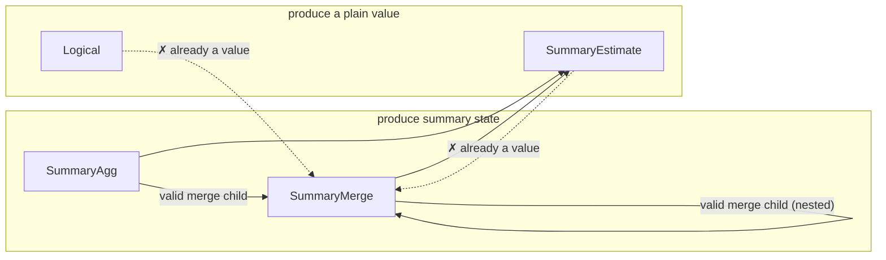

# L3 — summary-bound IR

The point where a plan commits to *what* answers each intent that L2's
canonical form deliberately leaves open. "Summary" is the umbrella term
for whatever answers an intent without re-scanning raw samples —
concretely, either an approximate sketch (e.g. a quantile sketch, a
cardinality sketch, a frequency/heavy-hitter sketch) or an exact
accumulator (e.g. sum, count, min/max, rate, increase). New primitive
classes are meant to slot in as additional summary kinds, not as a new
IR or a new translation layer.

This layer has two distinct halves, deliberately kept separate:
**planning-time** binding (deciding, symbolically, which summary
answers which intent) and **serving-time** execution (actually
resolving that decision against whatever is materialized right now).
They're covered in turn below.

## Planning-time: binding

A decision, made once per query shape, symbolically: given an intent
and its accuracy requirement, which summary family and parameters
answer it — with no reference to what's actually stored anywhere yet.

### The shape of a summary-bound plan

A summary-bound plan mirrors the canonical intent tree but replaces
each summarizable node with a decision:

- **Unbound / logical** — nothing rewrote this node (e.g. a filter or a
  projection); it stays as ordinary logical computation over its
  child's output.
- **Summary aggregation** — a summary family and its parameters, chosen
  for the intent and its accuracy target, over a designated column and
  grouping keys.
- **Summary-aware join** — a join realized via a summary technique
  (e.g. a cardinality-aware join sketch), rather than a full
  materialized join.
- **Summary subtraction / deletion** — algebraic operations on an
  already-built summary, only valid for summary kinds that support
  them.
- **Summary readout** — reading a value out of an already-built
  summary; the inverse of building one.
- **Summary merge** — combining multiple built summaries into one; only
  valid when every input agrees on family and parameters.

A summary-bound plan is a DAG, not just a tree — a shared
sub-computation can appear as more than one reference to the same bound
node, mirroring the sharing already present in the canonical form (see
[`l2-intent-algebra.md`](./l2-intent-algebra.md)). Binding only fires
where an intent is recognizable in the tree; anything underneath an
unrewritten (logical) parent stays logical too — extending binding to
rewrite through a logical parent is a known open design question, not
attempted by the base design.

Each bound node's output schema extends the canonical schema with one
new possibility: a field whose type *is* a built summary (identified by
its family and parameters). Two summary-typed fields are only
compatible if their family and parameters match exactly — which is what
lets subtraction, deletion, and merge reject a mismatched combination
as a planning-time error rather than a runtime one.

## Serving-time: execution

A lookup, done on every query: resolve each leaf of an already-bound
plan against whatever summaries are actually materialized right now.
Reality can diverge from what planning assumed — data might be missing,
several instances of the same summary might need merging, instances
might disagree on parameters — so serving needs its own error cases,
distinct from anything planning-time binding can raise.

### Split of responsibility

The *structural* rules are shared and deployment-independent: which
nestings of a summary-bound plan are valid, and what must agree for a
merge to be legal. Storage, summary math, and readout are entirely
deployment-supplied — this layer defines the interface a deployment
implements, not an implementation of summaries themselves. Concretely,
a deployment supplies: how to find candidate materialized instances for
a bound node, how to fetch one instance's state, how to merge several
instances' states, how to read a value out of a state, and how to
evaluate an unrewritten logical node directly. A shared execution
routine walks the bound tree and calls into these deployment-supplied
operations, so every deployment gets the same walk and merge logic for
free.

Finding candidates for a summary-aggregation node requires seeing that
node's entire input sub-tree, not just a bare name — a summary
aggregation node carries no source identity of its own; that identity
lives further down, inside a scan. Walking down to find it is
deployment-specific knowledge (how a real store names and indexes
summarized data); the shared execution routine doesn't need to
interpret it, only pass the sub-tree along.

### Nested composition

A bound plan nests to arbitrary depth by construction, so execution is
plain recursion with no special-casing for depth. Two composition rules
matter:

- **Only a node that produces summary state (a summary aggregation, or
  another merge) can be a merge's child.** A readout or a logical node
  has already collapsed to a plain value; merging values isn't the
  operation a merge models.
- **A merge of merges preserves the family/parameter agreement
  transitively** — the agreed family and parameters propagate upward
  through every nesting level, so a nested merge is checked the same
  way a flat one is.

Summary-aggregation-over-summary-aggregation is itself valid and
expected — e.g. a two-stage precompute pipeline where one tier streams
a per-group reduction and another tier builds a richer summary over
that stream is a real, intended shape.

**Deliberately left open:** whether a summary aggregation can validly
sit above a *readout* — "build a new summary from another summary's
already-computed value, at query time." Every design considered so far
only builds summaries incrementally from raw samples, at ingest time;
there's no established answer for building one from a
query-time-derived scalar. A deployment that hits this shape should
treat it as unsupported rather than assume either answer. The design
proposal below narrows exactly which cases of this remain genuinely
open (see "Pattern D" below) — it is not fully open anymore, but it is
not fully resolved either.

### What's out of scope here

Placement — *which machine* runs a piece of the plan — is L4's concern
entirely (see [`l4-physical-plan.md`](./l4-physical-plan.md)). This
layer is only about what "answer a query against already-materialized
summaries" means, on whichever machine ends up doing it. Some
operations (summary-aware join, subtraction, deletion) have no defined
execution behavior yet, because no binding rule produces them yet in
the base design — a deployment should add that behavior only once it
has a real need for the shape, rather than speculatively guessing the
right one now.

## Choosing a summary for an intent

Which summary family (if any) answers a given intent is itself a
pluggable decision: a default choice exists per intent, but a
deployment can supply its own ranking to prefer an alternative family
where one exists (e.g. an alternative quantile sketch, an alternative
cardinality sketch). This ranking is the one general-purpose extension
point in this layer — a deployment customizes *which* summary is
chosen, without touching how binding or execution works structurally.

Not every intent has a summary counterpart. An intent whose accurate
computation requires richer partial state than a single summary value
can capture, or whose result is fundamentally non-mergeable across
partitions, has no summary realization by design — it always stays as
ordinary logical computation over raw data.

## Interface

The planning-time IR:

```rust
pub struct L3Node {
    pub expr: SummaryExpr,
    pub schema: L3Schema,
}

pub enum SummaryExpr {
    Logical(Box<QueryExpr>),
    SummaryAgg {
        child: Rc<L3Node>,
        summary: SummaryKind,
        params: SummaryParams,
        col: ColumnRef,
        reduction: Reduction,
    },
    SummaryJoin { outer: Rc<L3Node>, inner: Rc<L3Node>, key: ColumnRef, summary: SummaryKind, params: SummaryParams },
    SummarySubtract { left: Rc<L3Node>, right: Rc<L3Node> },
    SummaryDelete { summary_input: Rc<L3Node>, key: ColumnRef },
    SummaryEstimate { summary_input: Rc<L3Node>, query: SketchQuery },
    SummaryMerge { children: Vec<Rc<L3Node>> },
}
```

The `summary`/`summary_input` field names match this doc's own "summary"
umbrella term (see the top of this doc) directly. An earlier revision of
this type used `sketch`/`sketch_input`, predating that umbrella term —
renamed in #170, landed together with the `Implementation` variant merge
described below.

Per-node validity constraints — each is a summary-catalog fact (see
"Summary catalog" above) checked at planning time, before this shape ever
reaches serving-time execution:

| Node | `summary` field | Constraint |
|---|---|---|
| `Logical` | — | none — wraps an arbitrary unrewritten `QueryExpr` subtree |
| `SummaryAgg` | own | none beyond `col`'s intent already requiring an accuracy target compatible with `summary`; this is the leaf every other row's constraints are checked *against* |
| `SummaryJoin` | own | only emitted by a join-specific `Bind*OnJoin` rule — none exist yet in the base design, so this variant has no live producer |
| `SummarySubtract` | read from `left`/`right` | `left`/`right` agree on `(kind, params)`; that kind's catalog entry sets `subtractable` |
| `SummaryDelete` | read from `summary_input` | that kind's catalog entry sets `deletable` |
| `SummaryEstimate` | read from `summary_input` | `query`'s `SketchQuery` variant is one that kind actually supports (not a single boolean flag — closer to that kind's whole reason for existing) |
| `SummaryMerge` | read from `children`, which must all agree | `children` non-empty; every child produces summary *state*, never a value (see diagram below); that shared kind's catalog entry sets `mergeable` |

The trickiest of these to hold in your head is `SummaryMerge`'s "children
must produce state, not a value" rule — everything here either produces
partial summary **state** (still mergeable, not yet read out) or a final
**value** (already collapsed, e.g. by a readout). Only a state-producing
node may feed a merge:



Binding — turning a canonical `QueryExpr` into an `L3Node` tree:

```rust
pub fn implement_tree(expr: &QueryExpr) -> Result<Rc<L3Node>, ImplementError>;
pub fn implement_tree_with(expr: &QueryExpr, cost_model: &dyn CostModel) -> Result<Rc<L3Node>, ImplementError>;
```

**"Implementation" is the answer to one question: how is this one
intent actually realized?** It's the return type of the per-intent
binding decision (`implementation_for`) — for a given `AggIntent`,
exactly one of: build an approximate sketch (bounded error, sized to
the accuracy target), build an exact accumulator (zero error, still
mergeable — see "Choosing a summary for an intent" above), or don't
summarize at all and evaluate the intent directly over raw data
(`PassThrough`). It's the same three-way choice this doc's "shape of a
summary-bound plan" section already describes in prose; this is that
decision's concrete type:

```rust
pub enum Implementation {
    Summary { kind: SummaryKind, params: SummaryParams },
    PassThrough,
}

pub fn implementation_for(intent: &AggIntent) -> Implementation;
```

An earlier revision of this type split `Summary` into two variants,
`Sketch{kind,params}` and `ExactAccumulator{kind,params}`, carrying
identical shapes — the split existed only because binding needed to
know, right here, whether the chosen `kind` requires a `SummaryEstimate`
readout afterward (approximate) or *is* the answer once built (exact —
no estimate step). #170 collapsed them into the single `Summary`
variant above, recovering that same fact from `SummaryKind::is_exact()`
instead of from the variant tag.

The one pluggable extension point at this layer — a deployment supplies
its own `CostModel` to override which summary family is chosen and how
its parameters are sized, without touching the binding pass itself.
Every method past the first has a sensible default, so a deployment that
only wants to reorder candidates doesn't have to implement the rest:

```rust
pub trait CostModel {
    fn rank_candidates(&self, intent: &AggIntent, candidates: &[SummaryKind]) -> Vec<SummaryKind>;

    fn size_params(&self, kind: SummaryKind, intent: &AggIntent, eps: f64, delta: f64) -> SummaryParams {
        /* default: this crate's built-in sizing formulas */
    }
    fn realize_extension(&self, ext_kind: &str, payload: &serde_json::Value) -> Implementation {
        /* default: PassThrough */
    }
    fn readout_extension(&self, ext_kind: &str, payload: &serde_json::Value, col: &ColumnRef) -> SketchQuery {
        /* default: panics -- only reachable if realize_extension was overridden without this */
    }
}
```

Serving-time — the interface a deployment implements to actually answer
a query against an already-bound `L3Node` tree:

```rust
pub trait SummaryExecutor {
    type Handle: Clone;
    type State;
    type Value;
    type Error;
    type GroupKey: Clone + Ord + Default;

    fn find_candidates(
        &self,
        summary: &SummaryKind,
        params: &SummaryParams,
        col: &ColumnRef,
        reduction: &Reduction,
        child: &L3Node,
    ) -> Result<Vec<(Self::GroupKey, Self::Handle)>, Self::Error>;

    fn fetch_state(&self, handle: &Self::Handle) -> Result<Self::State, Self::Error>;
    fn merge_states(&self, states: Vec<Self::State>) -> Result<Self::State, Self::Error>;
    fn readout(&self, state: &Self::State, query: &SketchQuery) -> Result<Self::Value, Self::Error>;
    fn logical(&self, expr: &QueryExpr) -> Result<Self::Value, Self::Error>;
}

pub fn execute<E: SummaryExecutor>(node: &L3Node, exec: &E) -> Result<ExecOutcome<E>, ExecError<E::Error>>;
```

`find_candidates`'s `reduction` parameter is exactly the `Reduction`
this doc's design section already explains — an implementer must branch
on `Reduce` vs. `PerEntity` there, not guess from an empty key list.

### Design proposal: composing summaries — a taxonomy and a recipe, not a formula

There's no single formula for the error bound of "summary built over
another summary." Exponential Histogram [Datar, Gionis, Indyk, Motwani,
SICOMP'02] and Hydra [VLDB'22] each prove a
bound for this shape, and the two bounds have different forms, because
they come from composing different concentration arguments, not from
adding two epsilons. What is general is a method. Four compound types,
by structural relationship:

1. **Same kind, same config — merge.** Already `SummaryMerge`: exact at
   the state level, zero added error, gated by the catalog's `mergeable`
   flag.
2. **Heterogeneous, inner exact.** An exact inner (`Rate`, `Increase`, …)
   has `Accuracy::EXACT` state, so composing over it adds nothing,
   unconditionally.
3. **Heterogeneous, both approximate.** Splits into two mechanisms:
   - **3a — over the inner's readout.** The outer consumes the inner's
     already-collapsed estimate as an ordinary noisy input. Always
     available — needs only the inner's published `(ε, δ)` — but only as
     tight as a Lipschitz-style sensitivity argument, generally loose.
   - **3b — over the inner's state.** The outer's construction runs
     directly on the inner's raw, pre-readout representation. Only
     available when the outer's construction can consume that
     representation, but tight when it applies — Exponential Histogram
     and Hydra are
     worked examples.
   3b is strictly tighter when available; 3a is the fallback when the
   inner's state isn't accessible (e.g. across a service boundary) or 3b
   doesn't apply.
4. **Neither 3a nor 3b justified for the pair.** Refused by default.

#### 3a: composing over the inner's readout

An ordinary error-propagation argument. Let the inner produce `ṽ`
satisfying `Accuracy A_c`, and the outer be built over `ṽ` as if exact,
satisfying `A_o`. If the outer's true function `φ_outer` is `L`-Lipschitz
with respect to the norm `A_c` is stated in:

```
Pr[ |ρ_outer(β_outer(ṽ)) − φ_outer(φ_inner(X))| > (ε_o + L·ε_c)·φ_outer(φ_inner(X)) ] ≤ δ_o + δ_c
```

by the triangle inequality plus a union bound on the two failure events:

```rust
pub enum ErrorNorm { L1, L2, Pointwise }

pub struct Sensitivity { pub lipschitz: f64, pub from: ErrorNorm }

impl Accuracy {
    /// `None` on a norm mismatch — refuse rather than apply an `L` that
    /// was never derived for it. `Sensitivity` is always the
    /// deployment's own claim (linear aggregates like Sum/Count have a
    /// provable `L=1`; rank-based ones like Quantile/TopK only have
    /// `L≈1` under an unproven local-density assumption).
    pub fn compose_over_readout(outer: Accuracy, child: Accuracy, sensitivity: Sensitivity) -> Option<Accuracy> {
        match (outer, child) {
            (
                Accuracy::Probabilistic { epsilon: e_o, delta: d_o, norm },
                Accuracy::Probabilistic { epsilon: e_c, delta: d_c, norm: child_norm },
            ) if child_norm == sensitivity.from => Some(Accuracy::Probabilistic {
                epsilon: e_o + sensitivity.lipschitz * e_c,
                delta: d_o + d_c,
                norm,
            }),
            _ => None,
        }
    }
}
```

Computable for any pair given a justified `Sensitivity`, but looser than
3b, since it treats the inner as an opaque noisy scalar.

#### 3b: composing over the inner's state (the recipe)

Every sketch here is a randomized construction `state = Φ(input)`, and
its bound is proved by a specific argument over that construction — a
Markov bound over hash-collision mass for CMS, a compaction invariant for
KLL, a variance calculation over the max-order-statistic register for
HLL. There's no shortcut around re-examining that argument:

1. **Feed the outer sketch the inner's state, not its answer.** Use the
   inner's raw, pre-`SummaryEstimate` state — typed here as
   `L3DataType::Sketch(kind, params)` — as the outer's input, instead of
   a scalar readout.
2. **Check the outer's own build procedure can actually run on that
   state.** Does feeding it the inner's state, instead of raw data, still
   make sense? This can fail — see the worked examples below for a case
   where it does and one where it clearly doesn't. If it fails, the pair
   is type 4: refused.
3. **If it works, prove a new bound — don't reuse the outer's old one.**
   The outer's published bound assumed clean raw input; it says nothing
   about input that's itself another sketch's noisy state. The outer's
   own proof technique has to be redone against this two-stage
   construction.
4. **Expect a different bound for each new pair.** There's no fixed
   shape this converges to — the two worked examples below land on two
   different formulas.

**Worked examples.** Exponential Histogram (a sketch built by concatenating other
sketches' state across time buckets) and Hydra (a sketch that routes
into other sketches by hash) both follow this recipe:

| | Step 2: does the outer's construction run on the inner's state? | Step 3: the re-derived bound |
|---|---|---|
| Exponential Histogram | Yes — the outer just concatenates buckets, and any composable sketch's state supports that (property P5). | `(1+ε̂)²Cf²/k + Cf − 1 + ε̂`, from re-running the windowing argument assuming the inner sketch is itself only `(1±ε̂)`-accurate. |
| Hydra | Yes — the outer just needs something hashable to route on, which any sub-population id is. | `Gi(1±εUS) + ε·GS`, from re-running the Markov/Chernoff routing argument treating each cell's inner estimate as noisy. |
| *Counter-example* | Not always — e.g. KLL's construction needs a stream of orderable items; an HLL's internal registers aren't that, so KLL can't run directly on HLL state. | — (type 4: refused) |

Neither Exponential Histogram's nor Hydra's bound came from combining two pre-existing
formulas — both required redoing the outer's own proof for the two-layer
construction. A third, novel pair should not be expected to land on
either shape.

#### Interface

Two `ColumnRef` variants make which mechanism a query uses explicit at
the type level, reusing the state/value distinction `SummaryMerge`
already enforces (`SummaryAgg`/`SummaryMerge` produce state;
`SummaryEstimate`/`Logical` produce a value):

```rust
pub enum ColumnRef {
    Named(String),
    Qualified { table: String, name: String },
    SampleValue,
    FromReadout(Rc<L3Node>),   // NEW — 3a; must be value-producing
    FromState(Rc<L3Node>),     // NEW — 3b; must be state-producing
}
```

Each routes to its own half of `CostModel`, both defaulting closed:

```rust
pub trait CostModel {
    /// 3a: has the deployment justified a Sensitivity for this pair?
    fn accepts_readout_composition(&self, outer: &AggIntent, child_kind: &SummaryKind) -> bool {
        false
    }
    fn sensitivity_for(&self, outer: &AggIntent, child_kind: &SummaryKind) -> Option<Sensitivity> {
        None
    }

    /// 3b: has the deployment derived a bound for this pair?
    fn accepts_state_composition(&self, outer: &AggIntent, child_kind: &SummaryKind) -> bool {
        false
    }
    /// No default body — each pair gets its own derivation. Takes the
    /// child's concrete (kind, params), not an abstracted accuracy
    /// value, since the derivation depends on the specific pair.
    fn size_params_from_state(
        &self,
        kind: SummaryKind,
        intent: &AggIntent,
        target_eps: f64,
        target_delta: f64,
        child: (&SummaryKind, &SummaryParams),
    ) -> SummaryParams;
}
```

A deployment facing a new pair has a real choice: try 3b, fall back to
3a, or refuse.

`Accuracy` (`implied_accuracy`, `is_exact`) stays a reporting type — what
a single `SummaryKind` guarantees on its own — used for type 2 and as
`compose_over_readout`'s input/output. It isn't a composition primitive
for 3b; 3b's bound comes from the recipe, not from a function of two
`Accuracy` values.
