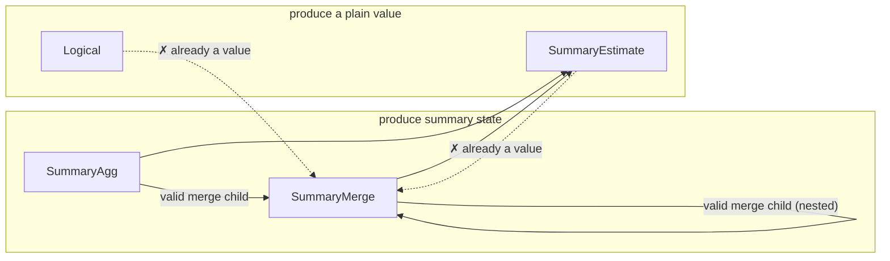

# L4 — summary-bound IR

The point where a plan commits to *what* answers each intent that L3's
canonical form deliberately leaves open. "Summary" is the umbrella term
for whatever answers an intent without re-scanning raw samples —
concretely, either an approximate sketch (e.g. a quantile sketch, a
cardinality sketch, a frequency/heavy-hitter sketch) or an exact
accumulator (e.g. sum, count, min/max, rate, increase). New primitive
classes are meant to slot in as additional summary kinds, not as a new
IR or a new translation layer.

This layer has two distinct halves, deliberately kept separate:
**planning-time** binding (deciding, symbolically, which summary
answers which intent) and **serving-time** execution (actually
resolving that decision against whatever is materialized right now).
They're covered in turn below.

## Planning-time: binding

A decision, made once per query shape, symbolically: given an intent
and its accuracy requirement, which summary family and parameters
answer it — with no reference to what's actually stored anywhere yet.

### The shape of a summary-bound plan

A summary-bound plan mirrors the canonical intent tree but replaces
each summarizable node with a decision:

- **Unbound / logical** — nothing rewrote this node (e.g. a filter or a
  projection); it stays as ordinary logical computation over its
  child's output.
- **Summary aggregation** — a summary family and its parameters, chosen
  for the intent and its accuracy target, over a designated column and
  grouping keys.
- **Summary-aware join** — a join realized via a summary technique
  (e.g. a cardinality-aware join sketch), rather than a full
  materialized join.
- **Summary subtraction / deletion** — algebraic operations on an
  already-built summary, only valid for summary kinds that support
  them.
- **Summary readout** — reading a value out of an already-built
  summary; the inverse of building one.
- **Summary merge** — combining multiple built summaries into one; only
  valid when every input agrees on family and parameters.

A summary-bound plan is a DAG, not just a tree — a shared
sub-computation can appear as more than one reference to the same bound
node, mirroring the sharing already present in the canonical form (see
[`l3-intent-algebra.md`](./l3-intent-algebra.md)). Binding only fires
where an intent is recognizable in the tree; anything underneath an
unrewritten (logical) parent stays logical too — extending binding to
rewrite through a logical parent is a known open design question, not
attempted by the base design.

Each bound node's output schema extends the canonical schema with one
new possibility: a field whose type *is* a built summary (identified by
its family and parameters). Two summary-typed fields are only
compatible if their family and parameters match exactly — which is what
lets subtraction, deletion, and merge reject a mismatched combination
as a planning-time error rather than a runtime one.

## Serving-time: execution

A lookup, done on every query: resolve each leaf of an already-bound
plan against whatever summaries are actually materialized right now.
Reality can diverge from what planning assumed — data might be missing,
several instances of the same summary might need merging, instances
might disagree on parameters — so serving needs its own error cases,
distinct from anything planning-time binding can raise.

### Split of responsibility

The *structural* rules are shared and deployment-independent: which
nestings of a summary-bound plan are valid, and what must agree for a
merge to be legal. Storage, summary math, and readout are entirely
deployment-supplied — this layer defines the interface a deployment
implements, not an implementation of summaries themselves. Concretely,
a deployment supplies: how to find candidate materialized instances for
a bound node, how to fetch one instance's state, how to merge several
instances' states, how to read a value out of a state, and how to
evaluate an unrewritten logical node directly. A shared execution
routine walks the bound tree and calls into these deployment-supplied
operations, so every deployment gets the same walk and merge logic for
free.

Finding candidates for a summary-aggregation node requires seeing that
node's entire input sub-tree, not just a bare name — a summary
aggregation node carries no source identity of its own; that identity
lives further down, inside a scan. Walking down to find it is
deployment-specific knowledge (how a real store names and indexes
summarized data); the shared execution routine doesn't need to
interpret it, only pass the sub-tree along.

### Nested composition

A bound plan nests to arbitrary depth by construction, so execution is
plain recursion with no special-casing for depth. Two composition rules
matter:

- **Only a node that produces summary state (a summary aggregation, or
  another merge) can be a merge's child.** A readout or a logical node
  has already collapsed to a plain value; merging values isn't the
  operation a merge models.
- **A merge of merges preserves the family/parameter agreement
  transitively** — the agreed family and parameters propagate upward
  through every nesting level, so a nested merge is checked the same
  way a flat one is.

Summary-aggregation-over-summary-aggregation is itself valid and
expected — e.g. a two-stage precompute pipeline where one tier streams
a per-group reduction and another tier builds a richer summary over
that stream is a real, intended shape.

**Deliberately left open:** whether a summary aggregation can validly
sit above a *readout* — "build a new summary from another summary's
already-computed value, at query time." Every design considered so far
only builds summaries incrementally from raw samples, at ingest time;
there's no established answer for building one from a
query-time-derived scalar. A deployment that hits this shape should
treat it as unsupported rather than assume either answer. The design
proposal below narrows exactly which cases of this remain genuinely
open (see "Pattern D" below) — it is not fully open anymore, but it is
not fully resolved either.

### What's out of scope here

Placement — *which machine* runs a piece of the plan — is L5's concern
entirely (see [`l5-physical-plan.md`](./l5-physical-plan.md)). This
layer is only about what "answer a query against already-materialized
summaries" means, on whichever machine ends up doing it. Some
operations (summary-aware join, subtraction, deletion) have no defined
execution behavior yet, because no binding rule produces them yet in
the base design — a deployment should add that behavior only once it
has a real need for the shape, rather than speculatively guessing the
right one now.

## Choosing a summary for an intent

Which summary family (if any) answers a given intent is itself a
pluggable decision: a default choice exists per intent, but a
deployment can supply its own ranking to prefer an alternative family
where one exists (e.g. an alternative quantile sketch, an alternative
cardinality sketch). This ranking is the one general-purpose extension
point in this layer — a deployment customizes *which* summary is
chosen, without touching how binding or execution works structurally.

Not every intent has a summary counterpart. An intent whose accurate
computation requires richer partial state than a single summary value
can capture, or whose result is fundamentally non-mergeable across
partitions, has no summary realization by design — it always stays as
ordinary logical computation over raw data.

## Interface

The planning-time IR:

```rust
pub struct L4Node {
    pub expr: SummaryExpr,
    pub schema: L4Schema,
}

pub enum SummaryExpr {
    Logical(Box<QueryExpr>),
    SummaryAgg {
        child: Rc<L4Node>,
        summary: SummaryKind,
        params: SummaryParams,
        col: ColumnRef,
        reduction: Reduction,
    },
    SummaryJoin { outer: Rc<L4Node>, inner: Rc<L4Node>, key: ColumnRef, summary: SummaryKind, params: SummaryParams },
    SummarySubtract { left: Rc<L4Node>, right: Rc<L4Node> },
    SummaryDelete { summary_input: Rc<L4Node>, key: ColumnRef },
    SummaryEstimate { summary_input: Rc<L4Node>, query: SketchQuery },
    SummaryMerge { children: Vec<Rc<L4Node>> },
}
```

The `summary`/`summary_input` field names match this doc's own "summary"
umbrella term (see the top of this doc) directly. An earlier revision of
this type used `sketch`/`sketch_input`, predating that umbrella term —
renamed in #170, landed together with the `Implementation` variant merge
described below.

Per-node validity constraints — each is a summary-catalog fact (see
"Summary catalog" above) checked at planning time, before this shape ever
reaches serving-time execution:

| Node | `summary` field | Constraint |
|---|---|---|
| `Logical` | — | none — wraps an arbitrary unrewritten `QueryExpr` subtree |
| `SummaryAgg` | own | none beyond `col`'s intent already requiring an accuracy target compatible with `summary`; this is the leaf every other row's constraints are checked *against* |
| `SummaryJoin` | own | only emitted by a join-specific `Bind*OnJoin` rule — none exist yet in the base design, so this variant has no live producer |
| `SummarySubtract` | read from `left`/`right` | `left`/`right` agree on `(kind, params)`; that kind's catalog entry sets `subtractable` |
| `SummaryDelete` | read from `summary_input` | that kind's catalog entry sets `deletable` |
| `SummaryEstimate` | read from `summary_input` | `query`'s `SketchQuery` variant is one that kind actually supports (not a single boolean flag — closer to that kind's whole reason for existing) |
| `SummaryMerge` | read from `children`, which must all agree | `children` non-empty; every child produces summary *state*, never a value (see diagram below); that shared kind's catalog entry sets `mergeable` |

The trickiest of these to hold in your head is `SummaryMerge`'s "children
must produce state, not a value" rule — everything here either produces
partial summary **state** (still mergeable, not yet read out) or a final
**value** (already collapsed, e.g. by a readout). Only a state-producing
node may feed a merge:



Binding — turning a canonical `QueryExpr` into an `L4Node` tree:

```rust
pub fn implement_tree(expr: &QueryExpr) -> Result<Rc<L4Node>, ImplementError>;
pub fn implement_tree_with(expr: &QueryExpr, cost_model: &dyn CostModel) -> Result<Rc<L4Node>, ImplementError>;
```

**"Implementation" is the answer to one question: how is this one
intent actually realized?** It's the return type of the per-intent
binding decision (`implementation_for`) — for a given `AggIntent`,
exactly one of: build an approximate sketch (bounded error, sized to
the accuracy target), build an exact accumulator (zero error, still
mergeable — see "Choosing a summary for an intent" above), or don't
summarize at all and evaluate the intent directly over raw data
(`PassThrough`). It's the same three-way choice this doc's "shape of a
summary-bound plan" section already describes in prose; this is that
decision's concrete type:

```rust
pub enum Implementation {
    Summary { kind: SummaryKind, params: SummaryParams },
    PassThrough,
}

pub fn implementation_for(intent: &AggIntent) -> Implementation;
```

An earlier revision of this type split `Summary` into two variants,
`Sketch{kind,params}` and `ExactAccumulator{kind,params}`, carrying
identical shapes — the split existed only because binding needed to
know, right here, whether the chosen `kind` requires a `SummaryEstimate`
readout afterward (approximate) or *is* the answer once built (exact —
no estimate step). #170 collapsed them into the single `Summary`
variant above, recovering that same fact from `SummaryKind::is_exact()`
instead of from the variant tag.

The one pluggable extension point at this layer — a deployment supplies
its own `CostModel` to override which summary family is chosen and how
its parameters are sized, without touching the binding pass itself.
Every method past the first has a sensible default, so a deployment that
only wants to reorder candidates doesn't have to implement the rest:

```rust
pub trait CostModel {
    fn rank_candidates(&self, intent: &AggIntent, candidates: &[SummaryKind]) -> Vec<SummaryKind>;

    fn size_params(&self, kind: SummaryKind, intent: &AggIntent, eps: f64, delta: f64) -> SummaryParams {
        /* default: this crate's built-in sizing formulas */
    }
    fn realize_extension(&self, ext_kind: &str, payload: &serde_json::Value) -> Implementation {
        /* default: PassThrough */
    }
    fn readout_extension(&self, ext_kind: &str, payload: &serde_json::Value, col: &ColumnRef) -> SketchQuery {
        /* default: panics -- only reachable if realize_extension was overridden without this */
    }
}
```

Serving-time — the interface a deployment implements to actually answer
a query against an already-bound `L4Node` tree:

```rust
pub trait SummaryExecutor {
    type Handle: Clone;
    type State;
    type Value;
    type Error;
    type GroupKey: Clone + Ord + Default;

    fn find_candidates(
        &self,
        summary: &SummaryKind,
        params: &SummaryParams,
        col: &ColumnRef,
        reduction: &Reduction,
        child: &L4Node,
    ) -> Result<Vec<(Self::GroupKey, Self::Handle)>, Self::Error>;

    fn fetch_state(&self, handle: &Self::Handle) -> Result<Self::State, Self::Error>;
    fn merge_states(&self, states: Vec<Self::State>) -> Result<Self::State, Self::Error>;
    fn readout(&self, state: &Self::State, query: &SketchQuery) -> Result<Self::Value, Self::Error>;
    fn logical(&self, expr: &QueryExpr) -> Result<Self::Value, Self::Error>;
}

pub fn execute<E: SummaryExecutor>(node: &L4Node, exec: &E) -> Result<ExecOutcome<E>, ExecError<E::Error>>;
```

`find_candidates`'s `reduction` parameter is exactly the `Reduction`
this doc's design section already explains — an implementer must branch
on `Reduce` vs. `PerEntity` there, not guess from an empty key list.

### Design proposal: three composition patterns, not one algebra

The starting question was whether there's a single accuracy law for
"build a summary over another summary's output." There isn't. Surveying
how real systems actually do this — Exponential Histograms / DGIM
[Datar-Gionis-Indyk-Motwani, SICOMP'02], UnivMon [SIGCOMM'16], Hydra
[VLDB'22], and PromSketch [VLDB'25, which builds directly on the first
three] — shows three structurally distinct composition problems, each
with its own (or, in one case, no) governing argument. Presenting them
as one generic algebra would be over-claiming; this section names each
pattern, scopes it against #171/#172/#173, and is explicit about which
one has no known solution at all.

#### Pattern A — same statistic, across partitions (out of scope here)

Composing the *same* summary kind's state across time/space partitions
of the *same* underlying data — e.g. merging per-bucket sketches to
answer a sliding-window range query. DGIM's Theorem 6/7 is the general,
already-proven law for this, for any function `f` satisfying:

```
P1. f(Bᵢ) ≥ 0
P2. f(Bᵢ) ≤ poly(|Bᵢ|)
P3. f(B1+B2) ≥ f(B1)+f(B2)              (sub-additive)
P4. f(B1+B2) ≤ Cf·(f(B1)+f(B2)), Cf ≥ 1  (weakly super-additive)
P5. f admits a composable sketch
```

giving, when the per-bucket sketch itself carries relative error `ε̂`:

```
Er ≤ (1+ε̂)²·Cf²/k + Cf − 1 + ε̂
```

(`k` is the bucket-count knob). PromSketch's own EHKLL (`εEHKLL ≤
2εEH+εKLL`) and EHUniv are both direct instances of this theorem for
specific `f` (rank-error, and `L2²` respectively) — EHUniv specifically
tunes `k = O(1/ε²)` so the `Cf²/k` term becomes asymptotically smaller
than `ε̂`, which is why its headline bound shows a single `ε` rather than
an explicit sum.

This is real, general, and probably something ASAPController needs
eventually for windowed/range-vector PromQL queries — but it composes
the *same* statistic across a partition of *the same data*, which is not
what #171/#172/#173 ask about (composing *different* statistics along a
query's data-flow). It's flagged here and left out of scope; it belongs
in a separate issue, not this design.

#### Pattern B — hash-collision routing (#173's Hydra and QTree cases)

Hydra's "sketch of sketches" hashes *subpopulations* to shared inner
sketch instances the same way CMS hashes *keys* to shared counters — raw
data flows directly into whichever inner instance a subpopulation routes
to; several subpopulations can collide into one. Theorem 2 gives the
combined bound:

```
Gi(1 − εUS) ≤ Ĝi ≤ Gi(1 + εUS) + ε·GS       w.p. ≥ 1 − δ
```

`εUS` is the inner universal sketch's own error; the additive term is
referenced against `GS`, the **global** total across the whole stream,
not against `Gi` itself — an asymmetric, non-self-referential shape that
doesn't fit the same-kind `(ε, δ)`-relative-to-self guarantee every other
`SummaryKind` in this catalog reports. That's precisely why this isn't a
composition of two independently-built `L4Node`s: it needs its own
dedicated `SummaryKind` (its own `w×r` grid, its own `implied_accuracy`
shaped like Theorem 2), fed directly from raw data, with one readout —
not a generic combination of already-built children.

QTree-style range trees belong in this pattern too, for a different
reason: their accuracy isn't a probabilistic `(ε,δ)` bound at all — it's
a deterministic interval radius that shrinks with tree capacity. Same
conclusion: its own `SummaryKind`, its own accuracy representation
(`Accuracy::Bounded { radius }`, alongside the existing `Probabilistic`
shape every sketch and accumulator already reports), no composition
primitive needed.

```rust
pub enum Accuracy {
    Probabilistic { epsilon: f64, delta: f64, norm: ErrorNorm },
    Bounded { radius: f64 },
}

pub enum ErrorNorm {
    L1,          // per-item error relative to Σ|x| — CMS
    L2,          // per-item error relative to the L2 norm of the (residual) value
                  // vector — Count-Sketch; tighter than L1 on skewed data, not
                  // directly convertible to it without a workload-dependent factor
    Pointwise,   // no underlying vector norm — KLL, HLL, DDSketch, Theta, Kmv
}
```

`#173`'s answer, in full: Hydra and QTree are both new `SummaryKind`
catalog entries with bespoke accuracy math, not a generalization of the
mechanism built for #171/#172 below.

#### Pattern D — heterogeneous sequential nesting (#171, #172)

This is what the two issues actually describe: an outer `AggIntent`
built over an inner `AggIntent` of a *different* kind (`TopK` over
`Rate`; `Max` over `Quantile`; `TopK` over `Cardinality`). None of the
four papers surveyed instantiate this shape — each avoids it
structurally (Pattern A merges same-kind state; Pattern B routes raw
data into a shared inner instance; nothing here ever re-sketches another
sketch's already-collapsed readout). There is no borrowed theorem for
this pattern. It splits into three cases by what the inner side actually
is.

**D1 — inner is exact (composes for free).** If the inner `AggIntent`
computes something exactly and cheaply from raw data (`Rate`, `Increase`,
`Delta`, `Deriv`, …), there's no need to reference its *readout* at all
— the outer summary can be built directly over the inner's exact,
mergeable **state**, which is definitionally `Accuracy::EXACT`
(`epsilon = delta = 0`). Composing over it adds zero error by
definition, so it's allowed unconditionally:

```rust
pub enum ColumnRef {
    Named(String),
    Qualified { table: String, name: String },
    SampleValue,
    FromSummary { node: Rc<L4Node>, accuracy: Accuracy },   // NEW
}
```

`accuracy == Accuracy::EXACT` is always a legal `FromSummary` — this is
`#171` direction 2 in full.

**D2 — outer is an exact fold over an inner realized summary.** `Min`/
`Max`/`Avg`/`StdDev`/`Variance` folded over an inner *already-realized*
summary (`max by (zone) (quantile_over_time(0.99, m[5m]))`) is exact by
construction on the fold side — the open question is only which of these
fold operators can consume the inner's collapsed scalar directly versus
which need its pre-readout sufficient statistic (the same distinction as
Algebird's `Averaged`/moment monoids: `Avg`/`Variance`/`StdDev` aren't
associative on the scalar output, only on `(Σv, n)` / `(Σv, Σv², n)`):

```rust
pub enum FoldOp { Min, Max, Avg, Variance { population: bool }, StdDev { population: bool } }

pub enum FoldInput {
    Value,                 // Min/Max: the inner's already-read-out scalar suffices
    SufficientStatistic,   // Avg/Variance/StdDev: needs the inner's pre-readout state
}

impl FoldOp {
    pub fn required_input(&self) -> FoldInput {
        match self {
            FoldOp::Min | FoldOp::Max => FoldInput::Value,
            _ => FoldInput::SufficientStatistic,
        }
    }
}

SummaryExpr::SummaryFold { child: Rc<L4Node>, fold: FoldOp, by: Vec<ColumnRef> },
```

`SummaryFold` carries no `Accuracy` of its own — the fold is exact, so
it's transparent to whatever accuracy its child already has. This is
`#171` direction 1 in full.

**D3 — outer approximate over an inner statistic that cannot be computed
exactly in sub-linear space (the genuinely open part of #172).** `Rate`
can always be computed inline from raw data (case D1), so it's never
truly stuck behind an approximate readout. But `Cardinality`/`Quantile`/
`TopK` as an *inner* statistic have no exact sub-linear form to fall back
to — `topk(5, count(hll_metric) by (key))` genuinely has no choice but to
build the outer `TopK` over the inner HLL's approximate estimate. This is
the actual, narrowed scope of what remains unsolved: not "any nested
approximation," but specifically *outer sketch over an inner statistic
that is inherently sketch-only*.

For this case only, the design keeps a composition hook — but labeled
honestly as a first-principles derivation this design is proposing, not
a result borrowed from any of the four systems surveyed (none of them
attempt this shape; Hydra's answer to "I need to combine an
inherently-approximate inner statistic with an outer one" is to build a
*single* bespoke `SummaryKind`, per Pattern B, not to compose two):

```rust
pub struct Sensitivity { pub lipschitz: f64, pub from: ErrorNorm }

impl Accuracy {
    /// `None` if `child.norm != sensitivity.from` — refuse rather than
    /// silently apply an unproven `lipschitz` constant across a norm it
    /// wasn't derived for.
    pub fn compose(outer: Accuracy, child: Accuracy, sensitivity: Sensitivity) -> Option<Accuracy> {
        match (outer, child) {
            (
                Accuracy::Probabilistic { epsilon: e_o, delta: d_o, norm },
                Accuracy::Probabilistic { epsilon: e_c, delta: d_c, norm: child_norm },
            ) if child_norm == sensitivity.from => Some(Accuracy::Probabilistic {
                epsilon: e_o + sensitivity.lipschitz * e_c,
                delta: d_o + d_c,
                norm,
            }),
            _ => None,
        }
    }
}

pub trait CostModel {
    /// Does this deployment accept building `outer` over an inner
    /// statistic that is inherently sketch-only (Cardinality/Quantile/
    /// TopK as the inner kind)? Default `false` — no known system
    /// attempts this composition; refuse rather than assume a Lipschitz
    /// bound nobody has proven for this specific pairing.
    fn accepts_nested_approx(&self, outer: &AggIntent, child_kind: &SummaryKind) -> bool {
        false
    }

    fn size_params(
        &self,
        kind: SummaryKind,
        intent: &AggIntent,
        target: Accuracy,
        child_accuracy: Option<Accuracy>,
    ) -> SummaryParams { .. }
}
```

`accepts_nested_approx` defaulting to `false` isn't a placeholder pending
proof — it's the design matching what every real system surveyed
actually does: none of them build an outer sketch over an inner sketch's
readout, ever. A deployment that overrides it to `true` is asserting a
`Sensitivity` it has independently justified for its specific
`(outer, child_kind)` pair, not relying on anything this design or the
literature behind it provides.

### Which issue this solves

- **[#171](https://github.com/ProjectASAP/ASAPController/issues/171)** —
  direction 1 (outer exact fold over inner summary) is Pattern D2,
  `SummaryFold`/`FoldOp`. Direction 2 (outer summary over inner exact
  accumulator) is Pattern D1, `FromSummary` at `Accuracy::EXACT`,
  unconditional.
- **[#172](https://github.com/ProjectASAP/ASAPController/issues/172)** —
  Pattern D3 exactly: narrowed from "any nested approximation" to "outer
  sketch over an inner statistic with no exact sub-linear form." No
  known system solves this generically; the design keeps a gated,
  explicitly-unproven `compose`/`accepts_nested_approx` hook rather than
  either forbidding the shape outright or pretending a borrowed theorem
  covers it.
- **[#173](https://github.com/ProjectASAP/ASAPController/issues/173)** —
  Pattern B. Hydra and QTree are each their own `SummaryKind` with
  bespoke accuracy math (Theorem 2's shape; a deterministic
  `Accuracy::Bounded` radius, respectively) fed directly from raw data —
  not a generalization of `FromSummary`/`SummaryFold`.
- **Pattern A** (same-statistic windowing, DGIM-grounded) answers none of
  the three issues directly — it's flagged as a real, separate gap
  (sliding-window range-vector queries) worth its own future issue.
