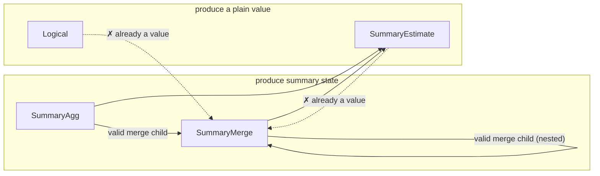

# L4 — summary-bound IR

The point where a plan commits to *what* answers each intent that L3's
canonical form deliberately leaves open. "Summary" is the umbrella term
for whatever answers an intent without re-scanning raw samples —
concretely, either an approximate sketch (e.g. a quantile sketch, a
cardinality sketch, a frequency/heavy-hitter sketch) or an exact
accumulator (e.g. sum, count, min/max, rate, increase). New primitive
classes are meant to slot in as additional summary kinds, not as a new
IR or a new translation layer.

This layer has two distinct halves, deliberately kept separate:
**planning-time** binding (deciding, symbolically, which summary
answers which intent) and **serving-time** execution (actually
resolving that decision against whatever is materialized right now).
They're covered in turn below.

## Planning-time: binding

A decision, made once per query shape, symbolically: given an intent
and its accuracy requirement, which summary family and parameters
answer it — with no reference to what's actually stored anywhere yet.

### The shape of a summary-bound plan

A summary-bound plan mirrors the canonical intent tree but replaces
each summarizable node with a decision:

- **Unbound / logical** — nothing rewrote this node (e.g. a filter or a
  projection); it stays as ordinary logical computation over its
  child's output.
- **Summary aggregation** — a summary family and its parameters, chosen
  for the intent and its accuracy target, over a designated column and
  grouping keys.
- **Summary-aware join** — a join realized via a summary technique
  (e.g. a cardinality-aware join sketch), rather than a full
  materialized join.
- **Summary subtraction / deletion** — algebraic operations on an
  already-built summary, only valid for summary kinds that support
  them.
- **Summary readout** — reading a value out of an already-built
  summary; the inverse of building one.
- **Summary merge** — combining multiple built summaries into one; only
  valid when every input agrees on family and parameters.

A summary-bound plan is a DAG, not just a tree — a shared
sub-computation can appear as more than one reference to the same bound
node, mirroring the sharing already present in the canonical form (see
[`l3-intent-algebra.md`](./l3-intent-algebra.md)). Binding only fires
where an intent is recognizable in the tree; anything underneath an
unrewritten (logical) parent stays logical too — extending binding to
rewrite through a logical parent is a known open design question, not
attempted by the base design.

Each bound node's output schema extends the canonical schema with one
new possibility: a field whose type *is* a built summary (identified by
its family and parameters). Two summary-typed fields are only
compatible if their family and parameters match exactly — which is what
lets subtraction, deletion, and merge reject a mismatched combination
as a planning-time error rather than a runtime one.

## Serving-time: execution

A lookup, done on every query: resolve each leaf of an already-bound
plan against whatever summaries are actually materialized right now.
Reality can diverge from what planning assumed — data might be missing,
several instances of the same summary might need merging, instances
might disagree on parameters — so serving needs its own error cases,
distinct from anything planning-time binding can raise.

### Split of responsibility

The *structural* rules are shared and deployment-independent: which
nestings of a summary-bound plan are valid, and what must agree for a
merge to be legal. Storage, summary math, and readout are entirely
deployment-supplied — this layer defines the interface a deployment
implements, not an implementation of summaries themselves. Concretely,
a deployment supplies: how to find candidate materialized instances for
a bound node, how to fetch one instance's state, how to merge several
instances' states, how to read a value out of a state, and how to
evaluate an unrewritten logical node directly. A shared execution
routine walks the bound tree and calls into these deployment-supplied
operations, so every deployment gets the same walk and merge logic for
free.

Finding candidates for a summary-aggregation node requires seeing that
node's entire input sub-tree, not just a bare name — a summary
aggregation node carries no source identity of its own; that identity
lives further down, inside a scan. Walking down to find it is
deployment-specific knowledge (how a real store names and indexes
summarized data); the shared execution routine doesn't need to
interpret it, only pass the sub-tree along.

### Nested composition

A bound plan nests to arbitrary depth by construction, so execution is
plain recursion with no special-casing for depth. Two composition rules
matter:

- **Only a node that produces summary state (a summary aggregation, or
  another merge) can be a merge's child.** A readout or a logical node
  has already collapsed to a plain value; merging values isn't the
  operation a merge models.
- **A merge of merges preserves the family/parameter agreement
  transitively** — the agreed family and parameters propagate upward
  through every nesting level, so a nested merge is checked the same
  way a flat one is.

Summary-aggregation-over-summary-aggregation is itself valid and
expected — e.g. a two-stage precompute pipeline where one tier streams
a per-group reduction and another tier builds a richer summary over
that stream is a real, intended shape.

**Deliberately left open:** whether a summary aggregation can validly
sit above a *readout* — "build a new summary from another summary's
already-computed value, at query time." Every design considered so far
only builds summaries incrementally from raw samples, at ingest time;
there's no established answer for building one from a
query-time-derived scalar. A deployment that hits this shape should
treat it as unsupported rather than assume either answer.

### What's out of scope here

Placement — *which machine* runs a piece of the plan — is L5's concern
entirely (see [`l5-physical-plan.md`](./l5-physical-plan.md)). This
layer is only about what "answer a query against already-materialized
summaries" means, on whichever machine ends up doing it. Some
operations (summary-aware join, subtraction, deletion) have no defined
execution behavior yet, because no binding rule produces them yet in
the base design — a deployment should add that behavior only once it
has a real need for the shape, rather than speculatively guessing the
right one now.

## Choosing a summary for an intent

Which summary family (if any) answers a given intent is itself a
pluggable decision: a default choice exists per intent, but a
deployment can supply its own ranking to prefer an alternative family
where one exists (e.g. an alternative quantile sketch, an alternative
cardinality sketch). This ranking is the one general-purpose extension
point in this layer — a deployment customizes *which* summary is
chosen, without touching how binding or execution works structurally.

Not every intent has a summary counterpart. An intent whose accurate
computation requires richer partial state than a single summary value
can capture, or whose result is fundamentally non-mergeable across
partitions, has no summary realization by design — it always stays as
ordinary logical computation over raw data.

## Interface

The planning-time IR:

```rust
pub struct L4Node {
    pub expr: SummaryExpr,
    pub schema: L4Schema,
}

pub enum SummaryExpr {
    Logical(Box<QueryExpr>),
    SummaryAgg {
        child: Rc<L4Node>,
        summary: SummaryKind,
        params: SummaryParams,
        col: ColumnRef,
        reduction: Reduction,
    },
    SummaryJoin { outer: Rc<L4Node>, inner: Rc<L4Node>, key: ColumnRef, summary: SummaryKind, params: SummaryParams },
    SummarySubtract { left: Rc<L4Node>, right: Rc<L4Node> },
    SummaryDelete { summary_input: Rc<L4Node>, key: ColumnRef },
    SummaryEstimate { summary_input: Rc<L4Node>, query: SketchQuery },
    SummaryMerge { children: Vec<Rc<L4Node>> },
}
```

The `summary`/`summary_input` field names match this doc's own "summary"
umbrella term (see the top of this doc) directly. An earlier revision of
this type used `sketch`/`sketch_input`, predating that umbrella term —
renamed in #170, landed together with the `Implementation` variant merge
described below.

Per-node validity constraints — each is a summary-catalog fact (see
"Summary catalog" above) checked at planning time, before this shape ever
reaches serving-time execution:

| Node | `summary` field | Constraint |
|---|---|---|
| `Logical` | — | none — wraps an arbitrary unrewritten `QueryExpr` subtree |
| `SummaryAgg` | own | none beyond `col`'s intent already requiring an accuracy target compatible with `summary`; this is the leaf every other row's constraints are checked *against* |
| `SummaryJoin` | own | only emitted by a join-specific `Bind*OnJoin` rule — none exist yet in the base design, so this variant has no live producer |
| `SummarySubtract` | read from `left`/`right` | `left`/`right` agree on `(kind, params)`; that kind's catalog entry sets `subtractable` |
| `SummaryDelete` | read from `summary_input` | that kind's catalog entry sets `deletable` |
| `SummaryEstimate` | read from `summary_input` | `query`'s `SketchQuery` variant is one that kind actually supports (not a single boolean flag — closer to that kind's whole reason for existing) |
| `SummaryMerge` | read from `children`, which must all agree | `children` non-empty; every child produces summary *state*, never a value (see diagram below); that shared kind's catalog entry sets `mergeable` |

The trickiest of these to hold in your head is `SummaryMerge`'s "children
must produce state, not a value" rule — everything here either produces
partial summary **state** (still mergeable, not yet read out) or a final
**value** (already collapsed, e.g. by a readout). Only a state-producing
node may feed a merge:



Binding — turning a canonical `QueryExpr` into an `L4Node` tree:

```rust
pub fn implement_tree(expr: &QueryExpr) -> Result<Rc<L4Node>, ImplementError>;
pub fn implement_tree_with(expr: &QueryExpr, cost_model: &dyn CostModel) -> Result<Rc<L4Node>, ImplementError>;
```

**"Implementation" is the answer to one question: how is this one
intent actually realized?** It's the return type of the per-intent
binding decision (`implementation_for`) — for a given `AggIntent`,
exactly one of: build an approximate sketch (bounded error, sized to
the accuracy target), build an exact accumulator (zero error, still
mergeable — see "Choosing a summary for an intent" above), or don't
summarize at all and evaluate the intent directly over raw data
(`PassThrough`). It's the same three-way choice this doc's "shape of a
summary-bound plan" section already describes in prose; this is that
decision's concrete type:

```rust
pub enum Implementation {
    Summary { kind: SummaryKind, params: SummaryParams },
    PassThrough,
}

pub fn implementation_for(intent: &AggIntent) -> Implementation;
```

An earlier revision of this type split `Summary` into two variants,
`Sketch{kind,params}` and `ExactAccumulator{kind,params}`, carrying
identical shapes — the split existed only because binding needed to
know, right here, whether the chosen `kind` requires a `SummaryEstimate`
readout afterward (approximate) or *is* the answer once built (exact —
no estimate step). #170 collapsed them into the single `Summary`
variant above, recovering that same fact from `SummaryKind::is_exact()`
instead of from the variant tag.

The one pluggable extension point at this layer — a deployment supplies
its own `CostModel` to override which summary family is chosen and how
its parameters are sized, without touching the binding pass itself.
Every method past the first has a sensible default, so a deployment that
only wants to reorder candidates doesn't have to implement the rest:

```rust
pub trait CostModel {
    fn rank_candidates(&self, intent: &AggIntent, candidates: &[SummaryKind]) -> Vec<SummaryKind>;

    fn size_params(&self, kind: SummaryKind, intent: &AggIntent, eps: f64, delta: f64) -> SummaryParams {
        /* default: this crate's built-in sizing formulas */
    }
    fn realize_extension(&self, ext_kind: &str, payload: &serde_json::Value) -> Implementation {
        /* default: PassThrough */
    }
    fn readout_extension(&self, ext_kind: &str, payload: &serde_json::Value, col: &ColumnRef) -> SketchQuery {
        /* default: panics -- only reachable if realize_extension was overridden without this */
    }
}
```

Serving-time — the interface a deployment implements to actually answer
a query against an already-bound `L4Node` tree:

```rust
pub trait SummaryExecutor {
    type Handle: Clone;
    type State;
    type Value;
    type Error;
    type GroupKey: Clone + Ord + Default;

    fn find_candidates(
        &self,
        summary: &SummaryKind,
        params: &SummaryParams,
        col: &ColumnRef,
        reduction: &Reduction,
        child: &L4Node,
    ) -> Result<Vec<(Self::GroupKey, Self::Handle)>, Self::Error>;

    fn fetch_state(&self, handle: &Self::Handle) -> Result<Self::State, Self::Error>;
    fn merge_states(&self, states: Vec<Self::State>) -> Result<Self::State, Self::Error>;
    fn readout(&self, state: &Self::State, query: &SketchQuery) -> Result<Self::Value, Self::Error>;
    fn logical(&self, expr: &QueryExpr) -> Result<Self::Value, Self::Error>;
}

pub fn execute<E: SummaryExecutor>(node: &L4Node, exec: &E) -> Result<ExecOutcome<E>, ExecError<E::Error>>;
```

`find_candidates`'s `reduction` parameter is exactly the `Reduction`
this doc's design section already explains — an implementer must branch
on `Reduce` vs. `PerEntity` there, not guess from an empty key list.

### Design proposal: an accuracy algebra for composed summaries (#171, #172, #173)

[#171](https://github.com/ProjectASAP/ASAPController/issues/171) (exact ↔
summary composition), [#172](https://github.com/ProjectASAP/ASAPController/issues/172)
(approximate-over-approximate composition), and
[#173](https://github.com/ProjectASAP/ASAPController/issues/173)
(multi-dimensional/structured summaries, e.g. QTree-style range trees and
Hydra-style sketch-of-sketches) are one design question, not three: what
does it mean to build a summary over the *output* of another summary,
rather than over raw data? The proposal below is a single algebra that
answers it once, so a fix doesn't have to be re-derived per issue.

#### The guarantee every summary kind already makes

Every `SummaryKind` implicitly satisfies a guarantee of this shape, for
its build map `β` (raw values → state), readout `ρ` (state → value), and
the true aggregate function `φ` it approximates (`Sum`, `Count`,
`Quantile_q`, `Cardinality`, `TopK_k`, …) over a multiset `X`:

```
Pr[ |ρ(β(X)) − φ(X)| > ε·φ(X) ] ≤ δ                      (G)
```

with `(ε, δ) = (0, 0)` for the exact accumulators (`Sum`/`Count`/`MinMax`/
`Rate`/`Increase`) — precisely what `SummaryKind::is_exact()` records. Made
explicit as a type:

```rust
pub struct Accuracy {
    pub epsilon: f64,
    pub delta: f64,
}

impl Accuracy {
    pub const EXACT: Accuracy = Accuracy { epsilon: 0.0, delta: 0.0 };
}

impl SummaryKind {
    /// The (ε, δ) this kind, at these params, actually satisfies for (G) —
    /// the inverse of `boundary::default_size_params`'s sizing formulas.
    /// E.g. Kll: ε ≈ 2/k; Hll: ε ≈ 1.04/√(2^p); Cms: ε ≈ e/width, δ ≈ e^(−depth).
    /// `Accuracy::EXACT` for every kind where `is_exact()` holds.
    pub fn implied_accuracy(&self, params: &SummaryParams) -> Accuracy { .. }
}
```

This is the same abstraction Algebird's `Approximate[T]` monoid packages —
a confidence interval that composes algebraically *within one chain*. All
three issues are asking what happens at the boundary where a second
instance of (G) is layered on top of the *output* of a first, instead of
being built once over raw `X`.

#### The composition theorem

Let a child summary produce `ṽ = ρ_child(β_child(X))` satisfying (G) with
`Accuracy A_c = (ε_c, δ_c)` for `φ_child`. Let an outer summary be built
over `ṽ` as if it were exact input, satisfying (G) with `A_o = (ε_o, δ_o)`
for `φ_outer`. If `φ_outer` is `L`-Lipschitz in its input (linear
aggregates like `Sum`/`Count`/CMS-frequency have `L = 1` exactly; rank-based
aggregates like `Quantile`/`TopK` have `L = 1` under the standard
assumption that a relative perturbation of each element doesn't move its
rank by more than a proportional amount — an assumption, not a proof, which
is why the gate below defaults closed), then by the triangle inequality on
the two error terms and a union bound on their two failure events:

```
Pr[ |ρ_outer(β_outer(ṽ)) − φ_outer(φ_child(X))| > (ε_o + L·ε_c)·φ_outer(φ_child(X)) ] ≤ δ_o + δ_c     (G∘)
```

As an operator on `Accuracy`:

```rust
impl Accuracy {
    pub fn compose(outer: Accuracy, child: Accuracy, lipschitz: f64) -> Accuracy {
        Accuracy {
            epsilon: outer.epsilon + lipschitz * child.epsilon,
            delta: outer.delta + child.delta,
        }
    }
}
```

**#171 direction 2 and #172 are the same formula at two points on one
axis.** `#171`'s outer-summary-over-inner-exact-accumulator is exactly
`A_c = Accuracy::EXACT` — `compose` returns `A_o` unchanged, so composing
over an exact child is free and can be blessed unconditionally. `#172`'s
outer-summary-over-inner-approximate-sketch is the same formula with
`A_c.epsilon, A_c.delta > 0` — composing is no longer free, and the
combined bound must be checked against what the query actually asked for.

#### Interface: letting a summary's input be another summary's output

One new `ColumnRef` variant carries an `Accuracy` alongside the reference,
so every consumer of `col` can see what it's actually built on without
re-deriving it:

```rust
pub enum ColumnRef {
    Named(String),
    Qualified { table: String, name: String },
    SampleValue,
    FromSummary { node: Rc<L4Node>, accuracy: Accuracy },   // NEW
}
```

Constructing `FromSummary` is legal in exactly two cases:

- `accuracy == Accuracy::EXACT` — always allowed (#171 direction 2).
- `accuracy.epsilon > 0 || accuracy.delta > 0` — allowed only when the
  deployment's `CostModel` opts in (#172):

  ```rust
  pub trait CostModel {
      /// Does this deployment accept building `outer` over a child already
      /// carrying `child_kind`'s own approximation error? Default `false` —
      /// refuse rather than silently double-approximate.
      fn accepts_nested_approx(&self, outer: &AggIntent, child_kind: &SummaryKind) -> bool {
          false
      }

      /// Size `kind`'s params so the composed guarantee (G∘) holds against
      /// `target` (what the query asked for), given the child's own
      /// resolved `Accuracy` when the input is a `FromSummary` column.
      /// Solves `target ≥ Accuracy::compose(result, child_accuracy, L)`,
      /// i.e. `result.epsilon = target.epsilon − L·child_accuracy.epsilon`,
      /// `result.delta = target.delta − child_accuracy.delta` — rejecting
      /// if either goes non-positive (no achievable outer accuracy leaves
      /// enough of the target budget for the child's contribution).
      fn size_params(
          &self,
          kind: SummaryKind,
          intent: &AggIntent,
          target: Accuracy,
          child_accuracy: Option<Accuracy>,   // None over raw/exact input
      ) -> SummaryParams { .. }
  }
  ```

  When `accepts_nested_approx` returns `false` (the default), binding
  falls back to `Implementation::PassThrough` instead of constructing an
  unsound `FromSummary` column — the same paired-method shape
  `realize_extension`/`readout_extension` already uses one layer up.

#### Interface: folding over a child, as a monoid homomorphism

The other half of #171 (an outer *exact fold* over an inner realized
summary) isn't an accuracy question — the fold itself is exact — it's a
question of which of `Min`/`Max`/`Avg`/`StdDev`/`Variance` are valid to
apply directly to a child's already-*collapsed* value, versus which need
the child's pre-readout state. This is exactly Algebird's `Averaged`/
moment-monoid distinction: `Avg`/`Variance`/`StdDev` are not associative
on the scalar output (the average of two averages isn't the true average
under unequal group sizes) — the monoid lives on the sufficient statistic
(`Σv`; `Σv, n`; `Σv, Σv², n`), not on the folded scalar itself.

```rust
pub enum FoldOp {
    Min,
    Max,
    Avg,
    Variance { population: bool },
    StdDev { population: bool },
}

pub enum FoldInput {
    /// (ℝ, min, +∞) / (ℝ, max, −∞) are commutative monoids on the value
    /// itself — the child's already-read-out scalar estimate suffices.
    Value,
    /// No monoid exists on the scalar average/variance alone — folding
    /// needs the child's pre-readout sufficient statistic instead.
    SufficientStatistic,
}

impl FoldOp {
    pub fn required_input(&self) -> FoldInput {
        match self {
            FoldOp::Min | FoldOp::Max => FoldInput::Value,
            FoldOp::Avg | FoldOp::Variance { .. } | FoldOp::StdDev { .. } => {
                FoldInput::SufficientStatistic
            }
        }
    }
}

SummaryExpr::SummaryFold {
    child: Rc<L4Node>,   // a SummaryEstimate/exact state for FoldInput::Value;
                          // a pre-readout SummaryAgg state for FoldInput::SufficientStatistic
    fold: FoldOp,
    by: Vec<ColumnRef>,   // this node's own grouping — may be coarser than child's
},
```

Because `fold` is always exact, `SummaryFold` carries no `Accuracy` of its
own — it's transparent to whatever accuracy the child already has.

#### Generalizing to #173: N-ary composition and non-probabilistic accuracy

Two changes make the same primitives serve #173 without inventing a
parallel mechanism when it lands:

- **Hydra's sketch-of-sketches is `FromSummary`/`SummaryFold` with more
  than one child.** Generalize both to `children: Vec<(Rc<L4Node>, Accuracy)>`
  combined by some `combine` function (per-dimension sketches feeding one
  cross-dimension estimate). The composition theorem generalizes the same
  way a union bound always does:

  ```
  ε_total = ε_outer + Σ_i Lᵢ·εᵢ         δ_total = δ_outer + Σ_i δᵢ
  ```

  — no new theorem, just summing (G∘)'s per-child term over the children
  vector instead of a single child.

- **QTree-style range trees need a non-probabilistic `Accuracy`.** `(G)`
  assumes a point estimate with probabilistic error; a range-tree kind's
  `rangeQuantileBounds`/`rangeSumBounds` return a *deterministic* interval
  whose half-width shrinks with tree capacity, not a `(ε, δ)` pair. Model
  it as a second `Accuracy` variant instead of forcing a probabilistic
  shape onto it:

  ```rust
  pub enum Accuracy {
      Probabilistic { epsilon: f64, delta: f64 },
      Bounded { radius: f64 },   // e.g. a QTree node's interval half-width
  }
  ```

  `compose` for two `Bounded` accuracies is `radius_total = radius_outer +
  L·radius_child` — the same triangle-inequality shape as `(G∘)`, just
  without a failure probability to union-bound. `FromSummary`/`SummaryFold`
  don't need to know which variant they're carrying; only `compose` and
  `size_params` do.
