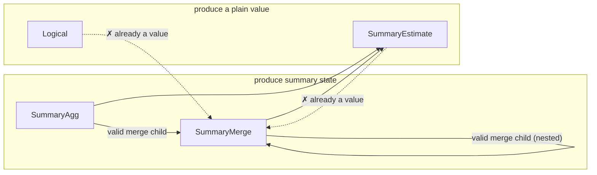

# L4 — summary-bound IR

The point where a plan commits to *what* answers each intent that L3's
canonical form deliberately leaves open. "Summary" is the umbrella term
for whatever answers an intent without re-scanning raw samples —
concretely, either an approximate sketch (e.g. a quantile sketch, a
cardinality sketch, a frequency/heavy-hitter sketch) or an exact
accumulator (e.g. sum, count, min/max, rate, increase). New primitive
classes are meant to slot in as additional summary kinds, not as a new
IR or a new translation layer.

This layer has two distinct halves, deliberately kept separate:
**planning-time** binding (deciding, symbolically, which summary
answers which intent) and **serving-time** execution (actually
resolving that decision against whatever is materialized right now).
They're covered in turn below.

## Planning-time: binding

A decision, made once per query shape, symbolically: given an intent
and its accuracy requirement, which summary family and parameters
answer it — with no reference to what's actually stored anywhere yet.

### The shape of a summary-bound plan

A summary-bound plan mirrors the canonical intent tree but replaces
each summarizable node with a decision:

- **Unbound / logical** — nothing rewrote this node (e.g. a filter or a
  projection); it stays as ordinary logical computation over its
  child's output.
- **Summary aggregation** — a summary family and its parameters, chosen
  for the intent and its accuracy target, over a designated column and
  grouping keys.
- **Summary-aware join** — a join realized via a summary technique
  (e.g. a cardinality-aware join sketch), rather than a full
  materialized join.
- **Summary subtraction / deletion** — algebraic operations on an
  already-built summary, only valid for summary kinds that support
  them.
- **Summary readout** — reading a value out of an already-built
  summary; the inverse of building one.
- **Summary merge** — combining multiple built summaries into one; only
  valid when every input agrees on family and parameters.

A summary-bound plan is a DAG, not just a tree — a shared
sub-computation can appear as more than one reference to the same bound
node, mirroring the sharing already present in the canonical form (see
[`l3-intent-algebra.md`](./l3-intent-algebra.md)). Binding only fires
where an intent is recognizable in the tree; anything underneath an
unrewritten (logical) parent stays logical too — extending binding to
rewrite through a logical parent is a known open design question, not
attempted by the base design.

Each bound node's output schema extends the canonical schema with one
new possibility: a field whose type *is* a built summary (identified by
its family and parameters). Two summary-typed fields are only
compatible if their family and parameters match exactly — which is what
lets subtraction, deletion, and merge reject a mismatched combination
as a planning-time error rather than a runtime one.

## Serving-time: execution

A lookup, done on every query: resolve each leaf of an already-bound
plan against whatever summaries are actually materialized right now.
Reality can diverge from what planning assumed — data might be missing,
several instances of the same summary might need merging, instances
might disagree on parameters — so serving needs its own error cases,
distinct from anything planning-time binding can raise.

### Split of responsibility

The *structural* rules are shared and deployment-independent: which
nestings of a summary-bound plan are valid, and what must agree for a
merge to be legal. Storage, summary math, and readout are entirely
deployment-supplied — this layer defines the interface a deployment
implements, not an implementation of summaries themselves. Concretely,
a deployment supplies: how to find candidate materialized instances for
a bound node, how to fetch one instance's state, how to merge several
instances' states, how to read a value out of a state, and how to
evaluate an unrewritten logical node directly. A shared execution
routine walks the bound tree and calls into these deployment-supplied
operations, so every deployment gets the same walk and merge logic for
free.

Finding candidates for a summary-aggregation node requires seeing that
node's entire input sub-tree, not just a bare name — a summary
aggregation node carries no source identity of its own; that identity
lives further down, inside a scan. Walking down to find it is
deployment-specific knowledge (how a real store names and indexes
summarized data); the shared execution routine doesn't need to
interpret it, only pass the sub-tree along.

### Nested composition

A bound plan nests to arbitrary depth by construction, so execution is
plain recursion with no special-casing for depth. Two composition rules
matter:

- **Only a node that produces summary state (a summary aggregation, or
  another merge) can be a merge's child.** A readout or a logical node
  has already collapsed to a plain value; merging values isn't the
  operation a merge models.
- **A merge of merges preserves the family/parameter agreement
  transitively** — the agreed family and parameters propagate upward
  through every nesting level, so a nested merge is checked the same
  way a flat one is.

Summary-aggregation-over-summary-aggregation is itself valid and
expected — e.g. a two-stage precompute pipeline where one tier streams
a per-group reduction and another tier builds a richer summary over
that stream is a real, intended shape.

**Deliberately left open:** whether a summary aggregation can validly
sit above a *readout* — "build a new summary from another summary's
already-computed value, at query time." Every design considered so far
only builds summaries incrementally from raw samples, at ingest time;
there's no established answer for building one from a
query-time-derived scalar. A deployment that hits this shape should
treat it as unsupported rather than assume either answer.

### What's out of scope here

Placement — *which machine* runs a piece of the plan — is L5's concern
entirely (see [`l5-physical-plan.md`](./l5-physical-plan.md)). This
layer is only about what "answer a query against already-materialized
summaries" means, on whichever machine ends up doing it. Some
operations (summary-aware join, subtraction, deletion) have no defined
execution behavior yet, because no binding rule produces them yet in
the base design — a deployment should add that behavior only once it
has a real need for the shape, rather than speculatively guessing the
right one now.

## Choosing a summary for an intent

Which summary family (if any) answers a given intent is itself a
pluggable decision: a default choice exists per intent, but a
deployment can supply its own ranking to prefer an alternative family
where one exists (e.g. an alternative quantile sketch, an alternative
cardinality sketch). This ranking is the one general-purpose extension
point in this layer — a deployment customizes *which* summary is
chosen, without touching how binding or execution works structurally.

Not every intent has a summary counterpart. An intent whose accurate
computation requires richer partial state than a single summary value
can capture, or whose result is fundamentally non-mergeable across
partitions, has no summary realization by design — it always stays as
ordinary logical computation over raw data.

## Interface

The planning-time IR:

```rust
pub struct L4Node {
    pub expr: SummaryExpr,
    pub schema: L4Schema,
}

pub enum SummaryExpr {
    Logical(Box<QueryExpr>),
    SummaryAgg {
        child: Rc<L4Node>,
        summary: SummaryKind,
        params: SummaryParams,
        col: ColumnRef,
        reduction: Reduction,
    },
    SummaryJoin { outer: Rc<L4Node>, inner: Rc<L4Node>, key: ColumnRef, summary: SummaryKind, params: SummaryParams },
    SummarySubtract { left: Rc<L4Node>, right: Rc<L4Node> },
    SummaryDelete { summary_input: Rc<L4Node>, key: ColumnRef },
    SummaryEstimate { summary_input: Rc<L4Node>, query: SketchQuery },
    SummaryMerge { children: Vec<Rc<L4Node>> },
}
```

The `summary`/`summary_input` field names match this doc's own "summary"
umbrella term (see the top of this doc) directly. An earlier revision of
this type used `sketch`/`sketch_input`, predating that umbrella term —
renamed in #170, landed together with the `Implementation` variant merge
described below.

Per-node validity constraints — each is a summary-catalog fact (see
"Summary catalog" above) checked at planning time, before this shape ever
reaches serving-time execution:

| Node | `summary` field | Constraint |
|---|---|---|
| `Logical` | — | none — wraps an arbitrary unrewritten `QueryExpr` subtree |
| `SummaryAgg` | own | none beyond `col`'s intent already requiring an accuracy target compatible with `summary`; this is the leaf every other row's constraints are checked *against* |
| `SummaryJoin` | own | only emitted by a join-specific `Bind*OnJoin` rule — none exist yet in the base design, so this variant has no live producer |
| `SummarySubtract` | read from `left`/`right` | `left`/`right` agree on `(kind, params)`; that kind's catalog entry sets `subtractable` |
| `SummaryDelete` | read from `summary_input` | that kind's catalog entry sets `deletable` |
| `SummaryEstimate` | read from `summary_input` | `query`'s `SketchQuery` variant is one that kind actually supports (not a single boolean flag — closer to that kind's whole reason for existing) |
| `SummaryMerge` | read from `children`, which must all agree | `children` non-empty; every child produces summary *state*, never a value (see diagram below); that shared kind's catalog entry sets `mergeable` |

The trickiest of these to hold in your head is `SummaryMerge`'s "children
must produce state, not a value" rule — everything here either produces
partial summary **state** (still mergeable, not yet read out) or a final
**value** (already collapsed, e.g. by a readout). Only a state-producing
node may feed a merge:



Binding — turning a canonical `QueryExpr` into an `L4Node` tree:

```rust
pub fn implement_tree(expr: &QueryExpr) -> Result<Rc<L4Node>, ImplementError>;
pub fn implement_tree_with(expr: &QueryExpr, cost_model: &dyn CostModel) -> Result<Rc<L4Node>, ImplementError>;
```

**"Implementation" is the answer to one question: how is this one
intent actually realized?** It's the return type of the per-intent
binding decision (`implementation_for`) — for a given `AggIntent`,
exactly one of: build an approximate sketch (bounded error, sized to
the accuracy target), build an exact accumulator (zero error, still
mergeable — see "Choosing a summary for an intent" above), or don't
summarize at all and evaluate the intent directly over raw data
(`PassThrough`). It's the same three-way choice this doc's "shape of a
summary-bound plan" section already describes in prose; this is that
decision's concrete type:

```rust
pub enum Implementation {
    Summary { kind: SummaryKind, params: SummaryParams },
    PassThrough,
}

pub fn implementation_for(intent: &AggIntent) -> Implementation;
```

An earlier revision of this type split `Summary` into two variants,
`Sketch{kind,params}` and `ExactAccumulator{kind,params}`, carrying
identical shapes — the split existed only because binding needed to
know, right here, whether the chosen `kind` requires a `SummaryEstimate`
readout afterward (approximate) or *is* the answer once built (exact —
no estimate step). #170 collapsed them into the single `Summary`
variant above, recovering that same fact from `SummaryKind::is_exact()`
instead of from the variant tag.

The one pluggable extension point at this layer — a deployment supplies
its own `CostModel` to override which summary family is chosen and how
its parameters are sized, without touching the binding pass itself.
Every method past the first has a sensible default, so a deployment that
only wants to reorder candidates doesn't have to implement the rest:

```rust
pub trait CostModel {
    fn rank_candidates(&self, intent: &AggIntent, candidates: &[SummaryKind]) -> Vec<SummaryKind>;

    fn size_params(&self, kind: SummaryKind, intent: &AggIntent, eps: f64, delta: f64) -> SummaryParams {
        /* default: this crate's built-in sizing formulas */
    }
    fn realize_extension(&self, ext_kind: &str, payload: &serde_json::Value) -> Implementation {
        /* default: PassThrough */
    }
    fn readout_extension(&self, ext_kind: &str, payload: &serde_json::Value, col: &ColumnRef) -> SketchQuery {
        /* default: panics -- only reachable if realize_extension was overridden without this */
    }
}
```

Serving-time — the interface a deployment implements to actually answer
a query against an already-bound `L4Node` tree:

```rust
pub trait SummaryExecutor {
    type Handle: Clone;
    type State;
    type Value;
    type Error;
    type GroupKey: Clone + Ord + Default;

    fn find_candidates(
        &self,
        summary: &SummaryKind,
        params: &SummaryParams,
        col: &ColumnRef,
        reduction: &Reduction,
        child: &L4Node,
    ) -> Result<Vec<(Self::GroupKey, Self::Handle)>, Self::Error>;

    fn fetch_state(&self, handle: &Self::Handle) -> Result<Self::State, Self::Error>;
    fn merge_states(&self, states: Vec<Self::State>) -> Result<Self::State, Self::Error>;
    fn readout(&self, state: &Self::State, query: &SketchQuery) -> Result<Self::Value, Self::Error>;
    fn logical(&self, expr: &QueryExpr) -> Result<Self::Value, Self::Error>;
}

pub fn execute<E: SummaryExecutor>(node: &L4Node, exec: &E) -> Result<ExecOutcome<E>, ExecError<E::Error>>;
```

`find_candidates`'s `reduction` parameter is exactly the `Reduction`
this doc's design section already explains — an implementer must branch
on `Reduce` vs. `PerEntity` there, not guess from an empty key list.

### Design proposal: composing exact and summary realizations (#171)

`implementation_for_with` is a single per-intent match — it has no
visibility into the intent's own child, only the intent itself. That's
fine as long as an intent's realization never depends on what its child
bound to. Two real query shapes break that assumption, both filed as
[#171](https://github.com/ProjectASAP/ASAPController/issues/171):

- **Direction 1** — an outer *exact* fold (`Min`/`Max`/`Avg`/`StdDev`/
  `Variance`) wraps an inner, independently-realizable summary (e.g.
  `max by (zone) (quantile_over_time(0.99, m[5m]))`). Today, `Min`/`Max`
  unconditionally call `accumulator(intent, SummaryKind::MinMax, ..)` —
  which commits to *building a real, independently-registered `MinMax`
  accumulator*, something no deployment has a reason to materialize
  alongside an unrelated `Quantile` sketch. `Avg`/`StdDev`/`Variance` go
  straight to `PassThrough`, which — per `bind.rs`'s conservative-fallback
  rule ("a logical parent above a bindable aggregate subsumes it
  unbound") — swallows the *entire* subtree, including the inner
  `Quantile` that would otherwise bind fine on its own.
- **Direction 2** — the mirror image: an outer summary-realizable op
  (`TopK`, `Count`) wraps an inner *exact* computation (`Rate`,
  `Increase`) that itself already bound to an exact accumulator
  (`SummaryAgg { summary: SummaryKind::Rate, .. }`, no `SummaryEstimate` —
  per `bind.rs`, "the partial state *is* the value"). The outer op wants
  to build its sketch over that already-computed per-group value, not
  over raw samples — but `summarised_column` only resolves `col` against
  an L3 `Schema`, never against another `L4Node`'s own output field, so
  there's no path to it today.

Both directions are the same underlying gap — the binding decision for
one node needs to see whether its child already committed to a
realization — but they don't share a fix, because the two directions
need different information out of the child.

**Direction 1 fix — a new composition node, not a new accumulator kind.**
Add a `SummaryExpr` variant that folds over whatever value(s) the child
already produces, independent of how the child itself bound:

```rust
SummaryExpr::SummaryFold {
    child: Rc<L4Node>,
    fold: FoldOp,       // Min | Max | Avg | StdDev { population: bool } | Variance { population: bool }
    by: Vec<ColumnRef>,  // this node's own grouping — may be coarser than child's
},
```

`bind.rs`'s `implement_tree_in_with` gains one new rule, checked *before*
falling back to `implementation_for_with`'s per-intent answer: for
`Min`/`Max`/`Avg`/`StdDev`/`Variance`, bind the child first (as it already
does for every `Aggregate`); if the child's bound `L4Node` is anything
other than `SummaryExpr::Logical` — i.e. it independently committed to
*some* summary realization — emit `SummaryFold` over it instead of
calling `accumulator()`/`PassThrough` for the outer intent. If the child
stayed `Logical`, nothing changes: today's `Implementation::{Summary,
PassThrough}` answer still applies, so this is additive, not a
replacement.

`SummaryFold` needs no new deployment-supplied `SummaryExecutor` method:
folding already-materialized per-group scalars by min/max/avg/stddev/
variance is ordinary, deployment-independent math, exactly the kind of
thing the doc's "same walk and merge logic for free" principle already
covers for `execute`'s existing node kinds — `execute` recurses into
`child` via the existing walk, then folds the resulting rows itself,
regrouping to `by` when it's coarser than whatever grouping the child
already produced.

**Direction 2 fix — let an exact accumulator's output stand in for a
plain column.** Add one constraint to the per-node table: a `SummaryAgg`
may take another `L4Node` as its effective input column when that node's
own realization is an *exact* `SummaryAgg` (`kind.is_exact()` — no
`SummaryEstimate` needed, so "the partial state is the value" already
holds). `summarised_column` grows a second resolution path: when `child`
is itself a `SummaryAgg` with an exact kind, resolve `col` to that node's
own state field by name instead of requiring a plain L3 `Schema` column.
Composing this way adds exactly the outer sketch's own error and nothing
more — the exact child contributes zero approximation error of its own —
which is what makes this safe to bless outright, unlike the approximate-
child case below.

This also answers, narrowly, the question this doc's "Nested composition"
section left open ("whether a summary aggregation can validly sit above
a *readout*"): sitting above an **exact accumulator's own state** is now
a yes, with zero added error. Sitting above an **approximate sketch's
estimate** is still a no — that's not a different opinion, it's the same
question [#172](https://github.com/ProjectASAP/ASAPController/issues/172)
is about, and it stays unsupported until that issue's error-composition
model exists. `implement_tree_in_with` should reject (fall back to
`PassThrough`) an attempt to resolve `col` against an *approximate*
child's estimate, rather than silently accepting it — see below.

### Design proposal: nested approximate-over-approximate composition (#172)

Once a deployment (or a future extension of the direction-2 fix above)
wants to sketch over another sketch's *approximate* readout rather than
an exact accumulator's state, [#172](https://github.com/ProjectASAP/ASAPController/issues/172)'s
gap applies: `CostModel::size_params` sizes the outer `(eps, delta)` as
if its input were exact, with no way to know the input already carries
error from the child. Concretely:

1. **Recover the child's own resolved error bound.** Add
   `SummaryKind::implied_accuracy(&SummaryParams) -> (f64, f64)` — the
   inverse of `boundary::default_size_params`'s sizing formulas (e.g.
   `Kll`: `eps ≈ 2/k`; `Hll`: `eps ≈ 1.04/√(2^p)`; `Cms`: `eps ≈ e/width`,
   `delta ≈ e^{-depth}`). This is mechanical and symmetric with the
   sizing math that already exists in `boundary.rs`.
2. **Thread it into sizing, opt-in.** Extend `CostModel::size_params`
   with one new parameter:

   ```rust
   fn size_params(
       &self,
       kind: SummaryKind,
       intent: &AggIntent,
       eps: f64,
       delta: f64,
       child_accuracy: Option<(f64, f64)>,  // NEW — Some((eps, delta)) iff the
                                             // designated input is itself an
                                             // approximate summary's estimate
   ) -> SummaryParams {
       // default: ignores child_accuracy — byte-identical to today's formulas,
       // same "sensible default" convention this trait already follows for
       // every method past `rank_candidates`.
   }
   ```

   A deployment that wants real composition can tighten its own target
   before sizing (e.g. a conservative additive/union-bound `remaining_eps
   = max(eps - child_eps, floor)`); core doesn't mandate a formula, the
   same way it doesn't mandate `rank_candidates`' ordering policy.
3. **Gate it explicitly rather than silently double-approximating.** Add
   `fn accepts_nested_approx(&self, outer: &AggIntent, child_kind: SummaryKind) -> bool`,
   defaulting to `false`. Binding an outer approximate summary over an
   *approximate* child's estimate falls back to `Implementation::PassThrough`
   unless a deployment overrides this to `true` — the same paired-method
   pattern `realize_extension`/`readout_extension` already uses (one
   method unlocks a shape, and overriding it is what states "I'm handling
   the consequences," rather than the shape silently working half-right).
   This directly answers the issue's own open question — refuse by
   default, let a deployment that has actually thought about its combined
   error budget opt in.

This keeps the exact-child case (#171 direction 2) and the approximate-
child case (#172) as two different defaults: the former composes for
free because it adds no error; the latter is refused by default because
core has no basis for deciding what a deployment's combined accuracy
budget should be.
