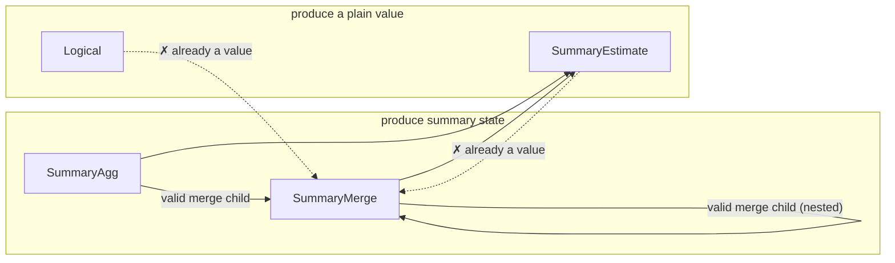

# L4 — summary-bound IR

The point where a plan commits to *what* answers each intent that L3's
canonical form deliberately leaves open. "Summary" is the umbrella term
for whatever answers an intent without re-scanning raw samples —
concretely, either an approximate sketch (e.g. a quantile sketch, a
cardinality sketch, a frequency/heavy-hitter sketch) or an exact
accumulator (e.g. sum, count, min/max, rate, increase). New primitive
classes are meant to slot in as additional summary kinds, not as a new
IR or a new translation layer.

This layer has two distinct halves, deliberately kept separate:
**planning-time** binding (deciding, symbolically, which summary
answers which intent) and **serving-time** execution (actually
resolving that decision against whatever is materialized right now).
They're covered in turn below.

## Planning-time: binding

A decision, made once per query shape, symbolically: given an intent
and its accuracy requirement, which summary family and parameters
answer it — with no reference to what's actually stored anywhere yet.

### The shape of a summary-bound plan

A summary-bound plan mirrors the canonical intent tree but replaces
each summarizable node with a decision:

- **Unbound / logical** — nothing rewrote this node (e.g. a filter or a
  projection); it stays as ordinary logical computation over its
  child's output.
- **Summary aggregation** — a summary family and its parameters, chosen
  for the intent and its accuracy target, over a designated column and
  grouping keys.
- **Summary-aware join** — a join realized via a summary technique
  (e.g. a cardinality-aware join sketch), rather than a full
  materialized join.
- **Summary subtraction / deletion** — algebraic operations on an
  already-built summary, only valid for summary kinds that support
  them.
- **Summary readout** — reading a value out of an already-built
  summary; the inverse of building one.
- **Summary merge** — combining multiple built summaries into one; only
  valid when every input agrees on family and parameters.

A summary-bound plan is a DAG, not just a tree — a shared
sub-computation can appear as more than one reference to the same bound
node, mirroring the sharing already present in the canonical form (see
[`l3-intent-algebra.md`](./l3-intent-algebra.md)). Binding only fires
where an intent is recognizable in the tree; anything underneath an
unrewritten (logical) parent stays logical too — extending binding to
rewrite through a logical parent is a known open design question, not
attempted by the base design.

Each bound node's output schema extends the canonical schema with one
new possibility: a field whose type *is* a built summary (identified by
its family and parameters). Two summary-typed fields are only
compatible if their family and parameters match exactly — which is what
lets subtraction, deletion, and merge reject a mismatched combination
as a planning-time error rather than a runtime one.

## Serving-time: execution

A lookup, done on every query: resolve each leaf of an already-bound
plan against whatever summaries are actually materialized right now.
Reality can diverge from what planning assumed — data might be missing,
several instances of the same summary might need merging, instances
might disagree on parameters — so serving needs its own error cases,
distinct from anything planning-time binding can raise.

### Split of responsibility

The *structural* rules are shared and deployment-independent: which
nestings of a summary-bound plan are valid, and what must agree for a
merge to be legal. Storage, summary math, and readout are entirely
deployment-supplied — this layer defines the interface a deployment
implements, not an implementation of summaries themselves. Concretely,
a deployment supplies: how to find candidate materialized instances for
a bound node, how to fetch one instance's state, how to merge several
instances' states, how to read a value out of a state, and how to
evaluate an unrewritten logical node directly. A shared execution
routine walks the bound tree and calls into these deployment-supplied
operations, so every deployment gets the same walk and merge logic for
free.

Finding candidates for a summary-aggregation node requires seeing that
node's entire input sub-tree, not just a bare name — a summary
aggregation node carries no source identity of its own; that identity
lives further down, inside a scan. Walking down to find it is
deployment-specific knowledge (how a real store names and indexes
summarized data); the shared execution routine doesn't need to
interpret it, only pass the sub-tree along.

### Nested composition

A bound plan nests to arbitrary depth by construction, so execution is
plain recursion with no special-casing for depth. Two composition rules
matter:

- **Only a node that produces summary state (a summary aggregation, or
  another merge) can be a merge's child.** A readout or a logical node
  has already collapsed to a plain value; merging values isn't the
  operation a merge models.
- **A merge of merges preserves the family/parameter agreement
  transitively** — the agreed family and parameters propagate upward
  through every nesting level, so a nested merge is checked the same
  way a flat one is.

Summary-aggregation-over-summary-aggregation is itself valid and
expected — e.g. a two-stage precompute pipeline where one tier streams
a per-group reduction and another tier builds a richer summary over
that stream is a real, intended shape.

**Deliberately left open:** whether a summary aggregation can validly
sit above a *readout* — "build a new summary from another summary's
already-computed value, at query time." Every design considered so far
only builds summaries incrementally from raw samples, at ingest time;
there's no established answer for building one from a
query-time-derived scalar. A deployment that hits this shape should
treat it as unsupported rather than assume either answer. The design
proposal below narrows exactly which cases of this remain genuinely
open (see "Pattern D" below) — it is not fully open anymore, but it is
not fully resolved either.

### What's out of scope here

Placement — *which machine* runs a piece of the plan — is L5's concern
entirely (see [`l5-physical-plan.md`](./l5-physical-plan.md)). This
layer is only about what "answer a query against already-materialized
summaries" means, on whichever machine ends up doing it. Some
operations (summary-aware join, subtraction, deletion) have no defined
execution behavior yet, because no binding rule produces them yet in
the base design — a deployment should add that behavior only once it
has a real need for the shape, rather than speculatively guessing the
right one now.

## Choosing a summary for an intent

Which summary family (if any) answers a given intent is itself a
pluggable decision: a default choice exists per intent, but a
deployment can supply its own ranking to prefer an alternative family
where one exists (e.g. an alternative quantile sketch, an alternative
cardinality sketch). This ranking is the one general-purpose extension
point in this layer — a deployment customizes *which* summary is
chosen, without touching how binding or execution works structurally.

Not every intent has a summary counterpart. An intent whose accurate
computation requires richer partial state than a single summary value
can capture, or whose result is fundamentally non-mergeable across
partitions, has no summary realization by design — it always stays as
ordinary logical computation over raw data.

## Interface

The planning-time IR:

```rust
pub struct L4Node {
    pub expr: SummaryExpr,
    pub schema: L4Schema,
}

pub enum SummaryExpr {
    Logical(Box<QueryExpr>),
    SummaryAgg {
        child: Rc<L4Node>,
        summary: SummaryKind,
        params: SummaryParams,
        col: ColumnRef,
        reduction: Reduction,
    },
    SummaryJoin { outer: Rc<L4Node>, inner: Rc<L4Node>, key: ColumnRef, summary: SummaryKind, params: SummaryParams },
    SummarySubtract { left: Rc<L4Node>, right: Rc<L4Node> },
    SummaryDelete { summary_input: Rc<L4Node>, key: ColumnRef },
    SummaryEstimate { summary_input: Rc<L4Node>, query: SketchQuery },
    SummaryMerge { children: Vec<Rc<L4Node>> },
}
```

The `summary`/`summary_input` field names match this doc's own "summary"
umbrella term (see the top of this doc) directly. An earlier revision of
this type used `sketch`/`sketch_input`, predating that umbrella term —
renamed in #170, landed together with the `Implementation` variant merge
described below.

Per-node validity constraints — each is a summary-catalog fact (see
"Summary catalog" above) checked at planning time, before this shape ever
reaches serving-time execution:

| Node | `summary` field | Constraint |
|---|---|---|
| `Logical` | — | none — wraps an arbitrary unrewritten `QueryExpr` subtree |
| `SummaryAgg` | own | none beyond `col`'s intent already requiring an accuracy target compatible with `summary`; this is the leaf every other row's constraints are checked *against* |
| `SummaryJoin` | own | only emitted by a join-specific `Bind*OnJoin` rule — none exist yet in the base design, so this variant has no live producer |
| `SummarySubtract` | read from `left`/`right` | `left`/`right` agree on `(kind, params)`; that kind's catalog entry sets `subtractable` |
| `SummaryDelete` | read from `summary_input` | that kind's catalog entry sets `deletable` |
| `SummaryEstimate` | read from `summary_input` | `query`'s `SketchQuery` variant is one that kind actually supports (not a single boolean flag — closer to that kind's whole reason for existing) |
| `SummaryMerge` | read from `children`, which must all agree | `children` non-empty; every child produces summary *state*, never a value (see diagram below); that shared kind's catalog entry sets `mergeable` |

The trickiest of these to hold in your head is `SummaryMerge`'s "children
must produce state, not a value" rule — everything here either produces
partial summary **state** (still mergeable, not yet read out) or a final
**value** (already collapsed, e.g. by a readout). Only a state-producing
node may feed a merge:



Binding — turning a canonical `QueryExpr` into an `L4Node` tree:

```rust
pub fn implement_tree(expr: &QueryExpr) -> Result<Rc<L4Node>, ImplementError>;
pub fn implement_tree_with(expr: &QueryExpr, cost_model: &dyn CostModel) -> Result<Rc<L4Node>, ImplementError>;
```

**"Implementation" is the answer to one question: how is this one
intent actually realized?** It's the return type of the per-intent
binding decision (`implementation_for`) — for a given `AggIntent`,
exactly one of: build an approximate sketch (bounded error, sized to
the accuracy target), build an exact accumulator (zero error, still
mergeable — see "Choosing a summary for an intent" above), or don't
summarize at all and evaluate the intent directly over raw data
(`PassThrough`). It's the same three-way choice this doc's "shape of a
summary-bound plan" section already describes in prose; this is that
decision's concrete type:

```rust
pub enum Implementation {
    Summary { kind: SummaryKind, params: SummaryParams },
    PassThrough,
}

pub fn implementation_for(intent: &AggIntent) -> Implementation;
```

An earlier revision of this type split `Summary` into two variants,
`Sketch{kind,params}` and `ExactAccumulator{kind,params}`, carrying
identical shapes — the split existed only because binding needed to
know, right here, whether the chosen `kind` requires a `SummaryEstimate`
readout afterward (approximate) or *is* the answer once built (exact —
no estimate step). #170 collapsed them into the single `Summary`
variant above, recovering that same fact from `SummaryKind::is_exact()`
instead of from the variant tag.

The one pluggable extension point at this layer — a deployment supplies
its own `CostModel` to override which summary family is chosen and how
its parameters are sized, without touching the binding pass itself.
Every method past the first has a sensible default, so a deployment that
only wants to reorder candidates doesn't have to implement the rest:

```rust
pub trait CostModel {
    fn rank_candidates(&self, intent: &AggIntent, candidates: &[SummaryKind]) -> Vec<SummaryKind>;

    fn size_params(&self, kind: SummaryKind, intent: &AggIntent, eps: f64, delta: f64) -> SummaryParams {
        /* default: this crate's built-in sizing formulas */
    }
    fn realize_extension(&self, ext_kind: &str, payload: &serde_json::Value) -> Implementation {
        /* default: PassThrough */
    }
    fn readout_extension(&self, ext_kind: &str, payload: &serde_json::Value, col: &ColumnRef) -> SketchQuery {
        /* default: panics -- only reachable if realize_extension was overridden without this */
    }
}
```

Serving-time — the interface a deployment implements to actually answer
a query against an already-bound `L4Node` tree:

```rust
pub trait SummaryExecutor {
    type Handle: Clone;
    type State;
    type Value;
    type Error;
    type GroupKey: Clone + Ord + Default;

    fn find_candidates(
        &self,
        summary: &SummaryKind,
        params: &SummaryParams,
        col: &ColumnRef,
        reduction: &Reduction,
        child: &L4Node,
    ) -> Result<Vec<(Self::GroupKey, Self::Handle)>, Self::Error>;

    fn fetch_state(&self, handle: &Self::Handle) -> Result<Self::State, Self::Error>;
    fn merge_states(&self, states: Vec<Self::State>) -> Result<Self::State, Self::Error>;
    fn readout(&self, state: &Self::State, query: &SketchQuery) -> Result<Self::Value, Self::Error>;
    fn logical(&self, expr: &QueryExpr) -> Result<Self::Value, Self::Error>;
}

pub fn execute<E: SummaryExecutor>(node: &L4Node, exec: &E) -> Result<ExecOutcome<E>, ExecError<E::Error>>;
```

`find_candidates`'s `reduction` parameter is exactly the `Reduction`
this doc's design section already explains — an implementer must branch
on `Reduce` vs. `PerEntity` there, not guess from an empty key list.

### Design proposal: a taxonomy of compound summaries, and a recipe (not a formula) for deriving their bound

The wrong question is "what's the formula for composing two summaries'
error bounds." Surveying how real systems actually do this — DGIM
[SICOMP'02], UnivMon [SIGCOMM'16], Hydra [VLDB'22], PromSketch [VLDB'25]
— there is no such formula, general or otherwise: `Hydra`'s Theorem 2
bound and `DGIM`'s Theorem 6/7 bound have genuinely different shapes,
because they're proved by composing two *different* concentration
arguments, not by combining two closed-form epsilons. But there **is** a
general move common to every one of them, and it's the one this doc's
"Nested composition" section above left as an open question: **never
compose past a readout.** Every system surveyed builds the outer
structure directly over the inner's *state* — never over a scalar the
inner has already collapsed to. That single move is what turns "no
general formula exists" into "a general *recipe* exists, and here it
is."

#### Four compound types, by structural relationship

1. **Same kind, same config — merge.** Already this doc's `SummaryMerge`:
   exact at the state level, zero added error, gated only by the
   catalog's `mergeable` flag. Not a new design question.
2. **Heterogeneous, inner exact.** The inner `AggIntent` (`Rate`,
   `Increase`, …) has `Accuracy::EXACT` state by construction — composing
   over it adds nothing, unconditionally. Not really a "compound bound"
   at all; it's a bound of zero.
3. **Heterogeneous, both approximate.** The genuinely interesting case —
   and it splits into **two different mechanisms**, not one, depending on
   *what the outer is actually built over*:
   - **3a — over the inner's readout.** The outer consumes the inner's
     already-collapsed `SummaryEstimate` value as if it were an ordinary
     (noisy) input. Always *available* — it needs nothing more than the
     inner's published `(ε, δ)` — but the bound it produces is only as
     good as a Lipschitz-style sensitivity argument, and is generally
     loose.
   - **3b — over the inner's state.** The outer's own construction runs
     directly on the inner's raw, pre-readout representation. Only
     available when the outer's construction can actually consume that
     representation's shape (see the recipe below) — but when it applies,
     it's tight: `DGIM`/`EH` and `Hydra` are worked examples.
   Neither subsumes the other: 3a is the fallback when a deployment only
   has API-level access to the inner's estimate (e.g. it crosses a
   service boundary and the raw sketch state isn't exposed), or when the
   outer's construction genuinely can't consume the inner's state shape
   (3b's step 2 fails). 3b is strictly better *when* it's available.
4. **Heterogeneous, both approximate, neither 3a nor 3b apply** — 3a
   always applies in principle (any inner reporting an `(ε,δ)` can be
   composed via *some* sensitivity argument), so type 4 really means "no
   sensitivity argument has been justified for 3a, and 3b's step 2
   fails." Stays refused.

#### Mechanism 3a: composing over the inner's readout

This is an ordinary error-propagation argument, not specific to any of
the four systems surveyed (none of them need it, since raw data or state
is always available to them) — but it's the one every deployment
*always* has available, because it only needs the inner's already-public
`(ε, δ)`, not its internals. Let the inner produce `ṽ` satisfying
`Accuracy A_c`, and the outer be built over `ṽ` as if exact, satisfying
`A_o` under that assumption. If the outer's true function `φ_outer` is
`L`-Lipschitz with respect to the norm `A_c.norm` is stated in:

```
Pr[ |ρ_outer(β_outer(ṽ)) − φ_outer(φ_inner(X))| > (ε_o + L·ε_c)·φ_outer(φ_inner(X)) ] ≤ δ_o + δ_c
```

by the triangle inequality on the two error terms and a union bound on
their failure events — the same derivation this design used earlier in
review, now correctly scoped to *only* the readout case rather than
presented as if it covered everything:

```rust
pub enum ErrorNorm { L1, L2, Pointwise }   // see Pattern-B discussion above for L1-vs-L2

pub struct Sensitivity { pub lipschitz: f64, pub from: ErrorNorm }

impl Accuracy {
    /// `None` if `child.norm != sensitivity.from` — refuse rather than
    /// apply an `L` that was never derived for that norm. `Sensitivity`
    /// is always a claim the deployment is making about `φ_outer`, not
    /// something this crate can derive on its own (linear aggregates
    /// like Sum/Count have a provable `L=1`; rank-based ones like
    /// Quantile/TopK only have `L≈1` under an unproven local-density
    /// assumption — see the earlier discussion of why this must be
    /// opt-in).
    pub fn compose_over_readout(outer: Accuracy, child: Accuracy, sensitivity: Sensitivity) -> Option<Accuracy> {
        match (outer, child) {
            (
                Accuracy::Probabilistic { epsilon: e_o, delta: d_o, norm },
                Accuracy::Probabilistic { epsilon: e_c, delta: d_c, norm: child_norm },
            ) if child_norm == sensitivity.from => Some(Accuracy::Probabilistic {
                epsilon: e_o + sensitivity.lipschitz * e_c,
                delta: d_o + d_c,
                norm,
            }),
            _ => None,
        }
    }
}
```

This bound is real and computable for *any* `(outer, inner)` pair,
provided a `Sensitivity` is justified — but it's provably looser than 3b
when 3b is available, because it throws away the inner's actual
construction and treats it as an opaque noisy scalar. It's the right
tool when the inner's state genuinely isn't accessible, or as a fallback
when 3b's step 2 fails.

#### Mechanism 3b: composing over the inner's state (the recipe)

Every sketch in this catalog is built by some randomized construction
`state = Φ(input)` (a hash-based projection, a compaction tree, …), and
its published accuracy bound is proved by a *specific* concentration or
counting argument applied to that construction — CMS's is a Markov bound
over hash-collision mass; KLL's is a compaction-invariant argument; HLL's
is a variance calculation over the max-order-statistic register. There is
no shortcut that lets you skip re-examining that argument. The recipe is:

1. **Treat the inner's state as the outer's input schema.** Not the
   inner's readout — the inner's raw, pre-`SummaryEstimate` state, typed
   the same way this doc already types it (`L4DataType::Sketch(kind,
   params)`). This is a schema-level move, not a numerical one: it's the
   difference between `outer built over Σ(inner)` and `outer built over
   ρ(inner)`.
2. **Ask whether the outer's own construction algorithm can literally run
   with the inner's state standing in for its usual raw input.** For
   `DGIM`/`EH`, the outer (windowing) construction is *bucket
   concatenation*, and any composable sketch's state supports that by
   definition (property P5) — always yes. For `Hydra`, the outer
   (hash-routing) construction just needs *something hashable to route*,
   which any subpopulation identifier is — always yes, for its specific
   shape. For an arbitrary `(outer, inner)` pair, this is not automatic —
   e.g. running CMS's own hash-and-increment construction *again*, over
   another CMS's counter array treated as a fresh multiset of
   "(bucket-index, count)" items, is well-defined; running a rank-based
   KLL construction over an HLL's register array is not obviously
   meaningful, because KLL's construction needs orderable *items*, and an
   HLL register isn't one. If this step fails, stop — you're in type 4.
3. **If step 2 succeeds, re-derive — don't reuse — the outer's own
   concentration argument against the *composed* randomness.** The
   composed construction is `Φ_outer ∘ Φ_inner`; the question is whether
   the specific proof technique `Φ_outer`'s bound normally relies on
   (independence assumptions, moment bounds, …) still holds when its
   input distribution is "the output of `Φ_inner`" instead of "raw
   samples." `DGIM` does exactly this in Theorem 7: the windowing
   argument (Observation 1/2) is re-run assuming the per-bucket sketch
   itself only supplies a `(1±ε̂)`-approximate `f`, not an exact one, and
   the bound `(1+ε̂)²Cf²/k + Cf−1+ε̂` is what falls out. `Hydra` does the
   same in Theorem 2: the routing argument (Markov on collision mass +
   Chernoff over independent rows) is re-run treating each cell's
   universal-sketch estimate as the noisy quantity, giving the
   asymmetric `Gi(1±εUS) + ε·GS` shape. Neither bound was available by
   composing two pre-existing formulas — both required redoing their
   respective single-layer proof against the two-layer construction.
4. **The resulting bound's *shape* is pair-specific, not universal.**
   `DGIM`'s is `(1+ε̂)²Cf²/k+Cf−1+ε̂`; `Hydra`'s is `Gi(1±εUS)+ε·GS`.
   There is no reason to expect a third, novel `(outer, inner)` pair to
   land on either shape — the recipe produces *a* bound, derived the same
   way, not *the same* bound.

#### Interface: two `ColumnRef` variants, one per mechanism

Reusing the state/value distinction this doc's `SummaryMerge` table
already established (`SummaryAgg`/`SummaryMerge` produce state;
`SummaryEstimate`/`Logical` produce a value), the two mechanisms above
get two distinct `ColumnRef` variants, so which one a query is using is
explicit at the type level rather than inferred:

```rust
pub enum ColumnRef {
    Named(String),
    Qualified { table: String, name: String },
    SampleValue,
    FromReadout(Rc<L4Node>),   // NEW — mechanism 3a. Must be a value-
                                // producing node (SummaryEstimate /
                                // Logical / an exact SummaryAgg with no
                                // estimate step).
    FromState(Rc<L4Node>),     // NEW — mechanism 3b. Must be a state-
                                // producing node (SummaryAgg /
                                // SummaryMerge). Same rule
                                // SummaryMerge's children already use,
                                // extended to this new consumer.
}
```

Neither variant supplies a bound by itself — each routes to the matching
half of `CostModel`:

```rust
pub trait CostModel {
    /// Mechanism 3a. Has this deployment justified a `Sensitivity` for
    /// building `outer` over a `FromReadout` input of `child_kind`?
    /// Default `false` — a Lipschitz-style claim about `outer`'s own
    /// function is always the deployment's to justify, not something
    /// this crate derives (see `Accuracy::compose_over_readout`).
    fn accepts_readout_composition(&self, outer: &AggIntent, child_kind: &SummaryKind) -> bool {
        false
    }
    fn sensitivity_for(&self, outer: &AggIntent, child_kind: &SummaryKind) -> Option<Sensitivity> {
        None
    }

    /// Mechanism 3b. Has this deployment derived (following the recipe
    /// above, or equivalent) a bound for building `outer` directly over
    /// a `FromState` input of `child_kind`? Default `false` — matches
    /// every system surveyed: none of them build an outer sketch over an
    /// inner sketch's state without first doing exactly this derivation
    /// for their specific pair.
    fn accepts_state_composition(&self, outer: &AggIntent, child_kind: &SummaryKind) -> bool {
        false
    }
    /// No default body: two different `(outer, inner)` pairs get two
    /// different derivations, per the recipe's step 4. Takes the
    /// child's concrete `(kind, params)` directly, not an abstracted
    /// accuracy value — the whole point of 3b is that the derivation is
    /// specific to *which two constructions* are being composed.
    fn size_params_from_state(
        &self,
        kind: SummaryKind,
        intent: &AggIntent,
        target_eps: f64,
        target_delta: f64,
        child: (&SummaryKind, &SummaryParams),
    ) -> SummaryParams;
}
```

A deployment facing a genuinely new `(outer, inner)` pair has a real
choice, not just a closed gate: try 3b first (tighter, needs the
recipe's step 2 to succeed), fall back to 3a (always computable given a
justified `Sensitivity`, but looser), or refuse (type 4, the safe
default either way).

`Accuracy` (`implied_accuracy`, `is_exact`) stays a **reporting** type —
what a single, already-built `SummaryKind` guarantees on its own — used
for type 2 (`Accuracy::EXACT` makes both `FromReadout` and `FromState`
unconditional) and as the input/output of `compose_over_readout`. It is
not, by itself, a composition primitive for 3b — 3b's bound comes from
the recipe, not from any function of two `Accuracy` values.

### Which issue this solves

- **[#171](https://github.com/ProjectASAP/ASAPController/issues/171)** —
  direction 2 (outer summary over inner exact accumulator, e.g. `TopK`
  over `Rate`) is compound type 2: `FromState`/`FromReadout` over
  `Accuracy::EXACT`, unconditional either way (state is preferred simply
  because it's available and free — there's no accuracy reason to
  prefer one over the other when the inner is exact). Direction 1 (outer
  exact fold over inner realized summary) is a separate axis from this
  taxonomy entirely — the fold itself is exact, so it's not a
  compound-*accuracy* question; it needs its own `SummaryFold`/`FoldOp`
  node distinguishing which folds (`Min`/`Max`) can consume the inner's
  already-read-out scalar versus which (`Avg`/`Variance`/`StdDev`, per
  Algebird's `Averaged`/moment-monoid distinction) need the inner's
  pre-readout sufficient statistic.
- **[#172](https://github.com/ProjectASAP/ASAPController/issues/172)** —
  compound type 3, with a real choice between two mechanisms rather than
  one closed gate: **3b** (`FromState`/`accepts_state_composition`/
  `size_params_from_state`) when a deployment has done the recipe's
  derivation for its specific `(outer, inner)` pair and the outer's
  construction can actually consume the inner's state shape — tighter,
  but not always available. **3a** (`FromReadout`/
  `accepts_readout_composition`/`sensitivity_for`/
  `compose_over_readout`) as the always-available fallback, given a
  justified `Sensitivity` — looser, but requires nothing more than the
  inner's already-public `(ε, δ)`. Type 4 (refused, the default for
  both) when neither has been justified for the pair in question. This
  replaces the earlier draft, which only exposed 3b and mechanically
  forbade 3a outright — 3a is a real, general, always-derivable (given a
  sensitivity claim) mechanism in its own right, just a looser one; it
  shouldn't have been designed out.
- **[#173](https://github.com/ProjectASAP/ASAPController/issues/173)** —
  Hydra and QTree are each 3b compositions *already worked out* by their
  respective papers (Theorem 2; a deterministic range bound) — concrete
  instances of the recipe, not a fourth pattern. Each still needs its own
  dedicated `SummaryKind` in the catalog (Hydra's bound doesn't fit the
  reporting `Accuracy` shape any single-layer kind uses, being
  referenced against a *global* total rather than the queried
  subpopulation's own value) rather than being expressed as a generic
  `FromState` composition — but the *reason* it needs one is now
  precise: it's a 3b pair someone has already derived, exactly like
  DGIM/EH is, not a structurally different kind of problem.
